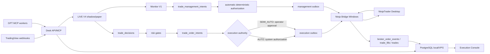
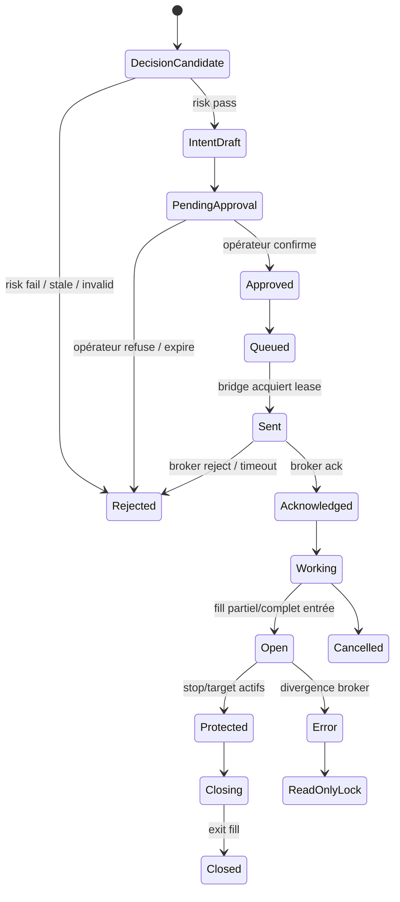

# Chantier NinjaTrader — exécution broker contrôlée

Date : 2026-07-22 — mise à jour : 2026-07-26  
Portée : PREPROD/VPS Windows, ordres physiques `Sim101` uniquement, aucun ordre live.  
Statut : socle logiciel livré et vérifié ; matrice ATI physique `Sim101` terminée ; gestion continue N13 et gateway AddOn N14 livrées ; modes d'autorité `AUTO` et `SEMI_AUTO` opérationnels avec garde-fous fail-closed.

## Résumé décisionnel

Le passage NinjaTrader doit être traité comme une couche d'exécution séparée du moteur Autopilot V4.

La stratégie reste :

```text
Replay / LIVE V4
→ setup / position paper canonique
→ décision trade normalisée
→ risk gates
→ intention d'ordre autorisée automatiquement ou approuvable selon le mode
→ bridge NinjaTrader
→ ack / fills / position réelle
→ reconciliation PostgreSQL
```

GPT ne doit jamais envoyer un ordre directement à NinjaTrader. GPT produit une analyse et des décisions structurées ; le backend les convertit en intentions d'ordre uniquement si les garde-fous passent.

## État de livraison au 22 juillet 2026

| Milestone | État | Preuve principale |
|---|---|---|
| N0 — gel stratégie/sécurité | Terminé | garde SHA-256 des contrats Master V4 et Monitor V1 dans `config/strategy-contract-lock.json` |
| N1 — modèle PostgreSQL broker | Terminé | migration `008_ninjatrader_execution_gateway.sql`, policy désactivée et kill switch engagé |
| N2 — matérialisation | Terminé | position paper canonique → `trade_decisions`, idempotente |
| N3 — risk gates | Terminé | moteur déterministe fail-closed et audit détaillé |
| N4 — intentions/autorité/front | Terminé | API protégée, modes `AUTO`/`SEMI_AUTO` audités et Execution Console PostgreSQL sans mock |
| N5 — bridge dry-run | Terminé | rendu atomique OIF hors dossier NinjaTrader |
| N6 — ATI Sim101 | Terminé | matrice OIF complète et template ATM protecteur validés sur `Sim101` |
| N7 — réconciliation ATI | Terminé côté logiciel | watcher `outgoing`, déduplication, events/fills/trades et lock sur divergence |
| N8 — AddOn PoC | Terminé | observateur initial read-only, base de N14 |
| N9 — parité Replay/LIVE/Sim | Terminé | tests long/short et fills `Sim101` réels observés via ATI `outgoing` |
| N10 — préparation live | Verrouillée par conception | aucun compte live accepté dans PREPROD locale |
| N11 — exploitation locale | Terminé | runbook, health checks, console, procédures d’arrêt et de reprise |
| N12 — recette finale | Terminée | 30 étapes physiques passées, ATM et `CLOSESTRATEGY` inclus, retour final `FLAT` |
| N13 — gestion continue | Terminée | Monitor → intention versionnée → autorisation système → outbox dédiée → bridge → ack/réconciliation |
| N14 — AddOn bidirectionnel | Terminé | protocole signé, shadow/parité, commandes canoniques autorisées et auditées, événements/snapshots PostgreSQL et console réelle |
| N15 — autorité d'exécution | Terminé | `AUTO` sans validation humaine ; `SEMI_AUTO` avec validation humaine de l'entrée ; gestion protectrice automatique dans les deux modes |

L'acceptance physique a été exécutée après confirmation d'une connexion de type `Simulation`, du mode global Simulation et du compte `Sim101`. La matrice isolée remet toujours son propre harnais en état fail-closed. L'environnement VPS a ensuite été armé séparément le 26 juillet 2026, en `AUTO`, exclusivement pour le compte `Sim101`.

## État actuel dans PREPROD

Le projet est déployé sur le VPS Windows et l'exécution `Sim101` est armée. L'état ci-dessous est celui contrôlé le 26 juillet 2026.

| Zone | État |
|---|---|
| LIVE V4 | Produit les décisions canoniques ; le scheduler matérialise et traite les positions broker éligibles. |
| Replay V4 | Sert de référence métier et de moteur de parité. |
| PostgreSQL | Modèle broker/trades et autorité versionnée via les migrations `003`, `008` à `015`. |
| Provider | `ninjatrader` activé uniquement pour le chemin de simulation contrôlé. |
| Compte | `Sim101` autorisé ; tout compte live reste interdit par le service et la configuration. |
| Contrats broker | MNQ/MES septembre 2026 actifs ; NQ/ES non autorisés pour cette phase. |
| Front opérateur | Execution Console réelle : autorité, risque, capital, bridge, ordres, positions, réconciliation et kill switch. |
| Autorité | `AUTO`, entrée et gestion sans validation humaine, sous réserve de tous les garde-fous. |

Conclusion : le chemin `LIVE V4 → risk gates → autorité → AddOn → Sim101 → réconciliation` est complet. Les contrats Master V4 et Monitor V1 n'ont pas été modifiés.

## Références officielles NinjaTrader utiles

- NinjaTrader propose l'automatisation via NinjaScript ou via l'Automated Trading Interface.
- L'ATI est faite pour recevoir des signaux externes, mais ce n'est pas une API broker/market data complète.
- L'interface fichier ATI passe par des fichiers OIF déposés dans le dossier `incoming`.
- Les fichiers `outgoing` peuvent fournir des updates d'ordre, position et connexion, mais leur contenu est supprimé au redémarrage de NinjaTrader.
- Les AddOns NinjaScript peuvent accéder plus largement à NinjaTrader, notamment comptes, ordres, positions et données de marché.

Sources :

- https://ninjatrader.com/support/helpguides/nt8/automated_trading.htm
- https://ninjatrader.com/support/helpguides/nt8/automated_trading_interface_at.htm
- https://ninjatrader.com/support/helpguides/nt8/file_interface.htm
- https://ninjatrader.com/support/helpguides/nt8/order_instruction_files_oif.htm
- https://ninjatrader.com/support/helpguides/nt8/information_update_files.htm
- https://ninjatrader.com/support/helpguides/nt8/commands_and_valid_parameters.htm
- https://ninjatrader.com/support/helpguides/nt8/addon_development_overview.htm

## Architecture cible recommandée



### Composants à créer

| Composant | Rôle |
|---|---|
| `ExecutionGateway` backend | Lit les décisions éligibles, applique les risk gates, crée les intentions d'ordre et expose l'état au front. |
| `BrokerPolicyEngine` | Vérifie taille, contrat, fenêtre horaire, fraîcheur data, perte journalière, unicité position et kill switch. |
| `NinjaBridge` Windows | Agent local près de NinjaTrader. Il ne décide rien ; il exécute seulement des intentions déjà approuvées. |
| `NinjaAdapter` | Convertit une intention canonique en commande ATI ou AddOn. |
| `ReconciliationWorker` | Reconstitue ordres, fills, positions et écarts depuis NinjaTrader vers PostgreSQL. |
| `Execution Console` front | File d'intentions, approvals, ordres, fills, positions, état bridge et bouton kill switch. |

## Choix ATI vs AddOn

### Phase rapide : ATI File/OIF en Sim101

Avantages :

- plus simple pour un premier proof-of-control ;
- compatible avec un agent Windows qui écrit des fichiers ;
- suffisant pour tester `PLACE`, `CHANGE`, `CANCEL`, `CLOSEPOSITION`, `FLATTENEVERYTHING` en simulation.

Limites :

- ce n'est pas une API broker complète ;
- la robustesse des updates dépend des fichiers `outgoing` ;
- attention aux fichiers OIF dupliqués ou écrits/copied trop vite ;
- pas le meilleur socle final pour une automatisation auditée.

### Phase robuste : AddOn NinjaScript

Avantages :

- meilleur accès aux événements d'ordre, d'exécution et de position ;
- plus propre pour un état bidirectionnel fiable ;
- permet un panneau local NinjaTrader de monitoring/kill switch ;
- architecture plus solide pour passer un jour de `Sim101` à un compte réel.

Limites :

- demande un développement C# / NinjaScript sur Windows ;
- nécessite tests manuels dans NinjaTrader ;
- plus lent à livrer qu'un prototype ATI.

Décision recommandée : commencer par un bridge ATI en `dry-run` puis `Sim101`, mais concevoir l'interface backend comme si l'adapter final pouvait devenir un AddOn. Le backend ne doit pas dépendre du format OIF.

## Invariants de sécurité

Ces règles sont non négociables.

- `DESK_BROKER_EXECUTION_ENABLED=false` par défaut.
- `broker_providers.enabled=false` par défaut.
- `broker_accounts.order_submission_enabled=false` par défaut.
- `broker_accounts.read_only=true` par défaut.
- `broker_accounts.max_contracts=0` par défaut.
- `broker_contracts.active=false` par défaut.
- Aucune intention ne peut devenir ordre sans `risk_check=pass`.
- Toute intention envoyée porte une autorisation auditée : autorisation système en `AUTO`, approval opérateur en `SEMI_AUTO`.
- En `SEMI_AUTO`, seule l'entrée attend l'opérateur ; stop, réduction et sortie protectrice restent automatiques une fois la position ouverte.
- Aucun mode d'autorité ne contourne les risk gates, le kill switch, les limites de perte, l'idempotence ou la réconciliation.
- Toute intention porte une `idempotency_key` unique.
- Le bridge ignore toute intention expirée.
- Le bridge ne reçoit jamais de texte libre GPT ; uniquement un payload canonique validé.
- Un kill switch global bloque immédiatement les nouvelles soumissions.
- Un mismatch broker/PostgreSQL met le système en `read_only`.

## États et cycle de vie



## Mapping des tables existantes

| Table | Usage NinjaTrader |
|---|---|
| `broker_providers` | Déclare `ninjatrader`, activation globale du provider. |
| `broker_accounts` | Comptes Sim101/live/prop firm, droits, limites, read-only. |
| `broker_contracts` | Contrats tradables réels, par exemple `MNQ 09-26`, séparés des symboles TradingView `MNQ1!`. |
| `trade_decisions` | Décision canonique issue du Desk, reliée au setup/monitor/master. |
| `trade_risk_checks` | Résultat détaillé des règles de risque. |
| `trade_order_intents` | Intention approuvable et idempotente avant broker. |
| `trade_approvals` | Trace opérateur avant envoi. |
| `broker_orders` | Ordres NinjaTrader soumis/observés. |
| `broker_order_events` | Journal d'ack, reject, working, cancel, fill. |
| `trade_fills` | Exécutions broker/fills. |
| `trades` | État canonique agrégé. |
| `trade_events` | Timeline immuable du cycle de vie. |
| `trade_position_snapshots` | Snapshots périodiques et reconciliation. |
| `trade_management_intents` | Décision Monitor transformée en action broker strictement réductrice de risque. |
| `trade_management_approvals` | Confirmation opérateur dédiée à la gestion de position. |
| `broker_management_outbox` | File séparée et prioritaire pour stop, réduction et fermeture. |

## N13 — gestion continue des positions

Le moteur paper continue d'évaluer les bougies entre deux analyses GPT. N13 ajoute le chemin broker canonique sans modifier les contrats Master V4 ou Monitor V1 :

```text
Monitor V1
→ mapping déterministe MOVE_STOP_BE / TAKE_PARTIAL / REDUCE_RISK / EXIT_POSITION / INVALIDATE_THESIS
→ contrôle du trade et de sa révision
→ preuve que l'action réduit le risque
→ autorisation système automatique
→ outbox de gestion séparée
→ bridge ATI Sim101
→ ack outgoing ou réconciliation
→ mise à jour atomique du trade et de sa révision
```

Règles fail-closed :

- un stop peut seulement être resserré et doit être aligné sur le tick ;
- `MOVE_STOP_BE` exige la référence exacte de l'ordre stop protecteur ;
- une réduction ne peut jamais fermer implicitement le dernier contrat ;
- une fermeture porte exactement sur la quantité ouverte et utilise l'ATM déterministe lorsqu'il existe ;
- une révision de trade différente invalide l'autorisation ;
- le bridge traite la gestion avant les nouvelles entrées ;
- les commandes ATI restent limitées au contexte `Sim*` ;
- toute divergence verrouille le compte en lecture seule.

Le worker `broker-management` tourne toutes les 15 secondes dans Docker. Dans la configuration actuelle, il répond `ENVIRONMENT_NOT_ARMED` et ne crée ni intention ni ordre.

## N14 — gateway AddOn bidirectionnelle

N14 remplace le PoC observateur par un adapter local complet, sans modifier la stratégie Autopilot V4 ni les contrats Master/Monitor :

```text
NinjaTrader AddOn
→ heartbeat / snapshot / événements signés
→ API locale
→ ledger et parité PostgreSQL

outbox approuvée
→ claim AddOn dédié
→ commande canonique entrée/stop/réduction/fermeture
→ APIs NinjaTrader Account + ATM
→ completion et événements signés
```

Le protocole `desk_ninja_addon_v1` utilise une signature HMAC-SHA256 couvrant la méthode, le chemin, le hash du corps, le timestamp et un nonce. L'API refuse un secret absent, une signature altérée, une requête trop ancienne et la réutilisation d'un nonce.

Le mode shadow est la valeur sûre : snapshots et événements sont persistés, mais `command_enabled=false` et aucune réconciliation destructive n'est déclenchée. La parité ATI↔AddOn est mesurée et stockée séparément. Le passage en commandes exige `sim101_addon_approved_only` des deux côtés ; dans ce mode, le bridge ATI ne peut pas réclamer la même outbox.

L'AddOn prend en charge :

- une entrée `Sim*` associée à un template ATM explicitement validé, puis l'ajustement des protections aux prix canoniques ;
- le déplacement du stop protecteur identifié exactement ;
- une réduction de quantité par ordre marché opposé ;
- la fermeture de l'instrument ;
- la remontée des ordres, exécutions, positions, valeurs de compte et références ATM.

La source C# a été compilée contre les assemblies NinjaTrader 8 locales. Son import et sa recette physique dans NinjaTrader restent une opération d'acceptance contrôlée : aucun démarrage automatique de NinjaTrader et aucune activation des commandes par le backend.

### Tables complémentaires désormais livrées

| Élément | Pourquoi |
|---|---|
| `broker_bridge_heartbeats` | Savoir si le bridge Windows est vivant, connecté, en lecture seule ou armé. |
| `broker_execution_locks` | Kill switch global/session/instrument/account. |
| `broker_account_snapshots` | Cash, margin, realized/unrealized, position count. |
| `broker_reconciliation_runs` | Audit des comparaisons PostgreSQL ↔ NinjaTrader. |
| `trade_policy_profiles` | Profils de limites : max contracts, max daily loss, allowed sessions, allowed contracts. |

## Variables d'environnement proposées

```bash
DESK_BROKER_EXECUTION_ENABLED=false
DESK_BROKER_PROVIDER=ninjatrader
DESK_NINJA_BRIDGE_MODE=disabled
DESK_NINJA_REQUIRE_OPERATOR_APPROVAL=true
DESK_NINJA_DEFAULT_ACCOUNT=ninjatrader_paper_local
DESK_NINJA_ACCOUNT_ALLOWLIST=ninjatrader_paper_local
DESK_NINJA_MAX_CONTRACTS=0
DESK_NINJA_ALLOWED_INSTRUMENTS=MNQ,MES
DESK_NINJA_KILL_SWITCH=true
DESK_NINJA_ORDER_TTL_SECONDS=60
```

Activation progressive possible :

```text
disabled
→ dry_run_file
→ sim101_ati_manual_arm
→ sim101_ati_approved_only
→ sim101_addon_approved_only
→ live_read_only_reconciliation
→ live_limited_approved_only
```

## Milestones du chantier

### N0 — Cadrage et gel sécurité

Objectif : documenter la cible et confirmer que tout reste désactivé.

Livrables :

- présent document ;
- audit de l'état DB seedé ;
- décision ATI prototype / AddOn cible ;
- checklist sécurité.

Critère de sortie : aucun chemin code ne peut créer un ordre broker.

### N1 — DB readiness broker

Objectif : rendre le modèle exécution exploitable sans envoyer d'ordre.

Livrables :

- migrations éventuelles pour heartbeats, locks, policy profiles ;
- seeds `Sim101` read-only ;
- indexes de polling outbox ;
- requêtes d'audit.

Tests :

- provider/account/contract désactivés par défaut ;
- activation impossible sans opt-in environnement + DB + mode d'autorité explicite.

### N2 — Materializer décision trade

Objectif : transformer les positions/setup paper LIVE en `trade_decisions`.

Règles :

- source obligatoire : setup/position/monitor/master ;
- pas de décision si setup incomplet ;
- pas de décision si data LIVE `DATA_NOT_READY` ;
- pas de mutation du workflow V4.

### N3 — Risk gate engine

Objectif : bloquer tout ce qui n'est pas tradable.

Règles minimum :

- instrument autorisé ;
- contrat broker actif et non expiré ;
- quantité entière et dans la limite ;
- prix alignés au tick ;
- stop obligatoire ;
- RR minimal conforme stratégie ;
- pas de double position sur même instrument/session ;
- ordre non expiré ;
- pertes journalières sous limite ;
- fenêtre horaire autorisée ;
- bridge vivant.

### N4 — Intention + autorité front

Objectif : afficher et valider une intention sans broker.

Écran cible : `Execution Console`.

Fonctions :

- intentions en attente ;
- détails risque ;
- boutons refuser/approuver en `SEMI_AUTO` ;
- bascule auditée `AUTO`/`SEMI_AUTO` avec phrase de confirmation ;
- bouton kill switch ;
- timeline décision → risk → autorisation → exécution.

### N5 — Bridge dry-run

Objectif : générer des commandes NinjaTrader sans les déposer dans `incoming`.

Livrables :

- `NinjaAdapter` canonique → commande ;
- rendu OIF dans un dossier `dry-run`;
- tests snapshot des commandes ;
- idempotency et TTL.

Critère de sortie : aucune commande n'arrive dans NinjaTrader.

### N6 — ATI Sim101 manuel

Objectif : tester l'envoi réel uniquement sur `Sim101`.

Conditions :

- NinjaTrader ouvert sur Windows ;
- ATI activé manuellement ;
- compte `Sim101` sélectionné ;
- bridge en mode `sim101_ati_manual_arm` ;
- contrat actif uniquement pour MNQ/MES ;
- taille max 1 micro contrat.

Critère de sortie : un ordre test Sim101 est envoyé, acké, annulé/flat, puis réconcilié.

### N7 — Reconciliation ATI

Objectif : lire les updates NinjaTrader et reconstruire l'état.

Livrables :

- watcher `outgoing`;
- ingestion order state / position / connection ;
- écriture `broker_order_events`, `trade_fills`, `trades`;
- détection divergence ;
- lock read-only en cas d'écart.

### N8 — AddOn Bridge PoC

Objectif : remplacer progressivement les limites ATI par un AddOn plus robuste.

Livrables :

- AddOn C# minimal ;
- auth locale ;
- heartbeat vers API ;
- ack/order/fill/position push ;
- kill switch local.

### N9 — Parité Replay/LIVE/Sim101

Objectif : démontrer que le broker suit la même logique que le paper.

Tests :

- même setup ;
- même prix d'entrée attendu ;
- même stop/TP ;
- delta fill/slippage mesuré ;
- timeline complète visible ;
- aucun ordre hors contrat/session.

### N10 — Préparation live limité

Objectif : préparer, pas activer automatiquement.

Conditions de discussion live :

- au moins 5 journées Sim101 complètes sans divergence bloquante ;
- reconciliation verte ;
- kill switch prouvé ;
- logs et exports disponibles ;
- limites contractuelles validées ;
- confirmation manuelle explicite avant toute activation.

### N11 — Runbook et observabilité locale

Objectif : rendre les procédures d'exploitation, de diagnostic, d'arrêt et de réconciliation reproductibles.

Livrable : `docs/NINJATRADER_LOCAL_RUNBOOK_2026-07-22.md`.

### N12 — Recette et preuve de non-régression

Objectif : vérifier la stack réelle, l'interface, l'idempotence broker, les fills/trades et la stratégie protégée.

Critère de sortie automatique initial : tests backend/domain/front verts, API fail-closed pendant la recette, aucune fixture résiduelle et contrats protégés inchangés. L'armement VPS a été effectué ensuite comme une opération distincte et auditée.

### N14 — AddOn bidirectionnel local

Objectif : disposer d'un adapter NinjaTrader plus robuste que les fichiers ATI, tout en conservant ATI comme secours opérateur isolé.

Livrables :

- protocole de commandes et d'événements versionné ;
- authentification signée anti-rejeu ;
- AddOn C# shadow puis mode de commandes autorisées (`sim101_addon_approved_only`, nom de transport historique) ;
- heartbeats, snapshots, événements et runs de parité persistés ;
- routes API dédiées et console opérateur sans mock ;
- simulateur de transport local sans soumission ;
- compilation contre les assemblies NinjaTrader 8 et matrice logicielle fail-closed.

## Tests d'acceptance globaux

- Un ordre ne peut pas être créé depuis GPT/MCP directement.
- Une intention expirée ne peut pas être envoyée.
- Deux envois avec la même `idempotency_key` ne créent qu'une seule action.
- Un contrat inactif bloque l'intention.
- Un compte `read_only=true` bloque l'intention.
- `order_submission_enabled=false` bloque l'intention.
- `DESK_BROKER_EXECUTION_ENABLED=false` bloque tout.
- Le kill switch bloque tout.
- Une divergence broker/PostgreSQL force `read_only`.
- Le front affiche clairement `paper`, `sim`, `live read-only` ou `live armed`.
- Les événements broker apparaissent dans la timeline trade.

## Ce qui est hors périmètre pour le premier lot

- ordre réel live ;
- compte financé / prop firm réel ;
- nouveaux outils MCP GPT pour placer des ordres ;
- remplacement du moteur Replay/LIVE V4 ;
- trading depuis le conteneur Docker Linux directement vers NinjaTrader Desktop.

## Exploitation autorisée

Laisser la session `Simulation` et l'AddOn ouverts sur le VPS, contrôler l'état dans l'Execution Console et utiliser le kill switch au moindre écart. La recette physique reste réservée à `Sim101` et ne doit jamais être appliquée à un compte live.
