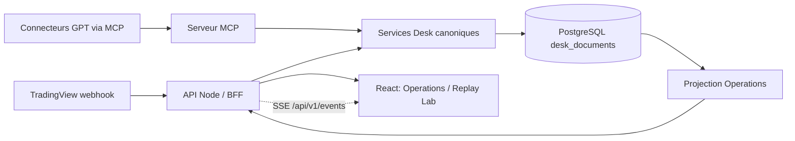

# Cockpit Operations et Replay Lab — architecture locale

## Périmètre

Ce document décrit les chantiers M0 à M11 réalisés dans la préproduction locale. La migration OVH reste volontairement séparée et n'est pas nécessaire au fonctionnement de ces fonctionnalités.

Le frontend ne contient aucune branche de données mockée en production. Les vues lisent les documents canoniques de PostgreSQL à travers le BFF HTTP. Les fixtures synthétiques n'existent que dans les tests isolés et dans le test d'acceptation temporaire, qui les supprime à la fin.

## Flux de données



La projection Operations est calculée à partir des collections canoniques. Elle ne devient jamais une deuxième source de vérité :

- workflows : `desk_jobs`, `desk_replay_runs`, `desk_backtests`, `desk_feature_runs` ;
- étapes et événements : `desk_replay_steps`, `desk_backtest_steps`, `desk_replay_timeline`, `desk_agent_work_events` ;
- processus GPT : `desk_agent_work_items`, bundles, Master Analyses et Monitors ;
- alertes : `desk_alerts`, `desk_errors`, `desk_data_quality_audits` ;
- performance : trades, bilans journaliers et statistiques stratégie ;
- versions : catalogue, configuration, runtime, contrats et `desk_strategy_versions`.

## Navigation

Les détails profonds utilisent des écrans routés, un fil d'Ariane et un retour vers le parent :

```text
/operations
  /operations/workflows/:workflowId
    /operations/workflows/:workflowId/events/:eventId

/replay
  /replay/runs/:runId
    /replay/runs/:runId/days/:date
      /replay/runs/:runId/days/:date/sessions/:sessionExecutionId
    /replay/runs/:runId/gpt/:processId
  /replay/compare

/history
  /history/sessions/:sessionId

/strategies
  /strategies/:strategyId
```

Les cartes restent réservées à la synthèse. Les détails workflow, session, événement et GPT ne s'empilent pas dans des drawers.

## Journées, sessions, variantes et tentatives

Une journée regroupe toutes les exécutions ayant la même `trading_date`. Chaque run conserve un `sessionExecutionId` distinct. La variante est dérivée de `variant_id`, ou à défaut du couple stratégie/cadence. Le numéro de tentative est ordonné par date de création à l'intérieur du couple session/variante.

Cette structure permet de conserver simultanément :

- plusieurs sessions Asia et NY dans une journée ;
- plusieurs tentatives de la même session ;
- plusieurs cadences ou variantes de stratégie ;
- les conclusions et erreurs propres à chaque exécution.

## Timeline synchronisée

Le backend consolide les couches décision, étape et GPT, et extrait les bougies OHLC des bundles/simulations persistés. L'écran session propose :

- zoom temporel de 1 à 8 ;
- activation/désactivation des couches décision, étape et GPT ;
- marqueurs horodatés synchronisés avec le prix ;
- accès direct à l'inspecteur GPT ;
- timeline textuelle complète lorsque les bougies ne sont pas encore disponibles.

## Mutations opérateur

Les écritures Operations exigent :

- une authentification `desk.write` ou la clé API locale ;
- une révision attendue ;
- une clé d'idempotence ;
- une justification ;
- une phrase exacte `CONFIRM_<ACTION>` ;
- une action compatible avec l'état canonique courant.

Les commandes et événements sont conservés dans `desk_operations_commands` et `desk_operations_events`. Les actions replay transmettent aussi la révision attendue au service d'automatisation. Les actions disponibles ne déclenchent jamais un ordre broker.

## Endpoints principaux

La spécification complète est exposée par `GET /api/v1/openapi.json`.

- `GET /api/v1/operations/summary`
- `GET /api/v1/workflows`
- `GET /api/v1/workflows/:id`
- `POST /api/v1/workflows/:id/actions`
- `GET|POST /api/v1/replays`
- `GET /api/v1/replays/:id`
- `GET /api/v1/replays/:id/days/:date`
- `GET /api/v1/replays/:id/sessions/:sessionExecutionId`
- `GET /api/v1/replays/:id/timeline`
- `GET /api/v1/replays/:id/price-series`
- `GET /api/v1/gpt-processes/:id`
- `GET /api/v1/performance/overview`
- `GET /api/v1/replays/compare?ids=...`
- `GET /api/v1/incidents`
- `POST /api/v1/incidents/:id/actions`
- `GET /api/v1/history/sessions`
- `GET /api/v1/strategies`
- `GET /api/v1/strategies/:id/versions/compare`
- `GET /api/v1/events` (SSE)

## Validation locale

Tests isolés :

```bash
npm run typecheck
npm run test:react
cd mcp_gpt_desk && npm test
```

Acceptation réelle Nginx/API/PostgreSQL :

```bash
npm run test:stack
```

`test:stack` vérifie que Docker est démarré, insère des documents canoniques temporaires dans PostgreSQL, teste les routes UI avec Chromium, puis supprime toutes les fixtures `acceptance_*`, même en cas d'échec.

## Correspondance des milestones

| Milestone | Livraison |
|---|---|
| M0 | Contrats 1.0.0, statuts normalisés, routes, sous-navigation et fils d'Ariane |
| M1 | Projection PostgreSQL/BFF sur les collections canoniques |
| M2 | Cockpit Operations global et filtres |
| M3 | Détail workflow, étapes, événements et actions contrôlées |
| M4 | Replay Lab global et création canonique d'un run |
| M5 | Journée multi-sessions, variantes et tentatives |
| M6 | Timeline prix/décisions zoomable et couches synchronisées |
| M7 | Inspecteur GPT, manifest, save target, lease, erreurs et conclusions |
| M8 | Performance ventilée et comparaison multi-runs |
| M9 | Cycle de vie des incidents avec révision/idempotence/audit |
| M10 | Historique des sessions et gouvernance des versions stratégie |
| M11 | SSE, responsive, OpenAPI, tests réels Docker et documentation |
