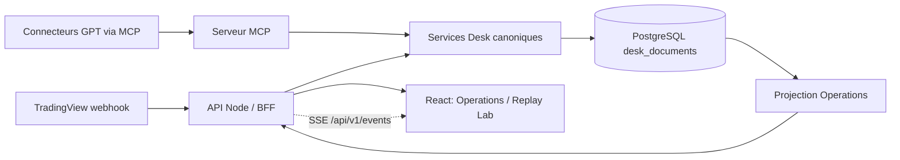

# Cockpit Operations et Replay Lab — architecture locale

## Périmètre

Ce document décrit les chantiers M0 à M11 réalisés dans la préproduction locale. La migration OVH reste volontairement séparée et n'est pas nécessaire au fonctionnement de ces fonctionnalités.

Le frontend ne contient aucune branche de données mockée en production. Les vues lisent les documents canoniques de PostgreSQL à travers le BFF HTTP. Les fixtures synthétiques n'existent que dans les tests isolés et dans le test d'acceptation temporaire, qui les supprime à la fin.

## Flux de données



La projection Operations est calculée à partir des collections canoniques. Elle ne devient jamais une deuxième source de vérité :

- workflows : `desk_jobs`, `desk_replay_runs`, `desk_backtests`, `desk_feature_runs` ;
- étapes et événements : `desk_replay_steps`, `desk_backtest_steps`, `desk_replay_timeline`, `desk_agent_work_events` ;
- processus GPT : `desk_agent_work_items`, bundles, Master Analyses et Monitors ;
- alertes : `desk_alerts`, `desk_errors`, `desk_data_quality_audits` ;
- performance : trades, bilans journaliers et statistiques stratégie ;
- versions : catalogue, configuration, runtime, contrats et `desk_strategy_versions`.

## Navigation

Les détails profonds utilisent des écrans routés, un fil d'Ariane et un retour vers le parent :

```text
/operations
  /operations/workflows/:workflowId
    /operations/workflows/:workflowId/events/:eventId

/replay
  /replay/runs/:runId
    /replay/runs/:runId/days/:date
      /replay/runs/:runId/days/:date/sessions/:sessionExecutionId
    /replay/runs/:runId/gpt/:processId
  /replay/compare

/history
  /history/sessions/:sessionId

/strategies
  /strategies/:strategyId
```

Les cartes restent réservées à la synthèse. Les détails workflow, session, événement et GPT ne s'empilent pas dans des drawers.

## Journées, sessions, variantes et tentatives

Une journée regroupe toutes les exécutions ayant la même `trading_date`. Chaque run conserve un `sessionExecutionId` distinct. La variante est dérivée de `variant_id`, ou à défaut du couple stratégie/cadence. Le numéro de tentative est ordonné par date de création à l'intérieur du couple session/variante.

Cette structure permet de conserver simultanément :

- plusieurs sessions Asia et NY dans une journée ;
- plusieurs tentatives de la même session ;
- plusieurs cadences ou variantes de stratégie ;
- les conclusions et erreurs propres à chaque exécution.

## Timeline synchronisée

Le backend consolide les couches décision, étape et GPT, et extrait les bougies OHLC des bundles/simulations persistés. L'écran session propose :

- zoom temporel de 1 à 8 ;
- activation/désactivation des couches décision, étape et GPT ;
- marqueurs horodatés synchronisés avec le prix ;
- accès direct à l'inspecteur GPT ;
- timeline textuelle complète lorsque les bougies ne sont pas encore disponibles.

## Performance Intelligence

La projection Performance agrège les collections canoniques `desk_strategy_trades`, `desk_strategy_daily_performance`, `desk_strategy_equity_curve` et `desk_strategy_stats`. Elle reconstruit la courbe à partir des trades filtrés lorsque c'est possible et utilise l'equity persistée ou les bilans journaliers comme repli explicite.

La workstation `/performance/analysis` expose :

- résultat, win rate, expectancy, profit factor et gains/pertes bruts ;
- equity et drawdown synchronisés ;
- meilleurs et pires trades/journées ;
- filtres backend par stratégie, session, instrument, direction et période ;
- ventilations stratégie/session/instrument/direction ;
- journées agrégées avec accès au Replay correspondant ;
- runs liés et navigation vers la gouvernance stratégie.

Une stratégie présente uniquement dans les trades, statistiques ou replays est également publiée par `/api/v1/strategies`. Le catalogue et la configuration peuvent rester absents sans rendre sa performance ou son historique invisibles.

## Historique et gouvernance V3

La projection Historique regroupe les workflows par couple `trading_date` / `session`. Le backend publie les agrégats, facettes et métriques de chaque session ; le frontend ne recharge plus tout l'historique pour reconstruire un détail.

La workstation `/history` propose :

- filtres backend par état, session, type, stratégie, recherche et période ;
- compteurs workflows, GPT, incidents, résultat et progression ;
- registre compact des sessions Asia, NY ou globales ;
- accès à un détail routé qui réunit workflows, performance du scope, incidents, processus GPT et timeline multi-workflows.

La gouvernance `/strategies/:strategyId` conserve le registre des versions et contrats, puis compare deux versions par un diff canonique `path / before / after`. Les ajouts, suppressions et modifications sont comptés séparément ; les métadonnées ou configurations brutes restent dans un inspecteur secondaire.

## Observabilité et coûts GPT V3

La projection `/api/v1/observability/overview` consolide les work items Replay et la dernière tentative de chaque curseur Live. Elle calcule côté backend la profondeur de queue, les durées d'attente et d'exécution, les retries, les états de lease, les dépassements SLA et les ventilations par workflow, worker et modèle.

Les outils `complete_live`, `complete_replay` et `complete_desk_work` acceptent une télémétrie GPT optionnelle et mesurée : provider, modèle, request ID, tokens, coût USD fourni par l'appelant, latence API et timestamps. Cette télémétrie est persistée sur le work item ou la tentative Live et devient immuable après enregistrement. Un second appel idempotent peut compléter une sortie déjà matérialisée, mais une valeur différente déclenche `GPT_TELEMETRY_CONFLICT`.

Le backend n'applique aucune grille tarifaire et ne fabrique aucun coût. Lorsqu'une exécution ne fournit pas la mesure, l'API renvoie `null` et la workstation affiche `N/D`. Les taux de couverture tokens/coûts rendent cette absence visible.

La workstation `/operations/observability` fournit :

- KPI globaux, P95 d'exécution et santé des leases ;
- couverture explicite de la télémétrie, des tokens et des coûts ;
- guardrails persistants et révisionnés pour les SLA de queue/exécution, l'expiration des leases, la couverture de télémétrie, le taux d'échec et les budgets GPT ;
- signaux actifs calculés sur les mesures canoniques (`critical` ou `warning`), avec navigation vers le processus Replay concerné ;
- contrôle séparé des budgets journaliers et mensuels. Un budget absent reste `NON CONFIG.`, une couverture coût insuffisante reste visible et aucun montant manquant n'est extrapolé ;
- filtres backend par scope, workflow, worker, modèle, état et recherche ;
- registre compact LIVE/REPLAY avec queue, exécution, lease, modèle, tokens et coût ;
- navigation directe vers l'inspecteur GPT Replay ;
- responsive sans débordement global à 320 px.

La policy active est stockée dans `desk_observability_policies/default`. Toute modification exige la révision attendue, une clé d'idempotence, une justification et la confirmation `CONFIRM_UPDATE`. Le changement est journalisé comme les autres mutations opérateur.

## Mutations opérateur

Les écritures Operations exigent :

- une authentification `desk.write` ou la clé API locale ;
- une révision attendue ;
- une clé d'idempotence ;
- une justification ;
- une phrase exacte `CONFIRM_<ACTION>` ;
- une action compatible avec l'état canonique courant.

Les commandes et événements sont conservés dans `desk_operations_commands` et `desk_operations_events`. Les actions replay transmettent aussi la révision attendue au service d'automatisation. Les actions disponibles ne déclenchent jamais un ordre broker.

## Endpoints principaux

La spécification complète est exposée par `GET /api/v1/openapi.json`.

- `GET /api/v1/operations/summary`
- `GET /api/v1/workflows`
- `GET /api/v1/workflows/:id`
- `POST /api/v1/workflows/:id/actions`
- `GET|POST /api/v1/replays`
- `GET /api/v1/replays/:id`
- `GET /api/v1/replays/:id/days/:date`
- `GET /api/v1/replays/:id/sessions/:sessionExecutionId`
- `GET /api/v1/replays/:id/timeline`
- `GET /api/v1/replays/:id/price-series`
- `GET /api/v1/gpt-processes/:id`
- `GET /api/v1/observability/overview?scope=&workflow=&worker=&model=&provider=&status=&q=`
- `GET /api/v1/observability/policy`
- `POST /api/v1/observability/policy`
- `POST /api/v1/observability/incidents/evaluate`
- `GET /api/v1/performance/overview?strategy_id=&session=&instrument=&direction=&from=&to=`
- `GET /api/v1/replays/compare?ids=...`
- `GET /api/v1/incidents`
- `POST /api/v1/incidents/:id/actions`
- `GET /api/v1/notifications?status=&level=&q=`
- `POST /api/v1/notifications/sync`
- `POST /api/v1/notifications/:id/actions`
- `GET /api/v1/runbooks?kind=&status=&q=`
- `GET /api/v1/runbooks/:id`
- `GET /api/v1/history/sessions?status=&session=&kind=&strategy_id=&from=&to=&q=`
- `GET /api/v1/history/sessions/:sessionId`
- `GET /api/v1/strategies`
- `GET /api/v1/strategies/:id/versions/compare`
- `GET /api/v1/events` (SSE)

## Validation locale

Tests isolés :

```bash
npm run typecheck
npm run test:react
cd mcp_gpt_desk && npm test
```

Acceptation réelle Nginx/API/PostgreSQL :

```bash
npm run test:stack
```

`test:stack` vérifie que Docker est démarré, insère des documents canoniques temporaires dans PostgreSQL, teste les routes UI avec Chromium, puis supprime toutes les fixtures `acceptance_*`, même en cas d'échec.

## M12 - Centre incidents automatique

Les guardrails d'observabilité ne restent plus uniquement en projection front. Le backend peut matérialiser les signaux courants dans `desk_alerts` avec `alert_kind=guardrail`, un fingerprint stable, la révision de policy, la mesure observée, le seuil, le run/process concerné et une timeline courte. Un signal actif réutilise toujours le même document; quand il disparaît, l'évaluateur peut auto-résoudre l'incident.

Le point d'entrée local est `POST /api/v1/observability/incidents/evaluate`. Le serveur démarre aussi un scheduler local quand l'API front est active, configurable par `DESK_OBSERVABILITY_INCIDENT_EVALUATION_MS` (`60000` par défaut, `0` pour désactiver). Aucune notification externe n'est envoyée dans ce chantier; Slack/email/webhook resteront un chantier séparé.

## M13 - Notifications locales et escalade

Les incidents actifs alimentent maintenant une outbox locale persistée dans `desk_notification_outbox`. Une notification est dédupliquée par incident (`incident:<id>`), porte un fingerprint de révision, un niveau d'escalade (`page`, `action`, `watch`, `muted`, `cleared`), une priorité, une timeline et un lien vers le centre incidents.

La synchronisation peut être déclenchée explicitement par `POST /api/v1/notifications/sync`. Elle est aussi appelée après l'évaluation automatique des guardrails et après une action opérateur sur incident. Quand l'incident est résolu ou disparaît de la vue active, la notification est clôturée localement (`cleared`) sans effacer l'historique.

La workstation `/operations/notifications` affiche l'outbox sous forme de ledger compact, filtre par statut/niveau/recherche, montre l'evidence et autorise deux actions journalisées : `mark_read` (`CONFIRM_MARK_READ`) et `dismiss` (`CONFIRM_DISMISS`). Ces actions utilisent la même discipline que les autres mutations Operations : révision attendue, idempotence, justification et audit dans `desk_operations_commands` / `desk_operations_events`.

Cette couche reste volontairement locale. Elle ne pousse rien vers Slack, email ou webhook externe; ces canaux resteront un chantier séparé pour éviter d'ajouter du coût et de la surface d'exploitation avant que le centre local soit stable.

## M14 à M17 - Opérations avancées et nettoyage contrôlé

M14 ajoute les runbooks opérateur générés depuis l'état réellement persisté : notifications actives, incidents ouverts, workflows bloqués ou en échec et processus GPT associés. `GET /api/v1/runbooks` retourne des procédures classées (`lease_expired`, `workflow_blocked`, `gpt_failure`, `telemetry_missing`, `cost_budget_breach`, `data_quality_issue`) avec liens, étapes recommandées et timeline source. L'écran `/operations/runbooks` sert de console d'action, sans exécuter d'ordre broker.

M15 enrichit `/operations` avec trois vues sur la même projection backend : table, board par état et timeline des dernières transitions. La table reste la vue par défaut pour ne pas casser les habitudes opérateur.

M16 enrichit Replay Lab : la vue globale affiche l'évolution des journées/backtests, et le détail journée expose désormais les processus GPT, conclusions et événements consolidés multi-sessions. Le backend ajoute ces données à `DeskReplayDayDetail`; le front ne reconstruit pas ces relations depuis des mocks.

M17 pose une procédure de nettoyage backend reproductible : `npm --prefix mcp_gpt_desk run audit:backend-cleanup`. L'audit classe les références à des fournisseurs cloud sortis du runtime local, les marqueurs historiques et les scripts sans référence directe, avec un périmètre de références élargi aux packages internes. M17-2 nettoie les marqueurs historiques encore présents dans le runtime `mcp_gpt_desk/src` et renomme le blocage replay en lecture seule en `READ_ONLY_REPLAY_FORBIDDEN`. M17-3 isole les rapports datés en archive et garde les notes d'infrastructure hors du nettoyage applicatif actif. M17-4 sépare les scripts racine par rôle : handoff, quality gates et stack Docker. M17-5 fige la passation Claude dans `docs/front-redesign/`. M17-6 clôture avec `docs/PREPROD_PROJECT_MANIFEST.md`, qui sépare runtime, qualité, documentation active et archive. Les suppressions restent volontaires, par lot et validées par tests; aucune suppression automatique n'est effectuée.

## Correspondance des milestones

| Milestone | Livraison |
|---|---|
| M0 | Contrats 1.0.0, statuts normalisés, routes, sous-navigation et fils d'Ariane |
| M1 | Projection PostgreSQL/BFF sur les collections canoniques |
| M2 | Cockpit Operations global et filtres |
| M3 | Détail workflow, étapes, événements et actions contrôlées |
| M4 | Replay Lab global et création canonique d'un run |
| M5 | Journée multi-sessions, variantes et tentatives |
| M6 | Timeline prix/décisions zoomable et couches synchronisées |
| M7 | Inspecteur GPT, manifest, save target, lease, erreurs et conclusions |
| M8 | Performance ventilée et comparaison multi-runs |
| M9 | Cycle de vie des incidents avec révision/idempotence/audit |
| M10 | Historique des sessions et gouvernance des versions stratégie |
| M11 | SSE, responsive, OpenAPI, tests réels Docker et documentation |
| M12 | Centre incidents automatique : matérialisation guardrails, auto-résolution, ownership, evidence et timeline |
| M13 | Notifications locales : outbox persistée, escalade, actions read/dismiss et page Operations dédiée |
| M14 | Runbooks opérateur générés depuis incidents, notifications, workflows et GPT |
| M15 | Cockpit workflows table / board / timeline |
| M16 | Replay Lab enrichi : évolution backtests, processus GPT et timeline journée consolidée |
| M17 | Nettoyage backend contrôlé : audit reproductible et suppression par lots seulement |
