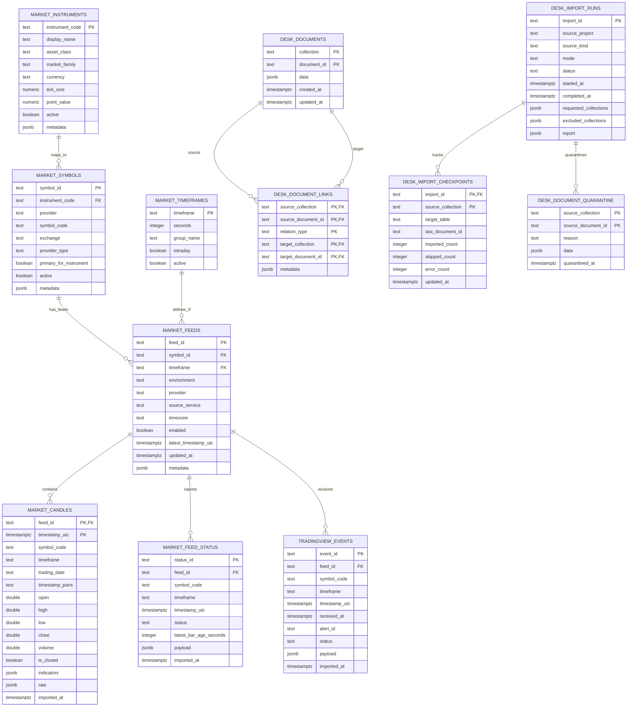
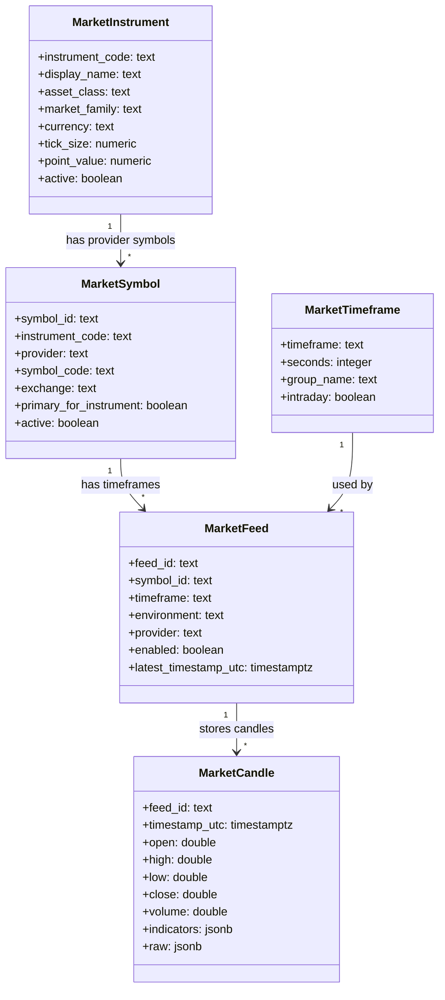

# Diagramme UML / ERD — PostgreSQL local PREPROD — 2026-07-19

## Intention

Ce diagramme décrit l’organisation cible de la base locale avant import Firestore.

Principe : séparer clairement :

- les symboles métier ;
- les symboles fournisseur, par exemple TradingView ;
- les feeds concrets par provider/symbole/timeframe ;
- les candles time-series ;
- les documents métier du Desk ;
- les imports et la quarantine.

Le cycle de vie des décisions de trade, des intentions d’ordre, des ordres broker et de NinjaTrader est volontairement séparé dans un modèle dédié :

- [POSTGRES_TRADE_AUTOMATION_UML_2026-07-19.md](/mnt/c/users/ces/desktop/TV_Automation_PREPROD/docs/POSTGRES_TRADE_AUTOMATION_UML_2026-07-19.md)

Ce découpage évite de mélanger les données de marché avec les décisions exécutables. Les candles et les symboles alimentent le Desk ; les tables trades/broker décrivent ensuite ce que le Desk décide, ce qui est approuvé, ce qui est envoyé au broker, et ce qui est réellement exécuté.

## Organisation des tables symboles

Il ne faut pas confondre trois notions :

| Niveau | Exemple | Rôle |
|---|---|---|
| Instrument métier | `MNQ`, `MES`, `DXY`, `US10Y` | Nom utilisé par le Desk et les stratégies |
| Symbole fournisseur | `MNQ1!`, `MES1!`, `DXY`, `US10Y` | Nom TradingView / broker / source externe |
| Feed concret | `prod__tradingview__MNQ1!__5` | Flux précis : environnement + provider + symbole + timeframe |

Exemple :

```text
market_instruments.instrument_code = MNQ
market_symbols.symbol_code         = MNQ1!
market_feeds.feed_id               = prod__tradingview__MNQ1!__5
market_candles.feed_id             = prod__tradingview__MNQ1!__5
```

Cette séparation permet de brancher plus tard :

- TradingView ;
- un broker ;
- un flux CSV ;
- un flux OVH/local ;
- plusieurs timeframes pour le même symbole.

## Diagramme global



## Diagramme centré marché / symboles



## Tables SQL proposées

### `market_instruments`

Table de référence métier.

Exemples :

| instrument_code | display_name | asset_class | market_family |
|---|---|---|---|
| `MNQ` | Micro Nasdaq | futures_index | us_indices |
| `MES` | Micro S&P | futures_index | us_indices |
| `NQ` | Nasdaq futures | futures_index | us_indices |
| `ES` | S&P futures | futures_index | us_indices |
| `DXY` | Dollar Index | macro_fx | cross_asset |
| `VIX` | Volatility Index | volatility | cross_asset |
| `US10Y` | US 10Y Yield | rates | cross_asset |
| `US02Y` | US 2Y Yield | rates | cross_asset |
| `GC` | Gold | commodities | cross_asset |
| `CL` | Crude Oil | commodities | cross_asset |

### `market_symbols`

Table de mapping provider.

Exemples :

| instrument_code | provider | symbol_code | primary |
|---|---|---|---|
| `MNQ` | tradingview | `MNQ1!` | true |
| `MES` | tradingview | `MES1!` | true |
| `NQ` | tradingview | `NQ1!` | true |
| `ES` | tradingview | `ES1!` | true |
| `GC` | tradingview | `GC1!` | true |
| `CL` | tradingview | `CL1!` | true |
| `DXY` | tradingview | `DXY` | true |
| `VIX` | tradingview | `VIX` | true |
| `US10Y` | tradingview | `US10Y` | true |
| `US02Y` | tradingview | `US02Y` | true |

### `market_timeframes`

Table de référence timeframe.

| timeframe | seconds | group_name |
|---|---:|---|
| `1` | 60 | intraday |
| `5` | 300 | intraday |
| `15` | 900 | intraday |
| `1H` | 3600 | higher_timeframe |
| `4H` | 14400 | higher_timeframe |

### `market_feeds`

Un feed = un flux concret.

Exemples :

| feed_id | symbol_code | timeframe | provider | environment |
|---|---|---|---|---|
| `prod__tradingview__MNQ1!__5` | `MNQ1!` | `5` | tradingview | prod |
| `prod__tradingview__MES1!__5` | `MES1!` | `5` | tradingview | prod |
| `preprod__tradingview__MNQ1!__5` | `MNQ1!` | `5` | tradingview | preprod |

### `market_candles`

Table time-series.

Clé primaire recommandée :

```text
(feed_id, timestamp_utc)
```

Pourquoi :

- un feed ne doit avoir qu’une candle par timestamp ;
- les lectures de fenêtres sont rapides ;
- le replay peut charger une tranche `from/to` sans scanner `desk_documents`.

## SQL cible

```sql
CREATE TABLE IF NOT EXISTS market_instruments (
  instrument_code text PRIMARY KEY,
  display_name text,
  asset_class text,
  market_family text,
  currency text,
  tick_size numeric,
  point_value numeric,
  active boolean NOT NULL DEFAULT true,
  metadata jsonb NOT NULL DEFAULT '{}'::jsonb
);

CREATE TABLE IF NOT EXISTS market_symbols (
  symbol_id text PRIMARY KEY,
  instrument_code text NOT NULL REFERENCES market_instruments(instrument_code),
  provider text NOT NULL,
  symbol_code text NOT NULL,
  exchange text,
  provider_type text,
  primary_for_instrument boolean NOT NULL DEFAULT false,
  active boolean NOT NULL DEFAULT true,
  metadata jsonb NOT NULL DEFAULT '{}'::jsonb,
  UNIQUE(provider, symbol_code)
);

CREATE TABLE IF NOT EXISTS market_timeframes (
  timeframe text PRIMARY KEY,
  seconds integer NOT NULL,
  group_name text NOT NULL,
  intraday boolean NOT NULL DEFAULT true,
  active boolean NOT NULL DEFAULT true
);

CREATE TABLE IF NOT EXISTS market_feeds (
  feed_id text PRIMARY KEY,
  symbol_id text NOT NULL REFERENCES market_symbols(symbol_id),
  timeframe text NOT NULL REFERENCES market_timeframes(timeframe),
  environment text NOT NULL,
  provider text NOT NULL,
  source_service text,
  timezone text NOT NULL DEFAULT 'Europe/Paris',
  enabled boolean NOT NULL DEFAULT true,
  latest_timestamp_utc timestamptz,
  updated_at timestamptz NOT NULL DEFAULT now(),
  metadata jsonb NOT NULL DEFAULT '{}'::jsonb
);

CREATE TABLE IF NOT EXISTS market_candles (
  feed_id text NOT NULL REFERENCES market_feeds(feed_id),
  timestamp_utc timestamptz NOT NULL,
  symbol_code text NOT NULL,
  timeframe text NOT NULL,
  trading_date text,
  timestamp_paris text,
  open double precision NOT NULL,
  high double precision NOT NULL,
  low double precision NOT NULL,
  close double precision NOT NULL,
  volume double precision,
  is_closed boolean NOT NULL DEFAULT true,
  indicators jsonb NOT NULL DEFAULT '{}'::jsonb,
  raw jsonb NOT NULL DEFAULT '{}'::jsonb,
  source_collection text,
  source_document_id text,
  imported_at timestamptz NOT NULL DEFAULT now(),
  PRIMARY KEY(feed_id, timestamp_utc)
);

CREATE INDEX IF NOT EXISTS market_candles_symbol_tf_time_idx
  ON market_candles(symbol_code, timeframe, timestamp_utc DESC);

CREATE INDEX IF NOT EXISTS market_candles_feed_time_idx
  ON market_candles(feed_id, timestamp_utc DESC);

CREATE INDEX IF NOT EXISTS market_candles_trading_date_idx
  ON market_candles(trading_date, symbol_code, timeframe);
```

## Rôle de `desk_documents`

`desk_documents` reste le document store du Desk.

Il ne doit pas contenir les candles massives en cible.

Il contient :

- `desk_master_analyses`
- `desk_hourly_monitors`
- `desk_active_theses`
- `desk_replay_runs`
- `desk_replay_steps`
- `desk_replay_timeline`
- `desk_agent_work_items`
- `desk_packs`
- `desk_pack_builds`
- `desk_alerts`
- `desk_notification_outbox`

Cela permet de garder la souplesse JSONB pour les objets métiers complexes.

## Règle d’import Firestore

### Firestore `market_feeds`

```text
market_feeds/{feed_id}
```

devient :

```text
market_feeds.feed_id = feed_id
```

### Firestore candles

```text
market_feeds/{feed_id}/candles/{doc_id}
```

devient :

```text
market_candles.feed_id = feed_id
market_candles.timestamp_utc = data.timestamp_utc
market_candles.raw = data
```

### Firestore métier

```text
desk_replay_runs/{doc_id}
```

devient :

```text
desk_documents.collection = desk_replay_runs
desk_documents.document_id = doc_id
desk_documents.data = data
```

## Pourquoi cette organisation est meilleure

| Problème Firestore actuel | Organisation cible |
|---|---|
| Symboles mélangés aux feeds | `market_instruments` + `market_symbols` |
| Feeds/timeframes dispersés en paths | `market_feeds` explicite |
| Candles dans sous-collections volumineuses | `market_candles` time-series indexée |
| Objets métier hétérogènes | `desk_documents` JSONB |
| Logs/imports sans traçabilité | `desk_import_runs` / checkpoints |
| Docs sales importés dans runtime | `desk_document_quarantine` |

## Extension trading automatisé / NinjaTrader

Le modèle marché ci-dessus ne suffit pas pour l’automatisation broker. Il faut ajouter une couche trade dédiée avec enums stricts et tables spécialisées :

| Couche | Table cible | Rôle |
|---|---|---|
| Décision Desk/GPT | `trade_decisions` | Signal ou décision structurée produite par Master/Monitor/Replay |
| Contrôle risque | `trade_risk_checks` | Validation taille, stop, exposition, règles horaires |
| Intention d’ordre | `trade_order_intents` | Demande d’ordre normalisée, approuvable, idempotente |
| Approbation | `trade_approvals` | Validation humaine ou automatique avant broker |
| Broker/NinjaTrader | `broker_orders`, `broker_order_events` | Ordres réellement envoyés/reçus côté broker |
| Exécutions | `trade_fills` | Fills partiels ou complets |
| Cycle canonique | `trades`, `trade_events`, `trade_position_snapshots` | État du trade, timeline, snapshots |

Principe important : `market_symbols` décrit les symboles de données, par exemple `MNQ1!` TradingView. `broker_contracts` décrit les contrats réellement tradables, par exemple `MNQ 09-26` côté NinjaTrader. On ne doit pas confondre les deux.

Le schéma complet avec enums PostgreSQL est dans :

- [POSTGRES_TRADE_AUTOMATION_UML_2026-07-19.md](/mnt/c/users/ces/desktop/TV_Automation_PREPROD/docs/POSTGRES_TRADE_AUTOMATION_UML_2026-07-19.md)

## Décision recommandée

Avant import :

1. créer les tables symboles/feeds/candles ;
2. seed `market_instruments`, `market_symbols`, `market_timeframes` ;
3. créer les enums et tables trades/broker, même si NinjaTrader reste désactivé au départ ;
4. adapter `PostgresDeskPersistence.queryDocuments()` pour router `market_feeds/*/candles` vers `market_candles` ;
5. importer P0/P1/P2 dans `desk_documents` ;
6. importer les candles utiles dans `market_candles`, pas dans `desk_documents` ;
7. garder `desk_ready_orders`, `desk_trade_outcomes`, `desk_positions` et `desk_position_states` en JSONB au premier import, puis les migrer vers `trade_decisions`, `trades` et `trade_events` après validation du modèle broker.

Cette organisation garde le Desk souple, mais donne à PostgreSQL une vraie structure performante pour les symboles et les séries de prix.
