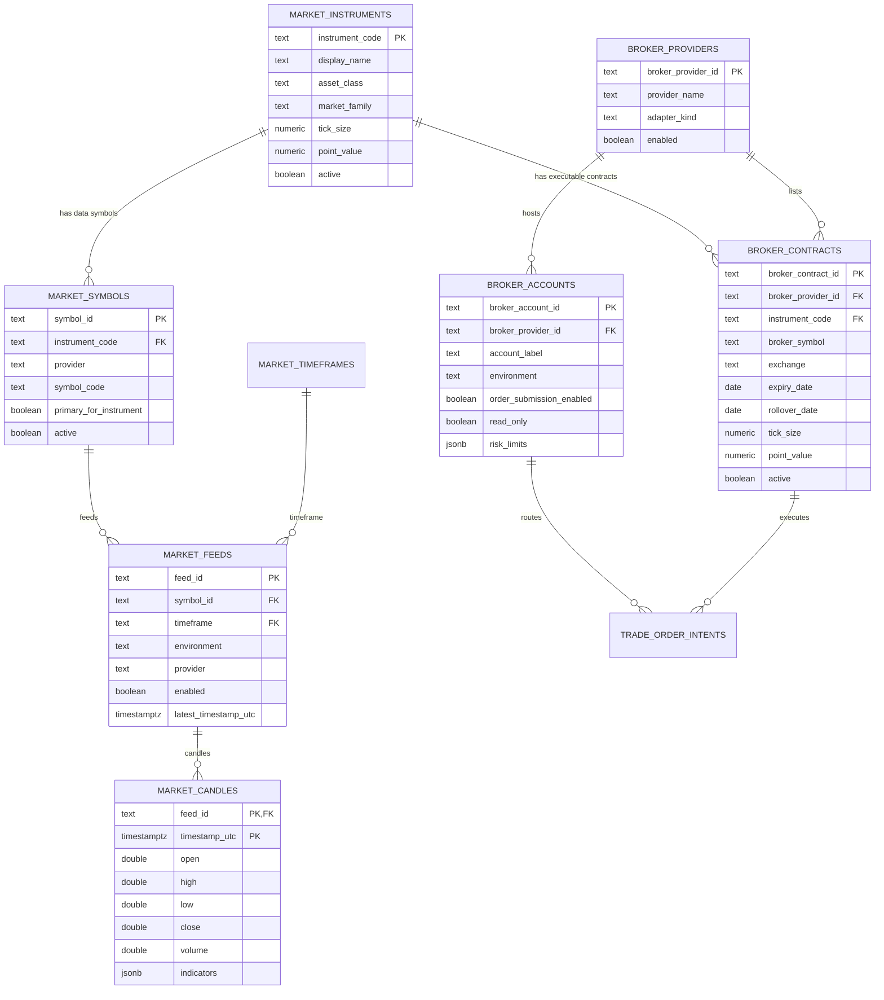
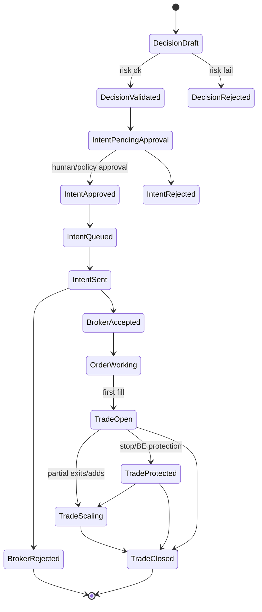

# UML cible — Symboles, décisions, trades et automatisation NinjaTrader — 2026-07-19

## Pourquoi ce découpage

Le Desk ne doit pas mélanger :

- l’analyse GPT / Master / Monitor ;
- la décision métier ;
- l’intention d’ordre ;
- l’ordre réellement envoyé à NinjaTrader ;
- les fills ;
- le trade canonique et son cycle de vie.

Cette séparation est indispensable si on veut passer plus tard vers une automatisation NinjaTrader propre, auditée et contrôlable.

## Principe fondamental

```text
GPT / Desk décide
→ le backend transforme en décision normalisée
→ une policy valide ou refuse
→ une intention d’ordre est créée
→ NinjaTrader reçoit seulement une intention approuvée
→ les ordres/fills reviennent du broker
→ le trade canonique est reconstruit depuis les événements
```

Donc :

- `trade_decisions` = ce que le Desk veut faire ;
- `trade_order_intents` = ce qui est autorisé à devenir un ordre ;
- `broker_orders` = ce qui a été envoyé ou reçu côté NinjaTrader ;
- `trade_fills` = ce qui a été exécuté réellement ;
- `trades` = état canonique agrégé du trade ;
- `trade_events` = journal immuable du cycle de vie.

## Enums PostgreSQL

Les enums doivent être réservés aux états stables. Les symboles, providers et stratégies doivent rester dans des tables, car ils vont évoluer.

```sql
CREATE TYPE execution_mode AS ENUM (
  'live',
  'paper',
  'replay',
  'backtest'
);

CREATE TYPE trade_side AS ENUM (
  'long',
  'short'
);

CREATE TYPE order_side AS ENUM (
  'buy',
  'sell'
);

CREATE TYPE order_type AS ENUM (
  'market',
  'limit',
  'stop_market',
  'stop_limit',
  'bracket',
  'oco',
  'cancel',
  'modify'
);

CREATE TYPE decision_status AS ENUM (
  'draft',
  'candidate',
  'validated',
  'rejected',
  'expired',
  'superseded'
);

CREATE TYPE approval_status AS ENUM (
  'not_required',
  'required',
  'approved',
  'rejected',
  'expired',
  'revoked'
);

CREATE TYPE order_intent_status AS ENUM (
  'draft',
  'blocked',
  'pending_approval',
  'approved',
  'queued',
  'sent',
  'acknowledged',
  'rejected',
  'cancelled',
  'expired',
  'superseded'
);

CREATE TYPE broker_order_status AS ENUM (
  'created',
  'submitted',
  'accepted',
  'working',
  'partially_filled',
  'filled',
  'cancel_requested',
  'cancelled',
  'rejected',
  'expired',
  'error',
  'unknown'
);

CREATE TYPE trade_status AS ENUM (
  'planned',
  'armed',
  'submitted',
  'open',
  'scaling',
  'protected',
  'closing',
  'closed',
  'cancelled',
  'rejected',
  'expired',
  'error'
);

CREATE TYPE fill_liquidity AS ENUM (
  'maker',
  'taker',
  'unknown'
);

CREATE TYPE lifecycle_event_type AS ENUM (
  'decision_created',
  'risk_checked',
  'approval_requested',
  'approval_granted',
  'approval_rejected',
  'intent_created',
  'intent_queued',
  'intent_sent',
  'broker_ack',
  'broker_reject',
  'order_working',
  'order_filled',
  'partial_fill',
  'stop_moved',
  'target_hit',
  'manual_intervention',
  'trade_closed',
  'trade_cancelled',
  'sync_reconciled',
  'error'
);
```

## Découpage symboles / contrats / feeds

Il faut distinguer :

| Table | Rôle | Exemple |
|---|---|---|
| `market_instruments` | instrument métier stable | `MNQ` |
| `market_symbols` | symbole data provider | `MNQ1!` chez TradingView |
| `market_feeds` | flux data concret | `prod__tradingview__MNQ1!__5` |
| `broker_contracts` | contrat exécutable NinjaTrader | `MNQ 09-26` |
| `broker_accounts` | compte d’exécution | `Sim101`, `PropFirmEval01` |

Pour les futures, `broker_contracts` est obligatoire : on ne trade pas vraiment `MNQ1!`, on trade un contrat échéancé.

## UML — marché, symboles et contrats broker



## UML — cycle décision → trade

```mermaid
erDiagram
    DESK_DOCUMENTS ||--o{ TRADE_DECISIONS : "source evidence"
    MARKET_INSTRUMENTS ||--o{ TRADE_DECISIONS : "instrument"
    TRADE_DECISIONS ||--o{ TRADE_RISK_CHECKS : "risk gates"
    TRADE_DECISIONS ||--o{ TRADE_ORDER_INTENTS : "creates"
    TRADE_ORDER_INTENTS ||--o{ TRADE_APPROVALS : "requires"
    TRADE_ORDER_INTENTS ||--o{ BROKER_ORDERS : "submits"
    BROKER_ORDERS ||--o{ BROKER_ORDER_EVENTS : "events"
    BROKER_ORDERS ||--o{ TRADE_FILLS : "fills"
    TRADE_DECISIONS ||--o| TRADES : "opens aggregate"
    TRADE_FILLS ||--o{ TRADES : "updates"
    TRADES ||--o{ TRADE_EVENTS : "lifecycle"
    TRADES ||--o{ TRADE_POSITION_SNAPSHOTS : "snapshots"

    DESK_DOCUMENTS {
        text collection PK
        text document_id PK
        jsonb data
    }

    TRADE_DECISIONS {
        text trade_decision_id PK
        text source_collection
        text source_document_id
        execution_mode mode
        text strategy_id
        text session
        text trading_date
        text instrument_code FK
        trade_side side
        decision_status status
        numeric entry_price
        numeric stop_price
        jsonb targets
        numeric planned_risk_points
        numeric planned_r_multiple
        timestamptz decided_at
    }

    TRADE_RISK_CHECKS {
        text risk_check_id PK
        text trade_decision_id FK
        text status
        numeric max_risk_usd
        numeric planned_risk_usd
        numeric max_daily_loss_remaining
        jsonb checks
        timestamptz checked_at
    }

    TRADE_ORDER_INTENTS {
        text order_intent_id PK
        text trade_decision_id FK
        text broker_account_id FK
        text broker_contract_id FK
        order_intent_status status
        order_side side
        order_type type
        numeric quantity
        numeric limit_price
        numeric stop_price
        jsonb bracket
        approval_status approval_status
        text idempotency_key
        integer revision
        timestamptz created_at
        timestamptz expires_at
    }

    TRADE_APPROVALS {
        text approval_id PK
        text order_intent_id FK
        approval_status status
        text actor_id
        text confirmation_phrase
        timestamptz decided_at
        jsonb evidence
    }

    BROKER_ORDERS {
        text broker_order_id PK
        text order_intent_id FK
        text broker_provider_id FK
        text broker_account_id FK
        text external_order_id
        broker_order_status status
        order_side side
        order_type type
        numeric quantity
        numeric filled_quantity
        numeric avg_fill_price
        timestamptz submitted_at
        timestamptz last_update_at
    }

    BROKER_ORDER_EVENTS {
        text broker_order_event_id PK
        text broker_order_id FK
        text external_order_id
        text event_type
        broker_order_status status
        timestamptz event_time
        jsonb payload
    }

    TRADE_FILLS {
        text fill_id PK
        text broker_order_id FK
        text trade_id FK
        text external_fill_id
        order_side side
        numeric quantity
        numeric price
        fill_liquidity liquidity
        timestamptz filled_at
        jsonb payload
    }

    TRADES {
        text trade_id PK
        text trade_decision_id FK
        text instrument_code FK
        text broker_contract_id FK
        trade_side side
        trade_status status
        numeric quantity_open
        numeric quantity_closed
        numeric avg_entry_price
        numeric avg_exit_price
        numeric stop_price
        jsonb targets
        numeric realized_pnl
        numeric realized_r
        timestamptz opened_at
        timestamptz closed_at
    }

    TRADE_EVENTS {
        text trade_event_id PK
        text trade_id FK
        lifecycle_event_type event_type
        timestamptz event_time
        text source
        jsonb payload
    }

    TRADE_POSITION_SNAPSHOTS {
        text snapshot_id PK
        text trade_id FK
        timestamptz snapshot_at
        trade_status status
        numeric quantity_open
        numeric stop_price
        numeric unrealized_pnl
        numeric realized_pnl
        jsonb payload
    }
```



## Tables SQL proposées

### Providers et comptes broker

```sql
CREATE TABLE broker_providers (
  broker_provider_id text PRIMARY KEY,
  provider_name text NOT NULL,
  adapter_kind text NOT NULL,
  enabled boolean NOT NULL DEFAULT false,
  metadata jsonb NOT NULL DEFAULT '{}'::jsonb
);

CREATE TABLE broker_accounts (
  broker_account_id text PRIMARY KEY,
  broker_provider_id text NOT NULL REFERENCES broker_providers(broker_provider_id),
  account_label text NOT NULL,
  environment text NOT NULL,
  order_submission_enabled boolean NOT NULL DEFAULT false,
  read_only boolean NOT NULL DEFAULT true,
  risk_limits jsonb NOT NULL DEFAULT '{}'::jsonb,
  metadata jsonb NOT NULL DEFAULT '{}'::jsonb,
  updated_at timestamptz NOT NULL DEFAULT now()
);
```

### Contrats exécutables

```sql
CREATE TABLE broker_contracts (
  broker_contract_id text PRIMARY KEY,
  broker_provider_id text NOT NULL REFERENCES broker_providers(broker_provider_id),
  instrument_code text NOT NULL REFERENCES market_instruments(instrument_code),
  broker_symbol text NOT NULL,
  exchange text,
  currency text,
  expiry_date date,
  rollover_date date,
  tick_size numeric,
  point_value numeric,
  active boolean NOT NULL DEFAULT true,
  metadata jsonb NOT NULL DEFAULT '{}'::jsonb,
  UNIQUE(broker_provider_id, broker_symbol)
);

CREATE INDEX broker_contracts_instrument_active_idx
  ON broker_contracts(instrument_code, active, expiry_date);
```

Exemples :

| instrument_code | broker_provider_id | broker_symbol | expiry_date |
|---|---|---|---|
| `MNQ` | `ninjatrader` | `MNQ 09-26` | `2026-09-18` |
| `MES` | `ninjatrader` | `MES 09-26` | `2026-09-18` |

### Décisions trade

```sql
CREATE TABLE trade_decisions (
  trade_decision_id text PRIMARY KEY,
  source_collection text,
  source_document_id text,
  mode execution_mode NOT NULL,
  strategy_id text,
  session text,
  trading_date text,
  run_id text,
  backtest_id text,
  instrument_code text NOT NULL REFERENCES market_instruments(instrument_code),
  side trade_side NOT NULL,
  status decision_status NOT NULL DEFAULT 'draft',
  entry_price numeric,
  stop_price numeric,
  targets jsonb NOT NULL DEFAULT '[]'::jsonb,
  planned_risk_points numeric,
  planned_risk_usd numeric,
  planned_r_multiple numeric,
  confidence_pct numeric,
  thesis_id text,
  setup_id text,
  decided_at timestamptz NOT NULL,
  expires_at timestamptz,
  evidence jsonb NOT NULL DEFAULT '{}'::jsonb,
  created_at timestamptz NOT NULL DEFAULT now(),
  updated_at timestamptz NOT NULL DEFAULT now()
);

CREATE INDEX trade_decisions_scope_idx
  ON trade_decisions(mode, trading_date, session, strategy_id);

CREATE INDEX trade_decisions_source_idx
  ON trade_decisions(source_collection, source_document_id);

CREATE INDEX trade_decisions_status_idx
  ON trade_decisions(status, decided_at DESC);
```

### Risk checks

```sql
CREATE TABLE trade_risk_checks (
  risk_check_id text PRIMARY KEY,
  trade_decision_id text NOT NULL REFERENCES trade_decisions(trade_decision_id),
  status text NOT NULL,
  max_risk_usd numeric,
  planned_risk_usd numeric,
  max_daily_loss_remaining numeric,
  checks jsonb NOT NULL DEFAULT '{}'::jsonb,
  checked_at timestamptz NOT NULL DEFAULT now()
);
```

### Intentions d’ordre

```sql
CREATE TABLE trade_order_intents (
  order_intent_id text PRIMARY KEY,
  trade_decision_id text NOT NULL REFERENCES trade_decisions(trade_decision_id),
  broker_account_id text NOT NULL REFERENCES broker_accounts(broker_account_id),
  broker_contract_id text NOT NULL REFERENCES broker_contracts(broker_contract_id),
  status order_intent_status NOT NULL DEFAULT 'draft',
  side order_side NOT NULL,
  type order_type NOT NULL,
  quantity numeric NOT NULL,
  limit_price numeric,
  stop_price numeric,
  bracket jsonb NOT NULL DEFAULT '{}'::jsonb,
  approval_status approval_status NOT NULL DEFAULT 'required',
  idempotency_key text NOT NULL,
  revision integer NOT NULL DEFAULT 0,
  created_by text,
  created_at timestamptz NOT NULL DEFAULT now(),
  queued_at timestamptz,
  sent_at timestamptz,
  expires_at timestamptz,
  metadata jsonb NOT NULL DEFAULT '{}'::jsonb,
  UNIQUE(idempotency_key)
);

CREATE INDEX trade_order_intents_status_idx
  ON trade_order_intents(status, created_at DESC);

CREATE INDEX trade_order_intents_decision_idx
  ON trade_order_intents(trade_decision_id);
```

### Approbations

```sql
CREATE TABLE trade_approvals (
  approval_id text PRIMARY KEY,
  order_intent_id text NOT NULL REFERENCES trade_order_intents(order_intent_id),
  status approval_status NOT NULL,
  actor_id text,
  actor_kind text,
  confirmation_phrase text,
  reason text,
  evidence jsonb NOT NULL DEFAULT '{}'::jsonb,
  decided_at timestamptz NOT NULL DEFAULT now()
);
```

### Ordres broker

```sql
CREATE TABLE broker_orders (
  broker_order_id text PRIMARY KEY,
  order_intent_id text NOT NULL REFERENCES trade_order_intents(order_intent_id),
  broker_provider_id text NOT NULL REFERENCES broker_providers(broker_provider_id),
  broker_account_id text NOT NULL REFERENCES broker_accounts(broker_account_id),
  external_order_id text,
  status broker_order_status NOT NULL DEFAULT 'created',
  side order_side NOT NULL,
  type order_type NOT NULL,
  quantity numeric NOT NULL,
  filled_quantity numeric NOT NULL DEFAULT 0,
  avg_fill_price numeric,
  submitted_at timestamptz,
  accepted_at timestamptz,
  last_update_at timestamptz,
  raw jsonb NOT NULL DEFAULT '{}'::jsonb,
  UNIQUE(broker_provider_id, broker_account_id, external_order_id)
);

CREATE INDEX broker_orders_status_idx
  ON broker_orders(status, last_update_at DESC);

CREATE INDEX broker_orders_intent_idx
  ON broker_orders(order_intent_id);
```

### Événements d’ordre

```sql
CREATE TABLE broker_order_events (
  broker_order_event_id text PRIMARY KEY,
  broker_order_id text REFERENCES broker_orders(broker_order_id),
  external_order_id text,
  event_type text NOT NULL,
  status broker_order_status,
  event_time timestamptz NOT NULL,
  payload jsonb NOT NULL DEFAULT '{}'::jsonb,
  received_at timestamptz NOT NULL DEFAULT now()
);

CREATE INDEX broker_order_events_order_time_idx
  ON broker_order_events(broker_order_id, event_time DESC);
```

### Trades canoniques

```sql
CREATE TABLE trades (
  trade_id text PRIMARY KEY,
  trade_decision_id text REFERENCES trade_decisions(trade_decision_id),
  instrument_code text NOT NULL REFERENCES market_instruments(instrument_code),
  broker_contract_id text REFERENCES broker_contracts(broker_contract_id),
  side trade_side NOT NULL,
  status trade_status NOT NULL DEFAULT 'planned',
  quantity_open numeric NOT NULL DEFAULT 0,
  quantity_closed numeric NOT NULL DEFAULT 0,
  avg_entry_price numeric,
  avg_exit_price numeric,
  stop_price numeric,
  targets jsonb NOT NULL DEFAULT '[]'::jsonb,
  realized_pnl numeric,
  unrealized_pnl numeric,
  realized_r numeric,
  max_favorable_excursion numeric,
  max_adverse_excursion numeric,
  opened_at timestamptz,
  closed_at timestamptz,
  created_at timestamptz NOT NULL DEFAULT now(),
  updated_at timestamptz NOT NULL DEFAULT now(),
  metadata jsonb NOT NULL DEFAULT '{}'::jsonb
);

CREATE INDEX trades_status_idx
  ON trades(status, updated_at DESC);

CREATE INDEX trades_instrument_time_idx
  ON trades(instrument_code, opened_at DESC);

CREATE INDEX trades_decision_idx
  ON trades(trade_decision_id);
```

### Fills

```sql
CREATE TABLE trade_fills (
  fill_id text PRIMARY KEY,
  trade_id text REFERENCES trades(trade_id),
  broker_order_id text REFERENCES broker_orders(broker_order_id),
  external_fill_id text,
  side order_side NOT NULL,
  quantity numeric NOT NULL,
  price numeric NOT NULL,
  commission numeric,
  liquidity fill_liquidity NOT NULL DEFAULT 'unknown',
  filled_at timestamptz NOT NULL,
  payload jsonb NOT NULL DEFAULT '{}'::jsonb,
  UNIQUE(broker_order_id, external_fill_id)
);

CREATE INDEX trade_fills_trade_time_idx
  ON trade_fills(trade_id, filled_at);
```

### Events et snapshots trade

```sql
CREATE TABLE trade_events (
  trade_event_id text PRIMARY KEY,
  trade_id text REFERENCES trades(trade_id),
  event_type lifecycle_event_type NOT NULL,
  event_time timestamptz NOT NULL,
  source text NOT NULL,
  payload jsonb NOT NULL DEFAULT '{}'::jsonb,
  created_at timestamptz NOT NULL DEFAULT now()
);

CREATE TABLE trade_position_snapshots (
  snapshot_id text PRIMARY KEY,
  trade_id text NOT NULL REFERENCES trades(trade_id),
  snapshot_at timestamptz NOT NULL,
  status trade_status NOT NULL,
  quantity_open numeric,
  stop_price numeric,
  unrealized_pnl numeric,
  realized_pnl numeric,
  payload jsonb NOT NULL DEFAULT '{}'::jsonb
);

CREATE INDEX trade_events_trade_time_idx
  ON trade_events(trade_id, event_time DESC);

CREATE INDEX trade_position_snapshots_trade_time_idx
  ON trade_position_snapshots(trade_id, snapshot_at DESC);
```

## Lifecycle proposé



## Ce qui reste dans `desk_documents`

Le document store garde les objets complexes non time-series :

- `desk_master_analyses`
- `desk_hourly_monitors`
- `desk_active_theses`
- `desk_replay_runs`
- `desk_replay_timeline`
- `desk_agent_work_items`
- `desk_packs`
- projections front

Mais les trades réels / broker ne doivent pas rester uniquement en JSONB. Ils deviennent des tables relationnelles auditables.

## Règle de sécurité NinjaTrader

Même si on prépare l’automatisation, la base doit permettre de bloquer par design :

- `broker_accounts.order_submission_enabled = false` par défaut ;
- `broker_accounts.read_only = true` par défaut ;
- aucune ligne `broker_orders` ne doit être créée sans `trade_order_intents.status = approved`;
- chaque intention doit avoir une `idempotency_key`;
- les changements broker sont append-only dans `broker_order_events` et `trade_events`;
- le trade canonique est reconstruit depuis les fills/events, pas depuis une simple réponse GPT.

## Décision recommandée

Avant import Firestore :

1. créer les enums ;
2. créer les tables symboles/feeds/candles ;
3. créer les tables broker/trades, même si NinjaTrader reste désactivé ;
4. importer les anciennes collections `desk_positions`, `desk_position_states`, `desk_ready_orders`, `desk_trade_outcomes` dans `desk_documents` dans un premier temps ;
5. plus tard, écrire un migrateur vers `trade_decisions`, `trades`, `trade_events` quand le modèle broker est validé.

Cette approche évite de forcer l’ancien historique dans un modèle encore nouveau, tout en préparant correctement le futur cycle NinjaTrader.
