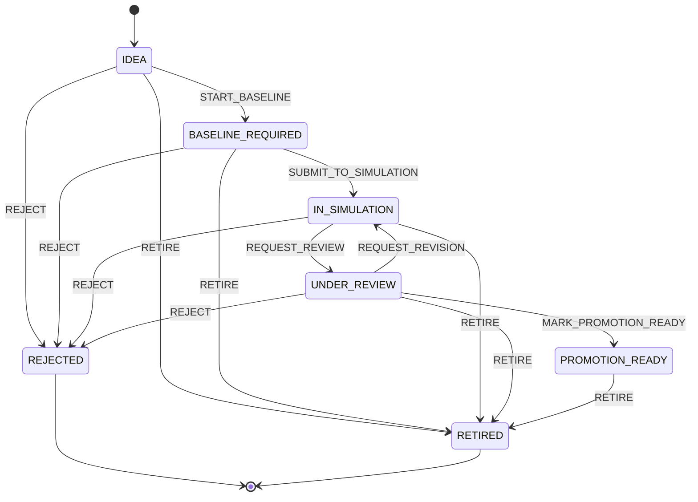

# Research Candidate Lifecycle V1 — TD2-510

## Objectif

`TD2-510` sépare clairement le cycle d’une candidate de recherche du lifecycle `StrategyVersion`/`StrategyInstance`. Une candidate peut être testée, rejetée, retirée ou préparée pour promotion, mais elle ne devient pas une stratégie publiée et encore moins une stratégie live par simple décision IA.

## State machine

## Contrat domaine

Le contrat est implémenté dans `packages/desk-domain/src/research-candidate-lifecycle-v1.js`.

Exports principaux :

- `buildResearchCandidateLifecyclePolicyV1`
- `transitionResearchCandidateLifecycleV1`
- `validateResearchCandidateLifecycleSnapshotV1`
- `researchCandidateLifecycleHashV1`

## Invariants

- Toute transition exige `actor_ref`, `idempotency_key` et `evidence_refs`.
- Les transitions non listées sont rejetées sans produire de patch.
- `REJECTED` et `RETIRED` sont terminaux et immuables.
- `REJECT` exige `negative_result_ref`.
- `PROMOTION_READY` exige :
  - `strategy_version_id` ;
  - preuve `VALIDATION_REPORT` ;
  - preuve `ROBUSTNESS_REPORT` ;
  - preuve `CONTRADICTORY_REVIEW` ;
  - preuve `DECISION_AUDIT` ;
  - `process_decision = PROMOTE_TO_REVIEW` issu du processus scientifique `TD2-506`.

## Relation avec les autres tickets

- `TD2-500` fournit l’entité `ResearchCandidate`.
- `TD2-506` décide si les gates scientifiques permettent une promotion en review.
- `TD2-510` applique la transition de lifecycle et empêche les raccourcis.
- `TD2-503` décidera plus tard de la matrice d’approbation réelle avant publication/promotion.

## Limites

La V1 produit un patch et un événement auditable en domaine pur. La persistance concrète reste assurée par le registre `research_candidates` existant ; aucun nouveau chemin live/exécution n’est introduit.
