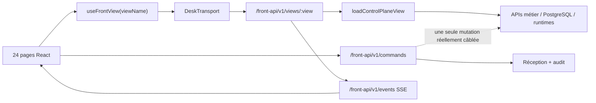
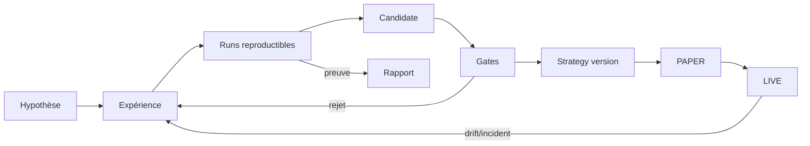
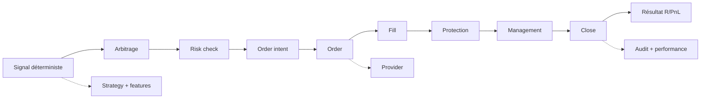

# Desk Control Plane V2 — Plan directeur frontend

**Statut :** référence maître de la phase 1 — audit et conception, sans refonte massive du code
**Date :** 13 août 2026
**Périmètre audité :** `apps/desk-control-plane`, BFF `/front-api/v1`, catalogue `/api/v2/catalog.json`, contrats et projections backend utiles au frontend
**Nom produit recommandé :** **Desk Control Plane V2**
**Nom technique conservé pendant la migration :** `front-control-plane-vnext`

Ce document est l'index décisionnel de la refonte. Il doit être lu avec :

- [les contrats d'exploitation des 24 écrans existants](./FRONTEND_V2_PAGE_OPERATING_CONTRACTS_2026-08-13.md) ;
- [l'audit backend → frontend, hardcoding et composants](./FRONTEND_V2_BACKEND_FRONT_AUDIT_2026-08-13.md).

---

## 1. Executive summary

Le frontend possède une bonne base visuelle : direction sombre compacte, densité adaptée à un desk professionnel, vocabulaire de domaines déjà large et 24 routes couvrant pilotage, recherche, stratégies, trading, exécution et gouvernance. Il ne s'agit donc pas de jeter l'identité visuelle ni de refaire une collection de maquettes.

En revanche, le produit n'est pas encore commercialisable comme SaaS enterprise mature. Le problème principal n'est pas le CSS : c'est le **contrat de vérité et d'exploitation**.

### Verdict

| Axe | Constat | Conséquence |
| --- | --- | --- |
| Vérité des données | Le BFF projette parfois `0`, `PASS`, `ACCEPTED`, `ACKED` ou `NOMINAL` lorsqu'une capacité est absente ou inconnue. | L'écran peut rassurer à tort un opérateur. |
| Actions | En production réelle, une seule mutation backend est actuellement implémentée ; de nombreuses actions visibles sont inertes ou seulement « acceptées ». | L'interface ressemble à un poste de contrôle sans en avoir encore les garanties. |
| Drill-down | Cinq routes de détail ne transmettent pas l'identifiant au repository ; le BFF renvoie des coquilles vides. | Le parcours global → détail est factice. |
| Permissions | Le `PermissionGate` autorise statiquement toutes les capacités de lecture connues. | Le contrôle d'accès affiché ne reflète pas la session réelle. |
| Architecture | Un view model de 2 721 lignes, un mock de 4 894 lignes et une feuille CSS de 9 666 lignes concentrent le produit. | Les changements sont risqués, les duplications nombreuses et la maintenabilité faible. |
| Navigation | La sidebar est une seconde source de vérité, non dérivée des routes ; le mobile n'expose que cinq destinations. | Des vues existent sans parcours fiable pour les atteindre. |
| Performance | Chaque vue BFF agrège jusqu'à onze sources, même si elle n'en utilise que deux. | Les lectures observées prennent souvent environ 0,7 à 1,5 s à vide ou presque. |
| UX | Les 24 pages réemploient souvent le même patron « 6 KPI + 6 panneaux ». | La hiérarchie visuelle précède la question métier au lieu de la servir. |

### Décision directrice

La V2 doit devenir un **control plane orienté objets et décisions** :

```text
Observer → Comprendre → Investiguer → Agir → Vérifier
```

Chaque métrique importante doit mener vers ses contributeurs, chaque objet métier vers une URL partageable, chaque commande vers un état terminal vérifiable, et chaque donnée inconnue être explicitement présentée comme inconnue.

### P0 avant toute migration écran par écran

1. Introduire les états `UNKNOWN`, `UNAVAILABLE`, `NOT_IMPLEMENTED`, `STALE` et `PARTIAL` ; supprimer les faux zéros et faux succès.
2. Rendre les routes de détail réellement paramétrées de bout en bout.
3. Ne jamais assimiler `ACCEPTED` à une mutation réussie ; afficher le cycle complet de commande.
4. Alimenter navigation et permissions depuis la session et le catalogue de capacités.
5. Retirer du shell les prix, l'utilisateur, l'environnement, les badges et la version hardcodés.
6. Charger uniquement les sources nécessaires à la vue demandée.

---

## 2. Frontend maturity score

| Dimension | Note /10 | Justification |
| --- | ---: | --- |
| UX | 4,0 | Couverture large, mais questions métier, parcours d'action et profondeur restent insuffisants. |
| UI | 6,0 | Direction premium cohérente ; densité parfois excessive, typographie trop petite et layout trop répétitif. |
| Architecture | 4,5 | Bon découplage BFF/frontend, mais pages, view models et styles sont monolithiques. |
| Réutilisabilité | 5,0 | Premières primitives utiles ; catalogue incomplet et variantes métier codées par page. |
| Intégration des données | 3,0 | Transport réel présent, mais projections incomplètes, détails non paramétrés et mock très en avance sur le réel. |
| Navigation | 4,0 | Routes nombreuses, mais arborescence plate, deux sources de vérité et mobile incomplet. |
| Cohérence | 6,0 | Langage visuel stable ; sémantique des états et des actions non stabilisée. |
| Responsive | 4,0 | Mode workstation travaillé ; mobile tronqué et adaptation encore fondée sur la réduction. |
| Accessibilité | 3,0 | Quelques attributs ARIA ; tailles, focus, dialogues, tables et navigation clavier non garantis. |
| Capacité SaaS | 3,5 | Bonne démonstration de vision, mais confiance, RBAC, actions réelles, audit et tests E2E incomplets. |
| **Maturité globale** | **4,3** | **Foundation convaincante, produit opérable non encore garanti.** |

---

## 3. Architecture actuelle

### 3.1 Flux réel



### 3.2 Points positifs

- application indépendante du legacy ;
- frontière `/front-api/v1` conforme au principe de control plane ;
- React Query pour les données serveur ;
- contrats runtime validés à la réception ;
- stream d'événements et suivi de commandes déjà amorcés ;
- composants de base partagés pour cartes, statuts, tables, actions et timeline ;
- mode mock explicitement opt-in.

### 3.3 Faiblesses structurelles prouvées

- `App.tsx` importe toutes les pages et les sélectionne par une chaîne de ternaires ; pas de lazy loading ni de modules de routes.
- `routes.ts` décrit 24 routes, tandis que `DeskShell.tsx` maintient séparément 13 liens.
- `useFrontView(viewName)` ne prend aucun paramètre, filtre ou identifiant.
- `viewModels.ts` contient tous les domaines dans 2 721 lignes.
- `canonicalDataset.ts` est importé dans le transport et embarque 4 894 lignes de scénario de démonstration.
- `styles.css` concentre 9 666 lignes et plus d'une centaine de sélecteurs dupliqués.
- les pages sont regroupées dans `src/pages` plutôt que dans des features verticales.
- le backend agrège les mêmes familles de données pour chaque vue.

### 3.4 Nomenclature à stabiliser

Les documents emploient « VNext », « Front V3 » et « V2 ». La recommandation est :

- **produit :** Desk Control Plane V2 ;
- **répertoire durant la coexistence :** `apps/desk-control-plane` ;
- **contrat API :** `/front-api/v2` lorsqu'un breaking change sera nécessaire ;
- **suppression progressive** des appellations Front V3/VNext dans les textes opérateur.

---

## 4. Inventaire exhaustif de l'existant

```text
DESK CONTROL PLANE — 24 routes
│
├── ACCÈS & GOUVERNANCE
│   ├── /auth                         AuthSessionPage
│   ├── /settings                     OperatorSettingsPage
│   └── /admin                        AdminAccessPage
│
├── PILOTAGE
│   ├── /command-center               CommandCenterPage
│   ├── /operations                   OperationsQueuePage
│   └── /events                       EventsAuditPage
│
├── RESEARCH
│   ├── /research                     ResearchLabPage
│   ├── /research/experiments/:id     ResearchExperimentDetailPage
│   ├── /research/runs/:id            ResearchRunDetailPage
│   ├── /research/agents              ResearchAgentFleetPage
│   ├── /research/data                ResearchDataCatalogPage
│   └── /research/compute             ResearchComputeSchedulerPage
│
├── STRATÉGIES
│   ├── /strategies                   StrategyCenterPage
│   ├── /strategies/:id               StrategyDetailPage
│   └── /strategies/:id/compare       StrategyComparePage
│
├── TRADING & RISQUE
│   ├── /live                         LiveTradingPage
│   ├── /demo-paper-readiness         DemoPaperReadinessPage
│   ├── /live/signals/:id             LiveSignalDetailPage
│   ├── /portfolio                    PortfolioPage
│   ├── /orders                       OrdersPage
│   └── /risk                         RiskCenterPage
│
├── EXÉCUTION
│   ├── /execution/providers          ExecutionProvidersPage
│   └── /execution/incidents          ExecutionIncidentsPage
│
└── ASSISTANT
    └── /jarvis                       JarvisWorkspacePage
```

L'audit page par page et les **Page Operating Contracts** figurent dans l'annexe dédiée. Ils couvrent pour chaque route : objectif, utilisateur, questions métier, informations L1/L2/L3, actions, manipulations, danger, permissions, API, temps réel, états, responsive, 5-second test et proposition cible.

---

## 5. Principaux constats page par page

| Domaine | Ce qui fonctionne | Défaut dominant | Décision V2 |
| --- | --- | --- | --- |
| Command Center | Synthèse système large | KPI sans contributeurs ; boutons inertes | Page L0 centrée sur exceptions, avec chaque KPI cliquable. |
| Opérations | Missions et incidents réels visibles | Flux, gates, DLQ et actions souvent vides | L1 queue filtrable + pages Workflow/Mission/Incident dédiées. |
| Audit | Intention de journal transversal | Pas de vrais détails ni filtres serveur | Event Explorer paginé, détail URL/drawer, corrélation par IDs. |
| Research | Vision complète agents/données/compute | Mock plus riche que le backend, détails vides | Parcours Hypothèse→Expérience→Runs→Candidate→Promotion. |
| Stratégies | Catalogue de 43 stratégies | Métriques et lifecycle à zéro | Séparer catalogue, détail, versions, instances et déploiements. |
| Live | Pipeline et objets essentiels présents | Faux statuts déterministes et signaux absents | Timeline causale temps réel ; aucune décision sans provenance. |
| Portefeuille | Positions et allocations disponibles | Corrélations/attribution absentes affichées à zéro | Exposure→contributeur→position→ordre→audit. |
| Ordres | Ordres et intents disponibles | Fills/protection/state history absents | Liste L1 + Order Detail L2 avec état canonique réconcilié. |
| Risque | Bonne ambition fonctionnelle | Limites, stress, breaches absents | Risque fondé sur limites réelles ; UNKNOWN visible sinon. |
| Providers | Provider/comptes/health disponibles | Switch workflows et adapters absents | Page de santé ; cutover dangereux dans un workflow séparé. |
| Jarvis | Citations et confirmation imaginées | Action agentique non garantie | Jarvis conseille et prépare ; Command Runtime reste l'autorité. |
| Gouvernance | Routes et vocabulaire existent | Permissions et shell hardcodés | Session réelle, capability catalog et historique des changements. |

---

## 6. Nouvelle architecture UX

### 6.1 Modèle mental du produit

Le produit s'organise autour de six objets racines :

1. **Session** — ce qui se passe maintenant ;
2. **Opportunity/Signal** — pourquoi une opportunité existe ;
3. **Strategy** — quelle logique déterministe l'a produite ;
4. **Order/Position** — ce qui a été décidé et exécuté ;
5. **Workflow/Incident** — comment le système a fonctionné ou échoué ;
6. **Experiment/Run** — comment une stratégie a été découverte et validée.

Chaque objet doit posséder : identifiant stable, statut canonique, fraîcheur, provenance, relations, timeline, actions autorisées et URL partageable.

### 6.2 Profondeur standard

| Niveau | Question | Pattern |
| --- | --- | --- |
| L0 Overview | Que se passe-t-il et que dois-je regarder ? | Page de synthèse. |
| L1 Operational | Pourquoi et que puis-je faire ? | Liste/tableau/graphe filtrable. |
| L2 Detail | Que s'est-il exactement passé sur cet objet ? | Page dédiée avec onglets et URL. |
| L3 Deep analysis | Quelles preuves, contributions, logs ou comparaisons ? | Sous-page analytique partageable. |

Le drawer sert uniquement à l'aperçu rapide depuis L0/L1. Une modal sert à confirmer ou saisir une action courte. Toute investigation durable doit ouvrir une page.

### 6.3 Hiérarchie interne d'une page

```text
Contexte + état + fraîcheur
  ↓
Exceptions / décisions à prendre
  ↓
Vue principale du domaine
  ↓
Contributeurs et tendances
  ↓
Historique, preuves, audit
  ↓
Actions autorisées + résultat vérifiable
```

### 6.4 Règle pour les métriques

Une `MetricCard` n'est autorisée que si elle a :

- une définition et une unité ;
- un périmètre et une période ;
- une fraîcheur et une provenance ;
- une tendance ou un seuil lorsque pertinent ;
- un clic vers les contributeurs ;
- un état `unknown` explicite si la donnée n'existe pas.

Exemple : `Drawdown -3,69 R` → historique → stratégies contributrices → positions → événements → limite associée → action autorisée.

---

## 7. Navigation cible

```text
DESK CONTROL PLANE V2
│
├── PILOTAGE
│   ├── Command Center
│   ├── Sessions
│   └── Readiness
│
├── LIVE
│   ├── Session en direct
│   ├── Signaux
│   │   └── Signal Detail
│   ├── Plan / Setup
│   ├── Agenda & News
│   └── Timeline live
│
├── RESEARCH
│   ├── Research Lab
│   ├── Experiments
│   │   └── Experiment Detail
│   │       └── Run Detail
│   ├── Candidates
│   ├── Agents
│   ├── Data Foundation
│   │   └── Dataset Detail
│   └── Compute
│
├── STRATÉGIES
│   ├── Catalogue
│   │   └── Strategy Detail
│   │       ├── Définition
│   │       ├── Performance
│   │       ├── Risque
│   │       ├── Signaux & trades
│   │       ├── Versions / Compare
│   │       ├── Instances
│   │       └── Audit
│   └── Déploiements
│
├── REPLAY
│   ├── Vue d'ensemble
│   ├── Runs
│   │   └── Replay Run
│   │       ├── Journée
│   │       ├── Session
│   │       ├── GPT Process
│   │       └── Trade Detail
│   └── Comparaison
│
├── PERFORMANCE
│   ├── Overview
│   ├── Calendrier
│   ├── Journée
│   ├── Stratégies
│   └── Trades
│
├── OPÉRATIONS
│   ├── Queue & Workflows
│   │   └── Workflow Detail
│   ├── Incidents
│   │   └── Incident Detail
│   ├── Events & Audit
│   │   └── Event Detail
│   ├── Runbooks
│   └── Observabilité
│
├── EXÉCUTION & RISQUE
│   ├── Orders
│   │   └── Order Detail
│   ├── Portfolio
│   │   └── Position Detail
│   ├── Risk Center
│   ├── Providers
│   └── Réconciliation
│
└── GOUVERNANCE
    ├── Accès & rôles
    ├── Prompts & AI Context
    ├── Policies
    ├── Réglages
    └── Administration
```

### Règles de navigation

- une seule source de vérité dérivée des modules, routes et capabilities ;
- sidebar limitée aux domaines, sous-navigation locale dans le domaine ;
- breadcrumbs obligatoires à partir de L2 ;
- retour contextuel conservant filtre, tri, pagination et scroll ;
- commande globale ouvrant recherche, actions et navigation ;
- les IDs complets ne sont jamais des titres, mais restent copiables dans l'inspecteur technique ;
- le mobile propose domaines prioritaires + menu « Plus », pas une tranche arbitraire des cinq premiers liens.

---

## 8. User flows structurants

### 8.1 Recherche → stratégie → production



Chaque transition expose acteur, règle, version, datasets, métriques, décision, raison et audit. La promotion PAPER→LIVE reste une action opérateur explicite.

### 8.2 Signal → position → clôture



L'IA peut expliquer, challenger et proposer ; elle ne crée pas directement l'`OrderIntent`.

### 8.3 Incident → résolution

```text
Alerte → Incident qualifié → Impact → Corrélation workflow/order/provider
→ Runbook → Action autorisée → Command Runtime → Réconciliation
→ Preuve de récupération → Clôture → Post-mortem
```

### 8.4 Commande opérateur

```text
Sélection → prévisualisation impact → raison → permission/step-up
→ idempotency key → ACCEPTED → RUNNING → SUCCEEDED|FAILED
→ ressource relue → audit consultable → rollback si disponible
```

---

## 9. Design System cible

### 9.1 Direction artistique

Conserver la direction **premium enterprise / data / operator workstation**, sans imitation aveugle de Bloomberg. La densité doit provenir d'une hiérarchie forte, pas de textes minuscules.

### 9.2 Tokens de couleur

| Token | Sombre | Clair | Usage |
| --- | --- | --- | --- |
| `bg.canvas` | `#03070E` | `#F3F6FA` | Fond global |
| `bg.sidebar` | `#030A13` | `#EAF0F6` | Navigation |
| `bg.surface` | `#05121E` | `#FFFFFF` | Cartes/panneaux |
| `bg.raised` | `#071624` | `#F8FAFD` | Éléments élevés |
| `border.default` | `#15304B` | `#D7E0EA` | Séparation |
| `text.primary` | `#E8F2FF` | `#102033` | Texte principal |
| `text.secondary` | `#8FA8C3` | `#566B82` | Secondaire |
| `text.muted` | `#6F879F` | `#71859A` | Métadonnées |
| `accent` | `#1477F2` | `#0B67D8` | Sélection/action |
| `success` | `#16D990` | `#087F5B` | Succès |
| `warning` | `#FF9D2E` | `#A95B00` | Avertissement |
| `danger` | `#FF4D5E` | `#C92A3A` | Erreur/danger |
| `info` | `#35B8FF` | `#0875B9` | Information |
| `ai` | `#9454E9` | `#7048C8` | Contribution IA, jamais autorité |

La couleur n'est jamais l'unique porteur de sens : icône, label et motif accompagnent l'état.

### 9.3 Typographie et densité

- famille : Inter, fallback `ui-sans-serif`, chiffres tabulaires ;
- échelle : 10, 11, 12, 14, 16, 20, 24 px ;
- aucun texte fonctionnel sous 10 px ; corps courant 12 px minimum en workstation, 14 px en tactile ;
- titres de page 20–24 px ; cartes 11–12 px semi-bold ; KPI 20–24 px ;
- trois densités explicites : `workstation`, `compact`, `comfortable` ;
- ne pas neutraliser silencieusement le zoom d'accessibilité du navigateur.

### 9.4 Layout, espacements et mouvement

- spacing : 2, 4, 6, 8, 10, 12, 16, 20, 24, 32 px ;
- rayons : 4, 6, 8, 12 px et pill ;
- ombres rares, réservées aux overlays ; les surfaces se distinguent par bordures et contraste ;
- transitions 120 ms feedback, 180 ms ouverture, 240 ms changement de vue ;
- respecter `prefers-reduced-motion` ;
- animations uniquement pour changement d'état, streaming, progression, skeleton ou attention nouvelle.

### 9.5 Catalogue de composants

**Fondations :** Button, IconButton, Input, Search, Select, MultiSelect, Checkbox, Radio, Switch, Badge, Status, Tooltip, Popover, Dropdown.
**Navigation :** Sidebar, Topbar, Breadcrumb, Tabs, CommandPalette, EntityLink.
**Conteneurs :** Card, MetricCard, DataCard, ChartCard, AlertCard, Drawer, Modal, PageHeader, SectionHeader.
**Data :** Table, DataTable, Pagination, Filters, DateRangePicker, SavedView, Sparkline, Histogram, Heatmap, Timeline, RelationGraph, MetricBreakdown.
**États :** Skeleton, EmptyState, PartialState, StaleState, ErrorState, ForbiddenState, DisconnectedState, Toast, RealtimeIndicator, DataQualityBanner.
**Actions :** CommandDialog, CommandProgress, ConfirmationPhrase, ReasonInput, AuditReceipt, RollbackAction.
**Technique :** TechnicalInspector, JsonViewer, CopyableId, ProvenanceBadge.

Chaque composant doit documenter variantes, accessibilité, densités, états, responsive et contrat de données. Une story ou page de catalogue interne devient obligatoire.

---

## 10. Architecture frontend cible

```text
src/
├── app/
│   ├── router/
│   ├── providers/
│   └── bootstrap/
├── core/
│   ├── auth/
│   ├── catalog/
│   ├── http/
│   ├── query/
│   ├── commands/
│   ├── realtime/
│   ├── telemetry/
│   └── errors/
├── shell/
├── shared/
│   ├── ui/
│   ├── format/
│   ├── charts/
│   ├── tables/
│   └── testing/
└── features/
    └── <domain>/
        ├── api/
        │   ├── contracts.ts
        │   ├── client.ts
        │   ├── queries.ts
        │   └── commands.ts
        ├── model/
        │   ├── types.ts
        │   ├── mappers.ts
        │   └── selectors.ts
        ├── components/
        ├── pages/
        ├── routes.tsx
        └── __tests__/
```

### 10.1 Pipeline de données obligatoire

```text
OpenAPI DTO → runtime validation → mapper domaine → view model
→ query cache → feature component → shared UI primitive
```

- aucun calcul de KPI officiel dans les composants ;
- aucun texte métier de statut dispersé dans les pages ;
- les filtres, onglets et périodes partageables vivent dans l'URL ;
- React Query reste l'autorité du cache serveur ; un store client ne porte que l'état UI transversal ;
- routes lazy-loadées par feature ;
- API client généré ou typé depuis OpenAPI ;
- listes paginées et filtrées côté serveur ;
- détails requis par `id`, sans réutilisation d'une vue globale vide.

### 10.2 Politique de synchronisation

| Donnée | Stratégie |
| --- | --- |
| Prix/session/signal/order | SSE ciblé ; reconnexion avec curseur ; fallback polling 5–15 s. |
| Commande | Événements jusqu'à terminal ; refetch de la ressource à succès. |
| Risque/portfolio | SSE ou polling 5–15 s selon disponibilité, badge `asOf`. |
| Operations/incidents | SSE + pagination historique. |
| Research/strategy | cache 30–120 s, invalidation événementielle. |
| Audit | pagination cursor, append-only, recherche serveur. |
| Réglages/catalogue | cache long, invalidation après mutation. |

Les retries sont limités, avec backoff et distinction entre erreur réseau, conflit 409, interdit 403, validation 422 et indisponibilité 503.

### 10.3 Contrat des commandes

Une action n'est rendue active que si le catalogue annonce :

- `command_type` réellement implémenté ;
- capacité requise ;
- environnement autorisé ;
- confirmation/step-up ;
- version attendue ;
- possibilité de dry-run/rollback ;
- événements de progression et état terminal.

`ACCEPTED` signifie uniquement « reçu ». L'UI n'affiche « terminé » qu'après `SUCCEEDED` et relecture cohérente de la ressource.

---

## 11. Nouveaux écrans nécessaires

| Écran | Pourquoi | Niveau | Dépendance backend |
| --- | --- | --- | --- |
| Workflow Detail | Comprendre étapes, claim, retries, résultat et actions. | L2/L3 | workflow detail/steps/events/actions existent dans `/api/v2`. |
| Incident Detail | Conserver une investigation longue et partageable. | L2/L3 | incident detail/action/runbook. |
| Event Detail | Payload, provenance, corrélation et liens vers objets. | L2 | event lookup/relation. |
| Replay Overview/Run/Day/Session | Rendre visibles progression, décision, R, GPT et anomalies. | L0–L3 | APIs replay déjà cataloguées. |
| Performance Overview/Day/Trade | Explorer PnL/R jusqu'au trade et à la décision. | L0–L3 | performance overview/calendar/day. |
| Candidate Detail | Évaluer gates et promotion d'une stratégie candidate. | L2 | research candidates/reports. |
| Dataset Detail | Couverture, version, lineage, qualité et usages. | L2/L3 | data foundation datasets/features/ingestion. |
| Agent Detail | Mission, conversation persistée, budget, outils et incidents. | L2 | worker/agent runtime à formaliser. |
| Order Detail | Machine d'état, fills, protection, provider, réconciliation. | L2/L3 | execution intent/order/event detail. |
| Position Detail | Entry, lots, stop/TP, management, R et provenance. | L2/L3 | position lifecycle/projection. |
| Prompt Registry | Prompts versionnés, activation, diff et historique. | L1/L2 | registre de prompts prévu en base. |
| Command Center Search | Recherche d'entités et actions autorisées. | Overlay | search API transverse à créer. |

---

## 12. Responsive et accessibilité

### 12.1 Breakpoints fonctionnels

| Profil | Comportement |
| --- | --- |
| Desktop XL / workstation | Grilles denses, panneaux comparatifs, tables larges, inspecteur en side panel. |
| Full HD | Même information primaire, panneaux secondaires repliables. |
| Laptop | Une colonne principale + rail contextuel ; tables avec colonnes prioritaires. |
| Tablet | Navigation en drawer, cards regroupées, détails dans sous-pages. |
| Mobile | Tâches critiques uniquement : état, alertes, action, position, incident ; aucune réduction brute du desktop. |

La compensation Windows 150 % actuelle doit devenir un **profil de densité explicite**, persisté et testable, et non une dépendance implicite à `zoom: .6667`.

### 12.2 Critères obligatoires

- WCAG 2.2 AA pour contrastes et focus ;
- parcours clavier complet ;
- focus trap et restauration du focus pour modales/drawers ;
- cibles tactiles 44 px en mode tactile ;
- captions et en-têtes pour tables ;
- `aria-live` limité aux changements importants ;
- statuts compréhensibles sans couleur ;
- pause/réduction des animations ;
- zoom navigateur 200 % sans perte d'action ni de contenu.

---

## 13. Plan de migration

| Phase | Priorité | Résultat vérifiable | Difficulté | Dépendances / risques |
| --- | --- | --- | --- | --- |
| 0 — Truth & safety gates | P0 | Aucun faux `0/PASS/SUCCEEDED`, matrice capacités/actions réelle, détails paramétrés. | Haute | BFF + contrats ; risque de révéler beaucoup d'états vides, ce qui est souhaitable. |
| 1 — Foundations | P0 | Tokens, thèmes, densités, shell dynamique, auth/RBAC, route registry unique. | Haute | Session opérateur/catalogue. |
| 2 — Core UI & data | P0/P1 | Design system accessible, client typé, états standard, commande vérifiable. | Haute | OpenAPI et événements de commandes. |
| 3 — Pilotage & Live | P1 | Command Center, Live, Signal, Readiness et timeline réellement opérables. | Haute | Projections live fiables. |
| 4 — Research & Strategies | P1 | Parcours hypothèse→candidate→strategy, détails et promotions contrôlées. | Très haute | APIs candidates/reports/versions/gates. |
| 5 — Replay & Performance | P1 | Analyse complète run/day/session/trade et comparaison. | Haute | API replay/performance et calcul R canonique. |
| 6 — Operations/Execution/Risk | P1 | Queue, workflows, incidents, orders, positions, risk, providers. | Très haute | Commandes réelles, reconciliation, permissions. |
| 7 — Governance & Jarvis | P1/P2 | Access, prompt registry, policies, settings et assistant sans bypass. | Haute | RBAC + prompt registry + AI context. |
| 8 — Advanced UX | P2 | Recherche globale, saved views, exports, comparaisons, relation graph. | Moyenne | Search/cross-entity APIs. |
| 9 — Quality | P0 continu | E2E réel, a11y, visuel, perf, responsive, erreurs, observabilité frontend. | Haute | Environnements stables et données de test. |
| 10 — Cutover | P0 | Activation par espace, métriques, rollback immédiat, retrait progressif legacy. | Moyenne | Feature flags et runbook de release. |

### 13.1 Ordre impératif des tickets P0

1. Contrat sémantique des valeurs inconnues/incomplètes.
2. Capability/action catalog réel.
3. Command lifecycle terminal et audit receipt.
4. Detail endpoints paramétrés.
5. Auth/session/permissions réelles.
6. Shell sans hardcoding et navigation unique.
7. BFF loaders par vue avec budgets de latence.
8. États UI standard et instrumentation.
9. Tests E2E réels des parcours à risque.

### 13.2 Définition de Done par écran

- Page Operating Contract validé ;
- toutes les données proviennent d'une API documentée ou sont marquées indisponibles ;
- chaque action a permission, confirmation, idempotence, progression, terminal et audit ;
- filtres/tri/période persistés dans l'URL ;
- L0→L1→L2 et retour contextuel testés ;
- loading/empty/partial/stale/error/forbidden/disconnected testés ;
- desktop XL, Full HD, laptop et mobile priorisé vérifiés ;
- navigation clavier et Axe sans violation critique ;
- tests unitaires de mapper, composants, intégration BFF et E2E ;
- budget de performance respecté ;
- feature flag et rollback documentés.

### 13.3 Budgets qualité

- chargement shell interactif < 2 s sur Full HD/VPS ;
- vue principale P75 < 1 s depuis le BFF local, détails P75 < 800 ms ;
- interaction < 100 ms hors réseau ;
- aucune requête non nécessaire à la vue ;
- aucune erreur console ;
- aucun overflow non intentionnel ;
- tests visuels sur 1792×1024, 1920×1080 à 150 %, laptop et mobile ;
- seuils visuels figés après validation de chaque golden screen.

---

## 14. Priorisation synthétique

| Évolution | P | Impact utilisateur | Impact business | Risque si différée |
| --- | --- | --- | --- | --- |
| Truth contract / états inconnus | P0 | Confiance | Critique | Mauvaise décision opérateur. |
| Commandes réellement exécutées | P0 | Actionnabilité | Critique | Faux sentiment de contrôle. |
| Permissions dynamiques | P0 | Sécurité | Critique | Accès incohérent. |
| Détails paramétrés | P0 | Investigation | Élevé | SaaS superficiel. |
| BFF ciblé/performance | P0 | Réactivité | Élevé | Timeouts et abandon. |
| Design system accessible | P1 | Cohérence | Élevé | Dette exponentielle. |
| Replay/Performance complets | P1 | Validation stratégie | Critique | Impossible de juger une stratégie. |
| Recherche/Strategy lifecycle | P1 | Industrialisation | Critique | Recherche non transformable en production. |
| Global search/saved views | P2 | Productivité | Moyen | Usage expert plus lent. |
| Personnalisation avancée | P3 | Confort | Faible à moyen | Aucun blocage initial. |

---

## 15. Décisions de gouvernance

1. Le backend reste l'autorité de statut, risque, R/PnL, permission et résultat de commande.
2. Le frontend ne déduit jamais un succès d'une absence d'erreur.
3. Le mock sert à la conception et aux tests ; il ne définit pas une capacité produit.
4. Toute action non implémentée est masquée ou explicitement désactivée avec raison.
5. Toute donnée nulle a une sémantique : inconnue, non applicable, indisponible ou zéro réel.
6. Les pages de détails sont partageables et profondes ; les drawers n'en sont qu'un aperçu.
7. La migration se fait par domaine sous feature flag, avec rollback, sans big bang.
8. Le design compact ne doit jamais réduire la lisibilité, la sécurité ou l'accessibilité.

---

## 16. Limites de preuve de cet audit

- Les routes, composants, appels, contrats, projections et réponses BFF ont été inspectés dans le repository et sur l'instance locale.
- Les maquettes stockées dans `design-evidence` ont été inspectées comme références de direction, conformément à leur rôle de maquettes.
- Elles affichent principalement un état `MOCK` et ne prouvent donc pas l'intégration réelle.
- L'automatisation du navigateur intégrée à cette session n'a pas pu se connecter à cause d'un problème de chemin de sandbox (`sandboxCwd is not a local file URI`). Aucun parcours interactif frais ne doit être considéré comme validé par ce document.
- La phase 9 doit recapturer toutes les routes contre le BFF réel et exécuter les flows clavier/action/erreur avant cutover.

---

## 17. Conclusion

La V2 ne doit pas être une nouvelle peau. Elle doit transformer une démonstration visuelle riche en un **poste de contrôle fiable**. Le premier investissement n'est pas d'ajouter des panneaux : c'est de garantir que chaque valeur, action, permission et relation affichée est vraie, explicable et vérifiable. Une fois ce socle P0 posé, la direction visuelle actuelle peut devenir un véritable avantage différenciant.

Le prochain livrable d'implémentation doit dériver ce plan en epics/tickets, avec une matrice de traçabilité : `Operating Contract → API/command → composant → test → feature flag → preuve de release`.
