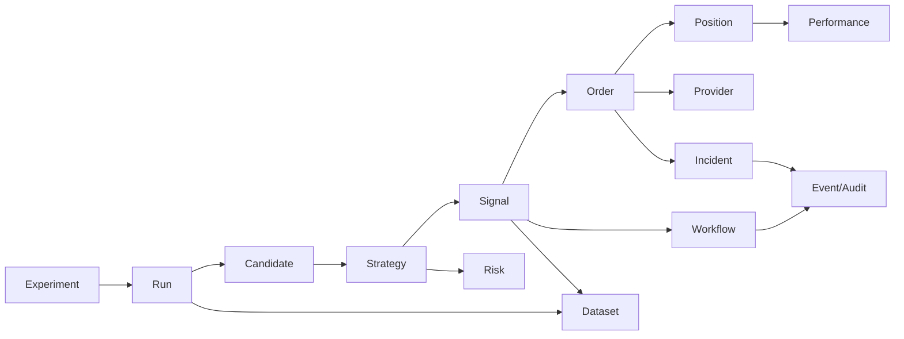

# Desk Control Plane V2 — Page Operating Contracts

**Portée :** les 24 routes actuellement déclarées dans `apps/desk-control-plane/src/app/routes.ts`.
**Règle :** une page doit permettre **Observer → Comprendre → Investiguer → Agir → Vérifier**.
**Lecture :** « API » indique la source actuelle puis, après `→`, la source cible ou le complément nécessaire.

---

## 0. Principes transverses

### États obligatoires

Chaque écran doit distinguer : `loading`, `empty`, `partial`, `stale`, `disconnected`, `forbidden`, `conflict`, `error`, `ready`. Un zéro ne remplace jamais une donnée inconnue. Un bouton n'est actif que si la capacité backend correspondante existe et si la permission de session l'autorise.

### Patterns de profondeur

- **Drawer :** aperçu rapide sans perdre le contexte de liste.
- **Modal :** confirmation, raison, step-up, saisie courte.
- **Page dédiée :** objet partageable, multi-onglets, historique ou actions multiples.
- **Inspecteur technique :** IDs, JSON, traces et corrélations ; jamais le titre principal.

### Contrat des actions dangereuses

Toute action d'arrêt, promotion, suppression, kill switch, cutover, changement LIVE ou allocation requiert : capability explicite, preview d'impact, version attendue, raison, confirmation renforcée, idempotence, suivi `ACCEPTED→RUNNING→SUCCEEDED|FAILED`, audit et rollback lorsqu'il existe.

---

## 1. Authentification opérateur — `/auth`

### Fonction actuelle et problèmes

La page affiche identité, session, environnements, permissions, MFA, route guards et actions. Le modèle mock est riche mais la barrière de route réelle autorise statiquement toutes les capacités de lecture. La session affichée ne gouverne donc pas réellement le routage.

| Élément | Page Operating Contract |
| --- | --- |
| Objectif | Établir qui opère, dans quel environnement et avec quels droits effectifs avant toute consultation ou action. |
| Utilisateur | Opérateur quotidien ; administrateur lors d'un diagnostic ; à chaque ouverture ou changement d'environnement. |
| Questions métier | Qui suis-je ? Où suis-je connecté ? La session est-elle valide ? Quelles actions puis-je effectuer ? Le MFA/step-up est-il requis ? |
| Informations primaires | Identité vérifiée, environnement, expiration de session, état MFA, niveau de permission global. |
| Informations secondaires | Scopes, dernières connexions, terminal/appareil, environnement disponible, raisons d'un refus. |
| Informations détaillées | Claims bruts, historique de session, audit d'authentification, corrélation de sécurité. |
| KPI | Temps avant expiration ; sessions actives ; échecs récents. Chacun ouvre son historique. |
| Actions principales | Se connecter, rafraîchir la session, effectuer le step-up, changer d'environnement autorisé. |
| Actions secondaires/contextuelles | Révoquer une autre session, copier un diagnostic, consulter les accès. |
| Actions dangereuses | Révocation globale et passage vers LIVE : double confirmation, MFA, audit, retour explicite. |
| Manipulations | Recherche de scope, filtre par environnement, tri des sessions, copie contrôlée des IDs. |
| Drill-down/sous-pages | Drawer scope ; page Session Detail pour historique ; lien vers Admin Access. |
| Relations | Settings, Admin, toutes les commandes protégées. |
| API | `/front-api/v1/views/auth-session` → session/capabilities réelles et auth events. |
| Temps réel | Expiration locale + refresh serveur ; événement de révocation immédiat. |
| Permissions | Lecture propre session ; administration distincte. |
| Empty/error | Aucun mock de session ; état « non authentifié » avec chemin de récupération. 401 reconnecte, 403 explique le scope. |
| Responsive | Mobile centré sur identité, environnement et step-up ; claims en page secondaire. |

**Test 5 secondes :** identité, environnement, validité et capacité d'agir doivent être visibles sans scroll.
**Proposition cible :** une porte d'entrée réelle, non un dashboard de permissions décoratif.

---

## 2. Command Center — `/command-center`

### Fonction actuelle et problèmes

La page montre santé système, activité, risque, lanes, prochains événements et raccourcis. Les boutons « Périmètre global » et « Actualiser » sont inertes, les KPI ne mènent pas à leurs contributeurs et la page répète le patron de six cartes.

| Élément | Page Operating Contract |
| --- | --- |
| Objectif | Répondre en quelques secondes : le desk fonctionne-t-il, que se passe-t-il et où faut-il intervenir ? |
| Utilisateur | Opérateur/superviseur, écran d'accueil permanent, forte fréquence. |
| Questions métier | Le système est-il sain ? Qu'est-ce qui est anormal ? Que traite-t-il ? Quelle décision est imminente ? Quel domaine contribue au risque/PnL ? |
| Informations primaires | Statut global vérifié, exceptions prioritaires, session active, tâches IA/workflows actifs, risque courant, performance du jour, fraîcheur. |
| Informations secondaires | Tendance de santé, prochains jalons, activité récente, capacité compute/agents, flux marché. |
| Informations détaillées | Contributeurs par stratégie/session/provider/workflow, timeline et preuves. |
| KPI | Santé, incidents, work en attente, exposition, PnL/R, freshness ; chaque KPI est un filtre vers le domaine source. |
| Actions principales | Ouvrir l'exception, reprendre un workflow autorisé, passer au Live/Operations/Risk. |
| Actions secondaires | Changer périmètre/période, actualiser, enregistrer une vue, plein écran. |
| Actions dangereuses | Aucune action destructive directe ; redirection vers le domaine propriétaire. |
| Manipulations | Périmètre, environnement, période, pinning, personnalisation légère, command search. |
| Drill-down/sous-pages | Drawer d'aperçu ; page dédiée pour incident/workflow/signal/position. |
| Relations | Tous les domaines ; liens contextuels conservant période et environnement. |
| API | `command-center` → endpoint composé léger + liens d'entités, pas onze agrégats systématiques. |
| Temps réel | SSE exceptions/commandes ; rafraîchissement ciblé 5–15 s pour risque et marché. |
| Permissions | La vue masque les domaines interdits et explique les agrégats partiels. |
| Empty/error | « Aucune exception » est positif ; « données indisponibles » ne devient jamais « nominal ». |
| Responsive | Mobile : état, exceptions, prochaine action, position ; analyses secondaires en sous-pages. |

**Test 5 secondes :** état global, exception la plus urgente, session et première action sont visibles.
**Proposition cible :** L0 d'exception management, pas mosaïque exhaustive.

---

## 3. Operations Hub — `/operations`

### Fonction actuelle et problèmes

La page expose jusqu'à 50 missions et plusieurs incidents réels, mais événements, gates, DLQ et actions sont souvent vides. Le tableau n'offre ni pagination serveur, ni sélection, ni détail durable.

| Élément | Page Operating Contract |
| --- | --- |
| Objectif | Piloter les workflows et queues, détecter le blocage et restaurer le flux avec une preuve. |
| Utilisateur | Opérateur technique/SRE desk, continu pendant sessions et batchs. |
| Questions métier | Qu'est-ce qui attend ? Qu'est-ce qui est bloqué ? Depuis combien de temps ? Quelle dépendance ? Quel retry est sûr ? |
| Informations primaires | Queue par priorité/âge, workflows actifs/bloqués, SLA, worker/lease, incident lié. |
| Informations secondaires | Throughput, retries, superseded, budgets, capacité et tendance de backlog. |
| Informations détaillées | Étapes, inputs/outputs, claims, logs, dead letter, causalité, commandes. |
| KPI | Backlog actionnable, plus ancien item, p95 claim/start/end, échecs, DLQ ; clic filtrant la table. |
| Actions principales | Ouvrir workflow, retry sûr, requeue, assigner/escalader, appliquer runbook. |
| Actions secondaires | Filtrer, grouper par type/statut/worker, exporter, pinning, sauvegarder vue. |
| Actions dangereuses | Annuler/purger/forcer : scope, preview, raison, confirmation, audit et éventuel rollback. |
| Manipulations | Recherche ID, filtres multi-valeurs, tri, pagination, sélection, bulk seulement pour actions sûres. |
| Drill-down/sous-pages | `/operations/workflows/:id`, `/operations/missions/:id`, `/operations/dead-letters/:id`. |
| Relations | Incident, event, agent, replay/live session, strategy/run. |
| API | `operations-queue` + `/api/v2/operations/workflows/*`, steps, events, actions. |
| Temps réel | SSE sur états et claims ; historique paginé. |
| Permissions | Read/operate/retry/cancel séparées. |
| Empty/error | Queue vide = nominal ; source workflow absente = partial avec domaine touché. |
| Responsive | Mobile : incidents et tâches bloquées ; tables complètes en page dédiée. |

**Test 5 secondes :** nombre bloqué, plus ancien item et action sûre disponible.
**Proposition cible :** L1 queue priorisée + L2 Workflow Detail, au lieu d'empiler détails et actions sur la même page.

---

## 4. Event Explorer — `/events`

### Fonction actuelle et problèmes

La page vise timeline, distinction autorité/advisory, payloads, logs, filtres, relations et export. Le BFF réel renvoie actuellement des collections vides et la table partagée n'offre pas de véritable exploration.

| Élément | Page Operating Contract |
| --- | --- |
| Objectif | Retrouver et corréler la preuve immuable de ce qui s'est passé dans le desk. |
| Utilisateur | Opérateur, support, audit/compliance, développeur ; à la demande et après incident. |
| Questions métier | Quel événement a changé l'état ? Quelle source fait autorité ? Quelles entités sont liées ? L'ordre est-il causalement cohérent ? |
| Informations primaires | Heure, type, domaine, sévérité, source, entité, statut d'intégrité. |
| Informations secondaires | Correlation/causation IDs, acteur, environnement, version de schéma, fraîcheur. |
| Informations détaillées | Payload diff, signature/hash, ingest time, sequence, logs et graphe de relations. |
| KPI | Taux d'erreur, événements hors ordre, doublons, lag d'ingestion ; clic appliquant le filtre. |
| Actions principales | Ouvrir un événement, suivre la corrélation, exporter une preuve. |
| Actions secondaires | Recherche, filtres, période, stream/pause, sauvegarde de vue. |
| Actions dangereuses | Aucune modification d'événement ; replay/réconciliation passe par workflow séparé. |
| Manipulations | Query avancée, pagination cursor, colonnes configurables, groupement par corrélation. |
| Drill-down/sous-pages | Drawer aperçu ; `/events/:eventId` pour payload, relations et historique. |
| Relations | Tous objets référencés : workflow, ordre, position, signal, stratégie, agent. |
| API | `events-audit` → événements paginés/recherche + endpoint relation/corrélation. |
| Temps réel | Stream optionnel avec bouton pause et compteur de nouveaux événements. |
| Permissions | Payloads sensibles masqués selon scope ; export audité. |
| Empty/error | Différencier « aucun résultat de filtre » et « source indisponible ». |
| Responsive | Colonnes essentielles seulement ; Event Detail en page, pas JSON dans une carte mobile. |

**Test 5 secondes :** fenêtre temporelle, filtre actif, erreurs et dernier événement sont clairs.
**Proposition cible :** véritable explorateur append-only, comparable à un outil d'observabilité orienté métier.

---

## 5. Research Lab — `/research`

### Fonction actuelle et problèmes

La vue rassemble command pipeline, expériences, agents, datasets, résultats, knowledge et compute. Le backend renvoie une expérience, 50 agents, 56 résultats et 40 jobs, mais la page ne structure pas clairement le parcours de découverte à promotion.

| Élément | Page Operating Contract |
| --- | --- |
| Objectif | Piloter la recherche de stratégies depuis l'hypothèse jusqu'à une candidate reproductible. |
| Utilisateur | Quant/research lead/superviseur IA, quotidien et par campagne. |
| Questions métier | Que cherche-t-on ? Quelles expériences avancent ? Quelles candidates sont prometteuses ? Quel blocage data/compute/agent ? |
| Informations primaires | Campagnes actives, expériences par gate, meilleures candidates ajustées du risque, blockers, budget restant. |
| Informations secondaires | Agents, jobs, datasets, nouveautés knowledge, cadence et coût. |
| Informations détaillées | Hypothèse, spec, run, métriques, régimes, trades, ambiguïtés, rapport et décision. |
| KPI | Candidates prêtes, expériences bloquées, reproductibilité, budget/coût, compute queue. |
| Actions principales | Créer une expérience depuis une hypothèse, lancer/stopper une campagne autorisée, ouvrir candidate. |
| Actions secondaires | Filtrer univers/régime/stratégie, comparer, exporter rapport, assigner agent. |
| Actions dangereuses | Promotion, suppression artefact, dépassement budget : gates, confirmation et audit. |
| Manipulations | Recherche, filtres, board/table toggle, période, comparaison, saved views. |
| Drill-down/sous-pages | Experiments, Candidates, Runs, Agents, Data, Compute ; détails dédiés. |
| Relations | Strategy Center, Data Foundation, compute, agent, replay/performance. |
| API | `research-lab` + research overview/experiments/candidates/reports. |
| Temps réel | Jobs/agents en SSE ; résultats via invalidation à fin de run. |
| Permissions | Research read/run/stop/promote/budget séparées. |
| Empty/error | Onboarding explicatif si aucune campagne ; source manquante marquée par lane. |
| Responsive | Mobile : campagnes, blockers et alertes ; analyse complète desktop. |

**Test 5 secondes :** objectif de recherche, candidate la plus proche d'un gate et principal blocker.
**Proposition cible :** overview de portefeuille de recherche, pas cockpit fourre-tout.

---

## 6. Experiment Detail — `/research/experiments/:experimentId`

### Fonction actuelle et problèmes

La page prévoit hypothèse, mission, spec, versions, datasets, itérations, métriques, journal, knowledge et actions. L'ID de route n'est pas envoyé au repository et le BFF renvoie une coquille vide : le détail n'est pas réel.

| Élément | Page Operating Contract |
| --- | --- |
| Objectif | Décider si une hypothèse est réfutée, à itérer ou à transformer en candidate. |
| Utilisateur | Researcher/lead/reviewer, pendant et après chaque campagne. |
| Questions métier | Hypothèse ? Méthode ? Données/version ? Résultats robustes ? Biais ? Reproductible ? Prochaine décision ? |
| Informations primaires | Hypothèse, statut/gate, owner, meilleure version, résultat ajusté risque, verdict. |
| Informations secondaires | Datasets, périodes, univers, budget, agents, progression, comparaison baseline. |
| Informations détaillées | Specs versionnées, chaque run, régimes, trades, logs, ambiguïtés, knowledge et audit. |
| KPI | Robustesse, Sharpe/R/DD/trades selon contrat, stabilité régimes, coût ; avec définitions et période. |
| Actions principales | Lancer itération, comparer runs, marquer candidate, rejeter/documenter. |
| Actions secondaires | Cloner spec, commenter, exporter, lier knowledge/dataset. |
| Actions dangereuses | Stopper campagne, promouvoir candidate, supprimer artefact : permission + raison + confirmation. |
| Manipulations | Tabs Overview/Runs/Data/Analysis/Knowledge/Audit, filtres de runs, comparaison multi-sélection. |
| Drill-down/sous-pages | Run Detail ; Dataset Detail ; Candidate Detail ; diff de spec L3. |
| Relations | Agents, compute jobs, strategy source, replay/performance. |
| API | `research-experiment-detail?experimentId=` → endpoint `/experiments/:id` réel. |
| Temps réel | Progression runs/agents ; métriques au checkpoint/terminal. |
| Permissions | Read/run/stop/promote/comment séparées. |
| Empty/error | 404 réel si ID inconnu ; aucune substitution par l'expérience « active ». |
| Responsive | Résumé et décision mobile ; matrices/comparaisons en desktop. |

**Test 5 secondes :** hypothèse, état du gate, résultat et prochaine décision.
**Proposition cible :** page L2 partageable avec onglets, jamais drawer principal.

---

## 7. Run Detail — `/research/runs/:runId`

### Fonction actuelle et problèmes

La page prévoit identité, reproductibilité, equity, distribution, benchmark, régimes, trades et ambiguïtés. Comme Experiment Detail, elle ignore actuellement le paramètre d'URL.

| Élément | Page Operating Contract |
| --- | --- |
| Objectif | Auditer un run reproductible et expliquer exactement son résultat. |
| Utilisateur | Quant/reviewer, après chaque run ou anomalie. |
| Questions métier | Avec quel code/config/data ? Résultat net ? Où le modèle gagne/perd ? Lookahead ? Coûts ? Peut-on reproduire ? |
| Informations primaires | Statut terminal, période, version stratégie/config/dataset, métriques nettes, verdict qualité. |
| Informations secondaires | Equity, drawdown, distribution, benchmarks, régimes, compute cost/duration. |
| Informations détaillées | Trades, décisions, features au cutoff, logs, artefacts, seeds, hashes, anomalies. |
| KPI | PnL/R net, DD, hit rate, expectancy, trades, coût, reproductibilité. |
| Actions principales | Reproduire, comparer, ouvrir trade/anomalie, générer rapport. |
| Actions secondaires | Exporter artefacts, épingler, annoter, ouvrir dataset/config. |
| Actions dangereuses | Annuler run actif ou supprimer artefacts : gated/audité. |
| Manipulations | Période, régime, instrument, session, trade outcome, zoom graphique, comparaison. |
| Drill-down/sous-pages | Trade Detail, décision/feature snapshot, logs/artefacts L3. |
| Relations | Experiment, candidate, strategy version, dataset, compute job. |
| API | `research-run-detail?runId=` → simulation run/research report/detail APIs. |
| Temps réel | Progression si actif ; figé/immuable au terminal. |
| Permissions | Read/reproduce/cancel/export séparées. |
| Empty/error | 404, artefact expiré, métrique non calculée explicitement distingués. |
| Responsive | Résumé et anomalies mobile ; charts/table trade sur vues dédiées. |

**Test 5 secondes :** run réussi/échoué, performance nette, qualité et reproductibilité.
**Proposition cible :** deep analysis L2/L3, base de toute décision de promotion.

---

## 8. Agent Fleet — `/research/agents`

### Fonction actuelle et problèmes

La page liste 50 agents, mais queues, conversations, incidents et actions réels sont vides. Elle ne permet pas encore de suivre une conversation persistée, le modèle/effort ni la dépense jusqu'au résultat.

| Élément | Page Operating Contract |
| --- | --- |
| Objectif | Superviser les workers IA, leur mission, leur continuité, leur coût et leur fiabilité. |
| Utilisateur | Research lead/opérateur IA, continu. |
| Questions métier | Qui travaille sur quoi ? Quel modèle/effort ? Quelle file attend ? Quelle conversation persiste ? Qui bloque ou coûte trop ? |
| Informations primaires | Agent, rôle, état, mission, conversation, heartbeat, budget consommé/restant, dernier résultat. |
| Informations secondaires | Model/reasoning, outils, latence, taux de succès, retries, backlog, SLA. |
| Informations détaillées | Timeline, prompts/version, tool calls, artefacts, erreurs, coûts par run, handoffs. |
| KPI | Actifs/bloqués, attente p95, succès, coût/jour, budget, incidents. |
| Actions principales | Ouvrir agent, affecter/pause/reprendre selon policy, ajuster modèle/effort dans limites. |
| Actions secondaires | Filtrer rôle/modèle/état, comparer performance, exporter. |
| Actions dangereuses | Terminer conversation, purger file, changer budget global : step-up et audit. |
| Manipulations | Recherche, tri, filtres, groupement pool, vue liste/capacité, saved view. |
| Drill-down/sous-pages | Agent Detail, Conversation Detail, Work Item Detail. |
| Relations | Experiment, run, compute job, prompt registry, incident. |
| API | `research-agent-fleet` → agent runtime, queues, conversations, budgets, incidents. |
| Temps réel | Heartbeat/queue/task via SSE ; coût agrégé périodiquement. |
| Permissions | Read/assign/pause/configure-budget/terminate séparées. |
| Empty/error | « aucun agent » n'est jamais remplacé par 50 identités sans runtime. |
| Responsive | Mobile : état/incident/actions urgentes ; conversations en page. |

**Test 5 secondes :** actifs, bloqués, coût et mission la plus urgente.
**Proposition cible :** fleet operations, pas annuaire d'agents.

---

## 9. Data Foundation — `/research/data`

### Fonction actuelle et problèmes

Le BFF fournit un dataset, un instrument, une lineage et plusieurs incidents, mais features et actions sont vides. Les valeurs « gaps 0 » et « lookahead PASS » peuvent être des fallbacks non prouvés.

| Élément | Page Operating Contract |
| --- | --- |
| Objectif | Garantir que chaque recherche et décision utilise des données versionnées, couvertes, fraîches et point-in-time. |
| Utilisateur | Data engineer, quant, reviewer, opérateur. |
| Questions métier | Quelles données existent ? Couverture ? Fraîcheur ? Qualité ? Lineage ? Qui les utilise ? Peut-on reproduire ? |
| Informations primaires | Datasets, version, période, instruments/timeframes, freshness, quality verdict réel, incidents. |
| Informations secondaires | Source, cadence, stockage, volume, hot window, coût, consumers. |
| Informations détaillées | Schéma, partitions, gaps, duplicates, corrections, features, computations, provenance. |
| KPI | Datasets healthy/stale/failed, couverture, lag, incidents, coût ; pas de faux PASS. |
| Actions principales | Ouvrir dataset, lancer validation/backfill si implémenté, acquitter incident. |
| Actions secondaires | Recherche, filtre source/instrument/timeframe, export metadata, lineage graph. |
| Actions dangereuses | Purge/rebuild/backfill large : dry-run, impact, confirmation et audit. |
| Manipulations | Facettes, période, compare versions, pin dataset, recherche schema. |
| Drill-down/sous-pages | Dataset Detail, Feature Detail, Ingestion Run, Storage/Hot Windows. |
| Relations | Experiments, runs, strategies, signals, incidents. |
| API | `research-data-catalog` + data foundation sources/datasets/features/computations/ingestion/storage/profiles. |
| Temps réel | Freshness/ingestion jobs ; metadata cache long. |
| Permissions | Read/validate/backfill/admin-storage séparées. |
| Empty/error | Unknown quality explicite ; source indisponible avec dernière valeur connue datée. |
| Responsive | Catalogue résumé mobile ; lineage et schema en pages dédiées. |

**Test 5 secondes :** nombre de datasets utilisables, principal stale/gap et impact.
**Proposition cible :** catalogue gouverné, non inventaire de cartes.

---

## 10. Compute Lab — `/research/compute`

### Fonction actuelle et problèmes

Le BFF expose deux pools, 50 workers, 40 jobs et une réservation, mais DLQ et actions manquent. La page doit distinguer capacité, orchestration IA et compute de backtest.

| Élément | Page Operating Contract |
| --- | --- |
| Objectif | Allouer et surveiller la capacité de calcul afin que les recherches terminent dans budget et SLA. |
| Utilisateur | Research ops/SRE/lead, quotidien. |
| Questions métier | Quelle capacité ? Quels jobs attendent ? Quel pool est saturé ? Pourquoi ? Coût/ETA ? Quel job peut être priorisé ? |
| Informations primaires | Pools, utilisation, queue, jobs actifs/bloqués, ETA, budget/coût. |
| Informations secondaires | Workers/heartbeats, réservations, retries, throughput, cache, saturation. |
| Informations détaillées | Job spec, logs, artefacts, ressources, timeline, cause d'échec. |
| KPI | Utilisation, queue age p95, succès, coût, ETA, dead letters. |
| Actions principales | Ouvrir job, retry/reprioriser/annuler si autorisé, réserver capacité. |
| Actions secondaires | Filtrer pool/projet/état, comparer coût, export. |
| Actions dangereuses | Purge queue, stop pool, dépassement quota : confirmation forte/audit. |
| Manipulations | Recherche, tri, pagination, grouping pool, timeline, saved view. |
| Drill-down/sous-pages | Job Detail, Worker Detail, Reservation Detail, DLQ Detail. |
| Relations | Experiment, run, agent, dataset, incident. |
| API | `research-compute-scheduler` → scheduler/jobs/workers/reservations/DLQ/actions. |
| Temps réel | Jobs/workers via SSE ; coût périodique. |
| Permissions | Read/operate/priority/quota/admin séparées. |
| Empty/error | Pool sans job = idle ; pool inaccessible = disconnected. |
| Responsive | Mobile : saturation/blockers ; gestion détaillée desktop. |

**Test 5 secondes :** saturation, backlog, ETA et principal job bloqué.
**Proposition cible :** page de capacité, avec détail séparé des jobs.

---

## 11. Strategy Center — `/strategies`

### Fonction actuelle et problèmes

Le catalogue réel contient 43 stratégies, mais lifecycle, performance, top strategies et events sont vides ou à zéro. Le catalogue manque d'outils de sélection/comparaison robustes.

| Élément | Page Operating Contract |
| --- | --- |
| Objectif | Piloter le cycle de vie des stratégies et identifier celles qui méritent attention, test ou action. |
| Utilisateur | Strategy lead, quant, risk manager, opérateur. |
| Questions métier | Quelles stratégies existent ? Statut/version/environnement ? Performance/risque/drift ? Quelle promotion ou suspension est requise ? |
| Informations primaires | Catalogue, état lifecycle, version active, environnement, owner, health, performance nette et risk status vérifiés. |
| Informations secondaires | Dernier déploiement, signaux/trades, régimes, incidents, candidate source. |
| Informations détaillées | Définition, versions, compare, instances, performance, risk, signals/trades, audit. |
| KPI | Actives/PAPER/LIVE, drift, gates en attente, incidents, performance agrégée avec périmètre. |
| Actions principales | Ouvrir, comparer, demander promotion, suspendre via workflow. |
| Actions secondaires | Recherche, filtres lifecycle/owner/univers, favoris, export. |
| Actions dangereuses | Promotion LIVE, suspension, rollback version : double validation, impact, audit. |
| Manipulations | DataTable serveur, colonnes, tri, multi-sélection compare, saved views. |
| Drill-down/sous-pages | Strategy Detail, Compare, Deployments/Instances. |
| Relations | Research candidate, experiments, signals, positions, performance, risk, incidents. |
| API | `strategy-center` + strategy definitions/versions/instances/actions/audit. |
| Temps réel | Invalidations sur déploiement/signal/incident ; agrégats 15–60 s. |
| Permissions | Read/compare/promote/suspend/rollback séparées. |
| Empty/error | Une métrique absente = `non calculée`, jamais zéro. |
| Responsive | Mobile : stratégies actives/alertes/actions ; catalogue complet en vue adaptée. |

**Test 5 secondes :** portefeuille actif, stratégie en anomalie et prochaine décision de lifecycle.
**Proposition cible :** catalogue L1 puis détail multi-onglets.

---

## 12. Strategy Detail — `/strategies/:strategyId`

### Fonction actuelle et problèmes

La page prévoit identité, lineage, spec, règles, versions, instances, performance, signaux, trades, contraintes et incidents. L'ID n'est pas transmis au BFF et toutes les sections réelles sont vides.

| Élément | Page Operating Contract |
| --- | --- |
| Objectif | Comprendre, évaluer et gouverner une stratégie précise sur tout son cycle de vie. |
| Utilisateur | Quant, strategy lead, risk, opérateur, reviewer. |
| Questions métier | Que fait-elle ? Quelle version tourne où ? Résultats backtest/PAPER/LIVE ? Risque/drift ? Pourquoi a-t-elle agi ? Puis-je promouvoir/suspendre ? |
| Informations primaires | Nom métier, état, version active, environnements/instances, health, performance nette, risk/drift, dernière décision. |
| Informations secondaires | Univers/session/timeframes, owner, candidate/experiment, signaux/trades récents, incidents. |
| Informations détaillées | Spec/règles/enums, deterministic plan, versions/diffs, régimes, décisions, features, audit. |
| KPI | R/PnL, DD, hit rate, expectancy, exposure, drift, signal→fill, avec période et comparaison baseline. |
| Actions principales | Comparer version, lancer validation, demander promotion, suspendre/rollback. |
| Actions secondaires | Cloner, exporter, ouvrir research/data/run, ajouter note. |
| Actions dangereuses | LIVE promotion/suspension/rollback/config : step-up, diff, impact, confirmation/audit. |
| Manipulations | Tabs Overview/Definition/Performance/Risk/Signals&Trades/Versions/Instances/Research/Audit ; période, environnement, benchmark. |
| Drill-down/sous-pages | Version Detail/Compare, Instance Detail, Signal/Trade Detail, Experiment/Run. |
| Relations | Research, dataset, live signal, order, position, risk, incident. |
| API | `strategy-detail?strategyId=` → definition/version/instances/performance/audit par ID. |
| Temps réel | Instances/signaux/incidents ; performance selon cadence canonique. |
| Permissions | Read/config/validate/promote/suspend séparées. |
| Empty/error | 404 strict ; sections partielles avec source et dernier `asOf`. |
| Responsive | Résumé/health/actions mobile ; analyse complexe en sous-pages. |

**Test 5 secondes :** identité, version/environnement, santé, performance et action requise.
**Proposition cible :** dossier complet de stratégie, URL stable.

---

## 13. Strategy Compare — `/strategies/:strategyId/compare`

### Fonction actuelle et problèmes

La page imagine versions, diff de spec, métriques, régimes, trades et coûts, mais elle ne charge ni la stratégie ni les versions sélectionnées de façon paramétrée.

| Élément | Page Operating Contract |
| --- | --- |
| Objectif | Décider rationnellement quelle version/variante conserver ou promouvoir. |
| Utilisateur | Quant/reviewer/strategy lead, avant gate. |
| Questions métier | Qu'est-ce qui change ? Quel impact global et par régime ? Robustesse ? Coûts ? Régressions ? |
| Informations primaires | Versions comparées, diff sémantique, score/gates, métriques nettes, verdict et incertitude. |
| Informations secondaires | Régimes, distribution, trades ajoutés/perdus, costs/slippage, data/config. |
| Informations détaillées | Rule diff, per-trade matching, feature changes, logs, audit. |
| KPI | Delta R/PnL/DD/expectancy/trades/cost, stabilité et confidence interval. |
| Actions principales | Choisir baseline, ajouter variante, générer rapport, demander gate/promotion. |
| Actions secondaires | Changer période/régime, exporter, partager URL. |
| Actions dangereuses | Promotion depuis compare : même workflow renforcé que Strategy Detail. |
| Manipulations | Sélection 2–4 versions, période, régime, instrument/session, normalisation, zoom. |
| Drill-down/sous-pages | Trade diff, spec diff, run evidence. |
| Relations | Strategy Detail, runs, candidate, datasets. |
| API | compare actuel → endpoint compare avec IDs/versionIds/query explicites. |
| Temps réel | Non critique ; résultats immuables/cache longs. |
| Permissions | Read/compare ; promote séparé. |
| Empty/error | Exiger deux versions ; expliquer métrique non comparable. |
| Responsive | Résumé de verdict mobile ; comparaison dense desktop. |

**Test 5 secondes :** versions, gagnante supposée, principal bénéfice et principale régression.
**Proposition cible :** outil d'aide à la décision, pas deux colonnes de chiffres sans provenance.

---

## 14. Live Trading — `/live`

### Fonction actuelle et problèmes

La page couvre pipeline, signaux, arbitrage, risk, orders, fills, positions, providers et timeline. Le BFF réel expose surtout orders/positions/provider/incidents ; il fabrique certains statuts `ACCEPTED`, `PASS`, `NEW` et quantité zéro, ce qui rend la lecture dangereusement crédible.

| Élément | Page Operating Contract |
| --- | --- |
| Objectif | Surveiller une session en cours, comprendre la chaîne de décision et intervenir uniquement lorsque nécessaire. |
| Utilisateur | Opérateur trading/superviseur, écran permanent pendant session. |
| Questions métier | Données fraîches ? Session/phase ? Signal ? Décision déterministe/IA ? Risk gate ? Ordre/position/protection ? Prochaine échéance ? Anomalie ? |
| Informations primaires | Horloges/session, data freshness, état pipeline, thèse/setup/position active, ordre/protection, exception prioritaire, prochain monitor/master. |
| Informations secondaires | Marchés/contextes, signaux récents, arbitrage, risk checks, provider health, timeline planifiée vs réelle. |
| Informations détaillées | Bundle/provenance, features/conditions, décision, ordre/fills, management, GPT process, événements. |
| KPI | Dernier/prochain claim, état prochaine tâche, data age, active setup/position, exposure/R, pipeline latency. |
| Actions principales | Ouvrir signal/setup/position/ordre/incident ; acquitter alerte ; décision opérateur si mode semi-auto. |
| Actions secondaires | Filtrer instrument/session, auto-refresh, pinning, plein écran, replay contextuel. |
| Actions dangereuses | Kill/cancel/close/override : toujours dans Execution/Risk avec preview, step-up et audit. |
| Manipulations | Timeline horizontale, sélection jalon, détails popup/drawer puis page, période intraday, pause stream. |
| Drill-down/sous-pages | Signal Detail, Plan/Setup, Position, Order, Session Timeline, GPT Process. |
| Relations | Strategy, risk, orders, portfolio, incidents, news, performance. |
| API | `live-trading` + today live/market/macro/news/thesis/setup/master/monitor/timeline ; états inconnus explicites. |
| Temps réel | SSE prioritaire ; cadence moteur M1, analyses IA selon stratégie ; `asOf` partout. |
| Permissions | Observe/ack/approve/cancel/override séparées ; mode AUTO/SEMI-AUTO explicite. |
| Empty/error | Aucune position = FLAT prouvé ; source absente = unavailable ; last known daté. |
| Responsive | Mobile : signal, setup, position, alertes et actions manuelles ; analytics en sous-pages. |

**Test 5 secondes :** session, fraîcheur, position/setup, décision courante, exception et prochain jalon.
**Proposition cible :** timeline causale opérable, sans faux état de confiance.

---

## 15. Demo/PAPER Readiness — `/demo-paper-readiness`

### Fonction actuelle et problèmes

La page présente blockers, commandes de vérification, feeds TradingView, NinjaTrader et liens. Elle mélange état opérateur, guides et commandes, alors que l'exécution NinjaTrader est actuellement volontairement stale pour le workflow manuel.

| Élément | Page Operating Contract |
| --- | --- |
| Objectif | Dire objectivement si le desk peut commencer/continuer un test PAPER et pourquoi. |
| Utilisateur | Release operator/owner, avant ouverture et après incident. |
| Questions métier | Quels gates passent ? Quels blockers ? Data/back/workers/strategy/alerts prêts ? Quel mode d'exécution ? Quelle preuve récente ? |
| Informations primaires | Verdict READY/NOT READY/PARTIAL, blockers P0, environnement, stratégie active, workers, feeds, alerting, execution mode. |
| Informations secondaires | Derniers tests, versions déployées, latences, runbooks, fenêtre marché. |
| Informations détaillées | Evidence par gate, logs, commandes, incidents, releases. |
| KPI | Gates passés/échoués, âge preuve, workers actifs, source freshness. |
| Actions principales | Exécuter une vérification supportée, ouvrir blocker/runbook, générer rapport de readiness. |
| Actions secondaires | Rafraîchir, filtrer gate, comparer release précédente, exporter. |
| Actions dangereuses | Activer AUTO/LIVE ou broker : workflow séparé, double confirmation et interdiction par défaut. |
| Manipulations | Checklist groupée, filtres severity/owner, historique des snapshots. |
| Drill-down/sous-pages | Gate Detail, Release Evidence, Incident/Runbook. |
| Relations | Live, workers, data, strategy, provider, Telegram, observability. |
| API | readiness view → checks réels signés et catalogués ; aucun statut dérivé d'une valeur mock. |
| Temps réel | 5–30 s selon gate ; snapshot immuable lors de décision. |
| Permissions | Read/run-check/approve-release distinctes. |
| Empty/error | Un check non implémenté bloque ou devient N/A explicite selon policy. |
| Responsive | Checklist et blockers d'abord ; preuves en page. |

**Test 5 secondes :** peut-on démarrer, si non pourquoi, et quelle action sûre vient ensuite.
**Proposition cible :** gate de release vérifiable, pas simple dashboard de composants.

---

## 16. Live Signal Detail — `/live/signals/:signalId`

### Fonction actuelle et problèmes

La page vise signal déterministe, prédicats, features, arbitrage, risk, contexte, ordres, audit et décision opérateur. Le signalId n'est pas transmis ; le BFF renvoie un détail vide et peut projeter des décisions par défaut.

| Élément | Page Operating Contract |
| --- | --- |
| Objectif | Expliquer pourquoi un signal existe, comment il a été arbitré et ce qu'il a produit. |
| Utilisateur | Opérateur, quant, risk, audit ; au moment du signal ou en post-analyse. |
| Questions métier | Quelle règle a déclenché ? Quelles conditions true/false ? Données au cutoff ? Conflits ? Risk verdict ? Ordre/position ? |
| Informations primaires | Instrument/direction/time, strategy/version, état, confidence définie, arbitration, risk verdict, outcome. |
| Informations secondaires | Features, prédicats, niveaux entry/stop/TP, contexte macro/cross-asset, competing signals. |
| Informations détaillées | Snapshot point-in-time, enum execution plan, bundle, rationale IA, événements, audit. |
| KPI | Signal age, predicate coverage, risk budget, expected R, realized outcome si terminé. |
| Actions principales | Accepter/rejeter uniquement si mode SEMI-AUTO et capability réelle ; ouvrir ordre/setup/strategy. |
| Actions secondaires | Comparer signaux, annoter, exporter evidence, ouvrir replay équivalent. |
| Actions dangereuses | Override risk/force order interdit depuis l'écran ; escalation dédiée. |
| Manipulations | Tabs Summary/Conditions/Context/Decision/Execution/Audit ; expand predicates, timeline. |
| Drill-down/sous-pages | Feature snapshot, Order/Position Detail, Strategy Version. |
| Relations | Strategy, session, market data, risk, order, position, incident. |
| API | `live-signal-detail?signalId=` → signal detail by ID + related objects. |
| Temps réel | État/arbitrage/order via SSE jusqu'au terminal. |
| Permissions | Read/approve/reject/annotate distinctes. |
| Empty/error | 404 strict ; jamais de signal « NEW/ACCEPTED » fabriqué. |
| Responsive | Résumé/decision mobile ; predicates/context en sous-pages. |

**Test 5 secondes :** quel signal, pourquoi, verdict, conséquence et prochain état.
**Proposition cible :** dossier de preuve causale, page L2.

---

## 17. Portfolio — `/portfolio`

### Fonction actuelle et problèmes

La page affiche six positions, exposition et allocations réelles, mais matrix, attribution, timeline et equity sont absentes ou à zéro. La maquette est visuellement aboutie mais peut surinterpréter des données non présentes.

| Élément | Page Operating Contract |
| --- | --- |
| Objectif | Comprendre l'exposition consolidée et ses contributeurs avant qu'ils ne deviennent un risque. |
| Utilisateur | Trader, risk manager, superviseur ; continu. |
| Questions métier | Exposition nette/brute ? Positions ? Contributeurs par stratégie/asset/compte ? Corrélations ? Protection ? PnL/R ? Concentration ? |
| Informations primaires | Capital net/asOf, exposition, positions, PnL/R, risk budget, alertes de concentration/protection. |
| Informations secondaires | Allocation, netting, corrélations, attribution, equity, broker vs theoretical. |
| Informations détaillées | Position lifecycle, strategy contributions, orders/fills, lots/risk calculation, audit. |
| KPI | Net/gross exposure, PnL/R, DD, open risk, margin, unprotected positions ; clic vers contributeurs. |
| Actions principales | Ouvrir position/risk alert, réconcilier si supporté, passer à Orders/Risk. |
| Actions secondaires | Filtrer compte/strategy/asset, grouper/netting view, période, export. |
| Actions dangereuses | Close/flatten/reallocate : hors overview, confirmation renforcée et audit. |
| Manipulations | Treemap/table, tri, multi-select pour analyse, heatmap, zoom timeline, saved views. |
| Drill-down/sous-pages | Position Detail, Allocation Detail, Exposure Breakdown, Reconciliation. |
| Relations | Strategy, orders, risk, providers, performance, incidents. |
| API | portfolio view + portfolio risk/exposure/position lifecycle ; `unknown` pour matrix/attribution absentes. |
| Temps réel | Positions/orders/risk via SSE ; equity selon cadence canonique. |
| Permissions | Read/reconcile/close/reallocate séparées. |
| Empty/error | FLAT prouvé vs provider disconnected ; dernière position connue datée. |
| Responsive | Positions/alertes et risk d'abord ; treemap/heatmap remplacées par listes prioritaires. |

**Test 5 secondes :** exposition, PnL/R, position la plus risquée, protection et alerte.
**Proposition cible :** L1 portfolio exploratoire avec Position Detail partageable.

---

## 18. Orders — `/orders`

### Fonction actuelle et problèmes

Le BFF fournit sept intents et quinze orders, mais fills, protection, state history et actions sont vides. Le type `LIMIT`, TIF `DAY` ou statut `ACKED` peut être normalisé par défaut et non prouvé.

| Élément | Page Operating Contract |
| --- | --- |
| Objectif | Suivre chaque intent jusqu'à son résultat broker et détecter toute divergence. |
| Utilisateur | Trader/opérateur exécution/support, continu. |
| Questions métier | Quel intent ? Quel ordre réel ? État canonique/provider ? Filled ? Protégé ? Latence ? Divergence ? Action nécessaire ? |
| Informations primaires | Intents/orders actifs, symbole/sens/qty/type/price, state, provider/account, protection, age, exception. |
| Informations secondaires | Strategy/signal, idempotency, slippage, partial fills, reconciliation status. |
| Informations détaillées | State machine, raw provider events, fills, stop/TP, management, audit. |
| KPI | Active, unprotected, rejected, partial, stale, latency p95 ; clic filtrant. |
| Actions principales | Ouvrir ordre, cancel/replace si réellement supporté, réconcilier, ouvrir incident. |
| Actions secondaires | Recherche, filtres status/provider/strategy/symbol, export, saved view. |
| Actions dangereuses | Cancel/replace/close/flatten : preview, expected revision, phrase, reason, audit. |
| Manipulations | DataTable serveur, tri, pagination, multi-select uniquement pour action sûre, timeline. |
| Drill-down/sous-pages | `/orders/:orderId`, Intent Detail, Fill/Protection, Provider raw event. |
| Relations | Signal, strategy, position, risk, provider, incident, event. |
| API | orders view + execution intent/order detail/actions/events/reconciliation. |
| Temps réel | SSE état/fills/protection ; fallback polling court. |
| Permissions | Read/cancel/replace/reconcile/flatten séparées. |
| Empty/error | Aucun ordre actif ≠ provider indisponible ; raw unknown préservé. |
| Responsive | Ordres actifs/exception/protection ; détails en page. |

**Test 5 secondes :** nombre actif, non protégé/rejeté et ordre nécessitant action.
**Proposition cible :** liste opérationnelle L1 + Order Detail L2/L3.

---

## 19. Risk Center — `/risk`

### Fonction actuelle et problèmes

La page vise limites, exposition, corrélations, contraintes prop, stress, breaches et actions. Le backend réel renvoie une exposition, mais la majorité des collections sont vides ; afficher des passes ou zéros est critique.

| Élément | Page Operating Contract |
| --- | --- |
| Objectif | Protéger le capital en montrant les limites réelles, leurs contributeurs et les actions de réduction sûres. |
| Utilisateur | Risk manager, superviseur, trader ; continu. |
| Questions métier | Risque actuel ? Limite la plus proche ? Contribution ? Scénario adverse ? Violation ? Action ? |
| Informations primaires | Capital net/source, open risk, limites/usage, breaches, unprotected exposure, kill state. |
| Informations secondaires | Corrélations, concentrations, drawdown, margin, prop constraints, stress scenarios. |
| Informations détaillées | Formules/version policy, position/strategy contributions, historiques, décisions et audit. |
| KPI | Utilisation limite max, DD, open R, margin, concentration, breaches ; tous cliquables. |
| Actions principales | Ouvrir breach/contributeur, appliquer réduction via workflow, acquitter/escalader. |
| Actions secondaires | Période, compte, strategy, scenario, export risk report. |
| Actions dangereuses | Kill switch, override limit, policy change : double validation/step-up/rollback/audit. |
| Manipulations | Heatmaps, stress scenario selector, breakdown, filtre/tri, comparaison avant/après. |
| Drill-down/sous-pages | Limit Detail, Breach Detail, Stress Analysis, Policy History. |
| Relations | Portfolio, position, order, strategy, provider, incident. |
| API | risk view + governance portfolio risk + risk policy/limits/breaches/stress à formaliser. |
| Temps réel | Risk/exposure 1–5 s si position ; policy cache long. |
| Permissions | Read/ack/reduce/kill/override/policy-admin séparées. |
| Empty/error | Absence de limite = NOT_CONFIGURED bloquant ; absence de breach prouvée = nominal. |
| Responsive | Alertes, limite la plus proche et actions urgentes ; matrices en sous-page. |

**Test 5 secondes :** niveau, limite la plus proche, contributeur et éventuelle action.
**Proposition cible :** centre d'exception risk-first, sans KPI rassurants par défaut.

---

## 20. Execution Providers — `/execution/providers`

### Fonction actuelle et problèmes

La page montre un provider, deux comptes, une santé et plusieurs incidents ; adapters, switch workflow, events et actions sont absents. Elle doit représenter le mode manuel actuel sans prétendre que NinjaTrader est opérationnel.

| Élément | Page Operating Contract |
| --- | --- |
| Objectif | Savoir quel provider/account est autoritaire, sa santé, et gérer un cutover contrôlé. |
| Utilisateur | Execution ops/SRE/admin, avant session et incident. |
| Questions métier | Provider actif ? Mode manual/PAPER/LIVE ? Connecté ? Comptes ? Latence ? Divergence ? Fallback ? Cutover prêt ? |
| Informations primaires | Provider role, mode, connection, account, last heartbeat, execution enabled/disabled, incidents. |
| Informations secondaires | Adapter/version, latences, taux d'erreur, capabilities, simulated vs real, reconciliation. |
| Informations détaillées | Raw events, config masked, health history, switch plan, audits. |
| KPI | Availability, heartbeat age, order latency/error, divergence, accounts healthy. |
| Actions principales | Ouvrir provider/account/incident, tester health, lancer workflow cutover si supporté. |
| Actions secondaires | Comparer providers, filtrer compte, exporter health, runbook. |
| Actions dangereuses | Switch primary, enable execution, credentials/config : double validation, dry-run, rollback. |
| Manipulations | Tabs Overview/Accounts/Capabilities/Events/Health/Configuration/Audit. |
| Drill-down/sous-pages | Provider Detail, Account Detail, Cutover Workflow, Raw Event. |
| Relations | Orders, positions, risk, incidents, readiness, audit. |
| API | provider view + execution provider overview/actions/events/bridge; capability contract réel. |
| Temps réel | Heartbeat/events/orders via SSE. |
| Permissions | Read/test/switch/configure/credential-admin séparées. |
| Empty/error | Stale/disabled/manual explicitement distincts ; ne pas interpréter absence d'event comme healthy. |
| Responsive | Santé, mode et incident d'abord ; configuration desktop. |

**Test 5 secondes :** provider autoritaire, mode, connexion, compte et blocage.
**Proposition cible :** santé opérationnelle avec cutover isolé et sûr.

---

## 21. Execution Incidents — `/execution/incidents`

### Fonction actuelle et problèmes

La page expose sept incidents, payload, reconciliation, chronology, retries et actions, mais retries/actions réels sont vides. Le zoom latéral permanent n'est pas adapté à une investigation complexe.

| Élément | Page Operating Contract |
| --- | --- |
| Objectif | Qualifier, contenir, diagnostiquer et clôturer un incident d'exécution avec preuve. |
| Utilisateur | Execution ops/SRE/risk, lors d'une alerte et post-mortem. |
| Questions métier | Impact ? Ordres/positions touchés ? Cause probable ? Action sûre ? Réconcilié ? Récurrence ? |
| Informations primaires | Incidents ouverts, severity, age, impact, provider/account, owner, containment/reconciliation. |
| Informations secondaires | Error code, occurrence, affected entities, SLA, runbook, retry eligibility. |
| Informations détaillées | Timeline, payload/raw event, attempts, commands, diff broker/canonical, post-mortem. |
| KPI | Open P0/P1, age max, unresolved divergence, MTTA/MTTR, recurrence. |
| Actions principales | Ouvrir incident, assigner, appliquer runbook, retry/reconcile si sûr, clôturer avec preuve. |
| Actions secondaires | Filtrer, grouper, commenter, exporter, lier duplicate. |
| Actions dangereuses | Force reconcile/replay event/purge DLQ : dry-run, confirmation, audit. |
| Manipulations | Table serveur, severity/status/provider, recherche IDs, saved views. |
| Drill-down/sous-pages | `/execution/incidents/:id` avec tabs Overview/Impact/Timeline/Reconciliation/Runbook/Audit. |
| Relations | Order, position, provider, workflow, event, risk. |
| API | incidents view + incident detail/actions/runbooks/reconciliation. |
| Temps réel | SSE incident/command ; historique immuable. |
| Permissions | Read/assign/retry/reconcile/close séparées. |
| Empty/error | Aucun incident ouvert = nominal prouvé ; source incident down = unavailable. |
| Responsive | Liste priorisée + Incident Detail dédié, jamais panneau permanent compressé. |

**Test 5 secondes :** incident le plus grave, impact, propriétaire et prochaine action.
**Proposition cible :** liste plein écran et page zoom, avec retour conservant la sélection.

---

## 22. Jarvis Workspace — `/jarvis`

### Fonction actuelle et problèmes

La page prévoit brief, conversation, actions, voice, snapshot, citations, alertes et commandes. Elle affirme que les actions passent par Command Runtime, mais le backend n'implémente pas la plupart de ces mutations.

| Élément | Page Operating Contract |
| --- | --- |
| Objectif | Aider l'opérateur à comprendre le desk et préparer des actions sans contourner les autorités métier. |
| Utilisateur | Opérateur/analyste, à la demande et en investigation. |
| Questions métier | Quel est le brief ? Pourquoi cette recommandation ? Quelles sources ? Quelle action proposée ? Qui doit la confirmer ? |
| Informations primaires | Contexte sélectionné, conversation persistée, réponse structurée, citations, niveau de confiance, pending actions. |
| Informations secondaires | Model/effort, outils utilisés, coût/latence, snapshot, alertes liées. |
| Informations détaillées | Prompt/version, tool calls, traces, data cutoffs, audit et résultat de commande. |
| KPI | Pending approvals, freshness, citations coverage, command success/failure, budget. |
| Actions principales | Questionner, approfondir, ouvrir source, préparer une action, confirmer via CommandDialog. |
| Actions secondaires | Voice, épingler, renommer/exporter conversation, changer périmètre. |
| Actions dangereuses | Aucune exécution directe ; action sensible redirigée vers propriétaire avec step-up. |
| Manipulations | Conversation continue, contexte/entités, recherche, citations hover, compare answers. |
| Drill-down/sous-pages | Conversation Detail, Source Detail, Pending Action, Prompt Inspector selon permission. |
| Relations | Toutes entités via citations ; Prompt Registry et Audit. |
| API | jarvis view + AI context/prompt registry/conversation/tool trace/command catalog. |
| Temps réel | Streaming réponse ; événements de commande séparés. |
| Permissions | Ask/read-source/propose/confirm/prompt-inspect distinctes. |
| Empty/error | Aucun contexte = onboarding ; source indisponible citée ; réponse partielle explicite. |
| Responsive | Conversation et pending action prioritaires ; sources en page/drawer. |

**Test 5 secondes :** sujet, dernière réponse, sources, action proposée et niveau d'autorité.
**Proposition cible :** copilote explicable ; jamais source d'ordre directe.

---

## 23. Operator Settings — `/settings`

### Fonction actuelle et problèmes

La page vise cockpit, widgets, notifications, voice, shortcuts, devices, privacy et actions. Le BFF réel renvoie actuellement toutes ces collections vides ; le shell conserve pourtant des préférences et identités en dur.

| Élément | Page Operating Contract |
| --- | --- |
| Objectif | Personnaliser l'expérience opérateur sans modifier les règles métier ou masquer les risques. |
| Utilisateur | Chaque opérateur, occasionnel. |
| Questions métier | Quel thème/densité ? Quelles alertes ? Quel appareil ? Quelle confidentialité ? Qu'est-ce qui est local vs serveur ? |
| Informations primaires | Thème, densité, timezone, alertes, canaux, profil de cockpit, sauvegarde/synchronisation. |
| Informations secondaires | Raccourcis, voice, devices, quiet hours, privacy. |
| Informations détaillées | Historique de préférences, device sessions, defaults organisation. |
| KPI | Aucun KPI décoratif ; uniquement statut sync, appareils actifs et alertes critiques configurées. |
| Actions principales | Modifier/prévisualiser/sauvegarder/réinitialiser préférences. |
| Actions secondaires | Tester notification, exporter/importer profil, gérer appareil. |
| Actions dangereuses | Désactiver alertes critiques ou révoquer device : avertissement/confirmation/audit. |
| Manipulations | Formulaires accessibles, preview en direct, validation, recherche settings. |
| Drill-down/sous-pages | Notifications, Appearance, Devices & Sessions, Privacy. |
| Relations | Auth, Admin policies, Live alerting, Jarvis voice. |
| API | settings view → preferences/device/notification endpoints réels. |
| Temps réel | Pas nécessaire hors sync multi-device. |
| Permissions | Préférences personnelles vs policy organisation admin. |
| Empty/error | Defaults explicites ; sauvegarde offline/retry sans faux succès. |
| Responsive | Formulaire simple et tactile ; preview réduit. |

**Test 5 secondes :** profil courant, sauvegarde/sync et sections de réglage.
**Proposition cible :** centre de préférences, pas cockpit opérationnel.

---

## 24. Administration — `/admin`

### Fonction actuelle et problèmes

La page prévoit users/access/RBAC/capabilities/account groups/audit/actions, mais le backend réel renvoie tout vide et `admin.read` est statiquement autorisé par le front.

| Élément | Page Operating Contract |
| --- | --- |
| Objectif | Administrer accès et politiques en réduisant le risque de mauvaise configuration. |
| Utilisateur | Administrateur habilité, rare et audité. |
| Questions métier | Qui a accès ? À quoi ? Pourquoi ? Quels changements récents ? Quel accès est excessif/expirant ? |
| Informations primaires | Utilisateurs, rôles, groupes, environnements, capacités, accès sensibles, alertes. |
| Informations secondaires | Dernière activité, MFA, sessions, héritage de rôles, owner, expiration. |
| Informations détaillées | Permission diff, audit, demandes/approbations, policies et evidence. |
| KPI | Comptes privilégiés, MFA manquant, accès expirants, changements récents ; clic filtrant. |
| Actions principales | Inviter/désactiver, assigner rôle, approuver demande, révoquer session. |
| Actions secondaires | Rechercher, filtrer, comparer role, exporter audit. |
| Actions dangereuses | Admin grant, LIVE grant, service account/secret : four-eyes, MFA, reason, audit, notification. |
| Manipulations | DataTable, role matrix, diff avant save, expiration, bulk seulement encadré. |
| Drill-down/sous-pages | User Detail, Role Detail, Access Request, Audit Detail. |
| Relations | Auth, settings, prompt registry, command audit. |
| API | admin-access → identity/RBAC/capability/audit APIs réelles. |
| Temps réel | Événements de sécurité immédiats ; listes cache court. |
| Permissions | `admin.read/write/approve` réelles, non allowlist client. |
| Empty/error | Interdit = 403 dédié ; aucun utilisateur n'est jamais un état vide normal. |
| Responsive | Lecture/approbation urgente possible ; matrice complète desktop. |

**Test 5 secondes :** périmètre admin, alertes d'accès et action sensible encadrée.
**Proposition cible :** espace distinct, protégé et peu accessible depuis la navigation courante.

---

## 25. Matrice des patterns de pages cibles

| Domaine | L0 Overview | L1 Operational | L2 Detail | L3 Analysis |
| --- | --- | --- | --- | --- |
| Pilotage | Command Center | Sessions/Readiness | Session | Timeline comparative |
| Operations | Operations summary | Workflows/Incidents/Events | Workflow/Incident/Event | Logs, causal graph, post-mortem |
| Research | Research Lab | Experiments/Candidates/Agents/Data/Compute | Experiment/Run/Agent/Dataset | Compare, regimes, trades, lineage |
| Strategy | Strategy Center | Catalogue/Deployments | Strategy/Version/Instance | Performance, risk, audit, compare |
| Live | Live Session | Signals/Plans/Timeline | Signal/Setup/Position | Feature cutoff, decision evidence |
| Replay | Replay Overview | Runs | Day/Session/Trade/GPT | Compare, decision timeline |
| Performance | Performance Overview | Calendar/Strategies/Trades | Day/Trade | Attribution/regimes |
| Execution | Execution summary | Orders/Providers/Reconciliation | Order/Provider/Account | Raw events/state machine |
| Risk | Risk Center | Limits/Breaches/Stress | Limit/Breach/Position contribution | Scenario/history/policy diff |
| Governance | Governance overview | Access/Prompts/Policies | User/Role/Prompt version | Audit/diff/history |

---

## 26. Navigation contextuelle entre objets

Chaque lien doit être bidirectionnel et conserver un contexte humain : libellé, état, date et relation, pas seulement un ID.

---

## 27. Screen specification commune

Chaque ticket écran devra reprendre ce squelette :

1. **Purpose et entry points** issus du contrat ci-dessus.
2. **Main questions** traduites en ordre de lecture.
3. **Layout** L1/L2/L3, sans imposer six KPI.
4. **Components** issus du Design System, jamais markup dupliqué.
5. **Data/APIs** avec DTO, mapper, provenance, fraîcheur et cardinalité.
6. **Primary/secondary/dangerous actions** avec capability et lifecycle.
7. **Filters** sérialisés dans l'URL.
8. **Drill-downs/child views/cross navigation** avec routes stables.
9. **Loading/empty/partial/stale/error/forbidden/disconnected**.
10. **Responsive/accessibility/performance/tests**.

Une page échoue son contrat si, sans couleurs ni styling, elle ne permet pas encore de comprendre l'état, investiguer la cause et vérifier une action.
