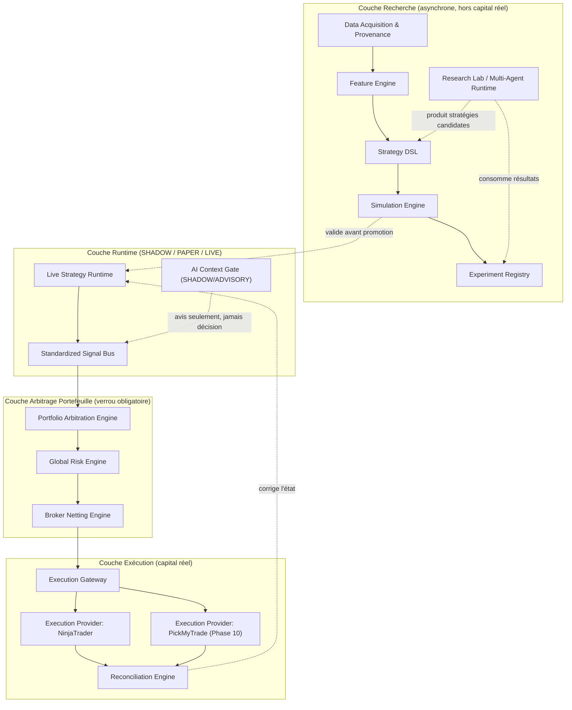

# 04 — Target System Architecture

- **Titre** : Architecture cible du système, vue d'ensemble
- **Statut** : `COMPLET`
- **Version** : 1.0.0
- **Date** : 2026-08-07
- **Auteur/agent** : Claude
- **Sources** : `01-NORTH-STAR-AND-SUCCESS-CRITERIA.md`, `03-AS-IS-TO-TARGET-GAP-MAP.md`, prompt maître §7
- **Documents supersédés** : aucun
- **Dernière vérification code** : n/a — architecture cible, voir `02` pour l'AS-IS correspondant à chaque composant réutilisé
- **Portée** : ce document donne la vue d'ensemble des composants cibles et de leurs relations. Chaque domaine est détaillé dans son propre document (`06` à `15`). Ce document ne fixe pas de chemins de fichiers définitifs pour les phases 2+ — voir la règle de `00-MASTER-INDEX.md` §7.

---

## 1. Vue d'ensemble en couches

## 2. Principe de séparation des couches

Quatre couches, dont la traversée est **strictement séquentielle** pour tout ce qui touche du capital réel :

1. **Recherche** — tout y est gratuit à essayer, rejouable, jamais connecté à un compte réel. C'est ici que vit la majorité de l'usage LLM (Research Lab).
2. **Runtime** — une Strategy Instance y calcule ses signaux en continu, en mode SHADOW (rien n'est exécuté), PAPER (compte simulé) ou LIVE (compte réel). L'AI Context Gate y produit des avis, jamais des ordres.
3. **Arbitrage Portefeuille** — **verrou obligatoire**, consolidation multi-stratégies avant toute soumission réelle. Aucun signal ne peut sauter cette couche pour atteindre l'exécution directement, quel que soit son mode.
4. **Exécution** — seule couche autorisée à contacter un broker réel, seule couche où `evaluateBrokerPolicy` et ses gates (`NO_DUPLICATE_POSITION`, `BRIDGE_HEALTHY`, etc.) s'appliquent en dernier ressort.

Cette séparation matérialise directement l'invariant INV-1 de `01` : le chemin allant d'un signal candidat à un ordre réel traverse toujours l'Arbitrage Portefeuille et l'Exécution, jamais un raccourci direct Runtime → broker.

## 3. Catalogue des composants cibles

| Composant | Rôle en une phrase | AS-IS réutilisable | Document de domaine |
|---|---|---|---|
| Data Acquisition & Provenance | Ingestion tracée et versionnée des données de marché et alternatives | Aucun (§6 de `03`) | `06` |
| Feature Engine | Calcul versionné de features dérivées, partagé simulation/live | Aucun dédié, catalogue de conditions partiellement réutilisable | `06` |
| Strategy DSL | Langage déclaratif de définition de stratégie, compilé vers le runtime canonique | Compilateurs de plan existants (partiel) | `07` |
| Canonical Runtime | Le moteur d'évaluation déterministe unique, partagé simulation et exécution réelle | `packages/desk-domain` (le moteur actuel EST ce composant) | `07` |
| Simulation Engine | Rejeu événementiel historique, portefeuille/risque simulés, métriques | `packages/desk-replay-engine` (partiel) | `08` |
| Run Registry | Registre des runs de simulation, paramètres, résultats, reproductibilité | Aucun | `08` |
| Experiment Registry | Comparaison structurée de runs/stratégies entre eux | Aucun | `08` |
| Research Lab / Multi-Agent Runtime | Registre générique Agent/Mission/Task/Batch pour tout usage LLM asynchrone | 3 pipelines LLM existants à migrer (partiel) | `09` |
| Live Strategy Runtime | Exécution en continu d'une Strategy Instance en SHADOW/PAPER/LIVE, isolée des autres | Aucun (le pipeline actuel est binaire, pas per-instance) | `10` |
| Standardized Signal Bus | Contrat unique de signal entre Live Strategy Runtime et Arbitrage Portefeuille | Aucun formalisé | `10` |
| AI Context Gate | Avis LLM encadré SHADOW/ADVISORY, jamais décisionnel | Aucun (fonctions actuelles non cloisonnées ainsi) | `12` |
| Portfolio Arbitration Engine | Consolidation des signaux candidats multi-stratégies | Aucun | `11` |
| Global Risk Engine | Limites de risque à l'échelle du portefeuille | Aucun (le moteur actuel évalue par décision, pas par portefeuille) | `11` |
| Broker Netting Engine | Résolution de la position nette cible par instrument avant soumission | Aucun (bug de collision actuel, §5 de `03`) | `11` |
| Execution Gateway | Point d'entrée unique, indépendant du provider, vers l'exécution réelle | Couplage direct actuel à NinjaTrader (partiel) | `13` |
| Execution Provider(s) | Adaptateur concret par broker/plateforme (NinjaTrader existant, PickMyTrade futur) | AddOn NinjaTrader HTTP+HMAC (réutilisé tel quel comme premier provider) | `13` |
| Reconciliation Engine | Comparaison état desk / état broker, gouvernée | `broker-execution-service.js` (existant, jamais déclenché automatiquement) | `13` |
| Event Envelope | Structure d'événement uniforme (`correlation_id`/`causation_id`) transverse | LISTEN/NOTIFY + outbox (partiel, sans enveloppe uniforme) | `14` |

## 4. Ce qui ne change PAS

Liste explicite, pour éviter toute ambiguïté à un agent d'implémentation futur, des composants existants qui restent la source de vérité et ne sont **pas** candidats à remplacement dans ce dossier :

- Le catalogue de conditions (`condition-catalog-v1-2.json`) et ses 11/12/10 prédicats/gates.
- `evaluateBrokerPolicy` et ses ~40 règles.
- Les state machines de position/thèse/setup, y compris `PROTECTION_CONFIRMED` et `ENGINE_ONLY_EVENTS`.
- Le système de contrats scellés par hash (`packages/desk-contracts`).
- `ACTIVE_STRATEGY_RUNTIME_VERSIONS` en tant que verrou schéma/moteur singulier (voir ADR-01).
- Le mécanisme LISTEN/NOTIFY + table de tâches durable comme fondation du réveil des workers.
- L'AddOn NinjaTrader C# compilé et son protocole HTTP+HMAC, qui devient le premier Execution Provider concret sans réécriture.

## 5. Ce qui est nouveau

- Data Acquisition & Provenance, Feature Engine formalisé, Strategy DSL, Run Registry, Experiment Registry, Research Lab générique, Live Strategy Runtime, Standardized Signal Bus, AI Context Gate, Portfolio Arbitration Engine, Global Risk Engine, Broker Netting Engine, Execution Gateway généralisé, Event Envelope uniforme.

## 6. Ce qui change mais ne se remplace pas — évolution en place

- La colonne `strategy_id` sur `trades` : conservée, complétée par une FK `strategy_instance_id` sans backfill destructif (voir `17`, Ticket 1.4 et ADR correspondant).
- Les Maps d'agrégation de position dans `broker-execution-service.js` : corrigées (clé étendue, prouvée par test), pas réécrites depuis zéro.
- Les trois pipelines LLM existants : leur valeur métier (analyse horaire, moniteur de thèse, orchestration de replay) est préservée ; seule leur infrastructure d'orchestration migre vers le Research Lab générique (Phase 4-5).

## 7. Vue de déploiement (haut niveau, non engageante en capacité)

Le système cible reste déployable sur la même topologie que l'existant (Windows Server VPS OVH, services WinSW, PostgreSQL 16) pour toutes les phases jusqu'à la Phase 9 incluse. Aucune migration d'infrastructure n'est requise par ce dossier — voir `15-SECURITY-OBSERVABILITY-AND-SCALABILITY.md` pour les recommandations de scalabilité horizontale, qui restent des options futures et non un prérequis des phases -1 à 9.

## 8. Relecture des invariants de `01` sur cette architecture

- INV-1/INV-2 : garantis structurellement par la séparation en couches (§2) — un signal ne peut atteindre `EG`/`EP1`/`EP2` sans traverser `PAE`→`GRE`→`BNE`, où les gates existants (§4) restent actifs sans modification de leur logique interne.
- INV-4 : le pipeline GPT-first actuel continue de fonctionner en parallèle de la construction des couches Recherche/Runtime tant que la Phase 11 (cutover) n'est pas déclenchée — voir `21`.
- INV-7 : `ACTIVE_STRATEGY_RUNTIME_VERSIONS` n'apparaît dans aucun composant du §3 ci-dessus comme mécanisme de sélection de stratégie — il reste en dehors du modèle de domaine de `05`, à un niveau orthogonal (versionning du Canonical Runtime lui-même, pas des Strategy Instances qui tournent dessus).
