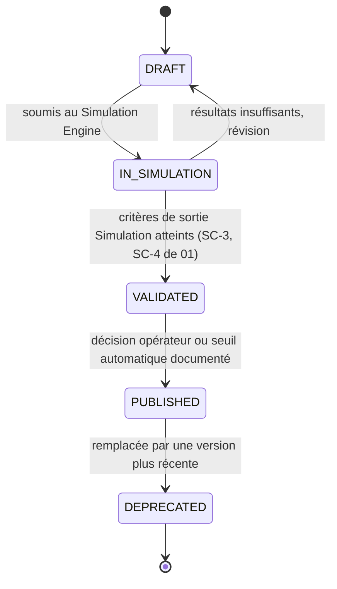
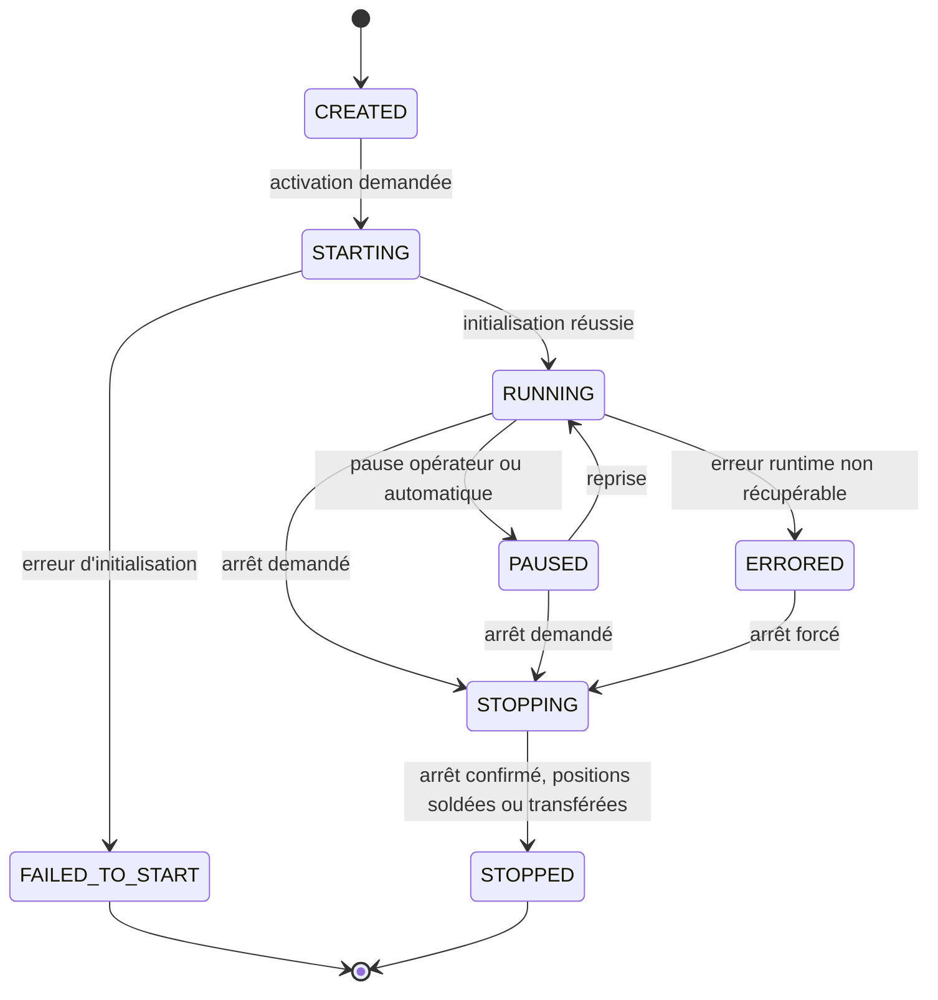
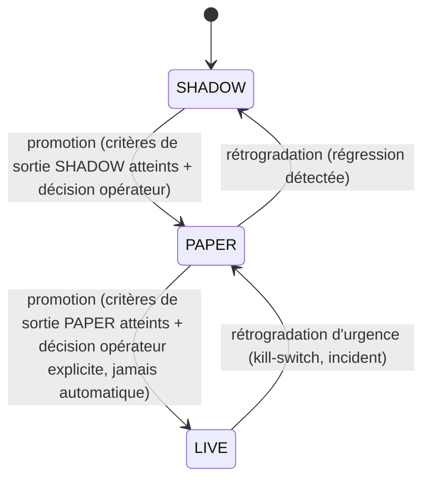
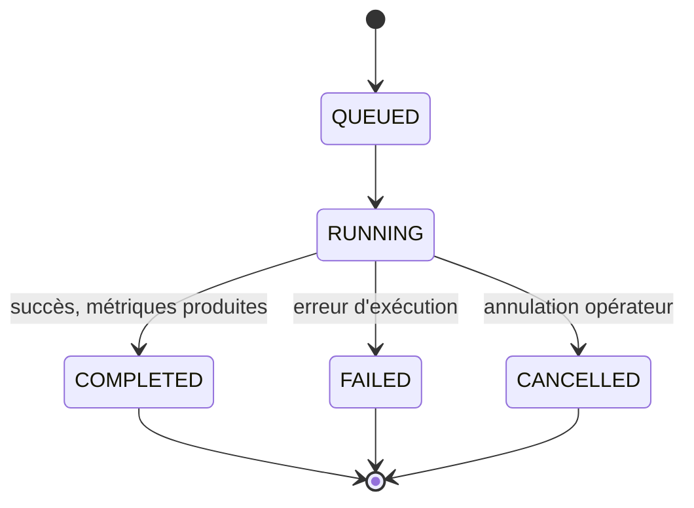
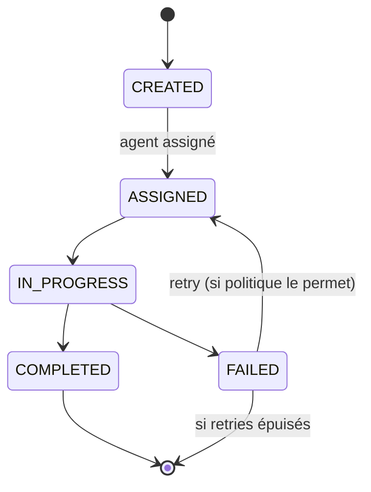
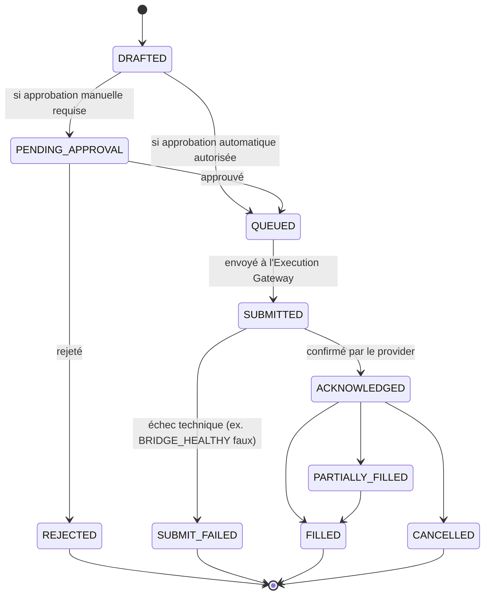

# 05 — Domain Model and State Machines

- **Titre** : Modèle de domaine cible et machines à états
- **Statut** : `COMPLET`
- **Version** : 1.0.0
- **Date** : 2026-08-07
- **Auteur/agent** : Claude
- **Sources** : `01`, `03`, `04`, prompt maître §7-8
- **Documents supersédés** : aucun
- **Dernière vérification code** : voir `02` pour les entités déjà existantes (`position-state-machine-v1.js`, `trades.strategy_id`)
- **Portée** : ce document définit les entités du domaine cible et leurs cycles de vie sous forme de machines à états. Il ne définit pas les schémas de tables SQL ni les endpoints — voir les documents de domaine `06`-`14` pour l'implémentation par sous-système.

---

## 1. Principe de modélisation

Chaque entité est décrite par : son identité, ses attributs clés, ses relations, et — quand elle a un cycle de vie — sa machine à états sous forme de transitions nommées. Les entités sont regroupées par sous-système pour lisibilité, mais toutes partagent le même style de traçabilité (`created_at`, `updated_at`, et pour les entités événementielles un `correlation_id`).

## 2. Axe central : Strategy Definition / Strategy Version / Strategy Instance

C'est le modèle le plus structurant de tout le dossier — il corrige directement l'erreur initiale identifiée dans `03` §4 (ne pas confondre avec `ACTIVE_STRATEGY_RUNTIME_VERSIONS`).

### 2.1 Strategy Definition

Le « quoi » — l'idée de stratégie elle-même, indépendante de toute implémentation figée.

- Attributs : `id`, `name`, `description`, `owner`, `created_at`.
- Pas de machine à états — une Strategy Definition n'a pas de cycle de vie opérationnel, seulement des versions.

### 2.2 Strategy Version

Une révision figée et testable d'une Strategy Definition — le code/DSL compilé + ses paramètres, immuable une fois publiée.

- Attributs : `id`, `strategy_definition_id` (FK), `version_label` (semver ou équivalent), `dsl_source_hash`, `compiled_artifact_ref`, `status`, `validated_metrics_ref` (FK vers Run Registry).
- Invariant : une `Strategy Version` en `PUBLISHED` est immuable — toute modification crée une nouvelle version, jamais une édition en place (cohérent avec le principe de contrats scellés par hash déjà en usage pour `packages/desk-contracts`).

### 2.3 Strategy Instance

Une exécution paramétrée d'une Strategy Version donnée, avec son propre état runtime et son propre mode d'exécution — **deux axes indépendants**, comme exigé par l'errata de sûreté reçu en amont de ce dossier.

**Axe A — état runtime (le cycle de vie opérationnel) :**

**Axe B — mode d'exécution (indépendant de l'axe A) :**

- **Garde technique explicite (rappel de l'errata de sûreté)** : le passage `PAPER → LIVE` ne peut **jamais** être déclenché automatiquement par un score de performance seul — il exige toujours une action opérateur explicite tracée, même si tous les critères chiffrés sont satisfaits. Ceci est un garde-fou technique, pas seulement procédural : voir `17`, garde de mode LIVE dans le ticket concerné, et INV-5 de `01`.
- Attributs : `id`, `strategy_version_id` (FK), `runtime_state` (axe A), `execution_mode` (axe B), `account_scope`, `risk_budget_ref`, `created_at`, `last_heartbeat_at`.
- Relation avec l'existant : `trades.strategy_instance_id` (nouvelle FK, voir `17` Ticket 1.4) référence cette entité ; l'ancienne colonne `strategy_id` (legacy, clé de session/lane) est conservée sans backfill, marquée dépréciée dans la documentation de schéma.

## 3. Axe Simulation

### 3.1 Dataset

- Attributs : `id`, `source_refs[]`, `time_range`, `schema_version`, `provenance_hash`, `created_at`.
- Pas de machine à états complexe : `BUILDING → READY → ARCHIVED`.

### 3.2 Run (Run Registry)

- Attributs : `id`, `strategy_version_id` (FK), `dataset_id` (FK), `parameters_hash`, `status`, `metrics_ref`, `started_at`, `completed_at`, `reproducibility_seed`.
- Invariant SC-3 (`01`) : deux `Run` avec le même `(strategy_version_id, dataset_id, parameters_hash, reproducibility_seed)` doivent produire des métriques identiques bit-à-bit.

### 3.3 Experiment

- Regroupe plusieurs `Run` pour comparaison structurée. Attributs : `id`, `name`, `run_ids[]`, `comparison_metric`, `winner_run_id` (nullable), `created_at`.
- Pas de machine à états — un Experiment est un regroupement, pas un processus.

## 4. Axe Research Lab / Multi-Agent Runtime

### 4.1 Agent

- Attributs : `id`, `type` (ex : `market-analysis`, `thesis-monitor`, `replay-orchestrator` — correspond aux 3 pipelines migrés), `capabilities[]`, `status` (`IDLE`/`BUSY`/`OFFLINE`).

### 4.2 Mission

- Attributs : `id`, `agent_id` (FK, nullable tant que `CREATED`), `objective`, `context_ref`, `correlation_id`, `status`.

### 4.3 Conversation

- Le fil de dialogue durable entre le système et un agent LLM — correspond à la notion `codex exec resume <thread_id>` déjà existante. Attributs : `id`, `mission_id` (FK), `thread_ref` (id externe Codex), `turn_count`.

### 4.4 Task

- Unité de travail atomique dans une Mission. Attributs : `id`, `mission_id` (FK), `input_ref`, `output_ref` (nullable), `status` (`PENDING`/`RUNNING`/`DONE`/`ERROR`).

### 4.5 Batch

- Regroupe plusieurs `Task` avec une politique d'agrégation. Attributs : `id`, `task_ids[]`, `policy` (`ALL`/`ANY`/`FIRST_SOCK`/`QUORUM`/`TIMEOUT_WITH_PARTIAL_RESULTS`), `status`, `deadline_at`.
- La politique `TIMEOUT_WITH_PARTIAL_RESULTS` est celle recommandée par défaut pour les pipelines migrés à haute fréquence (ex. moniteur de thèse horaire), pour préserver la disponibilité même si un sous-agent est lent.

### 4.6 Event (Event Envelope)

- Attributs : `id`, `type`, `correlation_id`, `causation_id` (nullable), `payload`, `emitted_at`, `emitted_by`.
- Traverse tous les sous-systèmes (voir `14-EVENTS-APIS-AND-MCP-SURFACE.md`) — c'est le mécanisme qui rend SC-7 de `01` vérifiable.

### 4.7 Lease / Lock

- `Lease` : réservation temporaire d'une ressource (ex. un `Run` en cours), avec expiration automatique. Attributs : `id`, `resource_ref`, `holder`, `expires_at`.
- `Lock` : verrou exclusif non temporisé, équivalent générique de `pg_try_advisory_lock` déjà utilisé par le worker actuel. Attributs : `id`, `resource_ref`, `holder`, `acquired_at`.
- Ces deux entités généralisent un mécanisme déjà présent et fonctionnel (`run_desk_ai_worker.mjs`, `pg_try_advisory_lock`) — voir `03` §9, réutilisation confirmée.

## 5. Axe Live Runtime et Signal

### 5.1 Signal (Standardized Signal Bus)

- Attributs : `id`, `strategy_instance_id` (FK), `instrument`, `direction`, `confidence`, `generated_at`, `expires_at`, `correlation_id`.
- Pas de machine à états propre — un Signal est immuable une fois émis ; son devenir (accepté/rejeté/agrégé) est tracé par les entités de la couche Arbitrage (§6).

### 5.2 AI Context Advisory

- Attributs : `id`, `signal_id` (FK, nullable — peut aussi s'appliquer à une position existante), `recommendation` (`TAKE`/`TAKE_REDUCED`/`WAIT`/`REJECT`), `rationale`, `model_ref`, `issued_at`.
- Invariant SC-6 (`01`) : cette entité n'a jamais de champ ni de relation lui permettant de créer directement un `Order Intent` — elle est consommée en lecture seule par le Portfolio Arbitration Engine, jamais en écriture directe sur l'exécution.

## 6. Axe Arbitrage Portefeuille

### 6.1 Candidate Allocation

- Sortie du Portfolio Arbitration Engine avant application du risque global. Attributs : `id`, `signal_ids[]`, `instrument`, `net_direction`, `proposed_size`.

### 6.2 Risk Decision

- Sortie du Global Risk Engine. Attributs : `id`, `candidate_allocation_id` (FK), `approved_size` (peut être réduit ou nul), `limits_applied[]`, `decided_at`.

### 6.3 Target Position

- Sortie du Broker Netting Engine — la position nette cible par instrument, tous comptes/stratégies confondus. Attributs : `id`, `instrument`, `account_id`, `net_target_size`, `derived_from_risk_decision_ids[]`.
- C'est cette entité qui remplace, de façon prouvée par test (voir `03` §5, `17` Ticket 0.4), l'agrégation actuelle par clé `instrument` seul.

## 7. Axe Exécution (existant, étendu — pas remplacé)

### 7.1 Order Intent

- Entité déjà existante dans le flux actuel (`createOrderIntent`). Cible : reste produite uniquement à partir d'une `Target Position`, jamais directement d'un `Signal` ou d'une `AI Context Advisory`.

- Ce cycle de vie est **cohérent avec, et ne remplace pas**, l'évaluation `evaluateBrokerPolicy` existante en phase `BROKER_SUBMIT` — la transition `QUEUED → SUBMITTED` est la matérialisation de cette évaluation, inchangée.

### 7.2 Position (existant — `position-state-machine-v1.js`)

- **Non modifiée par ce dossier.** Réutilisée telle quelle, y compris son état `PROTECTION_CONFIRMED` et son garde `ENGINE_ONLY_EVENTS`. Voir `04` §4 « Ce qui ne change PAS ». La seule extension prévue est un rattachement optionnel à `strategy_instance_id` (voir `17` Ticket 1.4), sans modification des transitions existantes.

### 7.3 Reconciliation Snapshot

- Attributs : `id`, `account_id`, `desk_positions_snapshot`, `broker_positions_snapshot`, `diffs[]`, `triggered_by` (`MANUAL`/`SCHEDULED`), `compared_at`.
- Invariant de séquencement (INV-8 de `01`, errata point 1) : `triggered_by = SCHEDULED` ne peut être activé qu'après la correction de l'agrégation multi-instance (§6.3 ci-dessus / `17` Ticket 0.4).

## 8. Table récapitulative — 32 entités du modèle cible

| # | Entité | Sous-système | A un cycle de vie propre |
|---|---|---|---|
| 1 | Strategy Definition | Identité stratégie | Non |
| 2 | Strategy Version | Identité stratégie | Oui (§2.2) |
| 3 | Strategy Instance | Identité stratégie | Oui, 2 axes (§2.3) |
| 4 | Dataset | Simulation | Simplifié |
| 5 | Run | Simulation | Oui (§3.2) |
| 6 | Experiment | Simulation | Non |
| 7 | Metrics Snapshot | Simulation | Non (immuable une fois produit) |
| 8 | Feature Definition | Data/Feature Engine | Versionné comme Strategy Version |
| 9 | Feature Value | Data/Feature Engine | Non (immuable, horodaté) |
| 10 | Data Source | Data Acquisition | `ACTIVE`/`DEPRECATED` |
| 11 | Ingestion Batch | Data Acquisition | `RUNNING`/`COMPLETED`/`FAILED` |
| 12 | Agent | Research Lab | `IDLE`/`BUSY`/`OFFLINE` |
| 13 | Mission | Research Lab | Oui (§4.2) |
| 14 | Conversation | Research Lab | Non (accumulation de tours) |
| 15 | Task | Research Lab | Oui (simple) |
| 16 | Batch (agent) | Research Lab | Oui (agrégation) |
| 17 | Event | Transverse | Non (immuable) |
| 18 | Lease | Transverse | `HELD`/`EXPIRED`/`RELEASED` |
| 19 | Lock | Transverse | `HELD`/`RELEASED` |
| 20 | Signal | Live Runtime | Non (immuable) |
| 21 | AI Context Advisory | AI Context Gate | Non (immuable) |
| 22 | Candidate Allocation | Arbitrage | Non |
| 23 | Risk Decision | Arbitrage | Non |
| 24 | Target Position | Arbitrage | Recalculée, pas transitionnée |
| 25 | Order Intent | Exécution | Oui (§7.1, existant) |
| 26 | Position | Exécution | Oui (§7.2, existant, non modifié) |
| 27 | Reconciliation Snapshot | Exécution | Non (immuable) |
| 28 | Execution Provider Config | Exécution | `ACTIVE`/`DISABLED` |
| 29 | Broker Account | Exécution | `ACTIVE`/`SUSPENDED` (existant) |
| 30 | Risk Budget | Arbitrage | Versionné, pas transitionné |
| 31 | Runtime Contract Bundle (`ACTIVE_STRATEGY_RUNTIME_VERSIONS`) | Canonical Runtime | Non modifié — voir §9 |
| 32 | Phase Gate Record | Gouvernance | `OPEN`/`PASSED`/`BLOCKED` (voir `phase-gates.yaml`) |

## 9. Rappel — ce que ce modèle NE fait PAS

Conformément à l'ADR-01 (`19-ARCHITECTURE-DECISION-RECORDS.md`) et à l'invariant INV-7 de `01` : `ACTIVE_STRATEGY_RUNTIME_VERSIONS` (entité #31) reste un verrou de compatibilité schéma/moteur **singulier**, complètement en dehors du graphe de relations des entités #1-3 (Strategy Definition/Version/Instance). Aucune requête, aucune migration, aucun endpoint de ce dossier ne doit faire dépendre la pluralité de #3 (plusieurs Strategy Instances actives) de la valeur de #31 (qui reste unique par déploiement).
