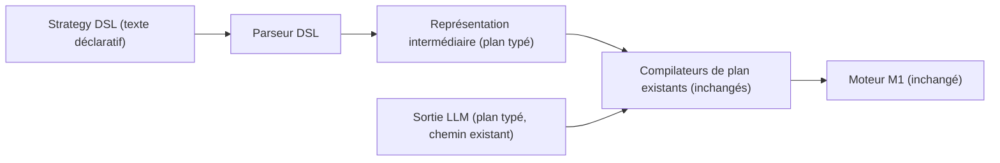

# 07 — Strategy DSL and Canonical Runtime

- **Titre** : DSL de stratégie et moteur d'exécution canonique
- **Statut** : `COMPLET`
- **Version** : 1.0.0
- **Date** : 2026-08-07
- **Auteur/agent** : Claude
- **Sources** : `01`, `03` §7, ADR-0010, ADR-0011
- **Documents supersédés** : aucun
- **Dernière vérification code** : `packages/desk-domain` confirmé comme base du Canonical Runtime, voir `02` §3
- **Portée** : architecture cible du chantier de Phase 3 (volet DSL/Runtime — le volet Simulation Engine est détaillé dans `08`). Propose une arborescence indicative, non engagée.

---

## 1. Rôle dans l'architecture cible

Ce chantier introduit la possibilité, pour un chercheur, d'écrire directement une définition de stratégie sans passer par une génération LLM, tout en garantissant (ADR-0010) que cette stratégie s'exécute sur exactement le même moteur que celui déjà en production pour l'exécution réelle.

## 2. Le Canonical Runtime — ce qu'il EST

**CONFIRMÉ, non modifié** : le Canonical Runtime cible est `packages/desk-domain` tel qu'il existe aujourd'hui — catalogue de conditions (11 prédicats/12 hard gates/10 soft gates), compilateurs de plan, moteur M1, state machines. Ce document ne propose aucune modification de ce moteur ; il documente comment le DSL s'y connecte en amont.

## 3. Strategy DSL — architecture cible

### 3.1 Principe de compilation



- **CIBLE REQUISE** : la représentation intermédiaire produite par le parseur DSL est strictement identique au format déjà consommé par les compilateurs de plan existants (le même format que celui produit aujourd'hui par la sortie LLM). Le DSL est une **deuxième origine** pour ce format, jamais un format concurrent.
- **RECOMMANDATION D'ARCHITECTURE** : le DSL devrait rester suffisamment proche du catalogue de conditions existant (mêmes noms de prédicats/gates) pour qu'un chercheur familier avec le système actuel n'ait pas à apprendre un second vocabulaire.

### 3.2 Cycle de vie d'une Strategy Version via le DSL

Une stratégie écrite en DSL suit le même cycle que documenté en `05` §2.2 (`DRAFT → IN_SIMULATION → VALIDATED → PUBLISHED → DEPRECATED`) — le DSL ne modifie pas ce cycle, il en est simplement une des origines possibles (aux côtés d'une génération assistée par le Research Lab, Phase 4-5).

## 4. Validation syntaxique et sémantique

- **CIBLE REQUISE** : le parseur DSL rejette à la compilation toute référence à un prédicat/gate non présent dans le catalogue de conditions versionné actif (`ACTIVE_STRATEGY_RUNTIME_VERSIONS`, ADR-0001) — pas de découverte tardive d'une erreur de syntaxe au moment de l'exécution.
- **CIBLE REQUISE** : toute Strategy Version compilée depuis le DSL référence, en lecture seule, la version du Runtime Contract Bundle utilisée à la compilation (cohérent avec ADR-0001, §1 du modèle de domaine).

## 5. Arborescence indicative (non engagée)

```
packages/desk-strategy-dsl/
  src/
    parser/             # grammaire, parsing
    compiler/            # DSL -> représentation intermédiaire (format plan typé existant)
    validation/           # vérification contre le catalogue de conditions actif
  test/
    fixtures/             # exemples de DSL valides/invalides
```

**À REVALIDER À L'ENTRÉE DE PHASE** : vérifier que le format exact de sortie des compilateurs de plan existants (consommé par `packages/desk-domain`) n'a pas évolué depuis cet audit, avant de figer le contrat de sortie du parseur DSL.

## 6. Critères de sortie de phase (volet DSL, Phase 3)

- Une stratégie simple écrite en DSL, compilée, exécutée par le moteur M1 existant sans modification de celui-ci, produisant un résultat identique à une stratégie équivalente définie via le chemin LLM existant sur le même scénario de test.
- Rejet propre (erreur de compilation, pas d'exception runtime) d'un DSL référençant un prédicat inexistant dans le catalogue actif.

## 7. Ce que ce chantier ne fait PAS

- Il ne remplace pas la génération de plan par LLM — les deux origines coexistent (§3.1). Le LLM reste utile pour l'exploration créative de nouvelles idées ; le DSL sert l'itération rapide et reproductible sur une idée déjà formulée.
- Il ne modifie aucune ligne du moteur M1 ni du catalogue de conditions — voir `04` §4, « ce qui ne change pas ».
