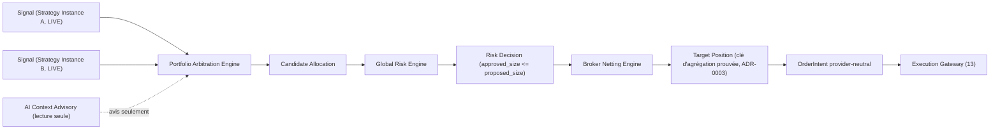

# 11 — Portfolio Arbitration, Global Risk Engine and Broker Netting

- **Titre** : Arbitrage de portefeuille, risque global et netting broker
- **Statut** : `COMPLET`
- **Version** : 1.0.0
- **Date** : 2026-08-07
- **Auteur/agent** : Claude
- **Sources** : `01`, `03` §11, ADR-0008, errata de sûreté (points sur le positionnement en verrou)
- **Documents supersédés** : aucun
- **Dernière vérification code** : n/a — composants `ABSENT` de l'AS-IS ; réutilise `evaluateBrokerPolicy` en aval sans le modifier (`02` §3, §6)
- **Portée** : architecture cible de la Phase 7, positionnée explicitement comme **verrou bloquant** avant toute activation réelle multi-stratégie (ADR-0008). C'est le chantier que le donneur d'ordre a demandé de détailler avec un contenu spécifique avant toute activation multi-stratégie réelle.

---

## 1. Pourquoi ce chantier est un verrou, pas une amélioration optionnelle

Rappel du raisonnement (ADR-0008, §16 de `03`) : sans consolidation de portefeuille, deux `Strategy Instance` individuellement conformes à leurs propres limites de risque peuvent, ensemble, dépasser une limite de risque de portefeuille qu'aucune n'aurait dépassée seule. C'est un mode de défaillance qui n'est **pas détecté** par le moteur `evaluateBrokerPolicy` existant, qui évalue chaque décision individuellement.

## 2. Portfolio Arbitration Engine

### Addendum TD2-700

La première fondation exécutable est `portfolio_candidate_allocation_plan_v1`.

- Les signaux actifs sont groupés par instrument.
- La politique V1 est `NET_BY_DIRECTION`.
- Une opposition parfaite produit une Candidate Allocation `FLAT` de taille `0`, statut `NEUTRALIZED`.
- Un snapshot `virtual_strategy_portfolio_v1` agrège exposition et résultat R par `Strategy Instance`.
- Aucun `OrderIntent` n’est produit à ce stade.

### 2.1 Entrée

- Consomme les `Signal` (`05` §5.1) publiés en mode LIVE par le Live Strategy Runtime (`10`) sur le Standardized Signal Bus, ainsi que les `AI Context Advisory` associées (`12`), en lecture seule.

### 2.2 Traitement

- **CIBLE REQUISE** : agrège tous les `Signal` LIVE actifs par instrument, résout les conflits directionnels entre stratégies (deux stratégies signalant des directions opposées sur le même instrument) selon une politique explicite et documentée — **DÉCISION OPÉRATEUR** : la politique par défaut proposée est la neutralisation (les signaux opposés s'annulent partiellement) plutôt que la priorité à la stratégie la plus ancienne ou la plus performante, sauf configuration contraire de l'opérateur.
- Produit une `Candidate Allocation` par instrument (`05` §6.1).

### 2.3 Sortie

- `Candidate Allocation` transmise au Global Risk Engine — jamais directement à l'Execution Gateway.

## 3. Global Risk Engine

### Addendum TD2-701

La première fondation exécutable de budget global est `portfolio_risk_budget_evaluation_v1`.

- Les budgets sont configurables par portefeuille, compte, instrument, Strategy Instance et groupe corrélé.
- Les limites de perte journalière et hebdomadaire sont évaluées avant toute approbation.
- Sans budget numérique, le moteur retourne `CONFIG_MISSING` et `gate.pass=false`.
- Une allocation peut être `PASS`, `REDUCE` ou `BLOCK`.
- La réduction calcule une taille approuvable, mais ne produit pas encore de `Target Position` broker.

### 3.1 Limites appliquées

- **CIBLE REQUISE**, contenu minimal exigé :
  - Exposition nette maximale par instrument (tous comptes/stratégies confondus).
  - Exposition nette maximale par classe d'actif ou secteur (si applicable).
  - Perte maximale journalière/hebdomadaire consolidée du portefeuille (kill-switch de portefeuille, distinct de tout kill-switch par stratégie individuelle déjà existant).
  - Nombre maximal de positions simultanées ouvertes, tous comptes confondus.
- **DÉCISION OPÉRATEUR** : les valeurs numériques exactes de ces limites (voir `operator-decisions.yaml`, entrée dédiée à créer à l'entrée de Phase 7) ne sont pas fixées par ce dossier — elles dépendent du capital réel engagé et de l'appétit au risque de l'opérateur.

### 3.2 Comportement en cas de dépassement

- **CIBLE REQUISE** : le Global Risk Engine réduit (`approved_size < proposed_size`) ou annule (`approved_size = 0`) une `Candidate Allocation` plutôt que de rejeter l'ensemble du cycle — cohérent avec le principe fail-closed appliqué au niveau le plus fin possible (réduire la taille plutôt que bloquer tout le portefeuille).
- Produit une `Risk Decision` (`05` §6.2) pour chaque `Candidate Allocation` traitée, y compris celles réduites à zéro — jamais de silence sur un rejet.

## 4. Broker Netting Engine

### Addendum TD2-702

La fondation exécutable de netting est `portfolio_target_position_plan_v1`.

- Elle consomme les Candidate Allocations et l’évaluation budgétaire.
- Elle produit une seule Target Position par `account_id + instrument`.
- Elle calcule `current_net_size` et `delta_size`.
- Elle conserve les contributions par Strategy Instance.
- Elle ne génère pas encore d’`OrderIntent`.

### Addendum TD2-703

La conversion exécutable Target Position → OrderIntent est `portfolio_order_intent_plan_v1`.

- Elle génère uniquement des intents dérivés d’une `Target Position`.
- Elle calcule `BUY`/`SELL`, quantité, `OPEN`/`REDUCE`/`REVERSE`/`CANCEL_REPLACE`.
- Elle applique une idempotence par hash canonique.
- Elle protège contre le double envoi via `existing_order_intents`.
- Elle exige des protections broker avant `broker_submission_allowed=true`.
- Elle reste provider-neutral et ne dépend pas directement de NinjaTrader.

### Addendum TD2-704

La sécurité exécution est formalisée par `portfolio_execution_reconciliation_v1`.

- Redémarrage : un intent actif identique ne produit pas de nouvel ordre.
- Concurrence : un double `idempotency_key` actif déclenche `CONTROLLED_DIVERGENCE`.
- Fills partiels : le restant ouvert est auditable.
- Divergence broker/desk : le desk pose `HALT_BROKER_SUBMIT`, demande snapshot provider et revue opérateur.

### Addendum TD2-900

La frontière provider-neutral d'exécution est `execution_provider_port_v1`.

- Elle consomme des `OrderIntent` déjà autorisés.
- Elle produit des `ExecutionProviderCommand` canoniques.
- Elle normalise les événements broker en `broker_provider_event_v1`.
- Elle permet de remplacer ou comparer les adapters sans modifier stratégie, risque ou netting.

### Addendum TD2-706

Le cockpit et le risk engine consomment `portfolio_virtual_pnl_attribution_v1`.

- Le PnL virtuel est attribué par Strategy Instance.
- La similarité réutilise les génomes TD2-507.
- Les stratégies trop proches produisent un impact d’allocation explicite.
- Ces projections alimentent TD2-705.

### Addendum TD2-707

Les contraintes prop firm sont portées par `prop_firm_account_risk_v1`.

- Le trailing drawdown est calculé par compte.
- Les limites journalières et contrats peuvent bloquer l’action.
- Le risque peut être réduit au buffer disponible.
- Le multi-compte reste isolé par `account_id + instrument`.

### Addendum TD2-705

Le cockpit transitoire `Portfolio Risk` est exposé dans le front opérateur.

- `GET /api/v1/portfolio-risk/overview` lit les sources réelles `execution`, `strategy-v2` et `performance`.
- La vue globale montre santé, comptes, exposition nette, contrôles, concentration stratégie, intentions et réconciliations.
- Chaque section ouvre une route de zoom dédiée sous `/operations/portfolio-risk/<section>`.
- Les actions sensibles restent contrôlées : le cockpit ouvre la console d’exécution mais ne publie aucune écriture portefeuille.
- En cas de source indisponible, la projection passe en état partiel et affiche l’erreur au lieu de masquer ou remplacer la donnée.

### 4.1 Rôle

- Résout, à partir de l'ensemble des `Risk Decision` approuvées, la **position nette cible** par instrument et par compte broker réel — c'est la sortie qui remplace directement, de façon prouvée par test, l'agrégation actuelle buguée (`03` §5, ADR-0003).

### 4.2 Relation avec le correctif de la Phase 0

- **CIBLE REQUISE** : le Broker Netting Engine réutilise la clé d'agrégation prouvée par test lors du Ticket 0.4 (`17`) comme fondation de son modèle de données `Target Position` (`05` §6.3) — pas une nouvelle clé introduite indépendamment en Phase 7.

## 5. Diagramme de flux (rappel de `04` §1, détaillé ici)



## 6. Arborescence indicative (non engagée)

```
packages/desk-portfolio-risk/
  src/
    arbitration/         # Portfolio Arbitration Engine
    global-risk/           # Global Risk Engine, limites configurables
    netting/                # Broker Netting Engine, réutilise la clé ADR-0003
  test/
    multi-strategy-limit.test.js   # preuve qu'une limite de portefeuille bloque 2 stratégies conformes individuellement
```

## 7. Critères de sortie de phase (Phase 7)

- Test d'intégration : deux `Strategy Instance` LIVE simultanées, chacune conforme à ses propres limites individuelles, ne peuvent collectivement dépasser l'exposition nette de portefeuille configurée (SC-5 de `01`, preuve directe).
- Le Broker Netting Engine produit une `Target Position` correcte sous accès concurrent multi-instance, sans collision (réutilisant la preuve du Ticket 0.4).
- Aucune régression sur `evaluateBrokerPolicy` et ses gates existants — ce moteur reste invoqué en aval, inchangé (`04` §4).

## 8. Ce que ce chantier ne fait PAS

- Il ne remplace pas `evaluateBrokerPolicy` — il ajoute une étape de consolidation **avant** que cette fonction ne soit invoquée avec l'`Order Intent` final.
- Il n'autorise aucune activation réelle multi-stratégie tant que les critères de sortie ci-dessus ne sont pas tous satisfaits — voir `phase-gates.yaml`.
