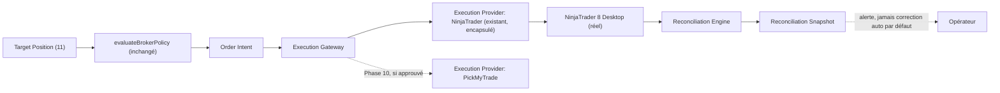

# 13 — Execution Gateway, Providers and Reconciliation

- **Titre** : Passerelle d'exécution, fournisseurs, et réconciliation
- **Statut** : `COMPLET`
- **Version** : 1.0.0
- **Date** : 2026-08-07
- **Auteur/agent** : Claude
- **Sources** : `01`, `02` §6, `03` §5 §13, ADR-0003, ADR-0016, ADR-0017
- **Documents supersédés** : aucun
- **Dernière vérification code** : chaîne d'exécution et réconciliation vérifiées par lecture directe, voir `02` §6
- **Portée** : architecture cible des Phases 9 (Execution Gateway) et 10 (PickMyTrade, due diligence uniquement). Arborescence indicative, non engagée.

---

## 1. Rôle dans l'architecture cible

Point d'entrée unique vers l'exécution broker réelle, indépendant du provider concret, encapsulant sans les réécrire les mécanismes déjà en production (`evaluateBrokerPolicy`, AddOn NinjaTrader).

## 2. Execution Gateway

### 2.1 Contrat d'entrée

- Reçoit un `Order Intent` déjà produit à partir d'une `Target Position` (`11`), déjà passé par `evaluateBrokerPolicy` (inchangé, `04` §4).
- **CIBLE REQUISE** : le comportement observable du chemin d'exécution réel (latence, séquence d'appels, gates évalués) doit être strictement identique avant et après l'introduction de cette couche — vérifié par tests de non-régression (ADR-0016).

### 2.2 Sélection de provider

- **CIBLE REQUISE** : la sélection du provider concret (NinjaTrader aujourd'hui, PickMyTrade potentiellement demain) se fait par configuration, jamais par branchement conditionnel dans la logique métier des couches supérieures.

## 3. Execution Provider : NinjaTrader (existant, encapsulé)

- **CONFIRMÉ, non modifié** : protocole HTTP+HMAC, AddOn C# compilé — réutilisés tels quels comme implémentation du premier `Execution Provider Config` (`05` §8, entité #28).
- **CIBLE REQUISE** : l'interface `Execution Provider` définit un contrat minimal (soumettre un ordre, interroger un statut, annuler un ordre) que l'adaptateur NinjaTrader existant doit satisfaire par encapsulation, sans changement de son propre code interne.

## 4. Execution Provider : PickMyTrade (Phase 10, due diligence uniquement)

- Voir ADR-0017 — statut `À DÉCIDER (OPÉRATEUR — OP-7)`. La Phase 10 se limite à :
  1. Due diligence de sécurité (méthode d'authentification, gestion des secrets, historique d'incidents connus).
  2. Due diligence de fiabilité (SLA annoncé, mécanisme de confirmation d'ordre).
  3. Modèle de coût.
  4. Si approuvé par l'opérateur : un pilote strictement en mode SHADOW/PAPER, jamais LIVE, avec ses propres critères de sortie avant toute reconsidération d'un statut LIVE (décision opérateur distincte et postérieure).

## 5. Reconciliation Engine

### 5.1 Ce qui existe déjà

- **CONFIRMÉ** : `broker-execution-service.js`, fonction `compareSnapshots` et méthode `reconcile()`, `reconciliationSnapshot(accountId)` scopant correctement le compte. Jamais déclenché automatiquement en production actuellement (`02` §6).

### 5.2 Ce qui change

- **CIBLE REQUISE** : le déclenchement périodique automatique de la réconciliation ne peut être activé qu'**après** la correction de l'agrégation de position multi-instance (ADR-0003, ADR-0005) — séquencement bloquant, pas une simple recommandation.
- **CIBLE REQUISE** : une fois activée, la réconciliation produit un `Reconciliation Snapshot` (`05` §7.3) journalisé avec `triggered_by = SCHEDULED`, consultable par l'opérateur, jamais silencieux.
- **DÉCISION OPÉRATEUR** : la fréquence du déclenchement périodique et le comportement automatique en cas de désynchronisation détectée (alerte seule vs action corrective automatique) restent à définir par l'opérateur avant activation — ce dossier recommande par défaut « alerte seule », jamais de correction automatique de position sans validation humaine, cohérent avec le principe fail-closed.

## 6. Diagramme de flux



## 7. Arborescence indicative (non engagée)

```
packages/desk-execution-gateway/
  src/
    gateway/               # point d'entrée unique, sélection de provider par config
    providers/
      ninjatrader/          # encapsule l'intégration HTTP+HMAC existante, inchangée
      pickmytrade/           # Phase 10 uniquement, si approuvé (OP-5)
    reconciliation/          # active le déclenchement périodique, gouverné
  test/
    gateway-parity.test.js   # preuve de non-régression du comportement observable
```

## 8. Critères de sortie de phase

**Phase 9** : l'Execution Gateway opérationnel avec le seul provider NinjaTrader, tests de non-régression prouvant l'absence de changement de comportement réel par rapport au chemin actuel direct.

**Phase 10** (optionnelle, sous `OP-5`) : due diligence PickMyTrade documentée et présentée à l'opérateur ; pilote SHADOW/PAPER uniquement si approuvé.

## 9. Ce que ce chantier ne fait PAS

- Il ne modifie pas `evaluateBrokerPolicy` ni ses ~40 règles.
- Il n'active jamais la réconciliation automatique avant que le prérequis de la Phase 0 (correction d'agrégation) ne soit confirmé fusionné et testé.
- Il n'engage aucune intégration PickMyTrade en production sans décision opérateur explicite distincte de la due diligence elle-même.
