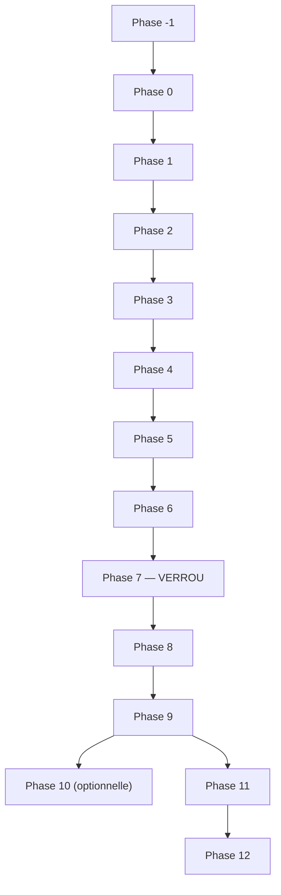

# 16 — End-to-End Migration Roadmap

- **Titre** : Feuille de route de migration de bout en bout
- **Statut** : `COMPLET`
- **Version** : 1.0.0
- **Date** : 2026-08-07
- **Auteur/agent** : Claude
- **Sources** : `03` §1 (réconciliation de numérotation), `phase-gates.yaml`, `implementation-backlog.yaml`, tous les ADR
- **Documents supersédés** : `docs/audit-2026-08-07/03-PLAN-EVOLUTION.md` en tant que séquencement (contenu technique repris, numérotation remplacée — voir `03` §1)
- **Dernière vérification code** : n/a — document de planification
- **Portée** : la trajectoire complète, Phase -1 à Phase 12, avec dépendances, chemin critique, parallélisation possible, et portes de sortie. Le détail fichier/fonction n'est donné que pour les Phases -1/0/1 (voir `17-EXECUTABLE-BACKLOG.md`) ; les Phases 2-12 restent au niveau architecture cible (voir `00` §7 pour la règle).

---

## 1. Les 14 phases, en un coup d'œil

| Phase | Nom | Objectif en une phrase | Détail fichier |
|---|---|---|---|
| -1 | Baseline et caractérisation | Établir un point de référence figé et testé avant tout changement | Oui, `17` |
| 0 | Sûreté immédiate et fondations de données | Corriger les défauts de sûreté connus (protection, collision de position) avant d'ajouter quoi que ce soit de nouveau | Oui, `17` |
| 1 | Strategy Definition/Version/Instance | Introduire l'identité de stratégie cible, sans toucher au chemin réel au-delà du strict nécessaire | Oui, `17` |
| 2 | Data Foundation and Provenance | Rendre les données consommées par la simulation traçables et reproductibles | Non, `06` |
| 3 | Strategy DSL, Canonical Runtime, Simulation Engine | Permettre l'écriture et la validation de stratégies sans dépendance LLM par itération | Non, `07`, `08` |
| 4 | Experiment Registry and Research Lab | Comparer des runs entre eux, premier pipeline LLM migré | Non, `08`, `09` |
| 5 | Generalized Multi-Agent Runtime | Généraliser l'orchestration LLM aux 3 pipelines existants | Non, `09` |
| 6 | Live Strategy Runtime (SHADOW/PAPER) | Exécution en continu par instance, isolée, sans capital réel engagé par défaut | Non, `10` |
| 7 | Portfolio Arbitration, Global Risk, Broker Netting | Verrou obligatoire avant toute activation réelle multi-stratégie | Non, `11` |
| 8 | AI Context Gate | Avis LLM encadré, jamais décisionnel | Non, `12` |
| 9 | Execution Gateway and NinjaTrader Adapter | Abstraction d'exécution, premier provider encapsulé sans réécriture | Non, `13` |
| 10 | PickMyTrade Due Diligence and Pilot | Option de second provider, sous décision opérateur, non bloquante | Non, `13` |
| 11 | Production Cutover | Bascule gouvernée vers le nouveau système | Non, `21` |
| 12 | GPT-First Decommission | Retrait du pipeline legacy, seulement après validation complète du cutover | Non, `21` |

## 2. Graphe de dépendances

Ce graphe est délibérément **linéaire** dans sa dépendance stricte — chaque phase suppose la précédente `PASSED` (voir `phase-gates.yaml`). La parallélisation possible (§3) se situe **à l'intérieur** de certaines phases, pas entre elles, à une exception près (Phase 10, voir §3).

## 3. Parallélisation possible

- **À l'intérieur de la Phase 1** : les Tickets 1.1 et 1.2 sont strictement séquentiels (1.2 référence 1.1) ; en revanche, une fois 1.1-1.4 terminés, le Ticket 1.5 (peuplement des tables lues par le frontend) peut être développé en parallèle du Ticket 1.6 (concurrence positionnelle paper/shadow) par deux agents distincts, car ils touchent des fichiers disjoints — à condition que les deux respectent indépendamment leurs listes de fichiers interdits.
- **Phase 10 (PickMyTrade)** : architecturalement indépendante de la Phase 11/12 grâce à l'abstraction Execution Gateway posée en Phase 9 (ADR-0016) — peut être menée en parallèle de la préparation de la Phase 11, ou reportée indéfiniment sans bloquer le reste, sous réserve de la décision opérateur `OP-7`.
- **Phases 2 à 5 (couche Recherche)** : n'ont, par construction, aucun impact sur le capital réel (`04` §2) — un développement plus rapide ou plus lent de cette couche n'a pas d'incidence de sûreté sur le système actuellement en production, contrairement aux Phases 6+.

## 4. Chemin critique

Le chemin critique de bout en bout est : `-1.1 → -1.2 → -1.3 → 0.1 → 0.2 → 0.3 → 0.4 → 0.5 → 0.6 → 1.1 → 1.2 → 1.3 → 1.4 → 1.6 → 1.7 → Phase 2 → Phase 3 → Phase 4 → Phase 5 → Phase 6 → Phase 7 → Phase 8 → Phase 9 → Phase 11 → Phase 12`.

Le Ticket 1.5 n'est **pas** sur le chemin critique (voir §3, parallélisable avec 1.6). La Phase 10 n'est **pas** sur le chemin critique (optionnelle, ADR-0017).

Le point de ralentissement le plus probable, identifié par ce dossier, est la **Phase 7** (Portfolio Arbitration/Global Risk/Broker Netting) : c'est un verrou bloquant (ADR-0008) qui dépend d'une décision opérateur non triviale (`OP-8`, valeurs numériques de limites de risque) — cette décision devrait être sollicitée le plus tôt possible, dès l'entrée en Phase 6, pour ne pas bloquer le chemin critique une fois la Phase 6 terminée.

## 5. Définition de « Ready » (DoR) — commune à tout ticket

Un ticket est prêt à démarrer si et seulement si :

1. Toutes ses dépendances (`depends_on` dans `implementation-backlog.yaml`) sont `PASSED`.
2. Toutes ses décisions opérateur bloquantes (`blocked_by_operator_decisions`) sont `resolved`, sauf si une valeur par défaut sûre documentée permet de procéder (voir `operator-decisions.yaml`, champ `default_if_unresolved`).
3. La liste des fichiers interdits (`files_forbidden`) a été relue par l'agent d'implémentation avant tout premier commit.
4. Les tests à écrire avant changement (`tests_before_change`) sont identifiés et compris — pas nécessairement encore écrits, mais leur portée est claire.

## 6. Définition de « Done » (DoD) — commune à tout ticket

Un ticket est terminé si et seulement si :

1. Tous les `tests_before_change` sont écrits, passent, et couvrent explicitement le comportement attendu ET le comportement de non-régression.
2. Tous les `pass_criteria` du ticket sont vérifiés.
3. Aucun fichier de `files_forbidden` n'apparaît dans le diff (vérifié explicitement en revue, pas seulement supposé).
4. Le test de caractérisation de bout en bout (`-1.3`) ne régresse pas, pour tout ticket des Phases 0 et 1.
5. Le comportement du pipeline GPT-first en production n'a pas changé (INV-4), pour tout ticket des Phases -1 à 10.
6. Un rollback documenté existe et a été mentalement ou effectivement exercé (feature flag testé en position désactivée).

## 7. Stratégie de branches, feature flags, rollback

- **Branches** : une branche par ticket (pas par phase), fusionnée dans la branche d'intégration de la phase seulement après revue complète (spec + qualité, cohérent avec la méthode subagent-driven-development si l'implémentation choisit de l'utiliser — hors scope de ce dossier de documenter ce choix, qui appartient à l'agent d'implémentation).
- **Feature flags** : voir ADR-0018 — tout changement touchant, même indirectement, le chemin d'exécution réel est protégé par un flag par défaut désactivé (liste exhaustive dans `phase-gates.yaml`, champ `feature_flags`).
- **Rollback** : chaque ticket documente son propre rollback (`implementation-backlog.yaml`, champ `rollback`) — la grande majorité sont des rollbacks triviaux (migrations additives, flags désactivables) grâce à la discipline expand/contract (ADR-0019) appliquée dès la Phase -1.

## 8. Ce que cette roadmap ne fait PAS

- Elle ne fixe pas de dates calendaires — aucune estimation de durée n'a été demandée ni n'est fournie ; le séquencement est logique (dépendances), pas temporel.
- Elle ne détaille pas les Phases 2-12 au niveau fichier — cohérent avec l'instruction explicite de ne pas préparer l'implémentation détaillée des phases lointaines (`00` §7).
