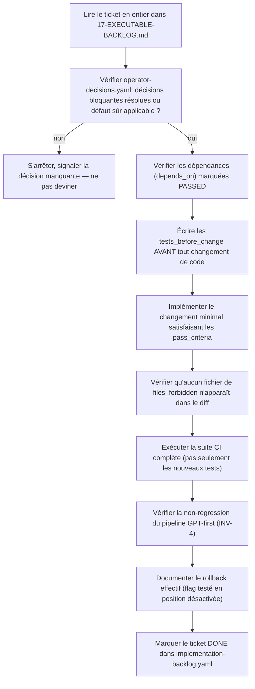

# 22 — GPT/Codex Implementation Runbook

- **Titre** : Protocole de démarrage pour l'agent d'implémentation
- **Statut** : `COMPLET`
- **Version** : 1.0.0
- **Date** : 2026-08-07
- **Auteur/agent** : Claude
- **Sources** : tout le dossier — ce document est un point d'entrée synthétique, pas une nouvelle source d'information
- **Documents supersédés** : `docs/audit-2026-08-07/05-CODEX-HANDOFF.md` en tant que point d'entrée (contenu consolidé dans `17`, ce document en est le protocole de démarrage)
- **Dernière vérification code** : n/a
- **Portée** : instructions opérationnelles pour tout agent (Codex ou autre) démarrant l'implémentation à partir de ce dossier. Rappelle les interdictions absolues et les réflexes attendus à chaque ticket.

---

## 1. Avant de commencer — ce qu'il faut lire, dans l'ordre

1. `00-MASTER-INDEX.md` — orientation générale.
2. `01-NORTH-STAR-AND-SUCCESS-CRITERIA.md` §3 — les 8 invariants non négociables (INV-1 à INV-8). **Les mémoriser, pas seulement les lire.**
3. `17-EXECUTABLE-BACKLOG.md` — le ticket courant, en entier, y compris sa liste de fichiers interdits.
4. `operator-decisions.yaml` — vérifier qu'aucune décision bloquante pour ce ticket n'est encore `open` sans valeur par défaut sûre applicable.
5. `20-RISK-REGISTER.md` — les risques associés à la phase courante.

## 2. Interdictions absolues (rappel, valables à chaque ticket sans exception)

- Ne jamais exécuter d'ordre réel, ne jamais contacter un broker réel, ne jamais utiliser des identifiants de production.
- Ne jamais modifier `packages/desk-domain/src/broker-execution.js` (`NO_DUPLICATE_POSITION`), les gates AddOn broker-facing, ou `CLOSEPOSITION` instrument-wide, en dehors d'un ticket qui les cible explicitement et nommément (aucun ticket avant la Phase 7 ne le fait — voir `17`).
- Ne jamais modifier `strategy-runtime-versioning.js` dans le cadre d'un ticket de Phase 1 (ADR-0001).
- Ne jamais introduire de backfill de `strategy_instance_id` depuis `strategy_id` (ADR-0004).
- Ne jamais activer un feature flag par défaut à `true` pour un changement touchant le chemin d'exécution réel (ADR-0018).
- Ne jamais combiner ajout et suppression dans une même migration de schéma (ADR-0019).
- Ne jamais supposer une valeur pour une décision opérateur marquée `open` sans valeur par défaut documentée dans `operator-decisions.yaml`.
- Ne jamais coder une fonctionnalité au-delà de ce que le ticket courant demande (YAGNI) — en particulier, ne jamais commencer un ticket de phase ultérieure « en avance » sous prétexte d'efficacité.

## 3. Réflexe à chaque ticket

## 4. Commandes de build/test

**CIBLE REQUISE** : reprendre exactement les commandes définies dans `.github/workflows/local-ci.yml` (source de vérité, vérifiée lors de l'audit initial). Toute commande nouvelle introduite par un ticket doit être ajoutée à ce fichier CI, jamais exécutée seulement localement de façon informelle.

## 5. Que faire en cas de doute

- **Ambiguïté sur le comportement AS-IS** : relire `02-VERIFIED-AS-IS-SUMMARY.md` §9-10 — si la zone est marquée `INCERTAIN` ou `ABSENT`, ne pas deviner, vérifier ponctuellement dans le code réel avant de procéder, en citant `fichier:ligne` dans le commit ou la PR.
- **Ambiguïté sur une décision d'architecture** : vérifier `19-ARCHITECTURE-DECISION-RECORDS.md` — si un ADR existe et est `TRANCHÉE`, l'appliquer sans revalidation. S'il est `À DÉCIDER (OPÉRATEUR)`, s'arrêter et signaler.
- **Le ticket semble nécessiter de toucher un fichier de `files_forbidden`** : c'est un signal d'alerte fort — s'arrêter, ne pas contourner, signaler explicitement le conflit apparent entre le besoin observé et la restriction documentée plutôt que de trancher unilatéralement.
- **Un test de non-régression échoue de façon inattendue** : ne jamais désactiver ou modifier le test pour le faire passer sans comprendre la cause racine — voir la discipline de débogage systématique (root cause avant fix) déjà en usage dans ce projet.

## 6. Rapport de progression attendu

**RECOMMANDATION D'ARCHITECTURE** : à l'issue de chaque ticket, l'agent d'implémentation devrait produire un court rapport (dans la description de commit ou de PR) couvrant : ce qui a été fait, les tests écrits et leur résultat, toute déviation par rapport au ticket tel que spécifié (et pourquoi), et l'état de `implementation-backlog.yaml` mis à jour pour ce ticket.

## 7. Premier ticket exécutable

**Ticket -1.1**, `17-EXECUTABLE-BACKLOG.md` — capture de l'état exact. Aucune dépendance, aucun blocage résiduel : `OP-1` (services WinSW arrêtés) et `OP-2` (contrat actif = 5.4.0) ont été tranchés directement par l'opérateur le 2026-08-07. `OP-12` (état runtime du hold `ENGINE_V5_VALIDATION_HOLD`) reste formellement ouvert mais n'est plus un préalable : sa vérification (`node mcp_gpt_desk/scripts/verify_v5_frozen_state.mjs --freeze-only` ou équivalent) est le contenu même de ce ticket — c'est l'agent d'implémentation qui l'exécute au démarrage, pas la session de planification qui a produit ce dossier (celle-ci ne doit jamais exécuter de code, y compris contre le checkout preprod local, même si l'opérateur a confirmé que préprod et VPS de production tournent le même code).

## 8. Ce que ce runbook ne fait PAS

- Il ne remplace pas la lecture complète de `17-EXECUTABLE-BACKLOG.md` pour le ticket courant — c'est un protocole de démarrage et de réflexe, pas un résumé suffisant en lui-même.
- Il n'autorise aucune action sur un système externe réel — voir §2, interdictions absolues, qui restent valables même si ce document ne les répète pas toutes littéralement à chaque section.
