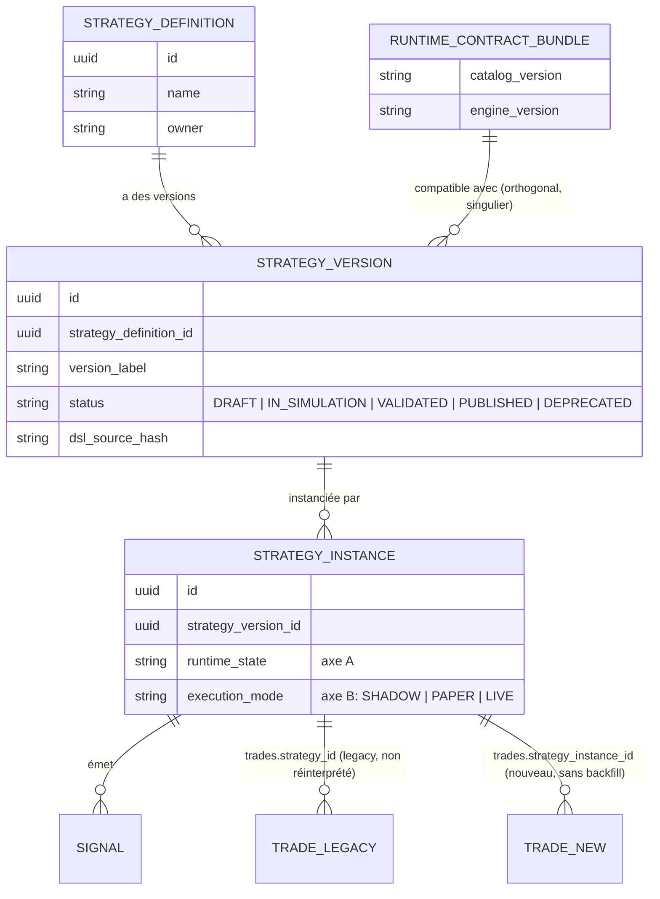

# Diagram 01 — Strategy Identity Relationships

Référencé par `05-DOMAIN-MODEL-AND-STATE-MACHINES.md` §2 et ADR-0001, ADR-0002.

**Point structurant** (ADR-0001) : `RUNTIME_CONTRACT_BUNDLE` (= `ACTIVE_STRATEGY_RUNTIME_VERSIONS`) reste **singulier par déploiement** — la relation avec `STRATEGY_VERSION` est une lecture de compatibilité, jamais une clé de sélection de stratégie active.
