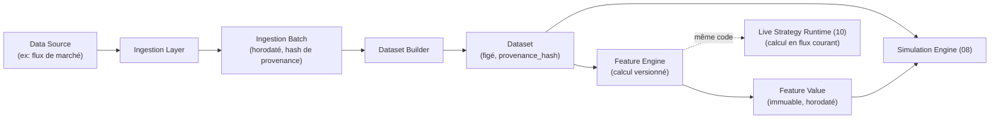

# Diagram 02 — Data Acquisition and Provenance Flow

Référencé par `06-DATA-ACQUISITION-FEATURES-AND-PROVENANCE.md`.

**Point structurant** (`06` §2.4) : le Feature Engine est invoqué à l'identique en mode simulation (sur un `Dataset` figé) et en mode live (sur un flux courant) — c'est ce qui garantit qu'une feature calculée en backtest a la même définition qu'en production.
