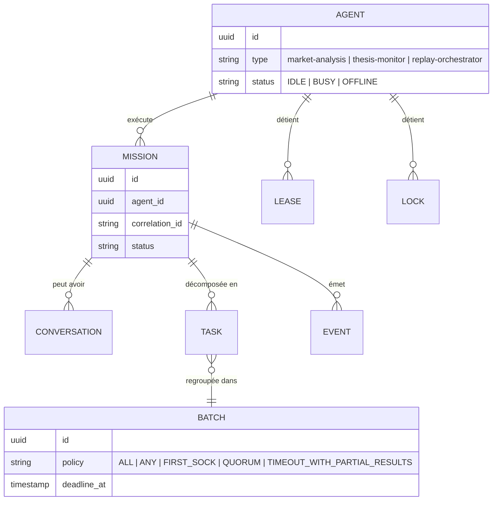

# Diagram 03 — Multi-Agent Runtime Entity Relationships

Référencé par `09-RESEARCH-LAB-AND-MULTI-AGENT-RUNTIME.md`, `05-DOMAIN-MODEL-AND-STATE-MACHINES.md` §4.

**Point structurant** (ADR-0013, ADR-0014) : chacun des 3 pipelines LLM existants devient un `type` d'`AGENT` — la structure ci-dessus est partagée par les 3, seule la politique de `BATCH` diffère selon leur fréquence.
