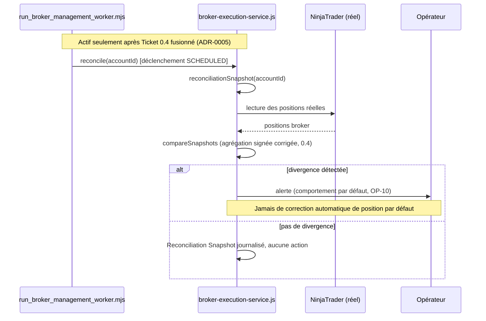

# Diagram 04 — Reconciliation Sequence (Gouvernée, Post Ticket 0.4)

Référencé par `13-EXECUTION-GATEWAY-PROVIDERS-AND-RECONCILIATION.md` §5, ADR-0005.

**Point structurant** (errata point 1, ADR-0005) : ce déclenchement `SCHEDULED` ne peut être activé qu'après que le Ticket 0.4 (correction de l'agrégation) soit terminé et fusionné — sinon la réconciliation convertirait un bug latent en verrouillages automatiques périodiques.
