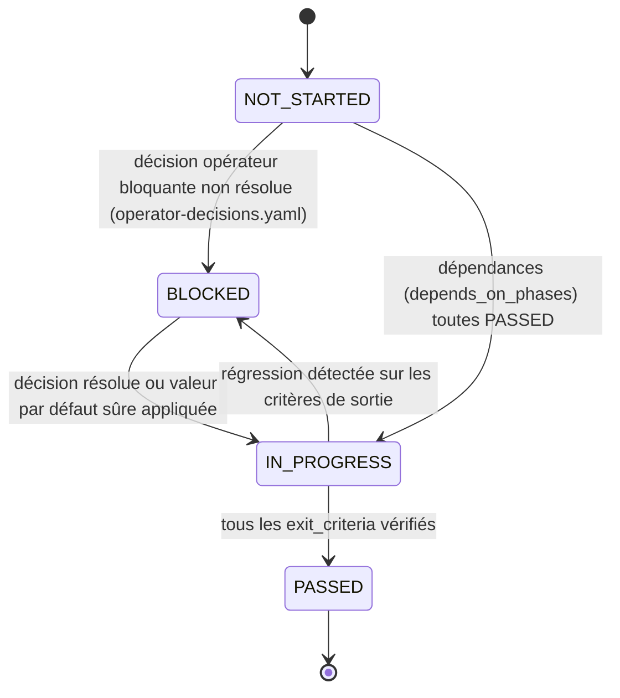

# Diagram 05 — Phase Gate Record Lifecycle

Référencé par `phase-gates.yaml`, `05-DOMAIN-MODEL-AND-STATE-MACHINES.md` §8 (entité #32), `16-END-TO-END-MIGRATION-ROADMAP.md`.

**Point structurant** : une phase ne peut passer à `IN_PROGRESS` que si toutes ses `depends_on_phases` sont `PASSED` — c'est la traduction machine-readable du graphe de dépendances de `16` §2. La Phase 7 (Portfolio Arbitration) est le seul point du graphe explicitement documenté comme goulot d'étranglement probable (`16` §4).
