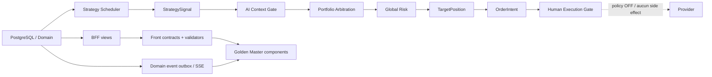

# Certification de clôture P0 — Command Center + Live Trading

> **Document maître unique et copiable.** Cette première partie contient la clôture après correction. L’audit initial intégral, ses matrices JSON, ses causes racines et ses preuves réseau sont conservés sans suppression dans la seconde partie du même fichier.

## Résultat de clôture locale

```text
TWO_SCREEN_CONNECTION_CLOSURE

audit_baseline_commit: 4be0cbc260f6ced5ff76235d347b35b594e305ae
backend_bff_runtime_commit: 59927cfa1c3e83eef16278eabdc22d975f9cc153
front_golden_commit: b538ae47bb90ad039611cb6702f6608f422ae752
evidence_commit: PENDING_THIS_DOCUMENT
local_certification_timestamp: 2026-08-16T12:19:19+02:00

COMMAND_CENTER:
view_http: 200
bff_requests_after_sse_batching: 4
console_errors: 0
generic_unavailable: 0
deep_links_rendered: 37
horizontal_overflow: false

LIVE_TRADING:
view_http: 200
bff_requests: 3
console_errors: 0
generic_unavailable: 0
deep_links_rendered: 20
post_risk_editable_fields: 0
enabled_human_gate_actions_without_operator_capability: 0

SSE:
nominal_domain_events_observed: 9
cursor_resume: implemented_and_tested
aggregate_sequence_tracking: implemented_and_tested
deduplication: implemented_and_tested
initial_replay_invalidation_batching: implemented_and_tested
expired_cursor_result: desk.resync_required

SAFETY:
AUTO_EXECUTION: false
PHYSICAL_LIVE: false
HUMAN_GATE: required
broker_provider_commands_before_after: 0 -> 0
broker_provider_events_before_after: 0 -> 0
operator_pin_used: false
provider_or_broker_side_effect: none

LOCAL_CERTIFICATION: PASSED
VPS_DEPLOYMENT: PENDING_RELEASE_SECTION
```

## Décision de clôture par gap initial

| Gap initial | Correction livrée | Preuve actuelle | Résultat |
|---|---|---|---|
| Golden Masters absents du VPS | Build VNext commun préparé pour la release intégrée | build production + QA Golden | CLOSED_LOCAL |
| Runtime Strategy non productif | Scheduler canonique persistant, évaluations idempotentes et événements de domaine | migration 057 + tests scheduler + certification SHADOW | CLOSED_LOCAL |
| Signal → Context → Portfolio → Risk → Target → Intent → Human Gate non prouvé | Service de certification canonique complet, sans provider side effect | scénario SHADOW et tests BFF/domain | CLOSED_LOCAL |
| BFF incomplet / mauvaise source / legacy mélangé | Projections canoniques, filtrage certification/legacy, source/asOf et sémantiques d’absence | 1 145 tests backend, 30 tests BFF ciblés | CLOSED_LOCAL |
| Champs BFF présents mais abandonnés par le Front (19 groupes) | Contrats, validateurs, modèles et mappers Golden enrichis | 171 tests Front + certification DOM | CLOSED_LOCAL |
| `UNAVAILABLE` générique et faux zéros | États `CONNECTED_EMPTY`, `DISABLED_BY_POLICY`, `NOT_APPLICABLE_CURRENT_MODE`, `LAST_KNOWN` | compteur DOM générique = 0 sur les deux écrans | CLOSED_LOCAL |
| Lifecycle provider statique | Projection depuis commandes/événements canoniques, état policy-disabled explicite | provider commands/events = 0, aucun faux ACK/FILL | CLOSED_LOCAL |
| SSE générique sans resync prouvé | Outbox domaine, curseur persistant, séquence par agrégat, déduplication et resync | `desk.resync_required` observé | CLOSED_LOCAL |
| Tempête de refetch lors du replay SSE initial | Invalidation React Query regroupée par vue sur fenêtre courte | Command Center 29 → 4 requêtes BFF | CLOSED_LOCAL |
| Deep links heuristiques / timestamp | Routes et IDs canoniques exposés par les projections | 37 + 20 liens rendus, aucun endpoint direct interdit | CLOSED_LOCAL |
| Marché fermé présenté comme live/stale générique | `MARKET_CLOSED` + `LAST_KNOWN`, fraîcheur et provenance durables | readiness locale et UI Golden | CLOSED_LOCAL |
| Reconciliation / performance non typées | Projections canoniques, distinction research/theoretical/broker et absence explicite | tests BFF + Live Golden | CLOSED_LOCAL |

## Pipeline canonique certifié



## Matrice de preuve de clôture

| Écran | Section | Source domaine/DB | Service/BFF | Contrat/mapper Front | Composant rendu | Realtime | État final |
|---|---|---|---|---|---|---|---|
| Command Center | Header/policy | execution safety + health | `command-center.mode` | `CommandCenterView` / mapper | `CommandCenterHeader` | snapshot/provider events | CONNECTED_AND_POPULATED |
| Command Center | KPI | strategy/runtime/incidents/execution | `command-center.summary` | summary model | KPI row | domain invalidation | CONNECTED_AND_POPULATED |
| Command Center | Desk Control | operational health | `systems` | systems mapper | control panel | health snapshot | CONNECTED_DEGRADED truthfully |
| Command Center | Market freshness | canonical feed readiness | `market` | market mapper | freshness table | market snapshot | MARKET_CLOSED / LAST_KNOWN |
| Command Center | Research | hypotheses/experiments/runs/artifacts | `research` | research mapper | pipeline panel | research events | CONNECTED_AND_POPULATED |
| Command Center | Signals/Risk | StrategySignal + Risk | `signals` / `risk` | canonical models | signals panel | signal/risk events | CONNECTED_EMPTY when no nominal signal |
| Command Center | Intent/Human Gate | portfolio intent + gates | `humanGate` | immutable rows | gate panel | intent/gate events | CONNECTED_EMPTY |
| Command Center | Provider | provider command/event stores | `provider` | provider status registry | lifecycle panel | provider events | DISABLED_BY_POLICY |
| Command Center | Operations | agent tasks + DLQ + readiness | `operations` | operations view model | incident/ops footer | incident/runtime events | CONNECTED_AND_POPULATED |
| Live Trading | Policy | execution safety | `live-trading.canonicalRuntime` | Live model | Live header | safety/domain events | SEMI_MANUAL / AUTO OFF / LIVE OFF |
| Live Trading | Market/chart | canonical OHLCV series | `marketContext` / `marketSeries` | chart mapper | market context/chart | market events | CONNECTED_AND_POPULATED or MARKET_CLOSED |
| Live Trading | Strategy | Strategy Instance/version/artifact | `activeStrategies` | strategy mapper | active strategies | lifecycle/evaluation events | CONNECTED_AND_POPULATED |
| Live Trading | Signal | StrategySignal | `latestSignal` | signal mapper | signal dossier | signal events | CONNECTED_EMPTY when absent |
| Live Trading | Context/Portfolio/Risk | canonical decisions | `authority` | authority mapper | authority panel | context/portfolio/risk events | CONNECTED_EMPTY when absent |
| Live Trading | Target/Intent | TargetPosition + OrderIntent | `orderIntent` | immutable mapper | intent dossier | target/intent events | CONNECTED_EMPTY when absent |
| Live Trading | Human Gate | canonical gate + allowedActions | `humanGate` | backend-driven actions | gate panel | gate events | actions disabled without capability |
| Live Trading | Provider | command/event lifecycle | `providerLifecycle` | unknown-safe status registry | lifecycle timeline | provider events | NOT_APPLICABLE_CURRENT_MODE |
| Live Trading | Reconciliation | expected vs broker snapshot | `reconciliation` | reconciliation mapper | comparison panel | reconciliation events | CONNECTED_EMPTY / policy-disabled |
| Live Trading | Timeline | domain event outbox | `timeline` | event mapper | event timeline | SSE | CONNECTED_AND_POPULATED |
| Live Trading | Performance | typed R ledger | `performance` | performance mapper | R panel | result events | CONNECTED_EMPTY when non publiée |

## Tests et preuves locales

| Contrôle | Résultat |
|---|---|
| Backend/BFF | 1 146 tests, 1 145 pass, 1 skip POSIX attendu, 0 fail |
| Domain | 467/467 |
| Front VNext | 171/171 |
| BFF/PostgreSQL E2E réel | 4/4 |
| Contrats analytiques | générés à jour + 7/7 |
| Desk time | 6/6 |
| Axe | 76 audits, 0 serious/critical |
| Command Center visual | 5/5 résolutions |
| Live Trading visual | 5/5 résolutions |
| BFF performance | 37/37 vues, P75 < 1 000 ms |
| Architecture/guards | tous verts ; complexité ramenée au budget 650 sans rebaseline |
| Runtime safety | clocks 130/130, idempotency 7, leases 3, optimistic locks 5 |
| UI/UX Rulebook | 1 000 règles valides ; sélecteur et scanner self-tests verts |
| Build production | succès |
| Browser connection certification | PASS, console 0, endpoint direct interdit 0 |

## Artefacts visuels et réseau après correction

- Command Center : `/mnt/c/Users/CES/Desktop/TV_Automation_PREPROD/output/playwright/two-screen-closure/command-center-full.png` — SHA-256 `20d71e84c3a2394f2e63e085931cd9d6fa7d3b8c0209e1e271272342d049eb5c`
- Live Trading : `/mnt/c/Users/CES/Desktop/TV_Automation_PREPROD/output/playwright/two-screen-closure/live-trading-full.png` — SHA-256 `ccf459056f16cd7a10e3fe316ed5eb7d14768766ad35b5535eee3bd19af5e4f1`
- Réseau/SSE : `/mnt/c/Users/CES/Desktop/TV_Automation_PREPROD/output/playwright/two-screen-closure/network-summary.json` — SHA-256 `4b0625505f1dcc8916f165efbb266998b79ffbcb4f01666119521b4acfca6636`

## Limite externe explicitement isolée

Le scénario mutatif opérateur n’a pas utilisé de PIN et reste classé `EXTERNAL_OPERATOR_BLOCKER`. Cette limite ne bloque ni le raccordement read-only, ni la certification SHADOW jusqu’au Human Gate. Elle empêche volontairement de confirmer/rejeter un ordre via une session opérateur réelle durant cette passe. Aucun test n’a contourné cette protection.

---

# Audit P0 initial intégral — avant correction

> Document consolidé et autonome pour la lecture et la copie. Il reprend intégralement tous les livrables textuels et JSON de l’audit. Les deux preuves visuelles sont intégrées par lien absolu et accompagnées de leur empreinte SHA-256.

## Sommaire

1. Rapport principal et synthèse
2. Fonctionnalités backend manquantes
3. Wiring Front manquant
4. Runtime non productif
5. Audit SSE
6. Plan de clôture
7. Matrice Command Center — JSON intégral
8. Matrice Live Trading — JSON intégral
9. Causes des états indisponibles — JSON intégral
10. Données BFF présentes mais abandonnées par le Front — JSON intégral
11. Preuves réseau Playwright — JSON intégral
12. Captures et empreintes

---

## Rapport principal

TWO_SCREEN_CONNECTION_AUDIT

backend_release: preprod-v2-front-freeze-20260815.1
backend_commit: ac8c418a9f87687090c5779f01fdfc2b753bb00f
front_commit: 3d3de41a373e33436879752e9d45f9aa6bc4e1c6 (last committed Front); Golden Master worktree is dirty at evidence HEAD d492b548a3eed53825bcc27de42c518214ecb246
front_build: VPS index-BUIC8CwN.js / index-CCwmBxTs.css; local Golden source is not deployed
vps_release: preprod-v2-front-freeze-20260815.1 (verified active)
audit_timestamp: 2026-08-16T00:52:00.639Z

COMMAND_CENTER:
components_total: 101
connected_populated: 8
connected_empty: 0
disabled_by_policy: 12
stale: 0
backend_missing: 0
bff_missing: 53
front_not_wired: 9
contract_mismatch: 0
runtime_not_producing: 10
unknown_cause: 0

LIVE_TRADING:
components_total: 131
connected_populated: 4
connected_empty: 4
disabled_by_policy: 10
stale: 0
backend_missing: 5
bff_missing: 34
front_not_wired: 12
contract_mismatch: 0
runtime_not_producing: 49
unknown_cause: 0

GENERIC_UNAVAILABLE_COUNT: 0 unclassified (54 rendered absence occurrences classified)
BFF_PRESENT_FRONT_DROPPED_COUNT: 19
SSE_CONNECTED_COMPONENTS: 1 (Command Center generic snapshot invalidation/refetch)
SSE_NOT_CONNECTED_COMPONENTS: 231 (business-component update not proven)
BROKEN_DEEP_LINKS: 3 proven classes (guardrail incident 404; strategy instance routed as strategy ID; timeline entity links absent)
P0_BACKEND: canonical strategy runtime not producing signals/decisions/intents; business domain events not emitted to SSE
P0_BFF: release/asOf/provider/PostgreSQL wrong-source mappings; canonical/legacy execution mixing; false numeric zero defaults; missing live series/session/risk/reconciliation fields
P0_FRONT: VPS serves legacy Front; Golden fields dropped; false semantic labels/zeros/placeholders; static provider lifecycle; wrong strategy deep-link
EXTERNAL_BLOCKERS: market is closed; physical provider deliberately disabled; anonymous session has no write capabilities. None blocks this read-only audit.

# Executive finding

The reference backend release is genuinely active, healthy and migration-complete on the VPS. The two-screen certification nevertheless **fails P0**. The served Front is an older committed build and not the local Golden Master worktree. In addition, several BFF projections are semantically incomplete even though their HTTP envelopes are AVAILABLE/PARTIAL.

The largest correctness risks are not transport failures. They are truth-shaping failures: canonical zero-row live state is mixed with legacy orders/intents/positions; missing values are coerced to zero; WARNING incidents are labelled critical; market-closed data is labelled LIVE; PostgreSQL is reported unavailable although readyz confirms PostgreSQL; and the Golden provider timeline is static rather than event-driven.

No product, database, service, contract or VPS mutation was performed. AUTO and physical LIVE stayed OFF. No Human Gate action was invoked.

# Baseline and release proof

| Item | Observed |
|---|---|
| Local branch | codex/preprod-v4-local-parity-cleanup |
| Local evidence HEAD | d492b548a3eed53825bcc27de42c518214ecb246 |
| Backend HEAD by path | ac8c418a9f87687090c5779f01fdfc2b753bb00f |
| Front HEAD by path | 3d3de41a373e33436879752e9d45f9aa6bc4e1c6 |
| Backend worktree | Clean for backend paths |
| Front worktree | Dirty Golden Master source/tests/styles; intentionally not modified by this audit |
| VPS release | preprod-v2-front-freeze-20260815.1 |
| VPS backend commit | ac8c418a9f87687090c5779f01fdfc2b753bb00f |
| VPS Front | index-BUIC8CwN.js / index-CCwmBxTs.css |
| VPS migrations | 56; latest 056_backend_domain_completeness_front_freeze |
| /healthz / /readyz / /status / capabilities | 200 / 200 / 200 / 200 |
| Local intended BFF :8790 | Refused/down; not started because audit is read-only |
| Local :8787 | Old contract; Golden validators would reject extended view |

# Runtime/database truth

Canonical live tables are empty: StrategySignal 0, AI Context 0, Portfolio Arbitration 0, Risk Decision 0, TargetPosition 0, OrderIntent lineage 0, Human Gate 0, provider commands/events 0. This is an upstream runtime-not-producing state, not a Front empty-table bug.

Research is not empty: hypotheses 5, experiments 5, simulation runs 203, candidates 197, evaluation reports 394, artifacts 1218, agent tasks 270. Command Center reports research unavailable because the command-center view does not compose the research/data-foundation sources.

Legacy execution contains broker_orders 15, trades 6 and trade_order_intents 8. These rows are currently projected into the Live/Command Center and create false canonical-looking orders, positions and Human Gate work.

# Network audit

| Screen | Requests | BFF view | Errors | Direct forbidden endpoint |
|---|---:|---|---|---|
| Command Center | 12 | command-center (2 fetches after reconnect) | 0 | none |
| Live Trading | 10 | live-trading (1 fetch) | 0 | none |

All captured requests were 200. VNext/served Front did not call Provider, Broker, PostgreSQL or Worker APIs directly. Full timings and payload sizes are in `output/playwright/two-screen-audit/network-summary.json`.

# Validator and mapper findings

1. The current Golden validators require the extended contracts and reject the old local :8787 shape. This is correct fail-closed behavior.
2. The deployed Front predates the Golden consumers and drops 19 BFF object groups listed in `BFF-PRESENT-FRONT-DROPPED.json`.
3. Golden `truthTone` treats any availability other than PARTIAL/stale—including UNAVAILABLE—as success.
4. Golden Live mapper hardcodes reconciliation unavailable and performance totalR null.
5. Golden Live portfolio UI infers ALLOCATED from the presence of an intent rather than a backend arbitration state.
6. Golden provider lifecycle statically lists lifecycle labels without observed events.
7. BFF numeric defaults transform missing quantity/price/R/drawdown into zero in legacy projections.

# Empty, disabled, stale and unavailable

- Canonical Human Gate 0: CONNECTED_EMPTY (no canonical OrderIntent), with CONFIRM/REJECT DISABLED_BY_POLICY.
- Provider command/event 0: NOT_APPLICABLE_CURRENT_MODE because physical execution is OFF.
- Market weekend: should be MARKET_CLOSED/LAST_KNOWN, not LIVE or generic unavailable.
- StrategySignal 0: BACKEND_RUNTIME_NOT_PRODUCING because the five SHADOW instances have no last/next evaluation and runtime services are stopped.
- Research nulls: BFF_VIEW_MISSING, because the database is populated.
- Reconciliation: BFF_FIELD_MISSING; a false zero mismatch count is not evidence of a match.

# Realtime certification

SSE transport opens and the client implements ID dedupe, cursor URL support and aggregate sequence checks. Certification still fails: the backend emitted only an assistant event and a generic `desk.snapshot.updated` heartbeat; no signal/risk/gate/provider/reconciliation domain event was observed. Browser reopen does not persist a cursor, `desk.resync_required` does not force a full resync, and Live did not refetch in the tested offline/online cycle. See `SSE-CONNECTION-AUDIT.md`.

# Deep-link certification

| Object | Result | Evidence |
|---|---|---|
| Order (legacy) | LEGACY_ONLY / working detail | A captured broker order ID returns order-detail 200 PARTIAL |
| Incident guardrail | WRONG_ID | ID emitted by Command Center returns incident-detail 404 |
| Strategy Instance | WRONG_ID | Golden route inserts instanceId into strategyId route; strategy-detail returns 404 |
| Signal | Route exists, no current row | No canonical signal to prove |
| Context decision | MISSING | No dedicated stable route |
| Portfolio decision | MISSING | No dedicated stable route |
| Risk decision | MISSING | No dedicated stable route |
| TargetPosition | MISSING | No dedicated stable route |
| Human Gate | MISSING | No dedicated stable route |
| ProviderCommand | MISSING | No dedicated stable route |
| Reconciliation | Aggregate route only | No per-snapshot canonical route |
| ResearchRun | Route exists; not exercised in two-screen runtime | DB populated but Command Center does not expose rows |
| AuditEvent | MISSING per event | General audit route only; timeline empty |

# Golden Master integrity

The local Golden source exists, but it is not served by the VPS. The served DOM has none of the Golden test IDs and renders the legacy Command Center/Live pages. The local Golden source uses BFF view hooks and contains no runtime mock import, but it still has semantic placeholders and hardcoded lifecycle/timeframe presentation identified in the matrices. No visual redesign was performed.

# Root-cause distribution

- CONNECTED_AND_POPULATED: 12
- CONNECTED_EMPTY: 4
- CONNECTED_DEGRADED: 6
- DISABLED_BY_POLICY: 14
- NOT_APPLICABLE_CURRENT_MODE: 8
- BACKEND_RUNTIME_NOT_PRODUCING: 59
- BFF_VIEW_MISSING: 27
- BFF_FIELD_MISSING: 41
- BFF_WRONG_SOURCE: 10
- BFF_LEGACY_FALLBACK: 9
- FRONT_COMPONENT_NOT_WIRED: 10
- FRONT_PLACEHOLDER_REMAINS: 5
- FRONT_WRONG_SEMANTIC_STATE: 6
- SSE_EVENT_NOT_EMITTED: 11
- DEEP_LINK_MISSING: 5
- NOT_IMPLEMENTED: 5

# Exit criteria

- [x] Every requested component/field is represented in one of the two matrices.
- [x] Every browser-observed generic absence has a classified cause.
- [x] BFF-present/Front-dropped groups are inventoried.
- [x] Every displayed truth class has a source or a documented gap.
- [x] Placeholders and legacy fallbacks are identified.
- [x] Gap owner and priority are assigned.
- [x] EMPTY/DISABLED/STALE/UNAVAILABLE semantics are separated.
- [x] No product/runtime/data correction was made.
- [x] No fictitious runtime data was added.

**Certification result: FAILED P0.** Corrections must be allocated before any implementation starts.

---

## Fonctionnalités backend manquantes

# Backend missing features

This list is limited to capabilities absent at the domain/runtime boundary, not BFF wiring defects.

| Priority | Capability | Evidence | Owner |
|---|---|---|---|
| P0 | Running strategy evaluation scheduler | 5 SHADOW/RUNNING instances but no last/next evaluation; StrategySignal table 0 | RUNTIME |
| P0 | Canonical live decision production | Context, arbitration, Risk, TargetPosition, OrderIntent and Human Gate tables all 0 | RUNTIME |
| P0 | Domain business events on SSE source | Only assistant event + generic heartbeat observed | BACKEND/RUNTIME |
| P0 | Canonical theoretical and broker reconciliation snapshot | No expected-vs-broker object in Live view | BACKEND |
| P1 | Paged OHLCV and deterministic VWAP service contract | Time-series contracts explicitly say not exposed | BACKEND/DATA |
| P1 | Typed R performance ledger with source class | No research/theoretical/broker series in Live | BACKEND |
| P1 | Macro/news/session calendar composition | No current canonical object in Live BFF | BACKEND/DATA |

Physical provider commands/events are **not** a missing feature in the current mode: they are disabled by policy and therefore not applicable until explicit certification.

---

## Wiring Front manquant

# Front missing wiring

| Priority | Gap | Evidence | Owner |
|---|---|---|---|
| P0 | Golden Master is not deployed | VPS serves index-BUIC8CwN.js; local Golden source is dirty and excluded from release certification | RELEASE/FRONT |
| P0 | Execution policy fields dropped | canonicalRuntime.mode is present but legacy Live page does not render it | FRONT |
| P0 | Legacy rows look canonical | Old Live renders 15 broker orders and six zero-valued legacy positions | FRONT/BFF |
| P0 | False semantic labels | WARNING incidents called critical; weekend market labelled LIVE | FRONT/BFF |
| P0 | False zeros | missing drawdown/position prices/R become 0 | FRONT/BFF |
| P0 | Static provider lifecycle | Golden local lists lifecycle states without event evidence | FRONT |
| P0 | Wrong strategy link identity | instanceId is sent to strategyId route and 404s | FRONT/BFF |
| P0 | Generic empty state | TruthEmpty always says UNAVAILABLE, including connected-empty states | FRONT |
| P1 | Command Center extended panels dropped | market/research/signals/gate/provider/performance/incidents/Jarvis/audit exist in BFF but not served UI | FRONT |
| P1 | Live extended panels dropped | canonical runtime/time-series/Telegram advisory objects exist but not served UI | FRONT |
| P1 | No per-event timeline deep links | General audit link only | FRONT/BFF |

No corrective edit was made during this audit.

---

## Runtime non productif

# Runtime not producing

Snapshot taken from the active VPS release without mutation.

| Source/table | Count | Classification |
|---|---:|---|
| strategy_signal_outbox | 0 | BACKEND_RUNTIME_NOT_PRODUCING |
| ai_context_gate_decisions | 0 | BACKEND_RUNTIME_NOT_PRODUCING |
| portfolio_arbitration_runs | 0 | BACKEND_RUNTIME_NOT_PRODUCING |
| portfolio_candidate_allocations | 0 | BACKEND_RUNTIME_NOT_PRODUCING |
| portfolio_risk_decisions | 0 | BACKEND_RUNTIME_NOT_PRODUCING |
| portfolio_target_positions | 0 | BACKEND_RUNTIME_NOT_PRODUCING |
| portfolio_order_intent_lineage | 0 | BACKEND_RUNTIME_NOT_PRODUCING |
| human_execution_gates / events | 0 / 0 | CONNECTED_EMPTY downstream; upstream runtime not producing |
| broker_provider_commands / events | 0 / 0 | DISABLED_BY_POLICY / NOT_APPLICABLE_CURRENT_MODE |

Counter-evidence that the database itself is not globally empty: research hypotheses 5, experiments 5, simulation runs 203, candidates 197, evaluation reports 394, artifacts 1218 and agent tasks 270. Services observed stopped/stale outside API/Caddy/Telegram explain why canonical live progression is absent.

---

## Audit SSE

# SSE connection audit

## Observed transport

- Endpoint: `GET /front-api/v1/events`, HTTP 200, `text/event-stream`.
- Observed messages in an 8-second read: one persisted `jarvis.message.created` event (sequence 1), then one generic `desk.snapshot.updated` heartbeat (wall-clock sequence).
- Command Center refetched after the reconnect test.
- Live Trading did not refetch within the same reconnect window.

## Client capabilities present

- Cursor query parameter supported by transport.
- In-memory event ID dedupe (bounded cache).
- Per-aggregate sequence/out-of-order/gap accounting.
- Backoff/reconnect logic.
- Query invalidation map.

## Certification gaps

| Requirement | Result | Classification |
|---|---|---|
| Business signal event updates signal card | Not observed/emitted | SSE_EVENT_NOT_EMITTED |
| Risk event updates Risk panel | Not observed/emitted | SSE_EVENT_NOT_EMITTED |
| Human Gate event updates actions | Not observed/emitted | SSE_EVENT_NOT_EMITTED |
| Provider ACK/fill updates lifecycle | Not observed/emitted | SSE_EVENT_NOT_EMITTED |
| Reconciliation event updates mismatch | Not observed/emitted | SSE_EVENT_NOT_EMITTED |
| Live invalidation on generic snapshot | Missing in observed reconnect cycle | SSE_EVENT_NOT_CONSUMED |
| Cursor resume after browser reopen | Cursor not persisted/passed by RealtimeProvider | SSE_RESYNC_NOT_PROVEN |
| Explicit desk.resync_required | Falls through generic handling; no mandatory snapshot resync | SSE_RESYNC_NOT_PROVEN |
| Domain ordering | Heartbeat sequence is wall-clock, not domain revision | SSE_RESYNC_NOT_PROVEN |

SSE is transport-connected but **not business-component certified**. The current SSE contract is marked NOT_FROZEN in the handoff artifacts.

---

## Plan de clôture

# Connection closure plan

This is an allocation plan only. No correction was started.

## P0 — Backend/Runtime

1. Start and certify the strategy evaluation scheduler; produce a traceable StrategySignal.
2. Prove one complete canonical chain through Context, Portfolio, Risk, TargetPosition, OrderIntent and Human Gate while physical execution remains OFF.
3. Emit canonical domain events with eventId, aggregateId/type, sequence, correlationId, causationId, revision and timestamps.
4. Publish theoretical/broker reconciliation as separate authoritative objects.

## P0 — BFF

1. Correct release_version, market latest_timestamp_utc, PostgreSQL readiness and broker_provider_code mappings.
2. Remove trade_order_intents/trades/broker_orders from canonical Live/Human Gate projections or label them explicitly LEGACY.
3. Replace numeric missing-to-zero coercions with nullable value + availability/reason.
4. Add market-closed/session semantics and explicit freshness threshold.
5. Add canonical reconciliation, risk reasons, gate denial reasons and stable entity relations.

## P0 — Front/Release

1. Build/test/deploy the actual Golden Master worktree after its own freeze; do not deploy from a dirty unidentified state.
2. Render execution policy fields from BFF.
3. Remove semantic inference (critical, allocated, healthy, zero) and static lifecycle steps.
4. Render CONNECTED_EMPTY, DISABLED_BY_POLICY, MARKET_CLOSED and STALE distinctly.
5. Repair ID-based deep links and add missing canonical detail routes.

## P1

1. Compose research/performance into Command Center.
2. Expose paged OHLCV/VWAP and typed R-equity series.
3. Add macro/news/session context.
4. Freeze and certify SSE resync semantics.

## Re-certification gates

- Same released backend and Front build are recorded in status/manifest.
- Generic unclassified UNAVAILABLE remains zero.
- No legacy row appears as canonical.
- No missing value renders as zero.
- One injected non-trading domain event updates exactly one intended component and survives reconnect/resync.
- Deep-link probe passes for every current canonical object.
- AUTO and physical LIVE remain OFF throughout certification.

---

## Matrice Command Center

Source originale : `/mnt/c/Users/CES/Desktop/TV_Automation_PREPROD/reports/two-screen-audit/COMMAND-CENTER-CONNECTION-MATRIX.json`

```json
{
  "generatedAt": "2026-08-16T00:52:00.639Z",
  "screen": "Command Center",
  "columns": [
    "SCREEN",
    "SECTION",
    "COMPONENT",
    "FIELD",
    "EXPECTED_SEMANTIC",
    "DOMAIN_OBJECT",
    "DB_TABLE_OR_SOURCE",
    "BACKEND_SERVICE",
    "BFF_VIEW",
    "BFF_JSON_PATH",
    "BFF_RUNTIME_VALUE",
    "BFF_AVAILABILITY",
    "FRONT_TYPE",
    "FRONT_VALIDATOR",
    "FRONT_MAPPER",
    "FRONT_COMPONENT",
    "RENDERED_VALUE",
    "SSE_EVENT_TYPE",
    "DEEP_LINK",
    "ROOT_CAUSE",
    "OWNER",
    "PRIORITY",
    "RECOMMENDED_FIX"
  ],
  "rows": [
    {
      "SCREEN": "Command Center",
      "SECTION": "Header",
      "COMPONENT": "CommandCenterHeader",
      "FIELD": "environment",
      "EXPECTED_SEMANTIC": "Deployment environment, distinct from execution mode",
      "DOMAIN_OBJECT": "RuntimePolicy / ReleaseManifest / AuthSession",
      "DB_TABLE_OR_SOURCE": "healthz + auth-session",
      "BACKEND_SERVICE": "front-control-plane-api / front-command-center-projection",
      "BFF_VIEW": "command-center",
      "BFF_JSON_PATH": "data.mode.environment",
      "BFF_RUNTIME_VALUE": "UNKNOWN",
      "BFF_AVAILABILITY": "AVAILABLE (envelope; semantic completeness not guaranteed)",
      "FRONT_TYPE": "CommandCenterView",
      "FRONT_VALIDATOR": "isCommandCenterView()",
      "FRONT_MAPPER": "toCommandCenterModel()",
      "FRONT_COMPONENT": "NOT_APPLICABLE",
      "RENDERED_VALUE": "Not addressably rendered by VPS Front build index-BUIC8CwN.js",
      "SSE_EVENT_TYPE": "desk.snapshot.updated (generic heartbeat only)",
      "DEEP_LINK": "MISSING",
      "ROOT_CAUSE": "BFF_FIELD_MISSING",
      "OWNER": "BFF",
      "PRIORITY": "P0",
      "RECOMMENDED_FIX": "Project the authoritative environment from release/runtime policy."
    },
    {
      "SCREEN": "Command Center",
      "SECTION": "Header",
      "COMPONENT": "CommandCenterHeader",
      "FIELD": "executionMode",
      "EXPECTED_SEMANTIC": "Authoritative execution mode",
      "DOMAIN_OBJECT": "RuntimePolicy / ReleaseManifest / AuthSession",
      "DB_TABLE_OR_SOURCE": "healthz + auth-session",
      "BACKEND_SERVICE": "front-control-plane-api / front-command-center-projection",
      "BFF_VIEW": "command-center",
      "BFF_JSON_PATH": "data.mode.executionMode",
      "BFF_RUNTIME_VALUE": "SEMI_MANUAL",
      "BFF_AVAILABILITY": "AVAILABLE (envelope; semantic completeness not guaranteed)",
      "FRONT_TYPE": "CommandCenterView",
      "FRONT_VALIDATOR": "isCommandCenterView()",
      "FRONT_MAPPER": "toCommandCenterModel()",
      "FRONT_COMPONENT": "NOT_APPLICABLE",
      "RENDERED_VALUE": "Not addressably rendered by VPS Front build index-BUIC8CwN.js",
      "SSE_EVENT_TYPE": "desk.snapshot.updated (generic heartbeat only)",
      "DEEP_LINK": "MISSING",
      "ROOT_CAUSE": "FRONT_COMPONENT_NOT_WIRED",
      "OWNER": "RELEASE/FRONT",
      "PRIORITY": "P0",
      "RECOMMENDED_FIX": "Deploy the Golden Master build that renders backend-driven executionMode."
    },
    {
      "SCREEN": "Command Center",
      "SECTION": "Header",
      "COMPONENT": "CommandCenterHeader",
      "FIELD": "autoExecutionEnabled",
      "EXPECTED_SEMANTIC": "Authoritative automatic execution policy",
      "DOMAIN_OBJECT": "RuntimePolicy / ReleaseManifest / AuthSession",
      "DB_TABLE_OR_SOURCE": "healthz + auth-session",
      "BACKEND_SERVICE": "front-control-plane-api / front-command-center-projection",
      "BFF_VIEW": "command-center",
      "BFF_JSON_PATH": "data.mode.autoExecution",
      "BFF_RUNTIME_VALUE": "UNKNOWN",
      "BFF_AVAILABILITY": "AVAILABLE (envelope; semantic completeness not guaranteed)",
      "FRONT_TYPE": "CommandCenterView",
      "FRONT_VALIDATOR": "isCommandCenterView()",
      "FRONT_MAPPER": "toCommandCenterModel()",
      "FRONT_COMPONENT": "NOT_APPLICABLE",
      "RENDERED_VALUE": "Not addressably rendered by VPS Front build index-BUIC8CwN.js",
      "SSE_EVENT_TYPE": "desk.snapshot.updated (generic heartbeat only)",
      "DEEP_LINK": "MISSING",
      "ROOT_CAUSE": "BFF_FIELD_MISSING",
      "OWNER": "BFF",
      "PRIORITY": "P0",
      "RECOMMENDED_FIX": "Use canonical runtime policy boolean; never infer in Front."
    },
    {
      "SCREEN": "Command Center",
      "SECTION": "Header",
      "COMPONENT": "CommandCenterHeader",
      "FIELD": "liveBrokerEnabled",
      "EXPECTED_SEMANTIC": "Physical live broker policy",
      "DOMAIN_OBJECT": "RuntimePolicy / ReleaseManifest / AuthSession",
      "DB_TABLE_OR_SOURCE": "healthz + auth-session",
      "BACKEND_SERVICE": "front-control-plane-api / front-command-center-projection",
      "BFF_VIEW": "command-center",
      "BFF_JSON_PATH": "data.mode.liveBroker",
      "BFF_RUNTIME_VALUE": "OFF",
      "BFF_AVAILABILITY": "AVAILABLE (envelope; semantic completeness not guaranteed)",
      "FRONT_TYPE": "CommandCenterView",
      "FRONT_VALIDATOR": "isCommandCenterView()",
      "FRONT_MAPPER": "toCommandCenterModel()",
      "FRONT_COMPONENT": "NOT_APPLICABLE",
      "RENDERED_VALUE": "Not addressably rendered by VPS Front build index-BUIC8CwN.js",
      "SSE_EVENT_TYPE": "desk.snapshot.updated (generic heartbeat only)",
      "DEEP_LINK": "MISSING",
      "ROOT_CAUSE": "FRONT_COMPONENT_NOT_WIRED",
      "OWNER": "RELEASE/FRONT",
      "PRIORITY": "P0",
      "RECOMMENDED_FIX": "Render OFF from BFF in the deployed header."
    },
    {
      "SCREEN": "Command Center",
      "SECTION": "Header",
      "COMPONENT": "CommandCenterHeader",
      "FIELD": "release",
      "EXPECTED_SEMANTIC": "Actually served backend release",
      "DOMAIN_OBJECT": "RuntimePolicy / ReleaseManifest / AuthSession",
      "DB_TABLE_OR_SOURCE": "healthz + auth-session",
      "BACKEND_SERVICE": "front-control-plane-api / front-command-center-projection",
      "BFF_VIEW": "command-center",
      "BFF_JSON_PATH": "data.mode.release",
      "BFF_RUNTIME_VALUE": "UNAVAILABLE",
      "BFF_AVAILABILITY": "AVAILABLE (envelope; semantic completeness not guaranteed)",
      "FRONT_TYPE": "CommandCenterView",
      "FRONT_VALIDATOR": "isCommandCenterView()",
      "FRONT_MAPPER": "toCommandCenterModel()",
      "FRONT_COMPONENT": "NOT_APPLICABLE",
      "RENDERED_VALUE": "Not addressably rendered by VPS Front build index-BUIC8CwN.js",
      "SSE_EVENT_TYPE": "desk.snapshot.updated (generic heartbeat only)",
      "DEEP_LINK": "MISSING",
      "ROOT_CAUSE": "BFF_WRONG_SOURCE",
      "OWNER": "BFF",
      "PRIORITY": "P0",
      "RECOMMENDED_FIX": "Map health.release_version, not health.release/health.version."
    },
    {
      "SCREEN": "Command Center",
      "SECTION": "Header",
      "COMPONENT": "CommandCenterHeader",
      "FIELD": "marketFreshness",
      "EXPECTED_SEMANTIC": "Market freshness with market-closed semantics",
      "DOMAIN_OBJECT": "RuntimePolicy / ReleaseManifest / AuthSession",
      "DB_TABLE_OR_SOURCE": "healthz + auth-session",
      "BACKEND_SERVICE": "front-control-plane-api / front-command-center-projection",
      "BFF_VIEW": "command-center",
      "BFF_JSON_PATH": "data.mode.marketData",
      "BFF_RUNTIME_VALUE": "FRESH",
      "BFF_AVAILABILITY": "AVAILABLE (envelope; semantic completeness not guaranteed)",
      "FRONT_TYPE": "CommandCenterView",
      "FRONT_VALIDATOR": "isCommandCenterView()",
      "FRONT_MAPPER": "toCommandCenterModel()",
      "FRONT_COMPONENT": "NOT_APPLICABLE",
      "RENDERED_VALUE": "Not addressably rendered by VPS Front build index-BUIC8CwN.js",
      "SSE_EVENT_TYPE": "desk.snapshot.updated (generic heartbeat only)",
      "DEEP_LINK": "MISSING",
      "ROOT_CAUSE": "CONNECTED_AND_POPULATED",
      "OWNER": "NONE",
      "PRIORITY": "P1",
      "RECOMMENDED_FIX": "No data fix; expose source/asOf beside the status."
    },
    {
      "SCREEN": "Command Center",
      "SECTION": "Header",
      "COMPONENT": "CommandCenterHeader",
      "FIELD": "operatorSession",
      "EXPECTED_SEMANTIC": "Authenticated principal and role",
      "DOMAIN_OBJECT": "RuntimePolicy / ReleaseManifest / AuthSession",
      "DB_TABLE_OR_SOURCE": "healthz + auth-session",
      "BACKEND_SERVICE": "front-control-plane-api / front-command-center-projection",
      "BFF_VIEW": "command-center",
      "BFF_JSON_PATH": "auth-session.data.principal",
      "BFF_RUNTIME_VALUE": "Anonymous read-only session",
      "BFF_AVAILABILITY": "AVAILABLE (envelope; semantic completeness not guaranteed)",
      "FRONT_TYPE": "CommandCenterView",
      "FRONT_VALIDATOR": "isCommandCenterView()",
      "FRONT_MAPPER": "toCommandCenterModel()",
      "FRONT_COMPONENT": "NOT_APPLICABLE",
      "RENDERED_VALUE": "Not addressably rendered by VPS Front build index-BUIC8CwN.js",
      "SSE_EVENT_TYPE": "desk.snapshot.updated (generic heartbeat only)",
      "DEEP_LINK": "MISSING",
      "ROOT_CAUSE": "CONNECTED_AND_POPULATED",
      "OWNER": "NONE",
      "PRIORITY": "P1",
      "RECOMMENDED_FIX": "Keep auth-session as authority."
    },
    {
      "SCREEN": "Command Center",
      "SECTION": "KPI",
      "COMPONENT": "CommandCenterKpiStrip",
      "FIELD": "globalDeskHealth",
      "EXPECTED_SEMANTIC": "Global health, not HTTP health only",
      "DOMAIN_OBJECT": "DeskSummary",
      "DB_TABLE_OR_SOURCE": "composed command-center sources",
      "BACKEND_SERVICE": "front-control-plane-api / front-command-center-projection",
      "BFF_VIEW": "command-center",
      "BFF_JSON_PATH": "data.summary.deskStatus",
      "BFF_RUNTIME_VALUE": "DEGRADED",
      "BFF_AVAILABILITY": "AVAILABLE (envelope; semantic completeness not guaranteed)",
      "FRONT_TYPE": "CommandCenterView",
      "FRONT_VALIDATOR": "isCommandCenterView()",
      "FRONT_MAPPER": "toCommandCenterModel()",
      "FRONT_COMPONENT": "NOT_APPLICABLE",
      "RENDERED_VALUE": "DEGRADED",
      "SSE_EVENT_TYPE": "desk.snapshot.updated (generic heartbeat only)",
      "DEEP_LINK": "MISSING",
      "ROOT_CAUSE": "CONNECTED_DEGRADED",
      "OWNER": "RUNTIME",
      "PRIORITY": "P0",
      "RECOMMENDED_FIX": "Retain degraded until source-level false negatives are corrected."
    },
    {
      "SCREEN": "Command Center",
      "SECTION": "KPI",
      "COMPONENT": "CommandCenterKpiStrip",
      "FIELD": "researchWorkers",
      "EXPECTED_SEMANTIC": "Active/expected research workers",
      "DOMAIN_OBJECT": "DeskSummary",
      "DB_TABLE_OR_SOURCE": "composed command-center sources",
      "BACKEND_SERVICE": "front-control-plane-api / front-command-center-projection",
      "BFF_VIEW": "command-center",
      "BFF_JSON_PATH": "data.summary.activeResearchAgents + expectedResearchAgents",
      "BFF_RUNTIME_VALUE": "0 / null despite 270 agent_tasks",
      "BFF_AVAILABILITY": "AVAILABLE (envelope; semantic completeness not guaranteed)",
      "FRONT_TYPE": "CommandCenterView",
      "FRONT_VALIDATOR": "isCommandCenterView()",
      "FRONT_MAPPER": "toCommandCenterModel()",
      "FRONT_COMPONENT": "NOT_APPLICABLE",
      "RENDERED_VALUE": "TÂCHES AGENT 0",
      "SSE_EVENT_TYPE": "desk.snapshot.updated (generic heartbeat only)",
      "DEEP_LINK": "MISSING",
      "ROOT_CAUSE": "BFF_VIEW_MISSING",
      "OWNER": "BFF",
      "PRIORITY": "P1",
      "RECOMMENDED_FIX": "Add research/worker runtime to command-center source dependencies."
    },
    {
      "SCREEN": "Command Center",
      "SECTION": "KPI",
      "COMPONENT": "CommandCenterKpiStrip",
      "FIELD": "strategyInstances",
      "EXPECTED_SEMANTIC": "Active strategy instances",
      "DOMAIN_OBJECT": "DeskSummary",
      "DB_TABLE_OR_SOURCE": "composed command-center sources",
      "BACKEND_SERVICE": "front-control-plane-api / front-command-center-projection",
      "BFF_VIEW": "command-center",
      "BFF_JSON_PATH": "data.summary.activeStrategies",
      "BFF_RUNTIME_VALUE": 5,
      "BFF_AVAILABILITY": "AVAILABLE (envelope; semantic completeness not guaranteed)",
      "FRONT_TYPE": "CommandCenterView",
      "FRONT_VALIDATOR": "isCommandCenterView()",
      "FRONT_MAPPER": "toCommandCenterModel()",
      "FRONT_COMPONENT": "NOT_APPLICABLE",
      "RENDERED_VALUE": 5,
      "SSE_EVENT_TYPE": "desk.snapshot.updated (generic heartbeat only)",
      "DEEP_LINK": "MISSING",
      "ROOT_CAUSE": "CONNECTED_AND_POPULATED",
      "OWNER": "NONE",
      "PRIORITY": "P1",
      "RECOMMENDED_FIX": "None."
    },
    {
      "SCREEN": "Command Center",
      "SECTION": "KPI",
      "COMPONENT": "CommandCenterKpiStrip",
      "FIELD": "humanGateQueue",
      "EXPECTED_SEMANTIC": "Canonical human_execution_gates awaiting action",
      "DOMAIN_OBJECT": "DeskSummary",
      "DB_TABLE_OR_SOURCE": "composed command-center sources",
      "BACKEND_SERVICE": "front-control-plane-api / front-command-center-projection",
      "BFF_VIEW": "command-center",
      "BFF_JSON_PATH": "data.summary.pendingCommands",
      "BFF_RUNTIME_VALUE": "6 legacy trade_order_intents",
      "BFF_AVAILABILITY": "AVAILABLE (envelope; semantic completeness not guaranteed)",
      "FRONT_TYPE": "CommandCenterView",
      "FRONT_VALIDATOR": "isCommandCenterView()",
      "FRONT_MAPPER": "toCommandCenterModel()",
      "FRONT_COMPONENT": "NOT_APPLICABLE",
      "RENDERED_VALUE": "COMMANDES EN ATTENTE 6",
      "SSE_EVENT_TYPE": "desk.snapshot.updated (generic heartbeat only)",
      "DEEP_LINK": "MISSING",
      "ROOT_CAUSE": "BFF_LEGACY_FALLBACK",
      "OWNER": "BFF",
      "PRIORITY": "P0",
      "RECOMMENDED_FIX": "Count canonical human_execution_gates only; show zero as CONNECTED_EMPTY."
    },
    {
      "SCREEN": "Command Center",
      "SECTION": "KPI",
      "COMPONENT": "CommandCenterKpiStrip",
      "FIELD": "criticalIncidents",
      "EXPECTED_SEMANTIC": "Critical incident count",
      "DOMAIN_OBJECT": "DeskSummary",
      "DB_TABLE_OR_SOURCE": "composed command-center sources",
      "BACKEND_SERVICE": "front-control-plane-api / front-command-center-projection",
      "BFF_VIEW": "command-center",
      "BFF_JSON_PATH": "data.summary.criticalIncidents",
      "BFF_RUNTIME_VALUE": "6 WARNING guardrails",
      "BFF_AVAILABILITY": "AVAILABLE (envelope; semantic completeness not guaranteed)",
      "FRONT_TYPE": "CommandCenterView",
      "FRONT_VALIDATOR": "isCommandCenterView()",
      "FRONT_MAPPER": "toCommandCenterModel()",
      "FRONT_COMPONENT": "NOT_APPLICABLE",
      "RENDERED_VALUE": "INCIDENTS CRITIQUES 6",
      "SSE_EVENT_TYPE": "desk.snapshot.updated (generic heartbeat only)",
      "DEEP_LINK": "MISSING",
      "ROOT_CAUSE": "FRONT_WRONG_SEMANTIC_STATE",
      "OWNER": "FRONT/BFF",
      "PRIORITY": "P0",
      "RECOMMENDED_FIX": "Do not label WARNING rows as critical; publish severity breakdown."
    },
    {
      "SCREEN": "Command Center",
      "SECTION": "KPI",
      "COMPONENT": "CommandCenterKpiStrip",
      "FIELD": "providerSafety",
      "EXPECTED_SEMANTIC": "Physical provider side-effect policy",
      "DOMAIN_OBJECT": "DeskSummary",
      "DB_TABLE_OR_SOURCE": "composed command-center sources",
      "BACKEND_SERVICE": "front-control-plane-api / front-command-center-projection",
      "BFF_VIEW": "command-center",
      "BFF_JSON_PATH": "data.summary.providerSafety",
      "BFF_RUNTIME_VALUE": "NO_BROKER_SIDE_EFFECT",
      "BFF_AVAILABILITY": "AVAILABLE (envelope; semantic completeness not guaranteed)",
      "FRONT_TYPE": "CommandCenterView",
      "FRONT_VALIDATOR": "isCommandCenterView()",
      "FRONT_MAPPER": "toCommandCenterModel()",
      "FRONT_COMPONENT": "NOT_APPLICABLE",
      "RENDERED_VALUE": "Not addressably rendered by VPS Front build index-BUIC8CwN.js",
      "SSE_EVENT_TYPE": "desk.snapshot.updated (generic heartbeat only)",
      "DEEP_LINK": "MISSING",
      "ROOT_CAUSE": "CONNECTED_AND_POPULATED",
      "OWNER": "NONE",
      "PRIORITY": "P0",
      "RECOMMENDED_FIX": "Keep explicit safety copy."
    },
    {
      "SCREEN": "Command Center",
      "SECTION": "Desk Control",
      "COMPONENT": "DeskControlPanel",
      "FIELD": "deskStatus",
      "EXPECTED_SEMANTIC": "Real desk actuator status",
      "DOMAIN_OBJECT": "DeskControlCapability",
      "DB_TABLE_OR_SOURCE": "capabilities + runtime actuator state",
      "BACKEND_SERVICE": "front-control-plane-api / front-command-center-projection",
      "BFF_VIEW": "command-center",
      "BFF_JSON_PATH": "data.summary.deskStatus",
      "BFF_RUNTIME_VALUE": "DEGRADED",
      "BFF_AVAILABILITY": "AVAILABLE (envelope; semantic completeness not guaranteed)",
      "FRONT_TYPE": "CommandCenterView",
      "FRONT_VALIDATOR": "isCommandCenterView()",
      "FRONT_MAPPER": "legacy CommandCenterPage command actions",
      "FRONT_COMPONENT": "NOT_APPLICABLE",
      "RENDERED_VALUE": "Status action only; no actuator state",
      "SSE_EVENT_TYPE": "desk.snapshot.updated (generic heartbeat only)",
      "DEEP_LINK": "MISSING",
      "ROOT_CAUSE": "BFF_FIELD_MISSING",
      "OWNER": "BFF",
      "PRIORITY": "P0",
      "RECOMMENDED_FIX": "Expose actual actuator/run state separately from aggregate health."
    },
    {
      "SCREEN": "Command Center",
      "SECTION": "Desk Control",
      "COMPONENT": "DeskControlPanel",
      "FIELD": "doctor",
      "EXPECTED_SEMANTIC": "Backend-authorized diagnostic command",
      "DOMAIN_OBJECT": "DeskControlCapability",
      "DB_TABLE_OR_SOURCE": "capabilities + runtime actuator state",
      "BACKEND_SERVICE": "front-control-plane-api / front-command-center-projection",
      "BFF_VIEW": "command-center",
      "BFF_JSON_PATH": "permissions + capabilities",
      "BFF_RUNTIME_VALUE": "Read-only anonymous; no write capability",
      "BFF_AVAILABILITY": "AVAILABLE (envelope; semantic completeness not guaranteed)",
      "FRONT_TYPE": "CommandCenterView",
      "FRONT_VALIDATOR": "isCommandCenterView()",
      "FRONT_MAPPER": "legacy CommandCenterPage command actions",
      "FRONT_COMPONENT": "NOT_APPLICABLE",
      "RENDERED_VALUE": "Doctor action disabled by capabilities",
      "SSE_EVENT_TYPE": "desk.snapshot.updated (generic heartbeat only)",
      "DEEP_LINK": "MISSING",
      "ROOT_CAUSE": "DISABLED_BY_POLICY",
      "OWNER": "NONE",
      "PRIORITY": "P0",
      "RECOMMENDED_FIX": "Keep capability-driven."
    },
    {
      "SCREEN": "Command Center",
      "SECTION": "Desk Control",
      "COMPONENT": "DeskControlPanel",
      "FIELD": "start",
      "EXPECTED_SEMANTIC": "Plan/execute start distinction",
      "DOMAIN_OBJECT": "DeskControlCapability",
      "DB_TABLE_OR_SOURCE": "capabilities + runtime actuator state",
      "BACKEND_SERVICE": "front-control-plane-api / front-command-center-projection",
      "BFF_VIEW": "command-center",
      "BFF_JSON_PATH": "permissions + capabilities",
      "BFF_RUNTIME_VALUE": "No write capability",
      "BFF_AVAILABILITY": "AVAILABLE (envelope; semantic completeness not guaranteed)",
      "FRONT_TYPE": "CommandCenterView",
      "FRONT_VALIDATOR": "isCommandCenterView()",
      "FRONT_MAPPER": "legacy CommandCenterPage command actions",
      "FRONT_COMPONENT": "NOT_APPLICABLE",
      "RENDERED_VALUE": "Start plan disabled",
      "SSE_EVENT_TYPE": "desk.snapshot.updated (generic heartbeat only)",
      "DEEP_LINK": "MISSING",
      "ROOT_CAUSE": "DISABLED_BY_POLICY",
      "OWNER": "NONE",
      "PRIORITY": "P0",
      "RECOMMENDED_FIX": "Keep fail-closed."
    },
    {
      "SCREEN": "Command Center",
      "SECTION": "Desk Control",
      "COMPONENT": "DeskControlPanel",
      "FIELD": "stop",
      "EXPECTED_SEMANTIC": "Plan/execute stop distinction",
      "DOMAIN_OBJECT": "DeskControlCapability",
      "DB_TABLE_OR_SOURCE": "capabilities + runtime actuator state",
      "BACKEND_SERVICE": "front-control-plane-api / front-command-center-projection",
      "BFF_VIEW": "command-center",
      "BFF_JSON_PATH": "permissions + capabilities",
      "BFF_RUNTIME_VALUE": "No write capability",
      "BFF_AVAILABILITY": "AVAILABLE (envelope; semantic completeness not guaranteed)",
      "FRONT_TYPE": "CommandCenterView",
      "FRONT_VALIDATOR": "isCommandCenterView()",
      "FRONT_MAPPER": "legacy CommandCenterPage command actions",
      "FRONT_COMPONENT": "NOT_APPLICABLE",
      "RENDERED_VALUE": "Stop plan disabled",
      "SSE_EVENT_TYPE": "desk.snapshot.updated (generic heartbeat only)",
      "DEEP_LINK": "MISSING",
      "ROOT_CAUSE": "DISABLED_BY_POLICY",
      "OWNER": "NONE",
      "PRIORITY": "P0",
      "RECOMMENDED_FIX": "Keep fail-closed."
    },
    {
      "SCREEN": "Command Center",
      "SECTION": "Desk Control",
      "COMPONENT": "DeskControlPanel",
      "FIELD": "restart",
      "EXPECTED_SEMANTIC": "Plan/execute restart distinction",
      "DOMAIN_OBJECT": "DeskControlCapability",
      "DB_TABLE_OR_SOURCE": "capabilities + runtime actuator state",
      "BACKEND_SERVICE": "front-control-plane-api / front-command-center-projection",
      "BFF_VIEW": "command-center",
      "BFF_JSON_PATH": "permissions + capabilities",
      "BFF_RUNTIME_VALUE": "No write capability",
      "BFF_AVAILABILITY": "AVAILABLE (envelope; semantic completeness not guaranteed)",
      "FRONT_TYPE": "CommandCenterView",
      "FRONT_VALIDATOR": "isCommandCenterView()",
      "FRONT_MAPPER": "legacy CommandCenterPage command actions",
      "FRONT_COMPONENT": "NOT_APPLICABLE",
      "RENDERED_VALUE": "Restart plan disabled",
      "SSE_EVENT_TYPE": "desk.snapshot.updated (generic heartbeat only)",
      "DEEP_LINK": "MISSING",
      "ROOT_CAUSE": "DISABLED_BY_POLICY",
      "OWNER": "NONE",
      "PRIORITY": "P0",
      "RECOMMENDED_FIX": "Keep fail-closed."
    },
    {
      "SCREEN": "Command Center",
      "SECTION": "Desk Control",
      "COMPONENT": "DeskControlPanel",
      "FIELD": "planOnly",
      "EXPECTED_SEMANTIC": "Explicit plan-only versus real actuator",
      "DOMAIN_OBJECT": "DeskControlCapability",
      "DB_TABLE_OR_SOURCE": "capabilities + runtime actuator state",
      "BACKEND_SERVICE": "front-control-plane-api / front-command-center-projection",
      "BFF_VIEW": "command-center",
      "BFF_JSON_PATH": "NOT_EXPOSED",
      "BFF_RUNTIME_VALUE": "No explicit field",
      "BFF_AVAILABILITY": "AVAILABLE (envelope; semantic completeness not guaranteed)",
      "FRONT_TYPE": "CommandCenterView",
      "FRONT_VALIDATOR": "isCommandCenterView()",
      "FRONT_MAPPER": "legacy CommandCenterPage command actions",
      "FRONT_COMPONENT": "NOT_APPLICABLE",
      "RENDERED_VALUE": "COLD START FAIL-CLOSED text",
      "SSE_EVENT_TYPE": "desk.snapshot.updated (generic heartbeat only)",
      "DEEP_LINK": "MISSING",
      "ROOT_CAUSE": "BFF_FIELD_MISSING",
      "OWNER": "BFF",
      "PRIORITY": "P0",
      "RECOMMENDED_FIX": "Publish actuatorMode and command impact preview."
    },
    {
      "SCREEN": "Command Center",
      "SECTION": "Desk Control",
      "COMPONENT": "DeskControlPanel",
      "FIELD": "componentHealth",
      "EXPECTED_SEMANTIC": "Per-component service health",
      "DOMAIN_OBJECT": "DeskControlCapability",
      "DB_TABLE_OR_SOURCE": "capabilities + runtime actuator state",
      "BACKEND_SERVICE": "front-control-plane-api / front-command-center-projection",
      "BFF_VIEW": "command-center",
      "BFF_JSON_PATH": "data.systems[]",
      "BFF_RUNTIME_VALUE": "10 rows",
      "BFF_AVAILABILITY": "AVAILABLE (envelope; semantic completeness not guaranteed)",
      "FRONT_TYPE": "CommandCenterView",
      "FRONT_VALIDATOR": "isCommandCenterView()",
      "FRONT_MAPPER": "legacy CommandCenterPage command actions",
      "FRONT_COMPONENT": "NOT_APPLICABLE",
      "RENDERED_VALUE": "10 system rows",
      "SSE_EVENT_TYPE": "desk.snapshot.updated (generic heartbeat only)",
      "DEEP_LINK": "MISSING",
      "ROOT_CAUSE": "CONNECTED_DEGRADED",
      "OWNER": "RUNTIME/BFF",
      "PRIORITY": "P1",
      "RECOMMENDED_FIX": "Correct wrong-source statuses before certifying."
    },
    {
      "SCREEN": "Command Center",
      "SECTION": "Desk Control",
      "COMPONENT": "DeskControlPanel",
      "FIELD": "lastCommandResult",
      "EXPECTED_SEMANTIC": "Authoritative command lifecycle/result",
      "DOMAIN_OBJECT": "DeskControlCapability",
      "DB_TABLE_OR_SOURCE": "capabilities + runtime actuator state",
      "BACKEND_SERVICE": "front-control-plane-api / front-command-center-projection",
      "BFF_VIEW": "command-center",
      "BFF_JSON_PATH": "NOT_EXPOSED",
      "BFF_RUNTIME_VALUE": "No command result",
      "BFF_AVAILABILITY": "AVAILABLE (envelope; semantic completeness not guaranteed)",
      "FRONT_TYPE": "CommandCenterView",
      "FRONT_VALIDATOR": "isCommandCenterView()",
      "FRONT_MAPPER": "legacy CommandCenterPage command actions",
      "FRONT_COMPONENT": "NOT_APPLICABLE",
      "RENDERED_VALUE": "Result En attente; blockers 0; warnings 0",
      "SSE_EVENT_TYPE": "desk.snapshot.updated (generic heartbeat only)",
      "DEEP_LINK": "MISSING",
      "ROOT_CAUSE": "FRONT_PLACEHOLDER_REMAINS",
      "OWNER": "FRONT",
      "PRIORITY": "P0",
      "RECOMMENDED_FIX": "Render no-command empty state; never default blockers/warnings to zero."
    },
    {
      "SCREEN": "Command Center",
      "SECTION": "Market & Data Freshness",
      "COMPONENT": "MarketFreshnessPanel",
      "FIELD": "MNQ",
      "EXPECTED_SEMANTIC": "MNQ M1/M5 freshness",
      "DOMAIN_OBJECT": "MarketFeedStatus",
      "DB_TABLE_OR_SOURCE": "durable TradingView alerts / data_readiness",
      "BACKEND_SERVICE": "front-control-plane-api / front-command-center-projection",
      "BFF_VIEW": "command-center",
      "BFF_JSON_PATH": "data.market.rows[2..3]",
      "BFF_RUNTIME_VALUE": "durable_alert; asOf UNAVAILABLE; age ~100k s",
      "BFF_AVAILABILITY": "AVAILABLE (envelope; semantic completeness not guaranteed)",
      "FRONT_TYPE": "CommandCenterView",
      "FRONT_VALIDATOR": "isCommandCenterView()",
      "FRONT_MAPPER": "toCommandCenterModel()",
      "FRONT_COMPONENT": "NOT_APPLICABLE",
      "RENDERED_VALUE": "Not addressably rendered by VPS Front build index-BUIC8CwN.js",
      "SSE_EVENT_TYPE": "desk.snapshot.updated (generic heartbeat only)",
      "DEEP_LINK": "MISSING",
      "ROOT_CAUSE": "CONNECTED_DEGRADED",
      "OWNER": "BFF",
      "PRIORITY": "P0",
      "RECOMMENDED_FIX": "Map latest_timestamp_utc to asOf and classify market-closed/last-known."
    },
    {
      "SCREEN": "Command Center",
      "SECTION": "Market & Data Freshness",
      "COMPONENT": "MarketFreshnessPanel",
      "FIELD": "MES",
      "EXPECTED_SEMANTIC": "MES M1/M5 freshness",
      "DOMAIN_OBJECT": "MarketFeedStatus",
      "DB_TABLE_OR_SOURCE": "durable TradingView alerts / data_readiness",
      "BACKEND_SERVICE": "front-control-plane-api / front-command-center-projection",
      "BFF_VIEW": "command-center",
      "BFF_JSON_PATH": "data.market.rows[0..1]",
      "BFF_RUNTIME_VALUE": "durable_alert; asOf UNAVAILABLE; age ~100k s",
      "BFF_AVAILABILITY": "AVAILABLE (envelope; semantic completeness not guaranteed)",
      "FRONT_TYPE": "CommandCenterView",
      "FRONT_VALIDATOR": "isCommandCenterView()",
      "FRONT_MAPPER": "toCommandCenterModel()",
      "FRONT_COMPONENT": "NOT_APPLICABLE",
      "RENDERED_VALUE": "Not addressably rendered by VPS Front build index-BUIC8CwN.js",
      "SSE_EVENT_TYPE": "desk.snapshot.updated (generic heartbeat only)",
      "DEEP_LINK": "MISSING",
      "ROOT_CAUSE": "CONNECTED_DEGRADED",
      "OWNER": "BFF",
      "PRIORITY": "P0",
      "RECOMMENDED_FIX": "Map latest_timestamp_utc to asOf and classify market-closed/last-known."
    },
    {
      "SCREEN": "Command Center",
      "SECTION": "Market & Data Freshness",
      "COMPONENT": "MarketFreshnessPanel",
      "FIELD": "VIX",
      "EXPECTED_SEMANTIC": "VIX source and freshness",
      "DOMAIN_OBJECT": "MarketFeedStatus",
      "DB_TABLE_OR_SOURCE": "durable TradingView alerts / data_readiness",
      "BACKEND_SERVICE": "front-control-plane-api / front-command-center-projection",
      "BFF_VIEW": "command-center",
      "BFF_JSON_PATH": "NOT_EXPOSED",
      "BFF_RUNTIME_VALUE": "Absent",
      "BFF_AVAILABILITY": "AVAILABLE (envelope; semantic completeness not guaranteed)",
      "FRONT_TYPE": "CommandCenterView",
      "FRONT_VALIDATOR": "isCommandCenterView()",
      "FRONT_MAPPER": "toCommandCenterModel()",
      "FRONT_COMPONENT": "NOT_APPLICABLE",
      "RENDERED_VALUE": "Not addressably rendered by VPS Front build index-BUIC8CwN.js",
      "SSE_EVENT_TYPE": "desk.snapshot.updated (generic heartbeat only)",
      "DEEP_LINK": "MISSING",
      "ROOT_CAUSE": "BFF_FIELD_MISSING",
      "OWNER": "BFF",
      "PRIORITY": "P0",
      "RECOMMENDED_FIX": "Add VIX canonical feed projection or explicit external/missing state."
    },
    {
      "SCREEN": "Command Center",
      "SECTION": "Market & Data Freshness",
      "COMPONENT": "MarketFreshnessPanel",
      "FIELD": "bigCaps",
      "EXPECTED_SEMANTIC": "Big-cap context source/freshness",
      "DOMAIN_OBJECT": "MarketFeedStatus",
      "DB_TABLE_OR_SOURCE": "durable TradingView alerts / data_readiness",
      "BACKEND_SERVICE": "front-control-plane-api / front-command-center-projection",
      "BFF_VIEW": "command-center",
      "BFF_JSON_PATH": "NOT_EXPOSED",
      "BFF_RUNTIME_VALUE": "Absent",
      "BFF_AVAILABILITY": "AVAILABLE (envelope; semantic completeness not guaranteed)",
      "FRONT_TYPE": "CommandCenterView",
      "FRONT_VALIDATOR": "isCommandCenterView()",
      "FRONT_MAPPER": "toCommandCenterModel()",
      "FRONT_COMPONENT": "NOT_APPLICABLE",
      "RENDERED_VALUE": "Not addressably rendered by VPS Front build index-BUIC8CwN.js",
      "SSE_EVENT_TYPE": "desk.snapshot.updated (generic heartbeat only)",
      "DEEP_LINK": "MISSING",
      "ROOT_CAUSE": "BFF_FIELD_MISSING",
      "OWNER": "BFF",
      "PRIORITY": "P1",
      "RECOMMENDED_FIX": "Expose configured big-cap coverage and freshness."
    },
    {
      "SCREEN": "Command Center",
      "SECTION": "Market & Data Freshness",
      "COMPONENT": "MarketFreshnessPanel",
      "FIELD": "source",
      "EXPECTED_SEMANTIC": "Durable/rescue market source",
      "DOMAIN_OBJECT": "MarketFeedStatus",
      "DB_TABLE_OR_SOURCE": "durable TradingView alerts / data_readiness",
      "BACKEND_SERVICE": "front-control-plane-api / front-command-center-projection",
      "BFF_VIEW": "command-center",
      "BFF_JSON_PATH": "data.market.rows[].source",
      "BFF_RUNTIME_VALUE": "durable_alert",
      "BFF_AVAILABILITY": "AVAILABLE (envelope; semantic completeness not guaranteed)",
      "FRONT_TYPE": "CommandCenterView",
      "FRONT_VALIDATOR": "isCommandCenterView()",
      "FRONT_MAPPER": "toCommandCenterModel()",
      "FRONT_COMPONENT": "NOT_APPLICABLE",
      "RENDERED_VALUE": "Not addressably rendered by VPS Front build index-BUIC8CwN.js",
      "SSE_EVENT_TYPE": "desk.snapshot.updated (generic heartbeat only)",
      "DEEP_LINK": "MISSING",
      "ROOT_CAUSE": "CONNECTED_AND_POPULATED",
      "OWNER": "NONE",
      "PRIORITY": "P1",
      "RECOMMENDED_FIX": "None."
    },
    {
      "SCREEN": "Command Center",
      "SECTION": "Market & Data Freshness",
      "COMPONENT": "MarketFreshnessPanel",
      "FIELD": "asOf",
      "EXPECTED_SEMANTIC": "Latest observed candle timestamp",
      "DOMAIN_OBJECT": "MarketFeedStatus",
      "DB_TABLE_OR_SOURCE": "durable TradingView alerts / data_readiness",
      "BACKEND_SERVICE": "front-control-plane-api / front-command-center-projection",
      "BFF_VIEW": "command-center",
      "BFF_JSON_PATH": "data.market.rows[].asOf",
      "BFF_RUNTIME_VALUE": "UNAVAILABLE",
      "BFF_AVAILABILITY": "AVAILABLE (envelope; semantic completeness not guaranteed)",
      "FRONT_TYPE": "CommandCenterView",
      "FRONT_VALIDATOR": "isCommandCenterView()",
      "FRONT_MAPPER": "toCommandCenterModel()",
      "FRONT_COMPONENT": "NOT_APPLICABLE",
      "RENDERED_VALUE": "Not addressably rendered by VPS Front build index-BUIC8CwN.js",
      "SSE_EVENT_TYPE": "desk.snapshot.updated (generic heartbeat only)",
      "DEEP_LINK": "MISSING",
      "ROOT_CAUSE": "BFF_WRONG_SOURCE",
      "OWNER": "BFF",
      "PRIORITY": "P0",
      "RECOMMENDED_FIX": "Use readyz.coreFeeds[].latest_timestamp_utc."
    },
    {
      "SCREEN": "Command Center",
      "SECTION": "Market & Data Freshness",
      "COMPONENT": "MarketFreshnessPanel",
      "FIELD": "age",
      "EXPECTED_SEMANTIC": "Age derived from authoritative asOf",
      "DOMAIN_OBJECT": "MarketFeedStatus",
      "DB_TABLE_OR_SOURCE": "durable TradingView alerts / data_readiness",
      "BACKEND_SERVICE": "front-control-plane-api / front-command-center-projection",
      "BFF_VIEW": "command-center",
      "BFF_JSON_PATH": "data.market.rows[].freshnessSeconds",
      "BFF_RUNTIME_VALUE": "~100043",
      "BFF_AVAILABILITY": "AVAILABLE (envelope; semantic completeness not guaranteed)",
      "FRONT_TYPE": "CommandCenterView",
      "FRONT_VALIDATOR": "isCommandCenterView()",
      "FRONT_MAPPER": "toCommandCenterModel()",
      "FRONT_COMPONENT": "NOT_APPLICABLE",
      "RENDERED_VALUE": "Not addressably rendered by VPS Front build index-BUIC8CwN.js",
      "SSE_EVENT_TYPE": "desk.snapshot.updated (generic heartbeat only)",
      "DEEP_LINK": "MISSING",
      "ROOT_CAUSE": "CONNECTED_DEGRADED",
      "OWNER": "BFF",
      "PRIORITY": "P0",
      "RECOMMENDED_FIX": "Keep value but bind it to visible asOf and session-aware threshold."
    },
    {
      "SCREEN": "Command Center",
      "SECTION": "Market & Data Freshness",
      "COMPONENT": "MarketFreshnessPanel",
      "FIELD": "threshold",
      "EXPECTED_SEMANTIC": "Session-aware freshness threshold",
      "DOMAIN_OBJECT": "MarketFeedStatus",
      "DB_TABLE_OR_SOURCE": "durable TradingView alerts / data_readiness",
      "BACKEND_SERVICE": "front-control-plane-api / front-command-center-projection",
      "BFF_VIEW": "command-center",
      "BFF_JSON_PATH": "NOT_EXPOSED",
      "BFF_RUNTIME_VALUE": "readyz applies 266400 s weekend threshold; BFF omits it",
      "BFF_AVAILABILITY": "AVAILABLE (envelope; semantic completeness not guaranteed)",
      "FRONT_TYPE": "CommandCenterView",
      "FRONT_VALIDATOR": "isCommandCenterView()",
      "FRONT_MAPPER": "toCommandCenterModel()",
      "FRONT_COMPONENT": "NOT_APPLICABLE",
      "RENDERED_VALUE": "Not addressably rendered by VPS Front build index-BUIC8CwN.js",
      "SSE_EVENT_TYPE": "desk.snapshot.updated (generic heartbeat only)",
      "DEEP_LINK": "MISSING",
      "ROOT_CAUSE": "BFF_FIELD_MISSING",
      "OWNER": "BFF",
      "PRIORITY": "P0",
      "RECOMMENDED_FIX": "Publish threshold and evaluation reason."
    },
    {
      "SCREEN": "Command Center",
      "SECTION": "Market & Data Freshness",
      "COMPONENT": "MarketFreshnessPanel",
      "FIELD": "durableRescue",
      "EXPECTED_SEMANTIC": "Durable versus rescue provenance",
      "DOMAIN_OBJECT": "MarketFeedStatus",
      "DB_TABLE_OR_SOURCE": "durable TradingView alerts / data_readiness",
      "BACKEND_SERVICE": "front-control-plane-api / front-command-center-projection",
      "BFF_VIEW": "command-center",
      "BFF_JSON_PATH": "data.market.rows[].source",
      "BFF_RUNTIME_VALUE": "durable_alert only",
      "BFF_AVAILABILITY": "AVAILABLE (envelope; semantic completeness not guaranteed)",
      "FRONT_TYPE": "CommandCenterView",
      "FRONT_VALIDATOR": "isCommandCenterView()",
      "FRONT_MAPPER": "toCommandCenterModel()",
      "FRONT_COMPONENT": "NOT_APPLICABLE",
      "RENDERED_VALUE": "Not addressably rendered by VPS Front build index-BUIC8CwN.js",
      "SSE_EVENT_TYPE": "desk.snapshot.updated (generic heartbeat only)",
      "DEEP_LINK": "MISSING",
      "ROOT_CAUSE": "CONNECTED_AND_POPULATED",
      "OWNER": "NONE",
      "PRIORITY": "P1",
      "RECOMMENDED_FIX": "Expose rescue=false explicitly if required by UX."
    },
    {
      "SCREEN": "Command Center",
      "SECTION": "Market & Data Freshness",
      "COMPONENT": "MarketFreshnessPanel",
      "FIELD": "marketSession",
      "EXPECTED_SEMANTIC": "OPEN/CLOSED plus active session",
      "DOMAIN_OBJECT": "MarketFeedStatus",
      "DB_TABLE_OR_SOURCE": "durable TradingView alerts / data_readiness",
      "BACKEND_SERVICE": "front-control-plane-api / front-command-center-projection",
      "BFF_VIEW": "command-center",
      "BFF_JSON_PATH": "NOT_EXPOSED",
      "BFF_RUNTIME_VALUE": "readyz=data_readiness.state market_closed; BFF omits",
      "BFF_AVAILABILITY": "AVAILABLE (envelope; semantic completeness not guaranteed)",
      "FRONT_TYPE": "CommandCenterView",
      "FRONT_VALIDATOR": "isCommandCenterView()",
      "FRONT_MAPPER": "toCommandCenterModel()",
      "FRONT_COMPONENT": "NOT_APPLICABLE",
      "RENDERED_VALUE": "Not addressably rendered by VPS Front build index-BUIC8CwN.js",
      "SSE_EVENT_TYPE": "desk.snapshot.updated (generic heartbeat only)",
      "DEEP_LINK": "MISSING",
      "ROOT_CAUSE": "BFF_FIELD_MISSING",
      "OWNER": "BFF",
      "PRIORITY": "P0",
      "RECOMMENDED_FIX": "Project market_closed rather than only FRESH."
    },
    {
      "SCREEN": "Command Center",
      "SECTION": "Research Pipeline",
      "COMPONENT": "ResearchPipelinePanel",
      "FIELD": "hypotheses",
      "EXPECTED_SEMANTIC": "Hypothesis count/status",
      "DOMAIN_OBJECT": "ResearchHypothesis/Experiment/Simulation/Candidate/Worker",
      "DB_TABLE_OR_SOURCE": "research_hypotheses, research_experiments, simulation_runs, research_candidates, research_evaluation_reports, simulation_run_artifacts, agent_tasks",
      "BACKEND_SERVICE": "front-control-plane-api / front-command-center-projection",
      "BFF_VIEW": "command-center",
      "BFF_JSON_PATH": "data.research.hypothesisCount",
      "BFF_RUNTIME_VALUE": "null; DB=5",
      "BFF_AVAILABILITY": "AVAILABLE (envelope; semantic completeness not guaranteed)",
      "FRONT_TYPE": "CommandCenterView",
      "FRONT_VALIDATOR": "isCommandCenterView()",
      "FRONT_MAPPER": "toCommandCenterModel()",
      "FRONT_COMPONENT": "NOT_APPLICABLE",
      "RENDERED_VALUE": "Not addressably rendered by VPS Front build index-BUIC8CwN.js",
      "SSE_EVENT_TYPE": "desk.snapshot.updated (generic heartbeat only)",
      "DEEP_LINK": "MISSING",
      "ROOT_CAUSE": "BFF_VIEW_MISSING",
      "OWNER": "BFF",
      "PRIORITY": "P1",
      "RECOMMENDED_FIX": "Add research/data-foundation dependencies and project canonical research aggregates."
    },
    {
      "SCREEN": "Command Center",
      "SECTION": "Research Pipeline",
      "COMPONENT": "ResearchPipelinePanel",
      "FIELD": "experiments",
      "EXPECTED_SEMANTIC": "Experiment count/status",
      "DOMAIN_OBJECT": "ResearchHypothesis/Experiment/Simulation/Candidate/Worker",
      "DB_TABLE_OR_SOURCE": "research_hypotheses, research_experiments, simulation_runs, research_candidates, research_evaluation_reports, simulation_run_artifacts, agent_tasks",
      "BACKEND_SERVICE": "front-control-plane-api / front-command-center-projection",
      "BFF_VIEW": "command-center",
      "BFF_JSON_PATH": "data.research.experimentCount",
      "BFF_RUNTIME_VALUE": "null; DB=5",
      "BFF_AVAILABILITY": "AVAILABLE (envelope; semantic completeness not guaranteed)",
      "FRONT_TYPE": "CommandCenterView",
      "FRONT_VALIDATOR": "isCommandCenterView()",
      "FRONT_MAPPER": "toCommandCenterModel()",
      "FRONT_COMPONENT": "NOT_APPLICABLE",
      "RENDERED_VALUE": "Not addressably rendered by VPS Front build index-BUIC8CwN.js",
      "SSE_EVENT_TYPE": "desk.snapshot.updated (generic heartbeat only)",
      "DEEP_LINK": "MISSING",
      "ROOT_CAUSE": "BFF_VIEW_MISSING",
      "OWNER": "BFF",
      "PRIORITY": "P1",
      "RECOMMENDED_FIX": "Add research/data-foundation dependencies and project canonical research aggregates."
    },
    {
      "SCREEN": "Command Center",
      "SECTION": "Research Pipeline",
      "COMPONENT": "ResearchPipelinePanel",
      "FIELD": "runs",
      "EXPECTED_SEMANTIC": "Simulation run count/state",
      "DOMAIN_OBJECT": "ResearchHypothesis/Experiment/Simulation/Candidate/Worker",
      "DB_TABLE_OR_SOURCE": "research_hypotheses, research_experiments, simulation_runs, research_candidates, research_evaluation_reports, simulation_run_artifacts, agent_tasks",
      "BACKEND_SERVICE": "front-control-plane-api / front-command-center-projection",
      "BFF_VIEW": "command-center",
      "BFF_JSON_PATH": "data.research.runCount",
      "BFF_RUNTIME_VALUE": "null; DB=203",
      "BFF_AVAILABILITY": "AVAILABLE (envelope; semantic completeness not guaranteed)",
      "FRONT_TYPE": "CommandCenterView",
      "FRONT_VALIDATOR": "isCommandCenterView()",
      "FRONT_MAPPER": "toCommandCenterModel()",
      "FRONT_COMPONENT": "NOT_APPLICABLE",
      "RENDERED_VALUE": "Not addressably rendered by VPS Front build index-BUIC8CwN.js",
      "SSE_EVENT_TYPE": "desk.snapshot.updated (generic heartbeat only)",
      "DEEP_LINK": "MISSING",
      "ROOT_CAUSE": "BFF_VIEW_MISSING",
      "OWNER": "BFF",
      "PRIORITY": "P1",
      "RECOMMENDED_FIX": "Add research/data-foundation dependencies and project canonical research aggregates."
    },
    {
      "SCREEN": "Command Center",
      "SECTION": "Research Pipeline",
      "COMPONENT": "ResearchPipelinePanel",
      "FIELD": "candidates",
      "EXPECTED_SEMANTIC": "Candidate count/state",
      "DOMAIN_OBJECT": "ResearchHypothesis/Experiment/Simulation/Candidate/Worker",
      "DB_TABLE_OR_SOURCE": "research_hypotheses, research_experiments, simulation_runs, research_candidates, research_evaluation_reports, simulation_run_artifacts, agent_tasks",
      "BACKEND_SERVICE": "front-control-plane-api / front-command-center-projection",
      "BFF_VIEW": "command-center",
      "BFF_JSON_PATH": "data.research.candidateCount",
      "BFF_RUNTIME_VALUE": "null; DB=197",
      "BFF_AVAILABILITY": "AVAILABLE (envelope; semantic completeness not guaranteed)",
      "FRONT_TYPE": "CommandCenterView",
      "FRONT_VALIDATOR": "isCommandCenterView()",
      "FRONT_MAPPER": "toCommandCenterModel()",
      "FRONT_COMPONENT": "NOT_APPLICABLE",
      "RENDERED_VALUE": "Not addressably rendered by VPS Front build index-BUIC8CwN.js",
      "SSE_EVENT_TYPE": "desk.snapshot.updated (generic heartbeat only)",
      "DEEP_LINK": "MISSING",
      "ROOT_CAUSE": "BFF_VIEW_MISSING",
      "OWNER": "BFF",
      "PRIORITY": "P1",
      "RECOMMENDED_FIX": "Add research/data-foundation dependencies and project canonical research aggregates."
    },
    {
      "SCREEN": "Command Center",
      "SECTION": "Research Pipeline",
      "COMPONENT": "ResearchPipelinePanel",
      "FIELD": "G1",
      "EXPECTED_SEMANTIC": "Gate G1 count/decision",
      "DOMAIN_OBJECT": "ResearchHypothesis/Experiment/Simulation/Candidate/Worker",
      "DB_TABLE_OR_SOURCE": "research_hypotheses, research_experiments, simulation_runs, research_candidates, research_evaluation_reports, simulation_run_artifacts, agent_tasks",
      "BACKEND_SERVICE": "front-control-plane-api / front-command-center-projection",
      "BFF_VIEW": "command-center",
      "BFF_JSON_PATH": "NOT_EXPOSED",
      "BFF_RUNTIME_VALUE": "Absent; reports exist",
      "BFF_AVAILABILITY": "AVAILABLE (envelope; semantic completeness not guaranteed)",
      "FRONT_TYPE": "CommandCenterView",
      "FRONT_VALIDATOR": "isCommandCenterView()",
      "FRONT_MAPPER": "toCommandCenterModel()",
      "FRONT_COMPONENT": "NOT_APPLICABLE",
      "RENDERED_VALUE": "Not addressably rendered by VPS Front build index-BUIC8CwN.js",
      "SSE_EVENT_TYPE": "desk.snapshot.updated (generic heartbeat only)",
      "DEEP_LINK": "MISSING",
      "ROOT_CAUSE": "BFF_VIEW_MISSING",
      "OWNER": "BFF",
      "PRIORITY": "P1",
      "RECOMMENDED_FIX": "Add research/data-foundation dependencies and project canonical research aggregates."
    },
    {
      "SCREEN": "Command Center",
      "SECTION": "Research Pipeline",
      "COMPONENT": "ResearchPipelinePanel",
      "FIELD": "G3",
      "EXPECTED_SEMANTIC": "Gate G3 count/decision",
      "DOMAIN_OBJECT": "ResearchHypothesis/Experiment/Simulation/Candidate/Worker",
      "DB_TABLE_OR_SOURCE": "research_hypotheses, research_experiments, simulation_runs, research_candidates, research_evaluation_reports, simulation_run_artifacts, agent_tasks",
      "BACKEND_SERVICE": "front-control-plane-api / front-command-center-projection",
      "BFF_VIEW": "command-center",
      "BFF_JSON_PATH": "NOT_EXPOSED",
      "BFF_RUNTIME_VALUE": "Absent; reports exist",
      "BFF_AVAILABILITY": "AVAILABLE (envelope; semantic completeness not guaranteed)",
      "FRONT_TYPE": "CommandCenterView",
      "FRONT_VALIDATOR": "isCommandCenterView()",
      "FRONT_MAPPER": "toCommandCenterModel()",
      "FRONT_COMPONENT": "NOT_APPLICABLE",
      "RENDERED_VALUE": "Not addressably rendered by VPS Front build index-BUIC8CwN.js",
      "SSE_EVENT_TYPE": "desk.snapshot.updated (generic heartbeat only)",
      "DEEP_LINK": "MISSING",
      "ROOT_CAUSE": "BFF_VIEW_MISSING",
      "OWNER": "BFF",
      "PRIORITY": "P1",
      "RECOMMENDED_FIX": "Add research/data-foundation dependencies and project canonical research aggregates."
    },
    {
      "SCREEN": "Command Center",
      "SECTION": "Research Pipeline",
      "COMPONENT": "ResearchPipelinePanel",
      "FIELD": "G4",
      "EXPECTED_SEMANTIC": "Gate G4 count/decision",
      "DOMAIN_OBJECT": "ResearchHypothesis/Experiment/Simulation/Candidate/Worker",
      "DB_TABLE_OR_SOURCE": "research_hypotheses, research_experiments, simulation_runs, research_candidates, research_evaluation_reports, simulation_run_artifacts, agent_tasks",
      "BACKEND_SERVICE": "front-control-plane-api / front-command-center-projection",
      "BFF_VIEW": "command-center",
      "BFF_JSON_PATH": "NOT_EXPOSED",
      "BFF_RUNTIME_VALUE": "Absent; reports exist",
      "BFF_AVAILABILITY": "AVAILABLE (envelope; semantic completeness not guaranteed)",
      "FRONT_TYPE": "CommandCenterView",
      "FRONT_VALIDATOR": "isCommandCenterView()",
      "FRONT_MAPPER": "toCommandCenterModel()",
      "FRONT_COMPONENT": "NOT_APPLICABLE",
      "RENDERED_VALUE": "Not addressably rendered by VPS Front build index-BUIC8CwN.js",
      "SSE_EVENT_TYPE": "desk.snapshot.updated (generic heartbeat only)",
      "DEEP_LINK": "MISSING",
      "ROOT_CAUSE": "BFF_VIEW_MISSING",
      "OWNER": "BFF",
      "PRIORITY": "P1",
      "RECOMMENDED_FIX": "Add research/data-foundation dependencies and project canonical research aggregates."
    },
    {
      "SCREEN": "Command Center",
      "SECTION": "Research Pipeline",
      "COMPONENT": "ResearchPipelinePanel",
      "FIELD": "promotions",
      "EXPECTED_SEMANTIC": "Promotion decisions",
      "DOMAIN_OBJECT": "ResearchHypothesis/Experiment/Simulation/Candidate/Worker",
      "DB_TABLE_OR_SOURCE": "research_hypotheses, research_experiments, simulation_runs, research_candidates, research_evaluation_reports, simulation_run_artifacts, agent_tasks",
      "BACKEND_SERVICE": "front-control-plane-api / front-command-center-projection",
      "BFF_VIEW": "command-center",
      "BFF_JSON_PATH": "NOT_EXPOSED",
      "BFF_RUNTIME_VALUE": "Absent",
      "BFF_AVAILABILITY": "AVAILABLE (envelope; semantic completeness not guaranteed)",
      "FRONT_TYPE": "CommandCenterView",
      "FRONT_VALIDATOR": "isCommandCenterView()",
      "FRONT_MAPPER": "toCommandCenterModel()",
      "FRONT_COMPONENT": "NOT_APPLICABLE",
      "RENDERED_VALUE": "Not addressably rendered by VPS Front build index-BUIC8CwN.js",
      "SSE_EVENT_TYPE": "desk.snapshot.updated (generic heartbeat only)",
      "DEEP_LINK": "MISSING",
      "ROOT_CAUSE": "BFF_VIEW_MISSING",
      "OWNER": "BFF",
      "PRIORITY": "P1",
      "RECOMMENDED_FIX": "Add research/data-foundation dependencies and project canonical research aggregates."
    },
    {
      "SCREEN": "Command Center",
      "SECTION": "Research Pipeline",
      "COMPONENT": "ResearchPipelinePanel",
      "FIELD": "workers",
      "EXPECTED_SEMANTIC": "Active/expected research workers",
      "DOMAIN_OBJECT": "ResearchHypothesis/Experiment/Simulation/Candidate/Worker",
      "DB_TABLE_OR_SOURCE": "research_hypotheses, research_experiments, simulation_runs, research_candidates, research_evaluation_reports, simulation_run_artifacts, agent_tasks",
      "BACKEND_SERVICE": "front-control-plane-api / front-command-center-projection",
      "BFF_VIEW": "command-center",
      "BFF_JSON_PATH": "data.research.activeWorkers/expectedWorkers",
      "BFF_RUNTIME_VALUE": "0/null; agent_tasks=270",
      "BFF_AVAILABILITY": "AVAILABLE (envelope; semantic completeness not guaranteed)",
      "FRONT_TYPE": "CommandCenterView",
      "FRONT_VALIDATOR": "isCommandCenterView()",
      "FRONT_MAPPER": "toCommandCenterModel()",
      "FRONT_COMPONENT": "NOT_APPLICABLE",
      "RENDERED_VALUE": "Not addressably rendered by VPS Front build index-BUIC8CwN.js",
      "SSE_EVENT_TYPE": "desk.snapshot.updated (generic heartbeat only)",
      "DEEP_LINK": "MISSING",
      "ROOT_CAUSE": "BFF_VIEW_MISSING",
      "OWNER": "BFF",
      "PRIORITY": "P1",
      "RECOMMENDED_FIX": "Add research/data-foundation dependencies and project canonical research aggregates."
    },
    {
      "SCREEN": "Command Center",
      "SECTION": "Research Pipeline",
      "COMPONENT": "ResearchPipelinePanel",
      "FIELD": "leases",
      "EXPECTED_SEMANTIC": "Active/expiring worker leases",
      "DOMAIN_OBJECT": "ResearchHypothesis/Experiment/Simulation/Candidate/Worker",
      "DB_TABLE_OR_SOURCE": "research_hypotheses, research_experiments, simulation_runs, research_candidates, research_evaluation_reports, simulation_run_artifacts, agent_tasks",
      "BACKEND_SERVICE": "front-control-plane-api / front-command-center-projection",
      "BFF_VIEW": "command-center",
      "BFF_JSON_PATH": "NOT_EXPOSED",
      "BFF_RUNTIME_VALUE": "Absent",
      "BFF_AVAILABILITY": "AVAILABLE (envelope; semantic completeness not guaranteed)",
      "FRONT_TYPE": "CommandCenterView",
      "FRONT_VALIDATOR": "isCommandCenterView()",
      "FRONT_MAPPER": "toCommandCenterModel()",
      "FRONT_COMPONENT": "NOT_APPLICABLE",
      "RENDERED_VALUE": "Not addressably rendered by VPS Front build index-BUIC8CwN.js",
      "SSE_EVENT_TYPE": "desk.snapshot.updated (generic heartbeat only)",
      "DEEP_LINK": "MISSING",
      "ROOT_CAUSE": "BFF_VIEW_MISSING",
      "OWNER": "BFF",
      "PRIORITY": "P1",
      "RECOMMENDED_FIX": "Add research/data-foundation dependencies and project canonical research aggregates."
    },
    {
      "SCREEN": "Command Center",
      "SECTION": "Research Pipeline",
      "COMPONENT": "ResearchPipelinePanel",
      "FIELD": "datasets",
      "EXPECTED_SEMANTIC": "Research dataset count/version",
      "DOMAIN_OBJECT": "ResearchHypothesis/Experiment/Simulation/Candidate/Worker",
      "DB_TABLE_OR_SOURCE": "research_hypotheses, research_experiments, simulation_runs, research_candidates, research_evaluation_reports, simulation_run_artifacts, agent_tasks",
      "BACKEND_SERVICE": "front-control-plane-api / front-command-center-projection",
      "BFF_VIEW": "command-center",
      "BFF_JSON_PATH": "data.research.datasetCount",
      "BFF_RUNTIME_VALUE": "null",
      "BFF_AVAILABILITY": "AVAILABLE (envelope; semantic completeness not guaranteed)",
      "FRONT_TYPE": "CommandCenterView",
      "FRONT_VALIDATOR": "isCommandCenterView()",
      "FRONT_MAPPER": "toCommandCenterModel()",
      "FRONT_COMPONENT": "NOT_APPLICABLE",
      "RENDERED_VALUE": "Not addressably rendered by VPS Front build index-BUIC8CwN.js",
      "SSE_EVENT_TYPE": "desk.snapshot.updated (generic heartbeat only)",
      "DEEP_LINK": "MISSING",
      "ROOT_CAUSE": "BFF_VIEW_MISSING",
      "OWNER": "BFF",
      "PRIORITY": "P1",
      "RECOMMENDED_FIX": "Add research/data-foundation dependencies and project canonical research aggregates."
    },
    {
      "SCREEN": "Command Center",
      "SECTION": "Research Pipeline",
      "COMPONENT": "ResearchPipelinePanel",
      "FIELD": "artifacts",
      "EXPECTED_SEMANTIC": "Artifact count/lineage",
      "DOMAIN_OBJECT": "ResearchHypothesis/Experiment/Simulation/Candidate/Worker",
      "DB_TABLE_OR_SOURCE": "research_hypotheses, research_experiments, simulation_runs, research_candidates, research_evaluation_reports, simulation_run_artifacts, agent_tasks",
      "BACKEND_SERVICE": "front-control-plane-api / front-command-center-projection",
      "BFF_VIEW": "command-center",
      "BFF_JSON_PATH": "data.research.artifactCount",
      "BFF_RUNTIME_VALUE": "null; DB=1218",
      "BFF_AVAILABILITY": "AVAILABLE (envelope; semantic completeness not guaranteed)",
      "FRONT_TYPE": "CommandCenterView",
      "FRONT_VALIDATOR": "isCommandCenterView()",
      "FRONT_MAPPER": "toCommandCenterModel()",
      "FRONT_COMPONENT": "NOT_APPLICABLE",
      "RENDERED_VALUE": "Not addressably rendered by VPS Front build index-BUIC8CwN.js",
      "SSE_EVENT_TYPE": "desk.snapshot.updated (generic heartbeat only)",
      "DEEP_LINK": "MISSING",
      "ROOT_CAUSE": "BFF_VIEW_MISSING",
      "OWNER": "BFF",
      "PRIORITY": "P1",
      "RECOMMENDED_FIX": "Add research/data-foundation dependencies and project canonical research aggregates."
    },
    {
      "SCREEN": "Command Center",
      "SECTION": "Research Pipeline",
      "COMPONENT": "ResearchPipelinePanel",
      "FIELD": "evaluationReports",
      "EXPECTED_SEMANTIC": "Evaluation report count/status",
      "DOMAIN_OBJECT": "ResearchHypothesis/Experiment/Simulation/Candidate/Worker",
      "DB_TABLE_OR_SOURCE": "research_hypotheses, research_experiments, simulation_runs, research_candidates, research_evaluation_reports, simulation_run_artifacts, agent_tasks",
      "BACKEND_SERVICE": "front-control-plane-api / front-command-center-projection",
      "BFF_VIEW": "command-center",
      "BFF_JSON_PATH": "NOT_EXPOSED",
      "BFF_RUNTIME_VALUE": "Absent; DB=394",
      "BFF_AVAILABILITY": "AVAILABLE (envelope; semantic completeness not guaranteed)",
      "FRONT_TYPE": "CommandCenterView",
      "FRONT_VALIDATOR": "isCommandCenterView()",
      "FRONT_MAPPER": "toCommandCenterModel()",
      "FRONT_COMPONENT": "NOT_APPLICABLE",
      "RENDERED_VALUE": "Not addressably rendered by VPS Front build index-BUIC8CwN.js",
      "SSE_EVENT_TYPE": "desk.snapshot.updated (generic heartbeat only)",
      "DEEP_LINK": "MISSING",
      "ROOT_CAUSE": "BFF_VIEW_MISSING",
      "OWNER": "BFF",
      "PRIORITY": "P1",
      "RECOMMENDED_FIX": "Add research/data-foundation dependencies and project canonical research aggregates."
    },
    {
      "SCREEN": "Command Center",
      "SECTION": "Signals & Risk Queue",
      "COMPONENT": "SignalRiskQueuePanel",
      "FIELD": "signals",
      "EXPECTED_SEMANTIC": "Current canonical signals",
      "DOMAIN_OBJECT": "StrategySignal/AIContextDecision/PortfolioRiskDecision",
      "DB_TABLE_OR_SOURCE": "strategy_signal_outbox + canonical risk tables",
      "BACKEND_SERVICE": "front-control-plane-api / front-command-center-projection",
      "BFF_VIEW": "command-center",
      "BFF_JSON_PATH": "data.signals.rows",
      "BFF_RUNTIME_VALUE": "[]; DB strategy_signal_outbox=0",
      "BFF_AVAILABILITY": "AVAILABLE (envelope; semantic completeness not guaranteed)",
      "FRONT_TYPE": "CommandCenterView",
      "FRONT_VALIDATOR": "isCommandCenterView()",
      "FRONT_MAPPER": "toCommandCenterModel()",
      "FRONT_COMPONENT": "NOT_APPLICABLE",
      "RENDERED_VALUE": "Not addressably rendered by VPS Front build index-BUIC8CwN.js",
      "SSE_EVENT_TYPE": "desk.snapshot.updated (generic heartbeat only)",
      "DEEP_LINK": "MISSING",
      "ROOT_CAUSE": "BACKEND_RUNTIME_NOT_PRODUCING",
      "OWNER": "RUNTIME",
      "PRIORITY": "P0",
      "RECOMMENDED_FIX": "Start/certify the strategy-to-risk runtime; keep canonical zero-row state explicit."
    },
    {
      "SCREEN": "Command Center",
      "SECTION": "Signals & Risk Queue",
      "COMPONENT": "SignalRiskQueuePanel",
      "FIELD": "latestEvaluation",
      "EXPECTED_SEMANTIC": "Latest strategy evaluation timestamp",
      "DOMAIN_OBJECT": "StrategySignal/AIContextDecision/PortfolioRiskDecision",
      "DB_TABLE_OR_SOURCE": "strategy_signal_outbox + canonical risk tables",
      "BACKEND_SERVICE": "front-control-plane-api / front-command-center-projection",
      "BFF_VIEW": "command-center",
      "BFF_JSON_PATH": "NOT_EXPOSED",
      "BFF_RUNTIME_VALUE": "No runtime evaluation",
      "BFF_AVAILABILITY": "AVAILABLE (envelope; semantic completeness not guaranteed)",
      "FRONT_TYPE": "CommandCenterView",
      "FRONT_VALIDATOR": "isCommandCenterView()",
      "FRONT_MAPPER": "toCommandCenterModel()",
      "FRONT_COMPONENT": "NOT_APPLICABLE",
      "RENDERED_VALUE": "Not addressably rendered by VPS Front build index-BUIC8CwN.js",
      "SSE_EVENT_TYPE": "desk.snapshot.updated (generic heartbeat only)",
      "DEEP_LINK": "MISSING",
      "ROOT_CAUSE": "BACKEND_RUNTIME_NOT_PRODUCING",
      "OWNER": "RUNTIME",
      "PRIORITY": "P0",
      "RECOMMENDED_FIX": "Start/certify the strategy-to-risk runtime; keep canonical zero-row state explicit."
    },
    {
      "SCREEN": "Command Center",
      "SECTION": "Signals & Risk Queue",
      "COMPONENT": "SignalRiskQueuePanel",
      "FIELD": "nextEvaluation",
      "EXPECTED_SEMANTIC": "Next scheduled evaluation",
      "DOMAIN_OBJECT": "StrategySignal/AIContextDecision/PortfolioRiskDecision",
      "DB_TABLE_OR_SOURCE": "strategy_signal_outbox + canonical risk tables",
      "BACKEND_SERVICE": "front-control-plane-api / front-command-center-projection",
      "BFF_VIEW": "command-center",
      "BFF_JSON_PATH": "NOT_EXPOSED",
      "BFF_RUNTIME_VALUE": "No scheduler output",
      "BFF_AVAILABILITY": "AVAILABLE (envelope; semantic completeness not guaranteed)",
      "FRONT_TYPE": "CommandCenterView",
      "FRONT_VALIDATOR": "isCommandCenterView()",
      "FRONT_MAPPER": "toCommandCenterModel()",
      "FRONT_COMPONENT": "NOT_APPLICABLE",
      "RENDERED_VALUE": "Not addressably rendered by VPS Front build index-BUIC8CwN.js",
      "SSE_EVENT_TYPE": "desk.snapshot.updated (generic heartbeat only)",
      "DEEP_LINK": "MISSING",
      "ROOT_CAUSE": "BACKEND_RUNTIME_NOT_PRODUCING",
      "OWNER": "RUNTIME",
      "PRIORITY": "P0",
      "RECOMMENDED_FIX": "Start/certify the strategy-to-risk runtime; keep canonical zero-row state explicit."
    },
    {
      "SCREEN": "Command Center",
      "SECTION": "Signals & Risk Queue",
      "COMPONENT": "SignalRiskQueuePanel",
      "FIELD": "setup",
      "EXPECTED_SEMANTIC": "Signal setup",
      "DOMAIN_OBJECT": "StrategySignal/AIContextDecision/PortfolioRiskDecision",
      "DB_TABLE_OR_SOURCE": "strategy_signal_outbox + canonical risk tables",
      "BACKEND_SERVICE": "front-control-plane-api / front-command-center-projection",
      "BFF_VIEW": "command-center",
      "BFF_JSON_PATH": "data.signals.rows[].setup",
      "BFF_RUNTIME_VALUE": "No row",
      "BFF_AVAILABILITY": "AVAILABLE (envelope; semantic completeness not guaranteed)",
      "FRONT_TYPE": "CommandCenterView",
      "FRONT_VALIDATOR": "isCommandCenterView()",
      "FRONT_MAPPER": "toCommandCenterModel()",
      "FRONT_COMPONENT": "NOT_APPLICABLE",
      "RENDERED_VALUE": "Not addressably rendered by VPS Front build index-BUIC8CwN.js",
      "SSE_EVENT_TYPE": "desk.snapshot.updated (generic heartbeat only)",
      "DEEP_LINK": "MISSING",
      "ROOT_CAUSE": "BACKEND_RUNTIME_NOT_PRODUCING",
      "OWNER": "RUNTIME",
      "PRIORITY": "P0",
      "RECOMMENDED_FIX": "Start/certify the strategy-to-risk runtime; keep canonical zero-row state explicit."
    },
    {
      "SCREEN": "Command Center",
      "SECTION": "Signals & Risk Queue",
      "COMPONENT": "SignalRiskQueuePanel",
      "FIELD": "confidence",
      "EXPECTED_SEMANTIC": "Backend-published confidence",
      "DOMAIN_OBJECT": "StrategySignal/AIContextDecision/PortfolioRiskDecision",
      "DB_TABLE_OR_SOURCE": "strategy_signal_outbox + canonical risk tables",
      "BACKEND_SERVICE": "front-control-plane-api / front-command-center-projection",
      "BFF_VIEW": "command-center",
      "BFF_JSON_PATH": "data.signals.rows[].confidence",
      "BFF_RUNTIME_VALUE": "No row",
      "BFF_AVAILABILITY": "AVAILABLE (envelope; semantic completeness not guaranteed)",
      "FRONT_TYPE": "CommandCenterView",
      "FRONT_VALIDATOR": "isCommandCenterView()",
      "FRONT_MAPPER": "toCommandCenterModel()",
      "FRONT_COMPONENT": "NOT_APPLICABLE",
      "RENDERED_VALUE": "Not addressably rendered by VPS Front build index-BUIC8CwN.js",
      "SSE_EVENT_TYPE": "desk.snapshot.updated (generic heartbeat only)",
      "DEEP_LINK": "MISSING",
      "ROOT_CAUSE": "BACKEND_RUNTIME_NOT_PRODUCING",
      "OWNER": "RUNTIME",
      "PRIORITY": "P0",
      "RECOMMENDED_FIX": "Start/certify the strategy-to-risk runtime; keep canonical zero-row state explicit."
    },
    {
      "SCREEN": "Command Center",
      "SECTION": "Signals & Risk Queue",
      "COMPONENT": "SignalRiskQueuePanel",
      "FIELD": "contextDecision",
      "EXPECTED_SEMANTIC": "AI context gate decision",
      "DOMAIN_OBJECT": "StrategySignal/AIContextDecision/PortfolioRiskDecision",
      "DB_TABLE_OR_SOURCE": "strategy_signal_outbox + canonical risk tables",
      "BACKEND_SERVICE": "front-control-plane-api / front-command-center-projection",
      "BFF_VIEW": "command-center",
      "BFF_JSON_PATH": "data.signals.rows[].contextDecision",
      "BFF_RUNTIME_VALUE": "No row; DB=0",
      "BFF_AVAILABILITY": "AVAILABLE (envelope; semantic completeness not guaranteed)",
      "FRONT_TYPE": "CommandCenterView",
      "FRONT_VALIDATOR": "isCommandCenterView()",
      "FRONT_MAPPER": "toCommandCenterModel()",
      "FRONT_COMPONENT": "NOT_APPLICABLE",
      "RENDERED_VALUE": "Not addressably rendered by VPS Front build index-BUIC8CwN.js",
      "SSE_EVENT_TYPE": "desk.snapshot.updated (generic heartbeat only)",
      "DEEP_LINK": "MISSING",
      "ROOT_CAUSE": "BACKEND_RUNTIME_NOT_PRODUCING",
      "OWNER": "RUNTIME",
      "PRIORITY": "P0",
      "RECOMMENDED_FIX": "Start/certify the strategy-to-risk runtime; keep canonical zero-row state explicit."
    },
    {
      "SCREEN": "Command Center",
      "SECTION": "Signals & Risk Queue",
      "COMPONENT": "SignalRiskQueuePanel",
      "FIELD": "portfolioArbitration",
      "EXPECTED_SEMANTIC": "Portfolio arbitration decision",
      "DOMAIN_OBJECT": "StrategySignal/AIContextDecision/PortfolioRiskDecision",
      "DB_TABLE_OR_SOURCE": "strategy_signal_outbox + canonical risk tables",
      "BACKEND_SERVICE": "front-control-plane-api / front-command-center-projection",
      "BFF_VIEW": "command-center",
      "BFF_JSON_PATH": "data.signals.rows[].portfolioDecision",
      "BFF_RUNTIME_VALUE": "No row; DB=0",
      "BFF_AVAILABILITY": "AVAILABLE (envelope; semantic completeness not guaranteed)",
      "FRONT_TYPE": "CommandCenterView",
      "FRONT_VALIDATOR": "isCommandCenterView()",
      "FRONT_MAPPER": "toCommandCenterModel()",
      "FRONT_COMPONENT": "NOT_APPLICABLE",
      "RENDERED_VALUE": "Not addressably rendered by VPS Front build index-BUIC8CwN.js",
      "SSE_EVENT_TYPE": "desk.snapshot.updated (generic heartbeat only)",
      "DEEP_LINK": "MISSING",
      "ROOT_CAUSE": "BACKEND_RUNTIME_NOT_PRODUCING",
      "OWNER": "RUNTIME",
      "PRIORITY": "P0",
      "RECOMMENDED_FIX": "Start/certify the strategy-to-risk runtime; keep canonical zero-row state explicit."
    },
    {
      "SCREEN": "Command Center",
      "SECTION": "Signals & Risk Queue",
      "COMPONENT": "SignalRiskQueuePanel",
      "FIELD": "globalRisk",
      "EXPECTED_SEMANTIC": "Global Risk decision",
      "DOMAIN_OBJECT": "StrategySignal/AIContextDecision/PortfolioRiskDecision",
      "DB_TABLE_OR_SOURCE": "strategy_signal_outbox + canonical risk tables",
      "BACKEND_SERVICE": "front-control-plane-api / front-command-center-projection",
      "BFF_VIEW": "command-center",
      "BFF_JSON_PATH": "data.signals.rows[].riskDecision",
      "BFF_RUNTIME_VALUE": "No row; DB=0",
      "BFF_AVAILABILITY": "AVAILABLE (envelope; semantic completeness not guaranteed)",
      "FRONT_TYPE": "CommandCenterView",
      "FRONT_VALIDATOR": "isCommandCenterView()",
      "FRONT_MAPPER": "toCommandCenterModel()",
      "FRONT_COMPONENT": "NOT_APPLICABLE",
      "RENDERED_VALUE": "Not addressably rendered by VPS Front build index-BUIC8CwN.js",
      "SSE_EVENT_TYPE": "desk.snapshot.updated (generic heartbeat only)",
      "DEEP_LINK": "MISSING",
      "ROOT_CAUSE": "BACKEND_RUNTIME_NOT_PRODUCING",
      "OWNER": "RUNTIME",
      "PRIORITY": "P0",
      "RECOMMENDED_FIX": "Start/certify the strategy-to-risk runtime; keep canonical zero-row state explicit."
    },
    {
      "SCREEN": "Command Center",
      "SECTION": "Signals & Risk Queue",
      "COMPONENT": "SignalRiskQueuePanel",
      "FIELD": "reasonCodes",
      "EXPECTED_SEMANTIC": "Authoritative decision reasons",
      "DOMAIN_OBJECT": "StrategySignal/AIContextDecision/PortfolioRiskDecision",
      "DB_TABLE_OR_SOURCE": "strategy_signal_outbox + canonical risk tables",
      "BACKEND_SERVICE": "front-control-plane-api / front-command-center-projection",
      "BFF_VIEW": "command-center",
      "BFF_JSON_PATH": "data.signals.rows[].reasonCodes",
      "BFF_RUNTIME_VALUE": "No row",
      "BFF_AVAILABILITY": "AVAILABLE (envelope; semantic completeness not guaranteed)",
      "FRONT_TYPE": "CommandCenterView",
      "FRONT_VALIDATOR": "isCommandCenterView()",
      "FRONT_MAPPER": "toCommandCenterModel()",
      "FRONT_COMPONENT": "NOT_APPLICABLE",
      "RENDERED_VALUE": "Not addressably rendered by VPS Front build index-BUIC8CwN.js",
      "SSE_EVENT_TYPE": "desk.snapshot.updated (generic heartbeat only)",
      "DEEP_LINK": "MISSING",
      "ROOT_CAUSE": "BACKEND_RUNTIME_NOT_PRODUCING",
      "OWNER": "RUNTIME",
      "PRIORITY": "P0",
      "RECOMMENDED_FIX": "Start/certify the strategy-to-risk runtime; keep canonical zero-row state explicit."
    },
    {
      "SCREEN": "Command Center",
      "SECTION": "Signals & Risk Queue",
      "COMPONENT": "SignalRiskQueuePanel",
      "FIELD": "authorizedQuantity",
      "EXPECTED_SEMANTIC": "Risk-authorized quantity",
      "DOMAIN_OBJECT": "StrategySignal/AIContextDecision/PortfolioRiskDecision",
      "DB_TABLE_OR_SOURCE": "strategy_signal_outbox + canonical risk tables",
      "BACKEND_SERVICE": "front-control-plane-api / front-command-center-projection",
      "BFF_VIEW": "command-center",
      "BFF_JSON_PATH": "data.signals.rows[].authorizedQuantity",
      "BFF_RUNTIME_VALUE": "No row",
      "BFF_AVAILABILITY": "AVAILABLE (envelope; semantic completeness not guaranteed)",
      "FRONT_TYPE": "CommandCenterView",
      "FRONT_VALIDATOR": "isCommandCenterView()",
      "FRONT_MAPPER": "toCommandCenterModel()",
      "FRONT_COMPONENT": "NOT_APPLICABLE",
      "RENDERED_VALUE": "Not addressably rendered by VPS Front build index-BUIC8CwN.js",
      "SSE_EVENT_TYPE": "desk.snapshot.updated (generic heartbeat only)",
      "DEEP_LINK": "MISSING",
      "ROOT_CAUSE": "BACKEND_RUNTIME_NOT_PRODUCING",
      "OWNER": "RUNTIME",
      "PRIORITY": "P0",
      "RECOMMENDED_FIX": "Start/certify the strategy-to-risk runtime; keep canonical zero-row state explicit."
    },
    {
      "SCREEN": "Command Center",
      "SECTION": "OrderIntent & Human Gate",
      "COMPONENT": "HumanGateQueuePanel",
      "FIELD": "canonicalIntentCount",
      "EXPECTED_SEMANTIC": "Canonical post-risk intent count",
      "DOMAIN_OBJECT": "PortfolioOrderIntent/HumanExecutionGate",
      "DB_TABLE_OR_SOURCE": "portfolio_order_intent_lineage + human_execution_gates",
      "BACKEND_SERVICE": "front-control-plane-api / front-command-center-projection",
      "BFF_VIEW": "command-center",
      "BFF_JSON_PATH": "data.humanGate.rows",
      "BFF_RUNTIME_VALUE": "6 legacy rows; canonical DB=0",
      "BFF_AVAILABILITY": "AVAILABLE (envelope; semantic completeness not guaranteed)",
      "FRONT_TYPE": "CommandCenterView",
      "FRONT_VALIDATOR": "isCommandCenterView()",
      "FRONT_MAPPER": "Command Center mapper / legacy deployed page",
      "FRONT_COMPONENT": "NOT_APPLICABLE",
      "RENDERED_VALUE": "Not addressably rendered by VPS Front build index-BUIC8CwN.js",
      "SSE_EVENT_TYPE": "desk.snapshot.updated (generic heartbeat only)",
      "DEEP_LINK": "MISSING",
      "ROOT_CAUSE": "BFF_LEGACY_FALLBACK",
      "OWNER": "BFF",
      "PRIORITY": "P0",
      "RECOMMENDED_FIX": "Read portfolio_order_intent_lineage and human_execution_gates only."
    },
    {
      "SCREEN": "Command Center",
      "SECTION": "OrderIntent & Human Gate",
      "COMPONENT": "HumanGateQueuePanel",
      "FIELD": "status",
      "EXPECTED_SEMANTIC": "Canonical gate/intent state",
      "DOMAIN_OBJECT": "PortfolioOrderIntent/HumanExecutionGate",
      "DB_TABLE_OR_SOURCE": "portfolio_order_intent_lineage + human_execution_gates",
      "BACKEND_SERVICE": "front-control-plane-api / front-command-center-projection",
      "BFF_VIEW": "command-center",
      "BFF_JSON_PATH": "data.humanGate.rows[].status",
      "BFF_RUNTIME_VALUE": "UNKNOWN",
      "BFF_AVAILABILITY": "AVAILABLE (envelope; semantic completeness not guaranteed)",
      "FRONT_TYPE": "CommandCenterView",
      "FRONT_VALIDATOR": "isCommandCenterView()",
      "FRONT_MAPPER": "Command Center mapper / legacy deployed page",
      "FRONT_COMPONENT": "NOT_APPLICABLE",
      "RENDERED_VALUE": "Not addressably rendered by VPS Front build index-BUIC8CwN.js",
      "SSE_EVENT_TYPE": "desk.snapshot.updated (generic heartbeat only)",
      "DEEP_LINK": "MISSING",
      "ROOT_CAUSE": "BFF_LEGACY_FALLBACK",
      "OWNER": "BFF",
      "PRIORITY": "P0",
      "RECOMMENDED_FIX": "Do not synthesize canonical state from trade_order_intents."
    },
    {
      "SCREEN": "Command Center",
      "SECTION": "OrderIntent & Human Gate",
      "COMPONENT": "HumanGateQueuePanel",
      "FIELD": "revision",
      "EXPECTED_SEMANTIC": "Optimistic concurrency revision",
      "DOMAIN_OBJECT": "PortfolioOrderIntent/HumanExecutionGate",
      "DB_TABLE_OR_SOURCE": "portfolio_order_intent_lineage + human_execution_gates",
      "BACKEND_SERVICE": "front-control-plane-api / front-command-center-projection",
      "BFF_VIEW": "command-center",
      "BFF_JSON_PATH": "NOT_EXPOSED",
      "BFF_RUNTIME_VALUE": "Absent",
      "BFF_AVAILABILITY": "AVAILABLE (envelope; semantic completeness not guaranteed)",
      "FRONT_TYPE": "CommandCenterView",
      "FRONT_VALIDATOR": "isCommandCenterView()",
      "FRONT_MAPPER": "Command Center mapper / legacy deployed page",
      "FRONT_COMPONENT": "NOT_APPLICABLE",
      "RENDERED_VALUE": "Not addressably rendered by VPS Front build index-BUIC8CwN.js",
      "SSE_EVENT_TYPE": "desk.snapshot.updated (generic heartbeat only)",
      "DEEP_LINK": "MISSING",
      "ROOT_CAUSE": "BFF_FIELD_MISSING",
      "OWNER": "BFF",
      "PRIORITY": "P0",
      "RECOMMENDED_FIX": "Expose canonical revision."
    },
    {
      "SCREEN": "Command Center",
      "SECTION": "OrderIntent & Human Gate",
      "COMPONENT": "HumanGateQueuePanel",
      "FIELD": "expiry",
      "EXPECTED_SEMANTIC": "Intent/gate expiry",
      "DOMAIN_OBJECT": "PortfolioOrderIntent/HumanExecutionGate",
      "DB_TABLE_OR_SOURCE": "portfolio_order_intent_lineage + human_execution_gates",
      "BACKEND_SERVICE": "front-control-plane-api / front-command-center-projection",
      "BFF_VIEW": "command-center",
      "BFF_JSON_PATH": "NOT_EXPOSED",
      "BFF_RUNTIME_VALUE": "Absent",
      "BFF_AVAILABILITY": "AVAILABLE (envelope; semantic completeness not guaranteed)",
      "FRONT_TYPE": "CommandCenterView",
      "FRONT_VALIDATOR": "isCommandCenterView()",
      "FRONT_MAPPER": "Command Center mapper / legacy deployed page",
      "FRONT_COMPONENT": "NOT_APPLICABLE",
      "RENDERED_VALUE": "Not addressably rendered by VPS Front build index-BUIC8CwN.js",
      "SSE_EVENT_TYPE": "desk.snapshot.updated (generic heartbeat only)",
      "DEEP_LINK": "MISSING",
      "ROOT_CAUSE": "BFF_FIELD_MISSING",
      "OWNER": "BFF",
      "PRIORITY": "P0",
      "RECOMMENDED_FIX": "Expose expiresAt from canonical gate."
    },
    {
      "SCREEN": "Command Center",
      "SECTION": "OrderIntent & Human Gate",
      "COMPONENT": "HumanGateQueuePanel",
      "FIELD": "allowedActions",
      "EXPECTED_SEMANTIC": "Backend-authorized actions",
      "DOMAIN_OBJECT": "PortfolioOrderIntent/HumanExecutionGate",
      "DB_TABLE_OR_SOURCE": "portfolio_order_intent_lineage + human_execution_gates",
      "BACKEND_SERVICE": "front-control-plane-api / front-command-center-projection",
      "BFF_VIEW": "command-center",
      "BFF_JSON_PATH": "data.humanGate.rows[].allowedActions",
      "BFF_RUNTIME_VALUE": "[]",
      "BFF_AVAILABILITY": "AVAILABLE (envelope; semantic completeness not guaranteed)",
      "FRONT_TYPE": "CommandCenterView",
      "FRONT_VALIDATOR": "isCommandCenterView()",
      "FRONT_MAPPER": "Command Center mapper / legacy deployed page",
      "FRONT_COMPONENT": "NOT_APPLICABLE",
      "RENDERED_VALUE": "Not addressably rendered by VPS Front build index-BUIC8CwN.js",
      "SSE_EVENT_TYPE": "desk.snapshot.updated (generic heartbeat only)",
      "DEEP_LINK": "MISSING",
      "ROOT_CAUSE": "DISABLED_BY_POLICY",
      "OWNER": "NONE",
      "PRIORITY": "P0",
      "RECOMMENDED_FIX": "Keep buttons unavailable; no local inference."
    },
    {
      "SCREEN": "Command Center",
      "SECTION": "OrderIntent & Human Gate",
      "COMPONENT": "HumanGateQueuePanel",
      "FIELD": "denialReasons",
      "EXPECTED_SEMANTIC": "Backend reasons actions are denied",
      "DOMAIN_OBJECT": "PortfolioOrderIntent/HumanExecutionGate",
      "DB_TABLE_OR_SOURCE": "portfolio_order_intent_lineage + human_execution_gates",
      "BACKEND_SERVICE": "front-control-plane-api / front-command-center-projection",
      "BFF_VIEW": "command-center",
      "BFF_JSON_PATH": "NOT_EXPOSED",
      "BFF_RUNTIME_VALUE": "Absent",
      "BFF_AVAILABILITY": "AVAILABLE (envelope; semantic completeness not guaranteed)",
      "FRONT_TYPE": "CommandCenterView",
      "FRONT_VALIDATOR": "isCommandCenterView()",
      "FRONT_MAPPER": "Command Center mapper / legacy deployed page",
      "FRONT_COMPONENT": "NOT_APPLICABLE",
      "RENDERED_VALUE": "Not addressably rendered by VPS Front build index-BUIC8CwN.js",
      "SSE_EVENT_TYPE": "desk.snapshot.updated (generic heartbeat only)",
      "DEEP_LINK": "MISSING",
      "ROOT_CAUSE": "BFF_FIELD_MISSING",
      "OWNER": "BFF",
      "PRIORITY": "P0",
      "RECOMMENDED_FIX": "Expose denialReasons for every disabled action."
    },
    {
      "SCREEN": "Command Center",
      "SECTION": "OrderIntent & Human Gate",
      "COMPONENT": "HumanGateQueuePanel",
      "FIELD": "confirmAvailability",
      "EXPECTED_SEMANTIC": "CONFIRM only when allowed",
      "DOMAIN_OBJECT": "PortfolioOrderIntent/HumanExecutionGate",
      "DB_TABLE_OR_SOURCE": "portfolio_order_intent_lineage + human_execution_gates",
      "BACKEND_SERVICE": "front-control-plane-api / front-command-center-projection",
      "BFF_VIEW": "command-center",
      "BFF_JSON_PATH": "data.humanGate.rows[].allowedActions",
      "BFF_RUNTIME_VALUE": "Not allowed",
      "BFF_AVAILABILITY": "AVAILABLE (envelope; semantic completeness not guaranteed)",
      "FRONT_TYPE": "CommandCenterView",
      "FRONT_VALIDATOR": "isCommandCenterView()",
      "FRONT_MAPPER": "Command Center mapper / legacy deployed page",
      "FRONT_COMPONENT": "NOT_APPLICABLE",
      "RENDERED_VALUE": "Not addressably rendered by VPS Front build index-BUIC8CwN.js",
      "SSE_EVENT_TYPE": "desk.snapshot.updated (generic heartbeat only)",
      "DEEP_LINK": "MISSING",
      "ROOT_CAUSE": "DISABLED_BY_POLICY",
      "OWNER": "NONE",
      "PRIORITY": "P0",
      "RECOMMENDED_FIX": "Remain fail-closed."
    },
    {
      "SCREEN": "Command Center",
      "SECTION": "OrderIntent & Human Gate",
      "COMPONENT": "HumanGateQueuePanel",
      "FIELD": "rejectAvailability",
      "EXPECTED_SEMANTIC": "REJECT only when allowed",
      "DOMAIN_OBJECT": "PortfolioOrderIntent/HumanExecutionGate",
      "DB_TABLE_OR_SOURCE": "portfolio_order_intent_lineage + human_execution_gates",
      "BACKEND_SERVICE": "front-control-plane-api / front-command-center-projection",
      "BFF_VIEW": "command-center",
      "BFF_JSON_PATH": "data.humanGate.rows[].allowedActions",
      "BFF_RUNTIME_VALUE": "Not allowed",
      "BFF_AVAILABILITY": "AVAILABLE (envelope; semantic completeness not guaranteed)",
      "FRONT_TYPE": "CommandCenterView",
      "FRONT_VALIDATOR": "isCommandCenterView()",
      "FRONT_MAPPER": "Command Center mapper / legacy deployed page",
      "FRONT_COMPONENT": "NOT_APPLICABLE",
      "RENDERED_VALUE": "Not addressably rendered by VPS Front build index-BUIC8CwN.js",
      "SSE_EVENT_TYPE": "desk.snapshot.updated (generic heartbeat only)",
      "DEEP_LINK": "MISSING",
      "ROOT_CAUSE": "DISABLED_BY_POLICY",
      "OWNER": "NONE",
      "PRIORITY": "P0",
      "RECOMMENDED_FIX": "Remain fail-closed."
    },
    {
      "SCREEN": "Command Center",
      "SECTION": "OrderIntent & Human Gate",
      "COMPONENT": "HumanGateQueuePanel",
      "FIELD": "orderIntentDeepLink",
      "EXPECTED_SEMANTIC": "Canonical ID route",
      "DOMAIN_OBJECT": "PortfolioOrderIntent/HumanExecutionGate",
      "DB_TABLE_OR_SOURCE": "portfolio_order_intent_lineage + human_execution_gates",
      "BACKEND_SERVICE": "front-control-plane-api / front-command-center-projection",
      "BFF_VIEW": "command-center",
      "BFF_JSON_PATH": "data.humanGate.rows[].orderIntentId",
      "BFF_RUNTIME_VALUE": "Legacy IDs",
      "BFF_AVAILABILITY": "AVAILABLE (envelope; semantic completeness not guaranteed)",
      "FRONT_TYPE": "CommandCenterView",
      "FRONT_VALIDATOR": "isCommandCenterView()",
      "FRONT_MAPPER": "Command Center mapper / legacy deployed page",
      "FRONT_COMPONENT": "NOT_APPLICABLE",
      "RENDERED_VALUE": "Not addressably rendered by VPS Front build index-BUIC8CwN.js",
      "SSE_EVENT_TYPE": "desk.snapshot.updated (generic heartbeat only)",
      "DEEP_LINK": "LEGACY_ONLY",
      "ROOT_CAUSE": "BFF_LEGACY_FALLBACK",
      "OWNER": "BFF",
      "PRIORITY": "P0",
      "RECOMMENDED_FIX": "Use canonical lineage ID and verify order-detail."
    },
    {
      "SCREEN": "Command Center",
      "SECTION": "Execution & Provider",
      "COMPONENT": "ProviderSafetyPanel",
      "FIELD": "providerPolicyState",
      "EXPECTED_SEMANTIC": "Physical execution policy",
      "DOMAIN_OBJECT": "BrokerProvider/ProviderCommand/ProviderEvent/Reconciliation",
      "DB_TABLE_OR_SOURCE": "broker_providers + canonical provider tables",
      "BACKEND_SERVICE": "front-control-plane-api / front-command-center-projection",
      "BFF_VIEW": "command-center",
      "BFF_JSON_PATH": "data.provider.mode",
      "BFF_RUNTIME_VALUE": "UNAVAILABLE while Live canonical mode is SEMI_MANUAL/OFF",
      "BFF_AVAILABILITY": "AVAILABLE (envelope; semantic completeness not guaranteed)",
      "FRONT_TYPE": "CommandCenterView",
      "FRONT_VALIDATOR": "isCommandCenterView()",
      "FRONT_MAPPER": "toCommandCenterModel()",
      "FRONT_COMPONENT": "NOT_APPLICABLE",
      "RENDERED_VALUE": "Not addressably rendered by VPS Front build index-BUIC8CwN.js",
      "SSE_EVENT_TYPE": "desk.snapshot.updated (generic heartbeat only)",
      "DEEP_LINK": "MISSING",
      "ROOT_CAUSE": "BFF_FIELD_MISSING",
      "OWNER": "BFF",
      "PRIORITY": "P0",
      "RECOMMENDED_FIX": "Reuse canonical runtime mode."
    },
    {
      "SCREEN": "Command Center",
      "SECTION": "Execution & Provider",
      "COMPONENT": "ProviderSafetyPanel",
      "FIELD": "providerHealth",
      "EXPECTED_SEMANTIC": "Configured provider health",
      "DOMAIN_OBJECT": "BrokerProvider/ProviderCommand/ProviderEvent/Reconciliation",
      "DB_TABLE_OR_SOURCE": "broker_providers + canonical provider tables",
      "BACKEND_SERVICE": "front-control-plane-api / front-command-center-projection",
      "BFF_VIEW": "command-center",
      "BFF_JSON_PATH": "data.provider.health",
      "BFF_RUNTIME_VALUE": "UNAVAILABLE; broker_providers=1",
      "BFF_AVAILABILITY": "AVAILABLE (envelope; semantic completeness not guaranteed)",
      "FRONT_TYPE": "CommandCenterView",
      "FRONT_VALIDATOR": "isCommandCenterView()",
      "FRONT_MAPPER": "toCommandCenterModel()",
      "FRONT_COMPONENT": "NOT_APPLICABLE",
      "RENDERED_VALUE": "Not addressably rendered by VPS Front build index-BUIC8CwN.js",
      "SSE_EVENT_TYPE": "desk.snapshot.updated (generic heartbeat only)",
      "DEEP_LINK": "MISSING",
      "ROOT_CAUSE": "BFF_WRONG_SOURCE",
      "OWNER": "BFF",
      "PRIORITY": "P0",
      "RECOMMENDED_FIX": "Map broker_provider_code rather than provider_id."
    },
    {
      "SCREEN": "Command Center",
      "SECTION": "Execution & Provider",
      "COMPONENT": "ProviderSafetyPanel",
      "FIELD": "circuitState",
      "EXPECTED_SEMANTIC": "Provider circuit breaker state",
      "DOMAIN_OBJECT": "BrokerProvider/ProviderCommand/ProviderEvent/Reconciliation",
      "DB_TABLE_OR_SOURCE": "broker_providers + canonical provider tables",
      "BACKEND_SERVICE": "front-control-plane-api / front-command-center-projection",
      "BFF_VIEW": "command-center",
      "BFF_JSON_PATH": "data.provider.circuitBreaker",
      "BFF_RUNTIME_VALUE": "UNAVAILABLE",
      "BFF_AVAILABILITY": "AVAILABLE (envelope; semantic completeness not guaranteed)",
      "FRONT_TYPE": "CommandCenterView",
      "FRONT_VALIDATOR": "isCommandCenterView()",
      "FRONT_MAPPER": "toCommandCenterModel()",
      "FRONT_COMPONENT": "NOT_APPLICABLE",
      "RENDERED_VALUE": "Not addressably rendered by VPS Front build index-BUIC8CwN.js",
      "SSE_EVENT_TYPE": "desk.snapshot.updated (generic heartbeat only)",
      "DEEP_LINK": "MISSING",
      "ROOT_CAUSE": "BFF_FIELD_MISSING",
      "OWNER": "BFF",
      "PRIORITY": "P0",
      "RECOMMENDED_FIX": "Expose canonical circuit state and asOf."
    },
    {
      "SCREEN": "Command Center",
      "SECTION": "Execution & Provider",
      "COMPONENT": "ProviderSafetyPanel",
      "FIELD": "providerCommands",
      "EXPECTED_SEMANTIC": "Canonical commands",
      "DOMAIN_OBJECT": "BrokerProvider/ProviderCommand/ProviderEvent/Reconciliation",
      "DB_TABLE_OR_SOURCE": "broker_providers + canonical provider tables",
      "BACKEND_SERVICE": "front-control-plane-api / front-command-center-projection",
      "BFF_VIEW": "command-center",
      "BFF_JSON_PATH": "data.provider.events",
      "BFF_RUNTIME_VALUE": "[]; DB commands=0",
      "BFF_AVAILABILITY": "AVAILABLE (envelope; semantic completeness not guaranteed)",
      "FRONT_TYPE": "CommandCenterView",
      "FRONT_VALIDATOR": "isCommandCenterView()",
      "FRONT_MAPPER": "toCommandCenterModel()",
      "FRONT_COMPONENT": "NOT_APPLICABLE",
      "RENDERED_VALUE": "Not addressably rendered by VPS Front build index-BUIC8CwN.js",
      "SSE_EVENT_TYPE": "desk.snapshot.updated (generic heartbeat only)",
      "DEEP_LINK": "MISSING",
      "ROOT_CAUSE": "DISABLED_BY_POLICY",
      "OWNER": "NONE",
      "PRIORITY": "P0",
      "RECOMMENDED_FIX": "Correct empty state: physical execution OFF."
    },
    {
      "SCREEN": "Command Center",
      "SECTION": "Execution & Provider",
      "COMPONENT": "ProviderSafetyPanel",
      "FIELD": "ACK",
      "EXPECTED_SEMANTIC": "Provider ACK, never fill",
      "DOMAIN_OBJECT": "BrokerProvider/ProviderCommand/ProviderEvent/Reconciliation",
      "DB_TABLE_OR_SOURCE": "broker_providers + canonical provider tables",
      "BACKEND_SERVICE": "front-control-plane-api / front-command-center-projection",
      "BFF_VIEW": "command-center",
      "BFF_JSON_PATH": "data.provider.events",
      "BFF_RUNTIME_VALUE": "No event",
      "BFF_AVAILABILITY": "AVAILABLE (envelope; semantic completeness not guaranteed)",
      "FRONT_TYPE": "CommandCenterView",
      "FRONT_VALIDATOR": "isCommandCenterView()",
      "FRONT_MAPPER": "toCommandCenterModel()",
      "FRONT_COMPONENT": "NOT_APPLICABLE",
      "RENDERED_VALUE": "Not addressably rendered by VPS Front build index-BUIC8CwN.js",
      "SSE_EVENT_TYPE": "desk.snapshot.updated (generic heartbeat only)",
      "DEEP_LINK": "MISSING",
      "ROOT_CAUSE": "NOT_APPLICABLE_CURRENT_MODE",
      "OWNER": "NONE",
      "PRIORITY": "P0",
      "RECOMMENDED_FIX": "Display not applicable while execution is disabled."
    },
    {
      "SCREEN": "Command Center",
      "SECTION": "Execution & Provider",
      "COMPONENT": "ProviderSafetyPanel",
      "FIELD": "partialFill",
      "EXPECTED_SEMANTIC": "Provider partial fill event",
      "DOMAIN_OBJECT": "BrokerProvider/ProviderCommand/ProviderEvent/Reconciliation",
      "DB_TABLE_OR_SOURCE": "broker_providers + canonical provider tables",
      "BACKEND_SERVICE": "front-control-plane-api / front-command-center-projection",
      "BFF_VIEW": "command-center",
      "BFF_JSON_PATH": "data.provider.events",
      "BFF_RUNTIME_VALUE": "No event",
      "BFF_AVAILABILITY": "AVAILABLE (envelope; semantic completeness not guaranteed)",
      "FRONT_TYPE": "CommandCenterView",
      "FRONT_VALIDATOR": "isCommandCenterView()",
      "FRONT_MAPPER": "toCommandCenterModel()",
      "FRONT_COMPONENT": "NOT_APPLICABLE",
      "RENDERED_VALUE": "Not addressably rendered by VPS Front build index-BUIC8CwN.js",
      "SSE_EVENT_TYPE": "desk.snapshot.updated (generic heartbeat only)",
      "DEEP_LINK": "MISSING",
      "ROOT_CAUSE": "NOT_APPLICABLE_CURRENT_MODE",
      "OWNER": "NONE",
      "PRIORITY": "P0",
      "RECOMMENDED_FIX": "Display not applicable while execution is disabled."
    },
    {
      "SCREEN": "Command Center",
      "SECTION": "Execution & Provider",
      "COMPONENT": "ProviderSafetyPanel",
      "FIELD": "fill",
      "EXPECTED_SEMANTIC": "Explicit provider fill",
      "DOMAIN_OBJECT": "BrokerProvider/ProviderCommand/ProviderEvent/Reconciliation",
      "DB_TABLE_OR_SOURCE": "broker_providers + canonical provider tables",
      "BACKEND_SERVICE": "front-control-plane-api / front-command-center-projection",
      "BFF_VIEW": "command-center",
      "BFF_JSON_PATH": "data.provider.events",
      "BFF_RUNTIME_VALUE": "No event",
      "BFF_AVAILABILITY": "AVAILABLE (envelope; semantic completeness not guaranteed)",
      "FRONT_TYPE": "CommandCenterView",
      "FRONT_VALIDATOR": "isCommandCenterView()",
      "FRONT_MAPPER": "toCommandCenterModel()",
      "FRONT_COMPONENT": "NOT_APPLICABLE",
      "RENDERED_VALUE": "Not addressably rendered by VPS Front build index-BUIC8CwN.js",
      "SSE_EVENT_TYPE": "desk.snapshot.updated (generic heartbeat only)",
      "DEEP_LINK": "MISSING",
      "ROOT_CAUSE": "NOT_APPLICABLE_CURRENT_MODE",
      "OWNER": "NONE",
      "PRIORITY": "P0",
      "RECOMMENDED_FIX": "Never infer from ACK."
    },
    {
      "SCREEN": "Command Center",
      "SECTION": "Execution & Provider",
      "COMPONENT": "ProviderSafetyPanel",
      "FIELD": "rejection",
      "EXPECTED_SEMANTIC": "Provider rejection event",
      "DOMAIN_OBJECT": "BrokerProvider/ProviderCommand/ProviderEvent/Reconciliation",
      "DB_TABLE_OR_SOURCE": "broker_providers + canonical provider tables",
      "BACKEND_SERVICE": "front-control-plane-api / front-command-center-projection",
      "BFF_VIEW": "command-center",
      "BFF_JSON_PATH": "data.provider.events",
      "BFF_RUNTIME_VALUE": "No event",
      "BFF_AVAILABILITY": "AVAILABLE (envelope; semantic completeness not guaranteed)",
      "FRONT_TYPE": "CommandCenterView",
      "FRONT_VALIDATOR": "isCommandCenterView()",
      "FRONT_MAPPER": "toCommandCenterModel()",
      "FRONT_COMPONENT": "NOT_APPLICABLE",
      "RENDERED_VALUE": "Not addressably rendered by VPS Front build index-BUIC8CwN.js",
      "SSE_EVENT_TYPE": "desk.snapshot.updated (generic heartbeat only)",
      "DEEP_LINK": "MISSING",
      "ROOT_CAUSE": "NOT_APPLICABLE_CURRENT_MODE",
      "OWNER": "NONE",
      "PRIORITY": "P0",
      "RECOMMENDED_FIX": "Display not applicable while execution is disabled."
    },
    {
      "SCREEN": "Command Center",
      "SECTION": "Execution & Provider",
      "COMPONENT": "ProviderSafetyPanel",
      "FIELD": "reconciliation",
      "EXPECTED_SEMANTIC": "Expected versus broker state",
      "DOMAIN_OBJECT": "BrokerProvider/ProviderCommand/ProviderEvent/Reconciliation",
      "DB_TABLE_OR_SOURCE": "broker_providers + canonical provider tables",
      "BACKEND_SERVICE": "front-control-plane-api / front-command-center-projection",
      "BFF_VIEW": "command-center",
      "BFF_JSON_PATH": "data.provider.mismatchCount",
      "BFF_RUNTIME_VALUE": "0 without current authoritative snapshot",
      "BFF_AVAILABILITY": "AVAILABLE (envelope; semantic completeness not guaranteed)",
      "FRONT_TYPE": "CommandCenterView",
      "FRONT_VALIDATOR": "isCommandCenterView()",
      "FRONT_MAPPER": "toCommandCenterModel()",
      "FRONT_COMPONENT": "NOT_APPLICABLE",
      "RENDERED_VALUE": "Not addressably rendered by VPS Front build index-BUIC8CwN.js",
      "SSE_EVENT_TYPE": "desk.snapshot.updated (generic heartbeat only)",
      "DEEP_LINK": "MISSING",
      "ROOT_CAUSE": "BFF_WRONG_SOURCE",
      "OWNER": "BFF",
      "PRIORITY": "P0",
      "RECOMMENDED_FIX": "Use explicit availability; null when no reconciliation snapshot."
    },
    {
      "SCREEN": "Command Center",
      "SECTION": "Performance Research",
      "COMPONENT": "ResearchPerformancePanel",
      "FIELD": "equityRSeries",
      "EXPECTED_SEMANTIC": "Research R-equity series",
      "DOMAIN_OBJECT": "ResearchPerformanceLedger",
      "DB_TABLE_OR_SOURCE": "simulation runs/evaluation reports/performance ledger",
      "BACKEND_SERVICE": "front-control-plane-api / front-command-center-projection",
      "BFF_VIEW": "command-center",
      "BFF_JSON_PATH": "data.performance.curve",
      "BFF_RUNTIME_VALUE": "[]",
      "BFF_AVAILABILITY": "AVAILABLE (envelope; semantic completeness not guaranteed)",
      "FRONT_TYPE": "CommandCenterView",
      "FRONT_VALIDATOR": "isCommandCenterView()",
      "FRONT_MAPPER": "toCommandCenterModel()",
      "FRONT_COMPONENT": "NOT_APPLICABLE",
      "RENDERED_VALUE": "Not addressably rendered by VPS Front build index-BUIC8CwN.js",
      "SSE_EVENT_TYPE": "desk.snapshot.updated (generic heartbeat only)",
      "DEEP_LINK": "MISSING",
      "ROOT_CAUSE": "BFF_VIEW_MISSING",
      "OWNER": "BFF",
      "PRIORITY": "P1",
      "RECOMMENDED_FIX": "Add performance dependency and publish typed research series."
    },
    {
      "SCREEN": "Command Center",
      "SECTION": "Performance Research",
      "COMPONENT": "ResearchPerformancePanel",
      "FIELD": "pnlR",
      "EXPECTED_SEMANTIC": "Research PnL in R",
      "DOMAIN_OBJECT": "ResearchPerformanceLedger",
      "DB_TABLE_OR_SOURCE": "simulation runs/evaluation reports/performance ledger",
      "BACKEND_SERVICE": "front-control-plane-api / front-command-center-projection",
      "BFF_VIEW": "command-center",
      "BFF_JSON_PATH": "data.performance.pnlR",
      "BFF_RUNTIME_VALUE": "null",
      "BFF_AVAILABILITY": "AVAILABLE (envelope; semantic completeness not guaranteed)",
      "FRONT_TYPE": "CommandCenterView",
      "FRONT_VALIDATOR": "isCommandCenterView()",
      "FRONT_MAPPER": "toCommandCenterModel()",
      "FRONT_COMPONENT": "NOT_APPLICABLE",
      "RENDERED_VALUE": "Not addressably rendered by VPS Front build index-BUIC8CwN.js",
      "SSE_EVENT_TYPE": "desk.snapshot.updated (generic heartbeat only)",
      "DEEP_LINK": "MISSING",
      "ROOT_CAUSE": "BFF_VIEW_MISSING",
      "OWNER": "BFF",
      "PRIORITY": "P1",
      "RECOMMENDED_FIX": "Add performance dependency and publish typed research series."
    },
    {
      "SCREEN": "Command Center",
      "SECTION": "Performance Research",
      "COMPONENT": "ResearchPerformancePanel",
      "FIELD": "sampleSize",
      "EXPECTED_SEMANTIC": "Trade/sample count",
      "DOMAIN_OBJECT": "ResearchPerformanceLedger",
      "DB_TABLE_OR_SOURCE": "simulation runs/evaluation reports/performance ledger",
      "BACKEND_SERVICE": "front-control-plane-api / front-command-center-projection",
      "BFF_VIEW": "command-center",
      "BFF_JSON_PATH": "data.performance.trades",
      "BFF_RUNTIME_VALUE": "null",
      "BFF_AVAILABILITY": "AVAILABLE (envelope; semantic completeness not guaranteed)",
      "FRONT_TYPE": "CommandCenterView",
      "FRONT_VALIDATOR": "isCommandCenterView()",
      "FRONT_MAPPER": "toCommandCenterModel()",
      "FRONT_COMPONENT": "NOT_APPLICABLE",
      "RENDERED_VALUE": "Not addressably rendered by VPS Front build index-BUIC8CwN.js",
      "SSE_EVENT_TYPE": "desk.snapshot.updated (generic heartbeat only)",
      "DEEP_LINK": "MISSING",
      "ROOT_CAUSE": "BFF_VIEW_MISSING",
      "OWNER": "BFF",
      "PRIORITY": "P1",
      "RECOMMENDED_FIX": "Add performance dependency and publish typed research series."
    },
    {
      "SCREEN": "Command Center",
      "SECTION": "Performance Research",
      "COMPONENT": "ResearchPerformancePanel",
      "FIELD": "drawdown",
      "EXPECTED_SEMANTIC": "Research max drawdown R",
      "DOMAIN_OBJECT": "ResearchPerformanceLedger",
      "DB_TABLE_OR_SOURCE": "simulation runs/evaluation reports/performance ledger",
      "BACKEND_SERVICE": "front-control-plane-api / front-command-center-projection",
      "BFF_VIEW": "command-center",
      "BFF_JSON_PATH": "data.performance.maxDrawdownR",
      "BFF_RUNTIME_VALUE": "null",
      "BFF_AVAILABILITY": "AVAILABLE (envelope; semantic completeness not guaranteed)",
      "FRONT_TYPE": "CommandCenterView",
      "FRONT_VALIDATOR": "isCommandCenterView()",
      "FRONT_MAPPER": "toCommandCenterModel()",
      "FRONT_COMPONENT": "NOT_APPLICABLE",
      "RENDERED_VALUE": "Not addressably rendered by VPS Front build index-BUIC8CwN.js",
      "SSE_EVENT_TYPE": "desk.snapshot.updated (generic heartbeat only)",
      "DEEP_LINK": "MISSING",
      "ROOT_CAUSE": "BFF_VIEW_MISSING",
      "OWNER": "BFF",
      "PRIORITY": "P1",
      "RECOMMENDED_FIX": "Add performance dependency and publish typed research series."
    },
    {
      "SCREEN": "Command Center",
      "SECTION": "Performance Research",
      "COMPONENT": "ResearchPerformancePanel",
      "FIELD": "source",
      "EXPECTED_SEMANTIC": "Research/theoretical/broker source type",
      "DOMAIN_OBJECT": "ResearchPerformanceLedger",
      "DB_TABLE_OR_SOURCE": "simulation runs/evaluation reports/performance ledger",
      "BACKEND_SERVICE": "front-control-plane-api / front-command-center-projection",
      "BFF_VIEW": "command-center",
      "BFF_JSON_PATH": "NOT_EXPOSED",
      "BFF_RUNTIME_VALUE": "Absent",
      "BFF_AVAILABILITY": "AVAILABLE (envelope; semantic completeness not guaranteed)",
      "FRONT_TYPE": "CommandCenterView",
      "FRONT_VALIDATOR": "isCommandCenterView()",
      "FRONT_MAPPER": "toCommandCenterModel()",
      "FRONT_COMPONENT": "NOT_APPLICABLE",
      "RENDERED_VALUE": "Not addressably rendered by VPS Front build index-BUIC8CwN.js",
      "SSE_EVENT_TYPE": "desk.snapshot.updated (generic heartbeat only)",
      "DEEP_LINK": "MISSING",
      "ROOT_CAUSE": "BFF_VIEW_MISSING",
      "OWNER": "BFF",
      "PRIORITY": "P1",
      "RECOMMENDED_FIX": "Add performance dependency and publish typed research series."
    },
    {
      "SCREEN": "Command Center",
      "SECTION": "Performance Research",
      "COMPONENT": "ResearchPerformancePanel",
      "FIELD": "performanceType",
      "EXPECTED_SEMANTIC": "Explicit research/theoretical/broker distinction",
      "DOMAIN_OBJECT": "ResearchPerformanceLedger",
      "DB_TABLE_OR_SOURCE": "simulation runs/evaluation reports/performance ledger",
      "BACKEND_SERVICE": "front-control-plane-api / front-command-center-projection",
      "BFF_VIEW": "command-center",
      "BFF_JSON_PATH": "NOT_EXPOSED",
      "BFF_RUNTIME_VALUE": "Absent",
      "BFF_AVAILABILITY": "AVAILABLE (envelope; semantic completeness not guaranteed)",
      "FRONT_TYPE": "CommandCenterView",
      "FRONT_VALIDATOR": "isCommandCenterView()",
      "FRONT_MAPPER": "toCommandCenterModel()",
      "FRONT_COMPONENT": "NOT_APPLICABLE",
      "RENDERED_VALUE": "Not addressably rendered by VPS Front build index-BUIC8CwN.js",
      "SSE_EVENT_TYPE": "desk.snapshot.updated (generic heartbeat only)",
      "DEEP_LINK": "MISSING",
      "ROOT_CAUSE": "BFF_VIEW_MISSING",
      "OWNER": "BFF",
      "PRIORITY": "P1",
      "RECOMMENDED_FIX": "Add performance dependency and publish typed research series."
    },
    {
      "SCREEN": "Command Center",
      "SECTION": "Incidents & Operations",
      "COMPONENT": "IncidentOperationsPanel",
      "FIELD": "incidentCount",
      "EXPECTED_SEMANTIC": "Count by severity",
      "DOMAIN_OBJECT": "GuardrailIncident/OperationsQueue",
      "DB_TABLE_OR_SOURCE": "incidents source + runtime queues",
      "BACKEND_SERVICE": "front-control-plane-api / front-command-center-projection",
      "BFF_VIEW": "command-center",
      "BFF_JSON_PATH": "data.summary.criticalIncidents",
      "BFF_RUNTIME_VALUE": "6 WARNING rows",
      "BFF_AVAILABILITY": "AVAILABLE (envelope; semantic completeness not guaranteed)",
      "FRONT_TYPE": "CommandCenterView",
      "FRONT_VALIDATOR": "isCommandCenterView()",
      "FRONT_MAPPER": "toCommandCenterModel()",
      "FRONT_COMPONENT": "NOT_APPLICABLE",
      "RENDERED_VALUE": "6 labeled critical",
      "SSE_EVENT_TYPE": "desk.snapshot.updated (generic heartbeat only)",
      "DEEP_LINK": "MISSING",
      "ROOT_CAUSE": "FRONT_WRONG_SEMANTIC_STATE",
      "OWNER": "BFF/FRONT",
      "PRIORITY": "P0",
      "RECOMMENDED_FIX": "Render warning count, not critical."
    },
    {
      "SCREEN": "Command Center",
      "SECTION": "Incidents & Operations",
      "COMPONENT": "IncidentOperationsPanel",
      "FIELD": "incidentList",
      "EXPECTED_SEMANTIC": "Canonical incidents",
      "DOMAIN_OBJECT": "GuardrailIncident/OperationsQueue",
      "DB_TABLE_OR_SOURCE": "incidents source + runtime queues",
      "BACKEND_SERVICE": "front-control-plane-api / front-command-center-projection",
      "BFF_VIEW": "command-center",
      "BFF_JSON_PATH": "data.incidents[]",
      "BFF_RUNTIME_VALUE": "6 queue SLA guardrails",
      "BFF_AVAILABILITY": "AVAILABLE (envelope; semantic completeness not guaranteed)",
      "FRONT_TYPE": "CommandCenterView",
      "FRONT_VALIDATOR": "isCommandCenterView()",
      "FRONT_MAPPER": "toCommandCenterModel()",
      "FRONT_COMPONENT": "NOT_APPLICABLE",
      "RENDERED_VALUE": "Not addressably rendered by VPS Front build index-BUIC8CwN.js",
      "SSE_EVENT_TYPE": "desk.snapshot.updated (generic heartbeat only)",
      "DEEP_LINK": "MISSING",
      "ROOT_CAUSE": "CONNECTED_DEGRADED",
      "OWNER": "RUNTIME",
      "PRIORITY": "P1",
      "RECOMMENDED_FIX": "Keep visible with complete timestamps/resources."
    },
    {
      "SCREEN": "Command Center",
      "SECTION": "Incidents & Operations",
      "COMPONENT": "IncidentOperationsPanel",
      "FIELD": "severity",
      "EXPECTED_SEMANTIC": "Backend severity",
      "DOMAIN_OBJECT": "GuardrailIncident/OperationsQueue",
      "DB_TABLE_OR_SOURCE": "incidents source + runtime queues",
      "BACKEND_SERVICE": "front-control-plane-api / front-command-center-projection",
      "BFF_VIEW": "command-center",
      "BFF_JSON_PATH": "data.incidents[].severity",
      "BFF_RUNTIME_VALUE": "WARNING",
      "BFF_AVAILABILITY": "AVAILABLE (envelope; semantic completeness not guaranteed)",
      "FRONT_TYPE": "CommandCenterView",
      "FRONT_VALIDATOR": "isCommandCenterView()",
      "FRONT_MAPPER": "toCommandCenterModel()",
      "FRONT_COMPONENT": "NOT_APPLICABLE",
      "RENDERED_VALUE": "Not addressably rendered by VPS Front build index-BUIC8CwN.js",
      "SSE_EVENT_TYPE": "desk.snapshot.updated (generic heartbeat only)",
      "DEEP_LINK": "MISSING",
      "ROOT_CAUSE": "CONNECTED_AND_POPULATED",
      "OWNER": "NONE",
      "PRIORITY": "P1",
      "RECOMMENDED_FIX": "None."
    },
    {
      "SCREEN": "Command Center",
      "SECTION": "Incidents & Operations",
      "COMPONENT": "IncidentOperationsPanel",
      "FIELD": "operationsQueue",
      "EXPECTED_SEMANTIC": "Queue depth and SLA",
      "DOMAIN_OBJECT": "GuardrailIncident/OperationsQueue",
      "DB_TABLE_OR_SOURCE": "incidents source + runtime queues",
      "BACKEND_SERVICE": "front-control-plane-api / front-command-center-projection",
      "BFF_VIEW": "command-center",
      "BFF_JSON_PATH": "NOT_EXPOSED",
      "BFF_RUNTIME_VALUE": "Absent in command-center extended model",
      "BFF_AVAILABILITY": "AVAILABLE (envelope; semantic completeness not guaranteed)",
      "FRONT_TYPE": "CommandCenterView",
      "FRONT_VALIDATOR": "isCommandCenterView()",
      "FRONT_MAPPER": "toCommandCenterModel()",
      "FRONT_COMPONENT": "NOT_APPLICABLE",
      "RENDERED_VALUE": "Not addressably rendered by VPS Front build index-BUIC8CwN.js",
      "SSE_EVENT_TYPE": "desk.snapshot.updated (generic heartbeat only)",
      "DEEP_LINK": "MISSING",
      "ROOT_CAUSE": "BFF_FIELD_MISSING",
      "OWNER": "BFF/FRONT",
      "PRIORITY": "P1",
      "RECOMMENDED_FIX": "Expose queue summary."
    },
    {
      "SCREEN": "Command Center",
      "SECTION": "Incidents & Operations",
      "COMPONENT": "IncidentOperationsPanel",
      "FIELD": "retries",
      "EXPECTED_SEMANTIC": "Retry counts/status",
      "DOMAIN_OBJECT": "GuardrailIncident/OperationsQueue",
      "DB_TABLE_OR_SOURCE": "incidents source + runtime queues",
      "BACKEND_SERVICE": "front-control-plane-api / front-command-center-projection",
      "BFF_VIEW": "command-center",
      "BFF_JSON_PATH": "NOT_EXPOSED",
      "BFF_RUNTIME_VALUE": "Absent",
      "BFF_AVAILABILITY": "AVAILABLE (envelope; semantic completeness not guaranteed)",
      "FRONT_TYPE": "CommandCenterView",
      "FRONT_VALIDATOR": "isCommandCenterView()",
      "FRONT_MAPPER": "toCommandCenterModel()",
      "FRONT_COMPONENT": "NOT_APPLICABLE",
      "RENDERED_VALUE": "Not addressably rendered by VPS Front build index-BUIC8CwN.js",
      "SSE_EVENT_TYPE": "desk.snapshot.updated (generic heartbeat only)",
      "DEEP_LINK": "MISSING",
      "ROOT_CAUSE": "BFF_FIELD_MISSING",
      "OWNER": "BFF/FRONT",
      "PRIORITY": "P1",
      "RECOMMENDED_FIX": "Expose operation retries."
    },
    {
      "SCREEN": "Command Center",
      "SECTION": "Incidents & Operations",
      "COMPONENT": "IncidentOperationsPanel",
      "FIELD": "DLQ",
      "EXPECTED_SEMANTIC": "Dead-letter queue count",
      "DOMAIN_OBJECT": "GuardrailIncident/OperationsQueue",
      "DB_TABLE_OR_SOURCE": "incidents source + runtime queues",
      "BACKEND_SERVICE": "front-control-plane-api / front-command-center-projection",
      "BFF_VIEW": "command-center",
      "BFF_JSON_PATH": "NOT_EXPOSED",
      "BFF_RUNTIME_VALUE": "Absent",
      "BFF_AVAILABILITY": "AVAILABLE (envelope; semantic completeness not guaranteed)",
      "FRONT_TYPE": "CommandCenterView",
      "FRONT_VALIDATOR": "isCommandCenterView()",
      "FRONT_MAPPER": "toCommandCenterModel()",
      "FRONT_COMPONENT": "NOT_APPLICABLE",
      "RENDERED_VALUE": "Golden local hardcodes UNAVAILABLE",
      "SSE_EVENT_TYPE": "desk.snapshot.updated (generic heartbeat only)",
      "DEEP_LINK": "MISSING",
      "ROOT_CAUSE": "FRONT_PLACEHOLDER_REMAINS",
      "OWNER": "FRONT/BFF",
      "PRIORITY": "P1",
      "RECOMMENDED_FIX": "Add BFF field, then remove placeholder."
    },
    {
      "SCREEN": "Command Center",
      "SECTION": "Incidents & Operations",
      "COMPONENT": "IncidentOperationsPanel",
      "FIELD": "staleServices",
      "EXPECTED_SEMANTIC": "Policy-aware stale services",
      "DOMAIN_OBJECT": "GuardrailIncident/OperationsQueue",
      "DB_TABLE_OR_SOURCE": "incidents source + runtime queues",
      "BACKEND_SERVICE": "front-control-plane-api / front-command-center-projection",
      "BFF_VIEW": "command-center",
      "BFF_JSON_PATH": "data.systems[]",
      "BFF_RUNTIME_VALUE": "Systems available but no aggregate",
      "BFF_AVAILABILITY": "AVAILABLE (envelope; semantic completeness not guaranteed)",
      "FRONT_TYPE": "CommandCenterView",
      "FRONT_VALIDATOR": "isCommandCenterView()",
      "FRONT_MAPPER": "toCommandCenterModel()",
      "FRONT_COMPONENT": "NOT_APPLICABLE",
      "RENDERED_VALUE": "Golden local hardcodes UNAVAILABLE",
      "SSE_EVENT_TYPE": "desk.snapshot.updated (generic heartbeat only)",
      "DEEP_LINK": "MISSING",
      "ROOT_CAUSE": "FRONT_PLACEHOLDER_REMAINS",
      "OWNER": "FRONT",
      "PRIORITY": "P1",
      "RECOMMENDED_FIX": "Map systems with policy-aware statuses."
    },
    {
      "SCREEN": "Command Center",
      "SECTION": "Incidents & Operations",
      "COMPONENT": "IncidentOperationsPanel",
      "FIELD": "policyDisabledServices",
      "EXPECTED_SEMANTIC": "Disabled by policy distinct from degraded",
      "DOMAIN_OBJECT": "GuardrailIncident/OperationsQueue",
      "DB_TABLE_OR_SOURCE": "incidents source + runtime queues",
      "BACKEND_SERVICE": "front-control-plane-api / front-command-center-projection",
      "BFF_VIEW": "command-center",
      "BFF_JSON_PATH": "data.systems[]",
      "BFF_RUNTIME_VALUE": "UNAVAILABLE used for stopped services",
      "BFF_AVAILABILITY": "AVAILABLE (envelope; semantic completeness not guaranteed)",
      "FRONT_TYPE": "CommandCenterView",
      "FRONT_VALIDATOR": "isCommandCenterView()",
      "FRONT_MAPPER": "toCommandCenterModel()",
      "FRONT_COMPONENT": "NOT_APPLICABLE",
      "RENDERED_VALUE": "Not addressably rendered by VPS Front build index-BUIC8CwN.js",
      "SSE_EVENT_TYPE": "desk.snapshot.updated (generic heartbeat only)",
      "DEEP_LINK": "MISSING",
      "ROOT_CAUSE": "FRONT_WRONG_SEMANTIC_STATE",
      "OWNER": "BFF/FRONT",
      "PRIORITY": "P0",
      "RECOMMENDED_FIX": "Publish/display DISABLED_BY_POLICY where applicable."
    },
    {
      "SCREEN": "Command Center",
      "SECTION": "Incidents & Operations",
      "COMPONENT": "IncidentOperationsPanel",
      "FIELD": "incidentDeepLink",
      "EXPECTED_SEMANTIC": "Incident ID resolves to detail",
      "DOMAIN_OBJECT": "GuardrailIncident/OperationsQueue",
      "DB_TABLE_OR_SOURCE": "incidents source + runtime queues",
      "BACKEND_SERVICE": "front-control-plane-api / front-command-center-projection",
      "BFF_VIEW": "command-center",
      "BFF_JSON_PATH": "data.incidents[].id",
      "BFF_RUNTIME_VALUE": "guardrail:...; incident-detail returns 404",
      "BFF_AVAILABILITY": "AVAILABLE (envelope; semantic completeness not guaranteed)",
      "FRONT_TYPE": "CommandCenterView",
      "FRONT_VALIDATOR": "isCommandCenterView()",
      "FRONT_MAPPER": "toCommandCenterModel()",
      "FRONT_COMPONENT": "NOT_APPLICABLE",
      "RENDERED_VALUE": "Not addressably rendered by VPS Front build index-BUIC8CwN.js",
      "SSE_EVENT_TYPE": "desk.snapshot.updated (generic heartbeat only)",
      "DEEP_LINK": "WRONG_ID",
      "ROOT_CAUSE": "DEEP_LINK_MISSING",
      "OWNER": "BFF",
      "PRIORITY": "P1",
      "RECOMMENDED_FIX": "Return resolvable incident IDs or add guardrail detail resolution."
    },
    {
      "SCREEN": "Command Center",
      "SECTION": "Jarvis",
      "COMPONENT": "JarvisPanel",
      "FIELD": "profiles",
      "EXPECTED_SEMANTIC": "Available Jarvis profiles",
      "DOMAIN_OBJECT": "AssistantProfile/Conversation/Task/Answer",
      "DB_TABLE_OR_SOURCE": "assistant_profiles/conversations/tasks/answers/events/outbox",
      "BACKEND_SERVICE": "front-control-plane-api / front-command-center-projection",
      "BFF_VIEW": "command-center",
      "BFF_JSON_PATH": "NOT_EXPOSED",
      "BFF_RUNTIME_VALUE": "DB=6",
      "BFF_AVAILABILITY": "AVAILABLE (envelope; semantic completeness not guaranteed)",
      "FRONT_TYPE": "CommandCenterView",
      "FRONT_VALIDATOR": "isCommandCenterView()",
      "FRONT_MAPPER": "toCommandCenterModel()",
      "FRONT_COMPONENT": "NOT_APPLICABLE",
      "RENDERED_VALUE": "Not addressably rendered by VPS Front build index-BUIC8CwN.js",
      "SSE_EVENT_TYPE": "desk.snapshot.updated (generic heartbeat only)",
      "DEEP_LINK": "MISSING",
      "ROOT_CAUSE": "BFF_FIELD_MISSING",
      "OWNER": "BFF",
      "PRIORITY": "P1",
      "RECOMMENDED_FIX": "Expose profiles or link to Jarvis view."
    },
    {
      "SCREEN": "Command Center",
      "SECTION": "Jarvis",
      "COMPONENT": "JarvisPanel",
      "FIELD": "latestBrief",
      "EXPECTED_SEMANTIC": "Latest cited brief",
      "DOMAIN_OBJECT": "AssistantProfile/Conversation/Task/Answer",
      "DB_TABLE_OR_SOURCE": "assistant_profiles/conversations/tasks/answers/events/outbox",
      "BACKEND_SERVICE": "front-control-plane-api / front-command-center-projection",
      "BFF_VIEW": "command-center",
      "BFF_JSON_PATH": "data.assistant.latest",
      "BFF_RUNTIME_VALUE": "3 certification agent tasks, not a brief",
      "BFF_AVAILABILITY": "AVAILABLE (envelope; semantic completeness not guaranteed)",
      "FRONT_TYPE": "CommandCenterView",
      "FRONT_VALIDATOR": "isCommandCenterView()",
      "FRONT_MAPPER": "toCommandCenterModel()",
      "FRONT_COMPONENT": "NOT_APPLICABLE",
      "RENDERED_VALUE": "Not addressably rendered by VPS Front build index-BUIC8CwN.js",
      "SSE_EVENT_TYPE": "desk.snapshot.updated (generic heartbeat only)",
      "DEEP_LINK": "MISSING",
      "ROOT_CAUSE": "BFF_WRONG_SOURCE",
      "OWNER": "BFF",
      "PRIORITY": "P1",
      "RECOMMENDED_FIX": "Project latest assistant answer/brief, not generic agent tasks."
    },
    {
      "SCREEN": "Command Center",
      "SECTION": "Jarvis",
      "COMPONENT": "JarvisPanel",
      "FIELD": "freshness",
      "EXPECTED_SEMANTIC": "Jarvis answer asOf",
      "DOMAIN_OBJECT": "AssistantProfile/Conversation/Task/Answer",
      "DB_TABLE_OR_SOURCE": "assistant_profiles/conversations/tasks/answers/events/outbox",
      "BACKEND_SERVICE": "front-control-plane-api / front-command-center-projection",
      "BFF_VIEW": "command-center",
      "BFF_JSON_PATH": "NOT_EXPOSED",
      "BFF_RUNTIME_VALUE": "No timestamp",
      "BFF_AVAILABILITY": "AVAILABLE (envelope; semantic completeness not guaranteed)",
      "FRONT_TYPE": "CommandCenterView",
      "FRONT_VALIDATOR": "isCommandCenterView()",
      "FRONT_MAPPER": "toCommandCenterModel()",
      "FRONT_COMPONENT": "NOT_APPLICABLE",
      "RENDERED_VALUE": "Not addressably rendered by VPS Front build index-BUIC8CwN.js",
      "SSE_EVENT_TYPE": "desk.snapshot.updated (generic heartbeat only)",
      "DEEP_LINK": "MISSING",
      "ROOT_CAUSE": "BFF_FIELD_MISSING",
      "OWNER": "BFF",
      "PRIORITY": "P1",
      "RECOMMENDED_FIX": "Expose latest answer timestamp and cutoff."
    },
    {
      "SCREEN": "Command Center",
      "SECTION": "Jarvis",
      "COMPONENT": "JarvisPanel",
      "FIELD": "conversation",
      "EXPECTED_SEMANTIC": "Conversation identity",
      "DOMAIN_OBJECT": "AssistantProfile/Conversation/Task/Answer",
      "DB_TABLE_OR_SOURCE": "assistant_profiles/conversations/tasks/answers/events/outbox",
      "BACKEND_SERVICE": "front-control-plane-api / front-command-center-projection",
      "BFF_VIEW": "command-center",
      "BFF_JSON_PATH": "NOT_EXPOSED",
      "BFF_RUNTIME_VALUE": "DB=1",
      "BFF_AVAILABILITY": "AVAILABLE (envelope; semantic completeness not guaranteed)",
      "FRONT_TYPE": "CommandCenterView",
      "FRONT_VALIDATOR": "isCommandCenterView()",
      "FRONT_MAPPER": "toCommandCenterModel()",
      "FRONT_COMPONENT": "NOT_APPLICABLE",
      "RENDERED_VALUE": "Not addressably rendered by VPS Front build index-BUIC8CwN.js",
      "SSE_EVENT_TYPE": "desk.snapshot.updated (generic heartbeat only)",
      "DEEP_LINK": "MISSING",
      "ROOT_CAUSE": "BFF_FIELD_MISSING",
      "OWNER": "BFF",
      "PRIORITY": "P1",
      "RECOMMENDED_FIX": "Expose canonical conversation ID."
    },
    {
      "SCREEN": "Command Center",
      "SECTION": "Jarvis",
      "COMPONENT": "JarvisPanel",
      "FIELD": "task",
      "EXPECTED_SEMANTIC": "Assistant task status",
      "DOMAIN_OBJECT": "AssistantProfile/Conversation/Task/Answer",
      "DB_TABLE_OR_SOURCE": "assistant_profiles/conversations/tasks/answers/events/outbox",
      "BACKEND_SERVICE": "front-control-plane-api / front-command-center-projection",
      "BFF_VIEW": "command-center",
      "BFF_JSON_PATH": "data.assistant.latest[].id/status",
      "BFF_RUNTIME_VALUE": "3 rows",
      "BFF_AVAILABILITY": "AVAILABLE (envelope; semantic completeness not guaranteed)",
      "FRONT_TYPE": "CommandCenterView",
      "FRONT_VALIDATOR": "isCommandCenterView()",
      "FRONT_MAPPER": "toCommandCenterModel()",
      "FRONT_COMPONENT": "NOT_APPLICABLE",
      "RENDERED_VALUE": "Not addressably rendered by VPS Front build index-BUIC8CwN.js",
      "SSE_EVENT_TYPE": "desk.snapshot.updated (generic heartbeat only)",
      "DEEP_LINK": "MISSING",
      "ROOT_CAUSE": "FRONT_COMPONENT_NOT_WIRED",
      "OWNER": "RELEASE/FRONT",
      "PRIORITY": "P1",
      "RECOMMENDED_FIX": "Deploy Golden component or link to Jarvis."
    },
    {
      "SCREEN": "Command Center",
      "SECTION": "Jarvis",
      "COMPONENT": "JarvisPanel",
      "FIELD": "answer",
      "EXPECTED_SEMANTIC": "Latest answer with citations",
      "DOMAIN_OBJECT": "AssistantProfile/Conversation/Task/Answer",
      "DB_TABLE_OR_SOURCE": "assistant_profiles/conversations/tasks/answers/events/outbox",
      "BACKEND_SERVICE": "front-control-plane-api / front-command-center-projection",
      "BFF_VIEW": "command-center",
      "BFF_JSON_PATH": "NOT_EXPOSED",
      "BFF_RUNTIME_VALUE": "DB=1",
      "BFF_AVAILABILITY": "AVAILABLE (envelope; semantic completeness not guaranteed)",
      "FRONT_TYPE": "CommandCenterView",
      "FRONT_VALIDATOR": "isCommandCenterView()",
      "FRONT_MAPPER": "toCommandCenterModel()",
      "FRONT_COMPONENT": "NOT_APPLICABLE",
      "RENDERED_VALUE": "Not addressably rendered by VPS Front build index-BUIC8CwN.js",
      "SSE_EVENT_TYPE": "desk.snapshot.updated (generic heartbeat only)",
      "DEEP_LINK": "MISSING",
      "ROOT_CAUSE": "BFF_FIELD_MISSING",
      "OWNER": "BFF",
      "PRIORITY": "P1",
      "RECOMMENDED_FIX": "Expose answer summary/citations."
    },
    {
      "SCREEN": "Command Center",
      "SECTION": "Jarvis",
      "COMPONENT": "JarvisPanel",
      "FIELD": "authority",
      "EXPECTED_SEMANTIC": "Read-only/advisory authority",
      "DOMAIN_OBJECT": "AssistantProfile/Conversation/Task/Answer",
      "DB_TABLE_OR_SOURCE": "assistant_profiles/conversations/tasks/answers/events/outbox",
      "BACKEND_SERVICE": "front-control-plane-api / front-command-center-projection",
      "BFF_VIEW": "command-center",
      "BFF_JSON_PATH": "auth-session permissions",
      "BFF_RUNTIME_VALUE": "Anonymous read-only",
      "BFF_AVAILABILITY": "AVAILABLE (envelope; semantic completeness not guaranteed)",
      "FRONT_TYPE": "CommandCenterView",
      "FRONT_VALIDATOR": "isCommandCenterView()",
      "FRONT_MAPPER": "toCommandCenterModel()",
      "FRONT_COMPONENT": "NOT_APPLICABLE",
      "RENDERED_VALUE": "Not addressably rendered by VPS Front build index-BUIC8CwN.js",
      "SSE_EVENT_TYPE": "desk.snapshot.updated (generic heartbeat only)",
      "DEEP_LINK": "MISSING",
      "ROOT_CAUSE": "CONNECTED_AND_POPULATED",
      "OWNER": "NONE",
      "PRIORITY": "P0",
      "RECOMMENDED_FIX": "Keep advisory/read-only explicit."
    },
    {
      "SCREEN": "Command Center",
      "SECTION": "Audit Timeline",
      "COMPONENT": "AuditTimelinePanel",
      "FIELD": "eventSource",
      "EXPECTED_SEMANTIC": "Source per audit event",
      "DOMAIN_OBJECT": "AuditEvent",
      "DB_TABLE_OR_SOURCE": "assistant_outbox + domain audit sources",
      "BACKEND_SERVICE": "front-control-plane-api / front-command-center-projection",
      "BFF_VIEW": "command-center",
      "BFF_JSON_PATH": "data.audit[]",
      "BFF_RUNTIME_VALUE": "[]",
      "BFF_AVAILABILITY": "AVAILABLE (envelope; semantic completeness not guaranteed)",
      "FRONT_TYPE": "CommandCenterView",
      "FRONT_VALIDATOR": "isCommandCenterView()",
      "FRONT_MAPPER": "toCommandCenterModel()",
      "FRONT_COMPONENT": "NOT_APPLICABLE",
      "RENDERED_VALUE": "Not addressably rendered by VPS Front build index-BUIC8CwN.js",
      "SSE_EVENT_TYPE": "desk.snapshot.updated (generic heartbeat only)",
      "DEEP_LINK": "MISSING",
      "ROOT_CAUSE": "BFF_VIEW_MISSING",
      "OWNER": "BFF",
      "PRIORITY": "P0",
      "RECOMMENDED_FIX": "Compose canonical audit sources into command-center."
    },
    {
      "SCREEN": "Command Center",
      "SECTION": "Audit Timeline",
      "COMPONENT": "AuditTimelinePanel",
      "FIELD": "correlationId",
      "EXPECTED_SEMANTIC": "Correlation ID",
      "DOMAIN_OBJECT": "AuditEvent",
      "DB_TABLE_OR_SOURCE": "assistant_outbox + domain audit sources",
      "BACKEND_SERVICE": "front-control-plane-api / front-command-center-projection",
      "BFF_VIEW": "command-center",
      "BFF_JSON_PATH": "data.audit[].correlationId",
      "BFF_RUNTIME_VALUE": "No row",
      "BFF_AVAILABILITY": "AVAILABLE (envelope; semantic completeness not guaranteed)",
      "FRONT_TYPE": "CommandCenterView",
      "FRONT_VALIDATOR": "isCommandCenterView()",
      "FRONT_MAPPER": "toCommandCenterModel()",
      "FRONT_COMPONENT": "NOT_APPLICABLE",
      "RENDERED_VALUE": "Not addressably rendered by VPS Front build index-BUIC8CwN.js",
      "SSE_EVENT_TYPE": "desk.snapshot.updated (generic heartbeat only)",
      "DEEP_LINK": "MISSING",
      "ROOT_CAUSE": "BFF_VIEW_MISSING",
      "OWNER": "BFF",
      "PRIORITY": "P0",
      "RECOMMENDED_FIX": "Expose event correlation."
    },
    {
      "SCREEN": "Command Center",
      "SECTION": "Audit Timeline",
      "COMPONENT": "AuditTimelinePanel",
      "FIELD": "causationId",
      "EXPECTED_SEMANTIC": "Causation ID",
      "DOMAIN_OBJECT": "AuditEvent",
      "DB_TABLE_OR_SOURCE": "assistant_outbox + domain audit sources",
      "BACKEND_SERVICE": "front-control-plane-api / front-command-center-projection",
      "BFF_VIEW": "command-center",
      "BFF_JSON_PATH": "data.audit[].causationId",
      "BFF_RUNTIME_VALUE": "No row",
      "BFF_AVAILABILITY": "AVAILABLE (envelope; semantic completeness not guaranteed)",
      "FRONT_TYPE": "CommandCenterView",
      "FRONT_VALIDATOR": "isCommandCenterView()",
      "FRONT_MAPPER": "toCommandCenterModel()",
      "FRONT_COMPONENT": "NOT_APPLICABLE",
      "RENDERED_VALUE": "Not addressably rendered by VPS Front build index-BUIC8CwN.js",
      "SSE_EVENT_TYPE": "desk.snapshot.updated (generic heartbeat only)",
      "DEEP_LINK": "MISSING",
      "ROOT_CAUSE": "BFF_VIEW_MISSING",
      "OWNER": "BFF",
      "PRIORITY": "P0",
      "RECOMMENDED_FIX": "Expose event causation."
    },
    {
      "SCREEN": "Command Center",
      "SECTION": "Audit Timeline",
      "COMPONENT": "AuditTimelinePanel",
      "FIELD": "resourceId",
      "EXPECTED_SEMANTIC": "Canonical resource ID",
      "DOMAIN_OBJECT": "AuditEvent",
      "DB_TABLE_OR_SOURCE": "assistant_outbox + domain audit sources",
      "BACKEND_SERVICE": "front-control-plane-api / front-command-center-projection",
      "BFF_VIEW": "command-center",
      "BFF_JSON_PATH": "data.audit[].resourceId",
      "BFF_RUNTIME_VALUE": "No row",
      "BFF_AVAILABILITY": "AVAILABLE (envelope; semantic completeness not guaranteed)",
      "FRONT_TYPE": "CommandCenterView",
      "FRONT_VALIDATOR": "isCommandCenterView()",
      "FRONT_MAPPER": "toCommandCenterModel()",
      "FRONT_COMPONENT": "NOT_APPLICABLE",
      "RENDERED_VALUE": "Not addressably rendered by VPS Front build index-BUIC8CwN.js",
      "SSE_EVENT_TYPE": "desk.snapshot.updated (generic heartbeat only)",
      "DEEP_LINK": "MISSING",
      "ROOT_CAUSE": "BFF_VIEW_MISSING",
      "OWNER": "BFF",
      "PRIORITY": "P0",
      "RECOMMENDED_FIX": "Expose resource reference."
    },
    {
      "SCREEN": "Command Center",
      "SECTION": "Audit Timeline",
      "COMPONENT": "AuditTimelinePanel",
      "FIELD": "eventOrder",
      "EXPECTED_SEMANTIC": "Domain sequence, not browser order",
      "DOMAIN_OBJECT": "AuditEvent",
      "DB_TABLE_OR_SOURCE": "assistant_outbox + domain audit sources",
      "BACKEND_SERVICE": "front-control-plane-api / front-command-center-projection",
      "BFF_VIEW": "command-center",
      "BFF_JSON_PATH": "data.audit[].sequence",
      "BFF_RUNTIME_VALUE": "No row",
      "BFF_AVAILABILITY": "AVAILABLE (envelope; semantic completeness not guaranteed)",
      "FRONT_TYPE": "CommandCenterView",
      "FRONT_VALIDATOR": "isCommandCenterView()",
      "FRONT_MAPPER": "toCommandCenterModel()",
      "FRONT_COMPONENT": "NOT_APPLICABLE",
      "RENDERED_VALUE": "Not addressably rendered by VPS Front build index-BUIC8CwN.js",
      "SSE_EVENT_TYPE": "desk.snapshot.updated (generic heartbeat only)",
      "DEEP_LINK": "MISSING",
      "ROOT_CAUSE": "BFF_VIEW_MISSING",
      "OWNER": "BFF",
      "PRIORITY": "P0",
      "RECOMMENDED_FIX": "Expose per-aggregate sequence."
    },
    {
      "SCREEN": "Command Center",
      "SECTION": "Audit Timeline",
      "COMPONENT": "AuditTimelinePanel",
      "FIELD": "deepLinks",
      "EXPECTED_SEMANTIC": "Every event navigates by canonical ID",
      "DOMAIN_OBJECT": "AuditEvent",
      "DB_TABLE_OR_SOURCE": "assistant_outbox + domain audit sources",
      "BACKEND_SERVICE": "front-control-plane-api / front-command-center-projection",
      "BFF_VIEW": "command-center",
      "BFF_JSON_PATH": "data.audit[].resourceId",
      "BFF_RUNTIME_VALUE": "No row",
      "BFF_AVAILABILITY": "AVAILABLE (envelope; semantic completeness not guaranteed)",
      "FRONT_TYPE": "CommandCenterView",
      "FRONT_VALIDATOR": "isCommandCenterView()",
      "FRONT_MAPPER": "toCommandCenterModel()",
      "FRONT_COMPONENT": "NOT_APPLICABLE",
      "RENDERED_VALUE": "Not addressably rendered by VPS Front build index-BUIC8CwN.js",
      "SSE_EVENT_TYPE": "desk.snapshot.updated (generic heartbeat only)",
      "DEEP_LINK": "MISSING",
      "ROOT_CAUSE": "DEEP_LINK_MISSING",
      "OWNER": "FRONT/BFF",
      "PRIORITY": "P0",
      "RECOMMENDED_FIX": "Publish entity type/id and stable route."
    },
    {
      "SCREEN": "Command Center",
      "SECTION": "Audit Timeline",
      "COMPONENT": "AuditTimelinePanel",
      "FIELD": "realtimeUpdate",
      "EXPECTED_SEMANTIC": "Business event updates matching component",
      "DOMAIN_OBJECT": "AuditEvent",
      "DB_TABLE_OR_SOURCE": "assistant_outbox + domain audit sources",
      "BACKEND_SERVICE": "front-control-plane-api / front-command-center-projection",
      "BFF_VIEW": "command-center",
      "BFF_JSON_PATH": "/front-api/v1/events",
      "BFF_RUNTIME_VALUE": "Only assistant event + generic heartbeat observed",
      "BFF_AVAILABILITY": "AVAILABLE (envelope; semantic completeness not guaranteed)",
      "FRONT_TYPE": "CommandCenterView",
      "FRONT_VALIDATOR": "isCommandCenterView()",
      "FRONT_MAPPER": "toCommandCenterModel()",
      "FRONT_COMPONENT": "NOT_APPLICABLE",
      "RENDERED_VALUE": "Not addressably rendered by VPS Front build index-BUIC8CwN.js",
      "SSE_EVENT_TYPE": "desk.snapshot.updated (generic heartbeat only)",
      "DEEP_LINK": "MISSING",
      "ROOT_CAUSE": "SSE_EVENT_NOT_EMITTED",
      "OWNER": "BACKEND",
      "PRIORITY": "P0",
      "RECOMMENDED_FIX": "Emit canonical domain events for signal/risk/gate/provider/reconciliation."
    }
  ]
}
```

---

## Matrice Live Trading

Source originale : `/mnt/c/Users/CES/Desktop/TV_Automation_PREPROD/reports/two-screen-audit/LIVE-TRADING-CONNECTION-MATRIX.json`

```json
{
  "generatedAt": "2026-08-16T00:52:00.639Z",
  "screen": "Live Trading",
  "columns": [
    "SCREEN",
    "SECTION",
    "COMPONENT",
    "FIELD",
    "EXPECTED_SEMANTIC",
    "DOMAIN_OBJECT",
    "DB_TABLE_OR_SOURCE",
    "BACKEND_SERVICE",
    "BFF_VIEW",
    "BFF_JSON_PATH",
    "BFF_RUNTIME_VALUE",
    "BFF_AVAILABILITY",
    "FRONT_TYPE",
    "FRONT_VALIDATOR",
    "FRONT_MAPPER",
    "FRONT_COMPONENT",
    "RENDERED_VALUE",
    "SSE_EVENT_TYPE",
    "DEEP_LINK",
    "ROOT_CAUSE",
    "OWNER",
    "PRIORITY",
    "RECOMMENDED_FIX"
  ],
  "rows": [
    {
      "SCREEN": "Live Trading",
      "SECTION": "Header / Policy",
      "COMPONENT": "LiveTradingHeader",
      "FIELD": "environment",
      "EXPECTED_SEMANTIC": "PAPER environment distinct from execution mode",
      "DOMAIN_OBJECT": "CanonicalRuntimeMode/AuthSession",
      "DB_TABLE_OR_SOURCE": "runtime policy + auth-session",
      "BACKEND_SERVICE": "front-control-plane-api / live canonical projection",
      "BFF_VIEW": "live-trading",
      "BFF_JSON_PATH": "data.canonicalRuntime.mode.environment",
      "BFF_RUNTIME_VALUE": "PAPER",
      "BFF_AVAILABILITY": "PARTIAL",
      "FRONT_TYPE": "LiveTradingView",
      "FRONT_VALIDATOR": "isLiveTradingView()",
      "FRONT_MAPPER": "toLiveTradingModel()",
      "FRONT_COMPONENT": "NOT_APPLICABLE",
      "RENDERED_VALUE": "Not addressably rendered by VPS Front build index-BUIC8CwN.js",
      "SSE_EVENT_TYPE": "No business event observed",
      "DEEP_LINK": "MISSING",
      "ROOT_CAUSE": "FRONT_COMPONENT_NOT_WIRED",
      "OWNER": "RELEASE/FRONT",
      "PRIORITY": "P0",
      "RECOMMENDED_FIX": "Deploy Golden Master header."
    },
    {
      "SCREEN": "Live Trading",
      "SECTION": "Header / Policy",
      "COMPONENT": "LiveTradingHeader",
      "FIELD": "executionMode",
      "EXPECTED_SEMANTIC": "Authoritative SEMI_MANUAL mode",
      "DOMAIN_OBJECT": "CanonicalRuntimeMode/AuthSession",
      "DB_TABLE_OR_SOURCE": "runtime policy + auth-session",
      "BACKEND_SERVICE": "front-control-plane-api / live canonical projection",
      "BFF_VIEW": "live-trading",
      "BFF_JSON_PATH": "data.canonicalRuntime.mode.executionMode",
      "BFF_RUNTIME_VALUE": "SEMI_MANUAL",
      "BFF_AVAILABILITY": "PARTIAL",
      "FRONT_TYPE": "LiveTradingView",
      "FRONT_VALIDATOR": "isLiveTradingView()",
      "FRONT_MAPPER": "toLiveTradingModel()",
      "FRONT_COMPONENT": "NOT_APPLICABLE",
      "RENDERED_VALUE": "Not addressably rendered by VPS Front build index-BUIC8CwN.js",
      "SSE_EVENT_TYPE": "No business event observed",
      "DEEP_LINK": "MISSING",
      "ROOT_CAUSE": "FRONT_COMPONENT_NOT_WIRED",
      "OWNER": "RELEASE/FRONT",
      "PRIORITY": "P0",
      "RECOMMENDED_FIX": "Deploy Golden Master header."
    },
    {
      "SCREEN": "Live Trading",
      "SECTION": "Header / Policy",
      "COMPONENT": "LiveTradingHeader",
      "FIELD": "autoOff",
      "EXPECTED_SEMANTIC": "autoExecutionEnabled=false",
      "DOMAIN_OBJECT": "CanonicalRuntimeMode/AuthSession",
      "DB_TABLE_OR_SOURCE": "runtime policy + auth-session",
      "BACKEND_SERVICE": "front-control-plane-api / live canonical projection",
      "BFF_VIEW": "live-trading",
      "BFF_JSON_PATH": "data.canonicalRuntime.mode.autoExecutionEnabled",
      "BFF_RUNTIME_VALUE": false,
      "BFF_AVAILABILITY": "PARTIAL",
      "FRONT_TYPE": "LiveTradingView",
      "FRONT_VALIDATOR": "isLiveTradingView()",
      "FRONT_MAPPER": "toLiveTradingModel()",
      "FRONT_COMPONENT": "NOT_APPLICABLE",
      "RENDERED_VALUE": "Not addressably rendered by VPS Front build index-BUIC8CwN.js",
      "SSE_EVENT_TYPE": "No business event observed",
      "DEEP_LINK": "MISSING",
      "ROOT_CAUSE": "FRONT_COMPONENT_NOT_WIRED",
      "OWNER": "RELEASE/FRONT",
      "PRIORITY": "P0",
      "RECOMMENDED_FIX": "Deploy Golden Master policy badge."
    },
    {
      "SCREEN": "Live Trading",
      "SECTION": "Header / Policy",
      "COMPONENT": "LiveTradingHeader",
      "FIELD": "liveOff",
      "EXPECTED_SEMANTIC": "physicalExecutionEnabled=false",
      "DOMAIN_OBJECT": "CanonicalRuntimeMode/AuthSession",
      "DB_TABLE_OR_SOURCE": "runtime policy + auth-session",
      "BACKEND_SERVICE": "front-control-plane-api / live canonical projection",
      "BFF_VIEW": "live-trading",
      "BFF_JSON_PATH": "data.canonicalRuntime.mode.physicalExecutionEnabled",
      "BFF_RUNTIME_VALUE": false,
      "BFF_AVAILABILITY": "PARTIAL",
      "FRONT_TYPE": "LiveTradingView",
      "FRONT_VALIDATOR": "isLiveTradingView()",
      "FRONT_MAPPER": "toLiveTradingModel()",
      "FRONT_COMPONENT": "NOT_APPLICABLE",
      "RENDERED_VALUE": "Not addressably rendered by VPS Front build index-BUIC8CwN.js",
      "SSE_EVENT_TYPE": "No business event observed",
      "DEEP_LINK": "MISSING",
      "ROOT_CAUSE": "FRONT_COMPONENT_NOT_WIRED",
      "OWNER": "RELEASE/FRONT",
      "PRIORITY": "P0",
      "RECOMMENDED_FIX": "Deploy Golden Master policy badge."
    },
    {
      "SCREEN": "Live Trading",
      "SECTION": "Header / Policy",
      "COMPONENT": "LiveTradingHeader",
      "FIELD": "humanGateRequired",
      "EXPECTED_SEMANTIC": "Human Gate policy",
      "DOMAIN_OBJECT": "CanonicalRuntimeMode/AuthSession",
      "DB_TABLE_OR_SOURCE": "runtime policy + auth-session",
      "BACKEND_SERVICE": "front-control-plane-api / live canonical projection",
      "BFF_VIEW": "live-trading",
      "BFF_JSON_PATH": "data.canonicalRuntime.mode.humanGateRequired",
      "BFF_RUNTIME_VALUE": true,
      "BFF_AVAILABILITY": "PARTIAL",
      "FRONT_TYPE": "LiveTradingView",
      "FRONT_VALIDATOR": "isLiveTradingView()",
      "FRONT_MAPPER": "toLiveTradingModel()",
      "FRONT_COMPONENT": "NOT_APPLICABLE",
      "RENDERED_VALUE": "Not addressably rendered by VPS Front build index-BUIC8CwN.js",
      "SSE_EVENT_TYPE": "No business event observed",
      "DEEP_LINK": "MISSING",
      "ROOT_CAUSE": "FRONT_COMPONENT_NOT_WIRED",
      "OWNER": "RELEASE/FRONT",
      "PRIORITY": "P0",
      "RECOMMENDED_FIX": "Deploy Golden Master policy badge."
    },
    {
      "SCREEN": "Live Trading",
      "SECTION": "Header / Policy",
      "COMPONENT": "LiveTradingHeader",
      "FIELD": "dataFreshness",
      "EXPECTED_SEMANTIC": "Market-closed/last-known, source, asOf",
      "DOMAIN_OBJECT": "CanonicalRuntimeMode/AuthSession",
      "DB_TABLE_OR_SOURCE": "runtime policy + auth-session",
      "BACKEND_SERVICE": "front-control-plane-api / live canonical projection",
      "BFF_VIEW": "live-trading",
      "BFF_JSON_PATH": "data.canonicalRuntime.freshness.marketData",
      "BFF_RUNTIME_VALUE": "LIVE while readyz says market_closed",
      "BFF_AVAILABILITY": "PARTIAL",
      "FRONT_TYPE": "LiveTradingView",
      "FRONT_VALIDATOR": "isLiveTradingView()",
      "FRONT_MAPPER": "toLiveTradingModel()",
      "FRONT_COMPONENT": "NOT_APPLICABLE",
      "RENDERED_VALUE": "Not addressably rendered by VPS Front build index-BUIC8CwN.js",
      "SSE_EVENT_TYPE": "No business event observed",
      "DEEP_LINK": "MISSING",
      "ROOT_CAUSE": "FRONT_WRONG_SEMANTIC_STATE",
      "OWNER": "BFF/FRONT",
      "PRIORITY": "P0",
      "RECOMMENDED_FIX": "Project MARKET_CLOSED/LAST_KNOWN instead of LIVE."
    },
    {
      "SCREEN": "Live Trading",
      "SECTION": "Header / Policy",
      "COMPONENT": "LiveTradingHeader",
      "FIELD": "operator",
      "EXPECTED_SEMANTIC": "Auth principal/role",
      "DOMAIN_OBJECT": "CanonicalRuntimeMode/AuthSession",
      "DB_TABLE_OR_SOURCE": "runtime policy + auth-session",
      "BACKEND_SERVICE": "front-control-plane-api / live canonical projection",
      "BFF_VIEW": "live-trading",
      "BFF_JSON_PATH": "auth-session.data.principal",
      "BFF_RUNTIME_VALUE": "Anonymous read-only",
      "BFF_AVAILABILITY": "PARTIAL",
      "FRONT_TYPE": "LiveTradingView",
      "FRONT_VALIDATOR": "isLiveTradingView()",
      "FRONT_MAPPER": "toLiveTradingModel()",
      "FRONT_COMPONENT": "NOT_APPLICABLE",
      "RENDERED_VALUE": "Not addressably rendered by VPS Front build index-BUIC8CwN.js",
      "SSE_EVENT_TYPE": "No business event observed",
      "DEEP_LINK": "MISSING",
      "ROOT_CAUSE": "CONNECTED_AND_POPULATED",
      "OWNER": "NONE",
      "PRIORITY": "P1",
      "RECOMMENDED_FIX": "Keep auth-session authority."
    },
    {
      "SCREEN": "Live Trading",
      "SECTION": "Market Context",
      "COMPONENT": "LiveMarketContextPanel",
      "FIELD": "instrumentList",
      "EXPECTED_SEMANTIC": "Canonical instrument list",
      "DOMAIN_OBJECT": "MarketSnapshot",
      "DB_TABLE_OR_SOURCE": "durable market feed / future OHLCV BFF",
      "BACKEND_SERVICE": "front-control-plane-api / live canonical projection",
      "BFF_VIEW": "live-trading",
      "BFF_JSON_PATH": "NOT_EXPOSED",
      "BFF_RUNTIME_VALUE": "No instrument snapshot list",
      "BFF_AVAILABILITY": "PARTIAL",
      "FRONT_TYPE": "LiveTradingView",
      "FRONT_VALIDATOR": "isLiveTradingView()",
      "FRONT_MAPPER": "toLiveTradingModel()",
      "FRONT_COMPONENT": "NOT_APPLICABLE",
      "RENDERED_VALUE": "Not addressably rendered by VPS Front build index-BUIC8CwN.js",
      "SSE_EVENT_TYPE": "No business event observed",
      "DEEP_LINK": "MISSING",
      "ROOT_CAUSE": "BFF_FIELD_MISSING",
      "OWNER": "BFF",
      "PRIORITY": "P0",
      "RECOMMENDED_FIX": "Expose canonical market snapshots for configured instruments."
    },
    {
      "SCREEN": "Live Trading",
      "SECTION": "Market Context",
      "COMPONENT": "LiveMarketContextPanel",
      "FIELD": "lastPrice",
      "EXPECTED_SEMANTIC": "Last known price with timestamp",
      "DOMAIN_OBJECT": "MarketSnapshot",
      "DB_TABLE_OR_SOURCE": "durable market feed / future OHLCV BFF",
      "BACKEND_SERVICE": "front-control-plane-api / live canonical projection",
      "BFF_VIEW": "live-trading",
      "BFF_JSON_PATH": "NOT_EXPOSED",
      "BFF_RUNTIME_VALUE": "Absent",
      "BFF_AVAILABILITY": "PARTIAL",
      "FRONT_TYPE": "LiveTradingView",
      "FRONT_VALIDATOR": "isLiveTradingView()",
      "FRONT_MAPPER": "toLiveTradingModel()",
      "FRONT_COMPONENT": "NOT_APPLICABLE",
      "RENDERED_VALUE": "Not addressably rendered by VPS Front build index-BUIC8CwN.js",
      "SSE_EVENT_TYPE": "No business event observed",
      "DEEP_LINK": "MISSING",
      "ROOT_CAUSE": "BFF_FIELD_MISSING",
      "OWNER": "BFF",
      "PRIORITY": "P0",
      "RECOMMENDED_FIX": "Expose last price, source, asOf; never default zero."
    },
    {
      "SCREEN": "Live Trading",
      "SECTION": "Market Context",
      "COMPONENT": "LiveMarketContextPanel",
      "FIELD": "change",
      "EXPECTED_SEMANTIC": "Backend-defined session change",
      "DOMAIN_OBJECT": "MarketSnapshot",
      "DB_TABLE_OR_SOURCE": "durable market feed / future OHLCV BFF",
      "BACKEND_SERVICE": "front-control-plane-api / live canonical projection",
      "BFF_VIEW": "live-trading",
      "BFF_JSON_PATH": "NOT_EXPOSED",
      "BFF_RUNTIME_VALUE": "Absent",
      "BFF_AVAILABILITY": "PARTIAL",
      "FRONT_TYPE": "LiveTradingView",
      "FRONT_VALIDATOR": "isLiveTradingView()",
      "FRONT_MAPPER": "toLiveTradingModel()",
      "FRONT_COMPONENT": "NOT_APPLICABLE",
      "RENDERED_VALUE": "Not addressably rendered by VPS Front build index-BUIC8CwN.js",
      "SSE_EVENT_TYPE": "No business event observed",
      "DEEP_LINK": "MISSING",
      "ROOT_CAUSE": "BFF_FIELD_MISSING",
      "OWNER": "BFF",
      "PRIORITY": "P1",
      "RECOMMENDED_FIX": "Expose baseline and change."
    },
    {
      "SCREEN": "Live Trading",
      "SECTION": "Market Context",
      "COMPONENT": "LiveMarketContextPanel",
      "FIELD": "trend",
      "EXPECTED_SEMANTIC": "Backend-published trend/regime",
      "DOMAIN_OBJECT": "MarketSnapshot",
      "DB_TABLE_OR_SOURCE": "durable market feed / future OHLCV BFF",
      "BACKEND_SERVICE": "front-control-plane-api / live canonical projection",
      "BFF_VIEW": "live-trading",
      "BFF_JSON_PATH": "NOT_EXPOSED",
      "BFF_RUNTIME_VALUE": "Absent",
      "BFF_AVAILABILITY": "PARTIAL",
      "FRONT_TYPE": "LiveTradingView",
      "FRONT_VALIDATOR": "isLiveTradingView()",
      "FRONT_MAPPER": "toLiveTradingModel()",
      "FRONT_COMPONENT": "NOT_APPLICABLE",
      "RENDERED_VALUE": "Not addressably rendered by VPS Front build index-BUIC8CwN.js",
      "SSE_EVENT_TYPE": "No business event observed",
      "DEEP_LINK": "MISSING",
      "ROOT_CAUSE": "BFF_FIELD_MISSING",
      "OWNER": "BFF",
      "PRIORITY": "P1",
      "RECOMMENDED_FIX": "Expose deterministic trend feature or omit."
    },
    {
      "SCREEN": "Live Trading",
      "SECTION": "Market Context",
      "COMPONENT": "LiveMarketContextPanel",
      "FIELD": "source",
      "EXPECTED_SEMANTIC": "Market source",
      "DOMAIN_OBJECT": "MarketSnapshot",
      "DB_TABLE_OR_SOURCE": "durable market feed / future OHLCV BFF",
      "BACKEND_SERVICE": "front-control-plane-api / live canonical projection",
      "BFF_VIEW": "live-trading",
      "BFF_JSON_PATH": "data.canonicalRuntime.authoritativeSources",
      "BFF_RUNTIME_VALUE": "No market feed entry; health source indirect",
      "BFF_AVAILABILITY": "PARTIAL",
      "FRONT_TYPE": "LiveTradingView",
      "FRONT_VALIDATOR": "isLiveTradingView()",
      "FRONT_MAPPER": "toLiveTradingModel()",
      "FRONT_COMPONENT": "NOT_APPLICABLE",
      "RENDERED_VALUE": "Not addressably rendered by VPS Front build index-BUIC8CwN.js",
      "SSE_EVENT_TYPE": "No business event observed",
      "DEEP_LINK": "MISSING",
      "ROOT_CAUSE": "BFF_FIELD_MISSING",
      "OWNER": "BFF",
      "PRIORITY": "P0",
      "RECOMMENDED_FIX": "Add explicit market source row."
    },
    {
      "SCREEN": "Live Trading",
      "SECTION": "Market Context",
      "COMPONENT": "LiveMarketContextPanel",
      "FIELD": "asOf",
      "EXPECTED_SEMANTIC": "Latest market observation",
      "DOMAIN_OBJECT": "MarketSnapshot",
      "DB_TABLE_OR_SOURCE": "durable market feed / future OHLCV BFF",
      "BACKEND_SERVICE": "front-control-plane-api / live canonical projection",
      "BFF_VIEW": "live-trading",
      "BFF_JSON_PATH": "data.canonicalRuntime.freshness.asOf",
      "BFF_RUNTIME_VALUE": "Projection generation time, not market asOf",
      "BFF_AVAILABILITY": "PARTIAL",
      "FRONT_TYPE": "LiveTradingView",
      "FRONT_VALIDATOR": "isLiveTradingView()",
      "FRONT_MAPPER": "toLiveTradingModel()",
      "FRONT_COMPONENT": "NOT_APPLICABLE",
      "RENDERED_VALUE": "Not addressably rendered by VPS Front build index-BUIC8CwN.js",
      "SSE_EVENT_TYPE": "No business event observed",
      "DEEP_LINK": "MISSING",
      "ROOT_CAUSE": "BFF_WRONG_SOURCE",
      "OWNER": "BFF",
      "PRIORITY": "P0",
      "RECOMMENDED_FIX": "Use feed latest_timestamp_utc."
    },
    {
      "SCREEN": "Live Trading",
      "SECTION": "Active Strategy Instances",
      "COMPONENT": "ActiveStrategyInstancesPanel",
      "FIELD": "strategyId",
      "EXPECTED_SEMANTIC": "Strategy definition ID",
      "DOMAIN_OBJECT": "StrategyInstance",
      "DB_TABLE_OR_SOURCE": "strategy_instances",
      "BACKEND_SERVICE": "front-control-plane-api / live canonical projection",
      "BFF_VIEW": "live-trading",
      "BFF_JSON_PATH": "data.canonicalRuntime.activeStrategyInstances[].strategyDefinitionId",
      "BFF_RUNTIME_VALUE": "unavailable for all 5",
      "BFF_AVAILABILITY": "PARTIAL",
      "FRONT_TYPE": "LiveTradingView",
      "FRONT_VALIDATOR": "isLiveTradingView()",
      "FRONT_MAPPER": "toLiveTradingModel()",
      "FRONT_COMPONENT": "NOT_APPLICABLE",
      "RENDERED_VALUE": "Not addressably rendered by VPS Front build index-BUIC8CwN.js",
      "SSE_EVENT_TYPE": "No business event observed",
      "DEEP_LINK": "MISSING",
      "ROOT_CAUSE": "BFF_FIELD_MISSING",
      "OWNER": "BFF",
      "PRIORITY": "P0",
      "RECOMMENDED_FIX": "Join strategy definition identity."
    },
    {
      "SCREEN": "Live Trading",
      "SECTION": "Active Strategy Instances",
      "COMPONENT": "ActiveStrategyInstancesPanel",
      "FIELD": "version",
      "EXPECTED_SEMANTIC": "Strategy version ID",
      "DOMAIN_OBJECT": "StrategyInstance",
      "DB_TABLE_OR_SOURCE": "strategy_instances",
      "BACKEND_SERVICE": "front-control-plane-api / live canonical projection",
      "BFF_VIEW": "live-trading",
      "BFF_JSON_PATH": "data.canonicalRuntime.activeStrategyInstances[].strategyVersionId",
      "BFF_RUNTIME_VALUE": "5 UUIDs",
      "BFF_AVAILABILITY": "PARTIAL",
      "FRONT_TYPE": "LiveTradingView",
      "FRONT_VALIDATOR": "isLiveTradingView()",
      "FRONT_MAPPER": "toLiveTradingModel()",
      "FRONT_COMPONENT": "NOT_APPLICABLE",
      "RENDERED_VALUE": "Not addressably rendered by VPS Front build index-BUIC8CwN.js",
      "SSE_EVENT_TYPE": "No business event observed",
      "DEEP_LINK": "MISSING",
      "ROOT_CAUSE": "FRONT_COMPONENT_NOT_WIRED",
      "OWNER": "RELEASE/FRONT",
      "PRIORITY": "P1",
      "RECOMMENDED_FIX": "Deploy Golden instance panel and display version."
    },
    {
      "SCREEN": "Live Trading",
      "SECTION": "Active Strategy Instances",
      "COMPONENT": "ActiveStrategyInstancesPanel",
      "FIELD": "instanceId",
      "EXPECTED_SEMANTIC": "Canonical instance ID",
      "DOMAIN_OBJECT": "StrategyInstance",
      "DB_TABLE_OR_SOURCE": "strategy_instances",
      "BACKEND_SERVICE": "front-control-plane-api / live canonical projection",
      "BFF_VIEW": "live-trading",
      "BFF_JSON_PATH": "data.canonicalRuntime.activeStrategyInstances[].strategyInstanceId",
      "BFF_RUNTIME_VALUE": "5 UUIDs",
      "BFF_AVAILABILITY": "PARTIAL",
      "FRONT_TYPE": "LiveTradingView",
      "FRONT_VALIDATOR": "isLiveTradingView()",
      "FRONT_MAPPER": "toLiveTradingModel()",
      "FRONT_COMPONENT": "NOT_APPLICABLE",
      "RENDERED_VALUE": "Not addressably rendered by VPS Front build index-BUIC8CwN.js",
      "SSE_EVENT_TYPE": "No business event observed",
      "DEEP_LINK": "MISSING",
      "ROOT_CAUSE": "CONNECTED_AND_POPULATED",
      "OWNER": "NONE",
      "PRIORITY": "P1",
      "RECOMMENDED_FIX": "None."
    },
    {
      "SCREEN": "Live Trading",
      "SECTION": "Active Strategy Instances",
      "COMPONENT": "ActiveStrategyInstancesPanel",
      "FIELD": "runtimeState",
      "EXPECTED_SEMANTIC": "Actual instance state",
      "DOMAIN_OBJECT": "StrategyInstance",
      "DB_TABLE_OR_SOURCE": "strategy_instances",
      "BACKEND_SERVICE": "front-control-plane-api / live canonical projection",
      "BFF_VIEW": "live-trading",
      "BFF_JSON_PATH": "data.canonicalRuntime.activeStrategyInstances[].runtimeState",
      "BFF_RUNTIME_VALUE": "RUNNING x5",
      "BFF_AVAILABILITY": "PARTIAL",
      "FRONT_TYPE": "LiveTradingView",
      "FRONT_VALIDATOR": "isLiveTradingView()",
      "FRONT_MAPPER": "toLiveTradingModel()",
      "FRONT_COMPONENT": "NOT_APPLICABLE",
      "RENDERED_VALUE": "Not addressably rendered by VPS Front build index-BUIC8CwN.js",
      "SSE_EVENT_TYPE": "No business event observed",
      "DEEP_LINK": "MISSING",
      "ROOT_CAUSE": "CONNECTED_AND_POPULATED",
      "OWNER": "NONE",
      "PRIORITY": "P1",
      "RECOMMENDED_FIX": "Pair with last evaluation to avoid false confidence."
    },
    {
      "SCREEN": "Live Trading",
      "SECTION": "Active Strategy Instances",
      "COMPONENT": "ActiveStrategyInstancesPanel",
      "FIELD": "nextEvaluation",
      "EXPECTED_SEMANTIC": "Next scheduled evaluation",
      "DOMAIN_OBJECT": "StrategyInstance",
      "DB_TABLE_OR_SOURCE": "strategy_instances",
      "BACKEND_SERVICE": "front-control-plane-api / live canonical projection",
      "BFF_VIEW": "live-trading",
      "BFF_JSON_PATH": "data.canonicalRuntime.activeStrategyInstances[].nextEvaluationAt",
      "BFF_RUNTIME_VALUE": "empty x5",
      "BFF_AVAILABILITY": "PARTIAL",
      "FRONT_TYPE": "LiveTradingView",
      "FRONT_VALIDATOR": "isLiveTradingView()",
      "FRONT_MAPPER": "toLiveTradingModel()",
      "FRONT_COMPONENT": "NOT_APPLICABLE",
      "RENDERED_VALUE": "Not addressably rendered by VPS Front build index-BUIC8CwN.js",
      "SSE_EVENT_TYPE": "No business event observed",
      "DEEP_LINK": "MISSING",
      "ROOT_CAUSE": "BACKEND_RUNTIME_NOT_PRODUCING",
      "OWNER": "RUNTIME",
      "PRIORITY": "P0",
      "RECOMMENDED_FIX": "Start scheduler and persist/publish next evaluation."
    },
    {
      "SCREEN": "Live Trading",
      "SECTION": "Active Strategy Instances",
      "COMPONENT": "ActiveStrategyInstancesPanel",
      "FIELD": "confidence",
      "EXPECTED_SEMANTIC": "Strategy/last signal confidence",
      "DOMAIN_OBJECT": "StrategyInstance",
      "DB_TABLE_OR_SOURCE": "strategy_instances",
      "BACKEND_SERVICE": "front-control-plane-api / live canonical projection",
      "BFF_VIEW": "live-trading",
      "BFF_JSON_PATH": "NOT_EXPOSED",
      "BFF_RUNTIME_VALUE": "Absent",
      "BFF_AVAILABILITY": "PARTIAL",
      "FRONT_TYPE": "LiveTradingView",
      "FRONT_VALIDATOR": "isLiveTradingView()",
      "FRONT_MAPPER": "toLiveTradingModel()",
      "FRONT_COMPONENT": "NOT_APPLICABLE",
      "RENDERED_VALUE": "Not addressably rendered by VPS Front build index-BUIC8CwN.js",
      "SSE_EVENT_TYPE": "No business event observed",
      "DEEP_LINK": "MISSING",
      "ROOT_CAUSE": "BFF_FIELD_MISSING",
      "OWNER": "BFF",
      "PRIORITY": "P1",
      "RECOMMENDED_FIX": "Expose only an official backend value."
    },
    {
      "SCREEN": "Live Trading",
      "SECTION": "Active Strategy Instances",
      "COMPONENT": "ActiveStrategyInstancesPanel",
      "FIELD": "artifactVersion",
      "EXPECTED_SEMANTIC": "Deployed artifact/version",
      "DOMAIN_OBJECT": "StrategyInstance",
      "DB_TABLE_OR_SOURCE": "strategy_instances",
      "BACKEND_SERVICE": "front-control-plane-api / live canonical projection",
      "BFF_VIEW": "live-trading",
      "BFF_JSON_PATH": "NOT_EXPOSED",
      "BFF_RUNTIME_VALUE": "Absent",
      "BFF_AVAILABILITY": "PARTIAL",
      "FRONT_TYPE": "LiveTradingView",
      "FRONT_VALIDATOR": "isLiveTradingView()",
      "FRONT_MAPPER": "toLiveTradingModel()",
      "FRONT_COMPONENT": "NOT_APPLICABLE",
      "RENDERED_VALUE": "Not addressably rendered by VPS Front build index-BUIC8CwN.js",
      "SSE_EVENT_TYPE": "No business event observed",
      "DEEP_LINK": "MISSING",
      "ROOT_CAUSE": "BFF_FIELD_MISSING",
      "OWNER": "BFF",
      "PRIORITY": "P1",
      "RECOMMENDED_FIX": "Join deployed artifact lineage."
    },
    {
      "SCREEN": "Live Trading",
      "SECTION": "Active Strategy Instances",
      "COMPONENT": "ActiveStrategyInstancesPanel",
      "FIELD": "strategyDeepLink",
      "EXPECTED_SEMANTIC": "Route by strategyDefinitionId",
      "DOMAIN_OBJECT": "StrategyInstance",
      "DB_TABLE_OR_SOURCE": "strategy_instances",
      "BACKEND_SERVICE": "front-control-plane-api / live canonical projection",
      "BFF_VIEW": "live-trading",
      "BFF_JSON_PATH": "activeStrategyInstances[].strategyDefinitionId",
      "BFF_RUNTIME_VALUE": "Golden links with instanceId; strategy-detail returns 404",
      "BFF_AVAILABILITY": "PARTIAL",
      "FRONT_TYPE": "LiveTradingView",
      "FRONT_VALIDATOR": "isLiveTradingView()",
      "FRONT_MAPPER": "toLiveTradingModel()",
      "FRONT_COMPONENT": "NOT_APPLICABLE",
      "RENDERED_VALUE": "Not addressably rendered by VPS Front build index-BUIC8CwN.js",
      "SSE_EVENT_TYPE": "No business event observed",
      "DEEP_LINK": "WRONG_ID",
      "ROOT_CAUSE": "DEEP_LINK_MISSING",
      "OWNER": "FRONT/BFF",
      "PRIORITY": "P0",
      "RECOMMENDED_FIX": "Expose definition ID and route by that ID; add separate instance route if needed."
    },
    {
      "SCREEN": "Live Trading",
      "SECTION": "Macro / Session",
      "COMPONENT": "MacroSessionPanel",
      "FIELD": "sessionId",
      "EXPECTED_SEMANTIC": "Canonical session ID",
      "DOMAIN_OBJECT": "TradingSession/MacroCalendar/NewsDigest",
      "DB_TABLE_OR_SOURCE": "session runtime + macro/news sources",
      "BACKEND_SERVICE": "front-control-plane-api / live canonical projection",
      "BFF_VIEW": "live-trading",
      "BFF_JSON_PATH": "data.session.sessionId",
      "BFF_RUNTIME_VALUE": "unavailable",
      "BFF_AVAILABILITY": "PARTIAL",
      "FRONT_TYPE": "LiveTradingView",
      "FRONT_VALIDATOR": "isLiveTradingView()",
      "FRONT_MAPPER": "toLiveTradingModel()",
      "FRONT_COMPONENT": "NOT_APPLICABLE",
      "RENDERED_VALUE": "Not addressably rendered by VPS Front build index-BUIC8CwN.js",
      "SSE_EVENT_TYPE": "No business event observed",
      "DEEP_LINK": "MISSING",
      "ROOT_CAUSE": "BFF_FIELD_MISSING",
      "OWNER": "BFF",
      "PRIORITY": "P0",
      "RECOMMENDED_FIX": "Expose canonical continuous session ID."
    },
    {
      "SCREEN": "Live Trading",
      "SECTION": "Macro / Session",
      "COMPONENT": "MacroSessionPanel",
      "FIELD": "marketSession",
      "EXPECTED_SEMANTIC": "Current session or market closed",
      "DOMAIN_OBJECT": "TradingSession/MacroCalendar/NewsDigest",
      "DB_TABLE_OR_SOURCE": "session runtime + macro/news sources",
      "BACKEND_SERVICE": "front-control-plane-api / live canonical projection",
      "BFF_VIEW": "live-trading",
      "BFF_JSON_PATH": "data.session.phase",
      "BFF_RUNTIME_VALUE": "Asia on Sunday",
      "BFF_AVAILABILITY": "PARTIAL",
      "FRONT_TYPE": "LiveTradingView",
      "FRONT_VALIDATOR": "isLiveTradingView()",
      "FRONT_MAPPER": "toLiveTradingModel()",
      "FRONT_COMPONENT": "NOT_APPLICABLE",
      "RENDERED_VALUE": "Not addressably rendered by VPS Front build index-BUIC8CwN.js",
      "SSE_EVENT_TYPE": "No business event observed",
      "DEEP_LINK": "MISSING",
      "ROOT_CAUSE": "BFF_WRONG_SOURCE",
      "OWNER": "BFF",
      "PRIORITY": "P0",
      "RECOMMENDED_FIX": "Use exchange calendar; emit MARKET_CLOSED outside session."
    },
    {
      "SCREEN": "Live Trading",
      "SECTION": "Macro / Session",
      "COMPONENT": "MacroSessionPanel",
      "FIELD": "volatilityRegime",
      "EXPECTED_SEMANTIC": "Deterministic volatility regime",
      "DOMAIN_OBJECT": "TradingSession/MacroCalendar/NewsDigest",
      "DB_TABLE_OR_SOURCE": "session runtime + macro/news sources",
      "BACKEND_SERVICE": "front-control-plane-api / live canonical projection",
      "BFF_VIEW": "live-trading",
      "BFF_JSON_PATH": "NOT_EXPOSED",
      "BFF_RUNTIME_VALUE": "Absent",
      "BFF_AVAILABILITY": "PARTIAL",
      "FRONT_TYPE": "LiveTradingView",
      "FRONT_VALIDATOR": "isLiveTradingView()",
      "FRONT_MAPPER": "toLiveTradingModel()",
      "FRONT_COMPONENT": "NOT_APPLICABLE",
      "RENDERED_VALUE": "Not addressably rendered by VPS Front build index-BUIC8CwN.js",
      "SSE_EVENT_TYPE": "No business event observed",
      "DEEP_LINK": "MISSING",
      "ROOT_CAUSE": "BFF_FIELD_MISSING",
      "OWNER": "BFF",
      "PRIORITY": "P1",
      "RECOMMENDED_FIX": "Expose the strategy feature/regime source."
    },
    {
      "SCREEN": "Live Trading",
      "SECTION": "Macro / Session",
      "COMPONENT": "MacroSessionPanel",
      "FIELD": "macroCalendar",
      "EXPECTED_SEMANTIC": "Relevant events around cutoff",
      "DOMAIN_OBJECT": "TradingSession/MacroCalendar/NewsDigest",
      "DB_TABLE_OR_SOURCE": "session runtime + macro/news sources",
      "BACKEND_SERVICE": "front-control-plane-api / live canonical projection",
      "BFF_VIEW": "live-trading",
      "BFF_JSON_PATH": "NOT_EXPOSED",
      "BFF_RUNTIME_VALUE": "Absent",
      "BFF_AVAILABILITY": "PARTIAL",
      "FRONT_TYPE": "LiveTradingView",
      "FRONT_VALIDATOR": "isLiveTradingView()",
      "FRONT_MAPPER": "toLiveTradingModel()",
      "FRONT_COMPONENT": "NOT_APPLICABLE",
      "RENDERED_VALUE": "Not addressably rendered by VPS Front build index-BUIC8CwN.js",
      "SSE_EVENT_TYPE": "No business event observed",
      "DEEP_LINK": "MISSING",
      "ROOT_CAUSE": "BFF_VIEW_MISSING",
      "OWNER": "BFF",
      "PRIORITY": "P1",
      "RECOMMENDED_FIX": "Add macro source to live-trading dependencies."
    },
    {
      "SCREEN": "Live Trading",
      "SECTION": "Macro / Session",
      "COMPONENT": "MacroSessionPanel",
      "FIELD": "newsState",
      "EXPECTED_SEMANTIC": "Current news availability/freshness",
      "DOMAIN_OBJECT": "TradingSession/MacroCalendar/NewsDigest",
      "DB_TABLE_OR_SOURCE": "session runtime + macro/news sources",
      "BACKEND_SERVICE": "front-control-plane-api / live canonical projection",
      "BFF_VIEW": "live-trading",
      "BFF_JSON_PATH": "NOT_EXPOSED",
      "BFF_RUNTIME_VALUE": "Absent",
      "BFF_AVAILABILITY": "PARTIAL",
      "FRONT_TYPE": "LiveTradingView",
      "FRONT_VALIDATOR": "isLiveTradingView()",
      "FRONT_MAPPER": "toLiveTradingModel()",
      "FRONT_COMPONENT": "NOT_APPLICABLE",
      "RENDERED_VALUE": "Not addressably rendered by VPS Front build index-BUIC8CwN.js",
      "SSE_EVENT_TYPE": "No business event observed",
      "DEEP_LINK": "MISSING",
      "ROOT_CAUSE": "BFF_VIEW_MISSING",
      "OWNER": "BFF",
      "PRIORITY": "P1",
      "RECOMMENDED_FIX": "Add news digest source and explicit availability."
    },
    {
      "SCREEN": "Live Trading",
      "SECTION": "Macro / Session",
      "COMPONENT": "MacroSessionPanel",
      "FIELD": "nextScheduledEvent",
      "EXPECTED_SEMANTIC": "Next macro/session event",
      "DOMAIN_OBJECT": "TradingSession/MacroCalendar/NewsDigest",
      "DB_TABLE_OR_SOURCE": "session runtime + macro/news sources",
      "BACKEND_SERVICE": "front-control-plane-api / live canonical projection",
      "BFF_VIEW": "live-trading",
      "BFF_JSON_PATH": "data.session.nextMonitorAt",
      "BFF_RUNTIME_VALUE": "unavailable",
      "BFF_AVAILABILITY": "PARTIAL",
      "FRONT_TYPE": "LiveTradingView",
      "FRONT_VALIDATOR": "isLiveTradingView()",
      "FRONT_MAPPER": "toLiveTradingModel()",
      "FRONT_COMPONENT": "NOT_APPLICABLE",
      "RENDERED_VALUE": "Not addressably rendered by VPS Front build index-BUIC8CwN.js",
      "SSE_EVENT_TYPE": "No business event observed",
      "DEEP_LINK": "MISSING",
      "ROOT_CAUSE": "BACKEND_RUNTIME_NOT_PRODUCING",
      "OWNER": "RUNTIME",
      "PRIORITY": "P0",
      "RECOMMENDED_FIX": "Publish scheduler next evaluation/event."
    },
    {
      "SCREEN": "Live Trading",
      "SECTION": "Macro / Session",
      "COMPONENT": "MacroSessionPanel",
      "FIELD": "dataCutoff",
      "EXPECTED_SEMANTIC": "Analysis cutoff",
      "DOMAIN_OBJECT": "TradingSession/MacroCalendar/NewsDigest",
      "DB_TABLE_OR_SOURCE": "session runtime + macro/news sources",
      "BACKEND_SERVICE": "front-control-plane-api / live canonical projection",
      "BFF_VIEW": "live-trading",
      "BFF_JSON_PATH": "data.canonicalRuntime.freshness.signalCutoffAt",
      "BFF_RUNTIME_VALUE": "null",
      "BFF_AVAILABILITY": "PARTIAL",
      "FRONT_TYPE": "LiveTradingView",
      "FRONT_VALIDATOR": "isLiveTradingView()",
      "FRONT_MAPPER": "toLiveTradingModel()",
      "FRONT_COMPONENT": "NOT_APPLICABLE",
      "RENDERED_VALUE": "Not addressably rendered by VPS Front build index-BUIC8CwN.js",
      "SSE_EVENT_TYPE": "No business event observed",
      "DEEP_LINK": "MISSING",
      "ROOT_CAUSE": "BACKEND_RUNTIME_NOT_PRODUCING",
      "OWNER": "RUNTIME",
      "PRIORITY": "P0",
      "RECOMMENDED_FIX": "Publish cutoff with each evaluated signal."
    },
    {
      "SCREEN": "Live Trading",
      "SECTION": "Main Chart",
      "COMPONENT": "LiveChartPanel",
      "FIELD": "OHLCV",
      "EXPECTED_SEMANTIC": "Paged OHLCV",
      "DOMAIN_OBJECT": "MarketSeries/SignalOverlay/FillOverlay",
      "DB_TABLE_OR_SOURCE": "market_candles/market_features/canonical event tables",
      "BACKEND_SERVICE": "front-control-plane-api / live canonical projection",
      "BFF_VIEW": "live-trading",
      "BFF_JSON_PATH": "data.timeSeriesContracts.series[market.ohlcv]",
      "BFF_RUNTIME_VALUE": "UNAVAILABLE: no paged series",
      "BFF_AVAILABILITY": "PARTIAL",
      "FRONT_TYPE": "LiveTradingView",
      "FRONT_VALIDATOR": "isLiveTradingView()",
      "FRONT_MAPPER": "toLiveTradingModel()",
      "FRONT_COMPONENT": "NOT_APPLICABLE",
      "RENDERED_VALUE": "Not addressably rendered by VPS Front build index-BUIC8CwN.js",
      "SSE_EVENT_TYPE": "No business event observed",
      "DEEP_LINK": "MISSING",
      "ROOT_CAUSE": "NOT_IMPLEMENTED",
      "OWNER": "BFF",
      "PRIORITY": "P0",
      "RECOMMENDED_FIX": "Expose paged OHLCV BFF endpoint/series."
    },
    {
      "SCREEN": "Live Trading",
      "SECTION": "Main Chart",
      "COMPONENT": "LiveChartPanel",
      "FIELD": "volume",
      "EXPECTED_SEMANTIC": "Volume in OHLCV series",
      "DOMAIN_OBJECT": "MarketSeries/SignalOverlay/FillOverlay",
      "DB_TABLE_OR_SOURCE": "market_candles/market_features/canonical event tables",
      "BACKEND_SERVICE": "front-control-plane-api / live canonical projection",
      "BFF_VIEW": "live-trading",
      "BFF_JSON_PATH": "market.ohlcv",
      "BFF_RUNTIME_VALUE": "Unavailable",
      "BFF_AVAILABILITY": "PARTIAL",
      "FRONT_TYPE": "LiveTradingView",
      "FRONT_VALIDATOR": "isLiveTradingView()",
      "FRONT_MAPPER": "toLiveTradingModel()",
      "FRONT_COMPONENT": "NOT_APPLICABLE",
      "RENDERED_VALUE": "Not addressably rendered by VPS Front build index-BUIC8CwN.js",
      "SSE_EVENT_TYPE": "No business event observed",
      "DEEP_LINK": "MISSING",
      "ROOT_CAUSE": "NOT_IMPLEMENTED",
      "OWNER": "BFF",
      "PRIORITY": "P1",
      "RECOMMENDED_FIX": "Include volume in OHLCV schema."
    },
    {
      "SCREEN": "Live Trading",
      "SECTION": "Main Chart",
      "COMPONENT": "LiveChartPanel",
      "FIELD": "VWAP",
      "EXPECTED_SEMANTIC": "Deterministic VWAP series",
      "DOMAIN_OBJECT": "MarketSeries/SignalOverlay/FillOverlay",
      "DB_TABLE_OR_SOURCE": "market_candles/market_features/canonical event tables",
      "BACKEND_SERVICE": "front-control-plane-api / live canonical projection",
      "BFF_VIEW": "live-trading",
      "BFF_JSON_PATH": "data.timeSeriesContracts.series[market.vwap]",
      "BFF_RUNTIME_VALUE": "UNAVAILABLE",
      "BFF_AVAILABILITY": "PARTIAL",
      "FRONT_TYPE": "LiveTradingView",
      "FRONT_VALIDATOR": "isLiveTradingView()",
      "FRONT_MAPPER": "toLiveTradingModel()",
      "FRONT_COMPONENT": "NOT_APPLICABLE",
      "RENDERED_VALUE": "Not addressably rendered by VPS Front build index-BUIC8CwN.js",
      "SSE_EVENT_TYPE": "No business event observed",
      "DEEP_LINK": "MISSING",
      "ROOT_CAUSE": "NOT_IMPLEMENTED",
      "OWNER": "BFF",
      "PRIORITY": "P0",
      "RECOMMENDED_FIX": "Expose paged VWAP feature series."
    },
    {
      "SCREEN": "Live Trading",
      "SECTION": "Main Chart",
      "COMPONENT": "LiveChartPanel",
      "FIELD": "timeframe",
      "EXPECTED_SEMANTIC": "Backend-supported timeframe",
      "DOMAIN_OBJECT": "MarketSeries/SignalOverlay/FillOverlay",
      "DB_TABLE_OR_SOURCE": "market_candles/market_features/canonical event tables",
      "BACKEND_SERVICE": "front-control-plane-api / live canonical projection",
      "BFF_VIEW": "live-trading",
      "BFF_JSON_PATH": "NOT_EXPOSED",
      "BFF_RUNTIME_VALUE": "Golden local hardcodes M1/M5/M15/H1",
      "BFF_AVAILABILITY": "PARTIAL",
      "FRONT_TYPE": "LiveTradingView",
      "FRONT_VALIDATOR": "isLiveTradingView()",
      "FRONT_MAPPER": "toLiveTradingModel()",
      "FRONT_COMPONENT": "NOT_APPLICABLE",
      "RENDERED_VALUE": "Not addressably rendered by VPS Front build index-BUIC8CwN.js",
      "SSE_EVENT_TYPE": "No business event observed",
      "DEEP_LINK": "MISSING",
      "ROOT_CAUSE": "FRONT_PLACEHOLDER_REMAINS",
      "OWNER": "FRONT/BFF",
      "PRIORITY": "P1",
      "RECOMMENDED_FIX": "Publish allowed granularities; do not hardcode controls."
    },
    {
      "SCREEN": "Live Trading",
      "SECTION": "Main Chart",
      "COMPONENT": "LiveChartPanel",
      "FIELD": "marketSession",
      "EXPECTED_SEMANTIC": "Session bands/calendar",
      "DOMAIN_OBJECT": "MarketSeries/SignalOverlay/FillOverlay",
      "DB_TABLE_OR_SOURCE": "market_candles/market_features/canonical event tables",
      "BACKEND_SERVICE": "front-control-plane-api / live canonical projection",
      "BFF_VIEW": "live-trading",
      "BFF_JSON_PATH": "NOT_EXPOSED",
      "BFF_RUNTIME_VALUE": "Absent",
      "BFF_AVAILABILITY": "PARTIAL",
      "FRONT_TYPE": "LiveTradingView",
      "FRONT_VALIDATOR": "isLiveTradingView()",
      "FRONT_MAPPER": "toLiveTradingModel()",
      "FRONT_COMPONENT": "NOT_APPLICABLE",
      "RENDERED_VALUE": "Not addressably rendered by VPS Front build index-BUIC8CwN.js",
      "SSE_EVENT_TYPE": "No business event observed",
      "DEEP_LINK": "MISSING",
      "ROOT_CAUSE": "BFF_FIELD_MISSING",
      "OWNER": "BFF",
      "PRIORITY": "P1",
      "RECOMMENDED_FIX": "Expose session intervals."
    },
    {
      "SCREEN": "Live Trading",
      "SECTION": "Main Chart",
      "COMPONENT": "LiveChartPanel",
      "FIELD": "proposedEntry",
      "EXPECTED_SEMANTIC": "Signal proposed entry",
      "DOMAIN_OBJECT": "MarketSeries/SignalOverlay/FillOverlay",
      "DB_TABLE_OR_SOURCE": "market_candles/market_features/canonical event tables",
      "BACKEND_SERVICE": "front-control-plane-api / live canonical projection",
      "BFF_VIEW": "live-trading",
      "BFF_JSON_PATH": "data.signals[].proposedTradePlan.entry",
      "BFF_RUNTIME_VALUE": "No signal",
      "BFF_AVAILABILITY": "PARTIAL",
      "FRONT_TYPE": "LiveTradingView",
      "FRONT_VALIDATOR": "isLiveTradingView()",
      "FRONT_MAPPER": "toLiveTradingModel()",
      "FRONT_COMPONENT": "NOT_APPLICABLE",
      "RENDERED_VALUE": "Not addressably rendered by VPS Front build index-BUIC8CwN.js",
      "SSE_EVENT_TYPE": "No business event observed",
      "DEEP_LINK": "MISSING",
      "ROOT_CAUSE": "BACKEND_RUNTIME_NOT_PRODUCING",
      "OWNER": "RUNTIME",
      "PRIORITY": "P0",
      "RECOMMENDED_FIX": "Publish StrategySignal; no front inference."
    },
    {
      "SCREEN": "Live Trading",
      "SECTION": "Main Chart",
      "COMPONENT": "LiveChartPanel",
      "FIELD": "riskAuthorizedEntry",
      "EXPECTED_SEMANTIC": "Post-risk immutable entry",
      "DOMAIN_OBJECT": "MarketSeries/SignalOverlay/FillOverlay",
      "DB_TABLE_OR_SOURCE": "market_candles/market_features/canonical event tables",
      "BACKEND_SERVICE": "front-control-plane-api / live canonical projection",
      "BFF_VIEW": "live-trading",
      "BFF_JSON_PATH": "data.portfolioOrderIntents[].executionTerms.entry",
      "BFF_RUNTIME_VALUE": "No intent",
      "BFF_AVAILABILITY": "PARTIAL",
      "FRONT_TYPE": "LiveTradingView",
      "FRONT_VALIDATOR": "isLiveTradingView()",
      "FRONT_MAPPER": "toLiveTradingModel()",
      "FRONT_COMPONENT": "NOT_APPLICABLE",
      "RENDERED_VALUE": "Not addressably rendered by VPS Front build index-BUIC8CwN.js",
      "SSE_EVENT_TYPE": "No business event observed",
      "DEEP_LINK": "MISSING",
      "ROOT_CAUSE": "BACKEND_RUNTIME_NOT_PRODUCING",
      "OWNER": "RUNTIME",
      "PRIORITY": "P0",
      "RECOMMENDED_FIX": "Produce canonical lineage first."
    },
    {
      "SCREEN": "Live Trading",
      "SECTION": "Main Chart",
      "COMPONENT": "LiveChartPanel",
      "FIELD": "stop",
      "EXPECTED_SEMANTIC": "Post-risk immutable stop",
      "DOMAIN_OBJECT": "MarketSeries/SignalOverlay/FillOverlay",
      "DB_TABLE_OR_SOURCE": "market_candles/market_features/canonical event tables",
      "BACKEND_SERVICE": "front-control-plane-api / live canonical projection",
      "BFF_VIEW": "live-trading",
      "BFF_JSON_PATH": "data.portfolioOrderIntents[].executionTerms.stop",
      "BFF_RUNTIME_VALUE": "No intent",
      "BFF_AVAILABILITY": "PARTIAL",
      "FRONT_TYPE": "LiveTradingView",
      "FRONT_VALIDATOR": "isLiveTradingView()",
      "FRONT_MAPPER": "toLiveTradingModel()",
      "FRONT_COMPONENT": "NOT_APPLICABLE",
      "RENDERED_VALUE": "Not addressably rendered by VPS Front build index-BUIC8CwN.js",
      "SSE_EVENT_TYPE": "No business event observed",
      "DEEP_LINK": "MISSING",
      "ROOT_CAUSE": "BACKEND_RUNTIME_NOT_PRODUCING",
      "OWNER": "RUNTIME",
      "PRIORITY": "P0",
      "RECOMMENDED_FIX": "Produce canonical lineage first."
    },
    {
      "SCREEN": "Live Trading",
      "SECTION": "Main Chart",
      "COMPONENT": "LiveChartPanel",
      "FIELD": "targets",
      "EXPECTED_SEMANTIC": "Post-risk immutable targets",
      "DOMAIN_OBJECT": "MarketSeries/SignalOverlay/FillOverlay",
      "DB_TABLE_OR_SOURCE": "market_candles/market_features/canonical event tables",
      "BACKEND_SERVICE": "front-control-plane-api / live canonical projection",
      "BFF_VIEW": "live-trading",
      "BFF_JSON_PATH": "data.portfolioOrderIntents[].executionTerms.targets",
      "BFF_RUNTIME_VALUE": "No intent",
      "BFF_AVAILABILITY": "PARTIAL",
      "FRONT_TYPE": "LiveTradingView",
      "FRONT_VALIDATOR": "isLiveTradingView()",
      "FRONT_MAPPER": "toLiveTradingModel()",
      "FRONT_COMPONENT": "NOT_APPLICABLE",
      "RENDERED_VALUE": "Not addressably rendered by VPS Front build index-BUIC8CwN.js",
      "SSE_EVENT_TYPE": "No business event observed",
      "DEEP_LINK": "MISSING",
      "ROOT_CAUSE": "BACKEND_RUNTIME_NOT_PRODUCING",
      "OWNER": "RUNTIME",
      "PRIORITY": "P0",
      "RECOMMENDED_FIX": "Produce canonical lineage first."
    },
    {
      "SCREEN": "Live Trading",
      "SECTION": "Main Chart",
      "COMPONENT": "LiveChartPanel",
      "FIELD": "supportsResistances",
      "EXPECTED_SEMANTIC": "Backend feature levels",
      "DOMAIN_OBJECT": "MarketSeries/SignalOverlay/FillOverlay",
      "DB_TABLE_OR_SOURCE": "market_candles/market_features/canonical event tables",
      "BACKEND_SERVICE": "front-control-plane-api / live canonical projection",
      "BFF_VIEW": "live-trading",
      "BFF_JSON_PATH": "NOT_EXPOSED",
      "BFF_RUNTIME_VALUE": "Absent",
      "BFF_AVAILABILITY": "PARTIAL",
      "FRONT_TYPE": "LiveTradingView",
      "FRONT_VALIDATOR": "isLiveTradingView()",
      "FRONT_MAPPER": "toLiveTradingModel()",
      "FRONT_COMPONENT": "NOT_APPLICABLE",
      "RENDERED_VALUE": "Not addressably rendered by VPS Front build index-BUIC8CwN.js",
      "SSE_EVENT_TYPE": "No business event observed",
      "DEEP_LINK": "MISSING",
      "ROOT_CAUSE": "BFF_FIELD_MISSING",
      "OWNER": "BFF",
      "PRIORITY": "P1",
      "RECOMMENDED_FIX": "Expose deterministic feature series only if canonical."
    },
    {
      "SCREEN": "Live Trading",
      "SECTION": "Main Chart",
      "COMPONENT": "LiveChartPanel",
      "FIELD": "signalMarkers",
      "EXPECTED_SEMANTIC": "Canonical signal markers",
      "DOMAIN_OBJECT": "MarketSeries/SignalOverlay/FillOverlay",
      "DB_TABLE_OR_SOURCE": "market_candles/market_features/canonical event tables",
      "BACKEND_SERVICE": "front-control-plane-api / live canonical projection",
      "BFF_VIEW": "live-trading",
      "BFF_JSON_PATH": "data.timeSeriesContracts.series[trading.signal_markers]",
      "BFF_RUNTIME_VALUE": "UNAVAILABLE: 0 StrategySignal",
      "BFF_AVAILABILITY": "PARTIAL",
      "FRONT_TYPE": "LiveTradingView",
      "FRONT_VALIDATOR": "isLiveTradingView()",
      "FRONT_MAPPER": "toLiveTradingModel()",
      "FRONT_COMPONENT": "NOT_APPLICABLE",
      "RENDERED_VALUE": "Not addressably rendered by VPS Front build index-BUIC8CwN.js",
      "SSE_EVENT_TYPE": "No business event observed",
      "DEEP_LINK": "MISSING",
      "ROOT_CAUSE": "BACKEND_RUNTIME_NOT_PRODUCING",
      "OWNER": "RUNTIME",
      "PRIORITY": "P1",
      "RECOMMENDED_FIX": "Start signal runtime."
    },
    {
      "SCREEN": "Live Trading",
      "SECTION": "Main Chart",
      "COMPONENT": "LiveChartPanel",
      "FIELD": "theoreticalFills",
      "EXPECTED_SEMANTIC": "Theoretical engine fills",
      "DOMAIN_OBJECT": "MarketSeries/SignalOverlay/FillOverlay",
      "DB_TABLE_OR_SOURCE": "market_candles/market_features/canonical event tables",
      "BACKEND_SERVICE": "front-control-plane-api / live canonical projection",
      "BFF_VIEW": "live-trading",
      "BFF_JSON_PATH": "NOT_EXPOSED",
      "BFF_RUNTIME_VALUE": "Absent",
      "BFF_AVAILABILITY": "PARTIAL",
      "FRONT_TYPE": "LiveTradingView",
      "FRONT_VALIDATOR": "isLiveTradingView()",
      "FRONT_MAPPER": "toLiveTradingModel()",
      "FRONT_COMPONENT": "NOT_APPLICABLE",
      "RENDERED_VALUE": "Not addressably rendered by VPS Front build index-BUIC8CwN.js",
      "SSE_EVENT_TYPE": "No business event observed",
      "DEEP_LINK": "MISSING",
      "ROOT_CAUSE": "BFF_FIELD_MISSING",
      "OWNER": "BFF",
      "PRIORITY": "P0",
      "RECOMMENDED_FIX": "Expose separate theoretical fill series with source type."
    },
    {
      "SCREEN": "Live Trading",
      "SECTION": "Main Chart",
      "COMPONENT": "LiveChartPanel",
      "FIELD": "brokerFills",
      "EXPECTED_SEMANTIC": "Explicit provider fill events",
      "DOMAIN_OBJECT": "MarketSeries/SignalOverlay/FillOverlay",
      "DB_TABLE_OR_SOURCE": "market_candles/market_features/canonical event tables",
      "BACKEND_SERVICE": "front-control-plane-api / live canonical projection",
      "BFF_VIEW": "live-trading",
      "BFF_JSON_PATH": "data.timeSeriesContracts.series[trading.broker_fills]",
      "BFF_RUNTIME_VALUE": "UNAVAILABLE: 0 explicit events",
      "BFF_AVAILABILITY": "PARTIAL",
      "FRONT_TYPE": "LiveTradingView",
      "FRONT_VALIDATOR": "isLiveTradingView()",
      "FRONT_MAPPER": "toLiveTradingModel()",
      "FRONT_COMPONENT": "NOT_APPLICABLE",
      "RENDERED_VALUE": "Not addressably rendered by VPS Front build index-BUIC8CwN.js",
      "SSE_EVENT_TYPE": "No business event observed",
      "DEEP_LINK": "MISSING",
      "ROOT_CAUSE": "DISABLED_BY_POLICY",
      "OWNER": "NONE",
      "PRIORITY": "P0",
      "RECOMMENDED_FIX": "Show disabled/not applicable, never a zero line."
    },
    {
      "SCREEN": "Live Trading",
      "SECTION": "Latest Strategy Signal",
      "COMPONENT": "LatestStrategySignalCard",
      "FIELD": "signalId",
      "EXPECTED_SEMANTIC": "Canonical signal ID",
      "DOMAIN_OBJECT": "StrategySignal",
      "DB_TABLE_OR_SOURCE": "strategy_signal_outbox",
      "BACKEND_SERVICE": "front-control-plane-api / live canonical projection",
      "BFF_VIEW": "live-trading",
      "BFF_JSON_PATH": "data.signals[].signalId",
      "BFF_RUNTIME_VALUE": "No row",
      "BFF_AVAILABILITY": "PARTIAL",
      "FRONT_TYPE": "LiveTradingView",
      "FRONT_VALIDATOR": "isLiveTradingView()",
      "FRONT_MAPPER": "toLiveTradingModel()",
      "FRONT_COMPONENT": "NOT_APPLICABLE",
      "RENDERED_VALUE": "Not addressably rendered by VPS Front build index-BUIC8CwN.js",
      "SSE_EVENT_TYPE": "No business event observed",
      "DEEP_LINK": "MISSING",
      "ROOT_CAUSE": "BACKEND_RUNTIME_NOT_PRODUCING",
      "OWNER": "RUNTIME",
      "PRIORITY": "P0",
      "RECOMMENDED_FIX": "Run the deterministic strategy evaluator and publish canonical StrategySignal rows."
    },
    {
      "SCREEN": "Live Trading",
      "SECTION": "Latest Strategy Signal",
      "COMPONENT": "LatestStrategySignalCard",
      "FIELD": "strategy",
      "EXPECTED_SEMANTIC": "Strategy definition ID",
      "DOMAIN_OBJECT": "StrategySignal",
      "DB_TABLE_OR_SOURCE": "strategy_signal_outbox",
      "BACKEND_SERVICE": "front-control-plane-api / live canonical projection",
      "BFF_VIEW": "live-trading",
      "BFF_JSON_PATH": "data.signals[].strategyId",
      "BFF_RUNTIME_VALUE": "No row",
      "BFF_AVAILABILITY": "PARTIAL",
      "FRONT_TYPE": "LiveTradingView",
      "FRONT_VALIDATOR": "isLiveTradingView()",
      "FRONT_MAPPER": "toLiveTradingModel()",
      "FRONT_COMPONENT": "NOT_APPLICABLE",
      "RENDERED_VALUE": "Not addressably rendered by VPS Front build index-BUIC8CwN.js",
      "SSE_EVENT_TYPE": "No business event observed",
      "DEEP_LINK": "MISSING",
      "ROOT_CAUSE": "BACKEND_RUNTIME_NOT_PRODUCING",
      "OWNER": "RUNTIME",
      "PRIORITY": "P0",
      "RECOMMENDED_FIX": "Run the deterministic strategy evaluator and publish canonical StrategySignal rows."
    },
    {
      "SCREEN": "Live Trading",
      "SECTION": "Latest Strategy Signal",
      "COMPONENT": "LatestStrategySignalCard",
      "FIELD": "version",
      "EXPECTED_SEMANTIC": "Strategy version",
      "DOMAIN_OBJECT": "StrategySignal",
      "DB_TABLE_OR_SOURCE": "strategy_signal_outbox",
      "BACKEND_SERVICE": "front-control-plane-api / live canonical projection",
      "BFF_VIEW": "live-trading",
      "BFF_JSON_PATH": "data.signals[].strategyVersionId",
      "BFF_RUNTIME_VALUE": "No row",
      "BFF_AVAILABILITY": "PARTIAL",
      "FRONT_TYPE": "LiveTradingView",
      "FRONT_VALIDATOR": "isLiveTradingView()",
      "FRONT_MAPPER": "toLiveTradingModel()",
      "FRONT_COMPONENT": "NOT_APPLICABLE",
      "RENDERED_VALUE": "Not addressably rendered by VPS Front build index-BUIC8CwN.js",
      "SSE_EVENT_TYPE": "No business event observed",
      "DEEP_LINK": "MISSING",
      "ROOT_CAUSE": "BACKEND_RUNTIME_NOT_PRODUCING",
      "OWNER": "RUNTIME",
      "PRIORITY": "P0",
      "RECOMMENDED_FIX": "Run the deterministic strategy evaluator and publish canonical StrategySignal rows."
    },
    {
      "SCREEN": "Live Trading",
      "SECTION": "Latest Strategy Signal",
      "COMPONENT": "LatestStrategySignalCard",
      "FIELD": "instance",
      "EXPECTED_SEMANTIC": "Strategy instance ID",
      "DOMAIN_OBJECT": "StrategySignal",
      "DB_TABLE_OR_SOURCE": "strategy_signal_outbox",
      "BACKEND_SERVICE": "front-control-plane-api / live canonical projection",
      "BFF_VIEW": "live-trading",
      "BFF_JSON_PATH": "data.signals[].strategyInstanceId",
      "BFF_RUNTIME_VALUE": "No row",
      "BFF_AVAILABILITY": "PARTIAL",
      "FRONT_TYPE": "LiveTradingView",
      "FRONT_VALIDATOR": "isLiveTradingView()",
      "FRONT_MAPPER": "toLiveTradingModel()",
      "FRONT_COMPONENT": "NOT_APPLICABLE",
      "RENDERED_VALUE": "Not addressably rendered by VPS Front build index-BUIC8CwN.js",
      "SSE_EVENT_TYPE": "No business event observed",
      "DEEP_LINK": "MISSING",
      "ROOT_CAUSE": "BACKEND_RUNTIME_NOT_PRODUCING",
      "OWNER": "RUNTIME",
      "PRIORITY": "P0",
      "RECOMMENDED_FIX": "Run the deterministic strategy evaluator and publish canonical StrategySignal rows."
    },
    {
      "SCREEN": "Live Trading",
      "SECTION": "Latest Strategy Signal",
      "COMPONENT": "LatestStrategySignalCard",
      "FIELD": "setup",
      "EXPECTED_SEMANTIC": "Setup code",
      "DOMAIN_OBJECT": "StrategySignal",
      "DB_TABLE_OR_SOURCE": "strategy_signal_outbox",
      "BACKEND_SERVICE": "front-control-plane-api / live canonical projection",
      "BFF_VIEW": "live-trading",
      "BFF_JSON_PATH": "data.signals[].setup",
      "BFF_RUNTIME_VALUE": "No row",
      "BFF_AVAILABILITY": "PARTIAL",
      "FRONT_TYPE": "LiveTradingView",
      "FRONT_VALIDATOR": "isLiveTradingView()",
      "FRONT_MAPPER": "toLiveTradingModel()",
      "FRONT_COMPONENT": "NOT_APPLICABLE",
      "RENDERED_VALUE": "Not addressably rendered by VPS Front build index-BUIC8CwN.js",
      "SSE_EVENT_TYPE": "No business event observed",
      "DEEP_LINK": "MISSING",
      "ROOT_CAUSE": "BACKEND_RUNTIME_NOT_PRODUCING",
      "OWNER": "RUNTIME",
      "PRIORITY": "P0",
      "RECOMMENDED_FIX": "Run the deterministic strategy evaluator and publish canonical StrategySignal rows."
    },
    {
      "SCREEN": "Live Trading",
      "SECTION": "Latest Strategy Signal",
      "COMPONENT": "LatestStrategySignalCard",
      "FIELD": "predicates",
      "EXPECTED_SEMANTIC": "Deterministic predicate results",
      "DOMAIN_OBJECT": "StrategySignal",
      "DB_TABLE_OR_SOURCE": "strategy_signal_outbox",
      "BACKEND_SERVICE": "front-control-plane-api / live canonical projection",
      "BFF_VIEW": "live-trading",
      "BFF_JSON_PATH": "data.signals[].predicates",
      "BFF_RUNTIME_VALUE": "No row",
      "BFF_AVAILABILITY": "PARTIAL",
      "FRONT_TYPE": "LiveTradingView",
      "FRONT_VALIDATOR": "isLiveTradingView()",
      "FRONT_MAPPER": "toLiveTradingModel()",
      "FRONT_COMPONENT": "NOT_APPLICABLE",
      "RENDERED_VALUE": "Not addressably rendered by VPS Front build index-BUIC8CwN.js",
      "SSE_EVENT_TYPE": "No business event observed",
      "DEEP_LINK": "MISSING",
      "ROOT_CAUSE": "BACKEND_RUNTIME_NOT_PRODUCING",
      "OWNER": "RUNTIME",
      "PRIORITY": "P0",
      "RECOMMENDED_FIX": "Run the deterministic strategy evaluator and publish canonical StrategySignal rows."
    },
    {
      "SCREEN": "Live Trading",
      "SECTION": "Latest Strategy Signal",
      "COMPONENT": "LatestStrategySignalCard",
      "FIELD": "features",
      "EXPECTED_SEMANTIC": "Feature snapshot/lineage",
      "DOMAIN_OBJECT": "StrategySignal",
      "DB_TABLE_OR_SOURCE": "strategy_signal_outbox",
      "BACKEND_SERVICE": "front-control-plane-api / live canonical projection",
      "BFF_VIEW": "live-trading",
      "BFF_JSON_PATH": "data.signals[].features",
      "BFF_RUNTIME_VALUE": "No row",
      "BFF_AVAILABILITY": "PARTIAL",
      "FRONT_TYPE": "LiveTradingView",
      "FRONT_VALIDATOR": "isLiveTradingView()",
      "FRONT_MAPPER": "toLiveTradingModel()",
      "FRONT_COMPONENT": "NOT_APPLICABLE",
      "RENDERED_VALUE": "Not addressably rendered by VPS Front build index-BUIC8CwN.js",
      "SSE_EVENT_TYPE": "No business event observed",
      "DEEP_LINK": "MISSING",
      "ROOT_CAUSE": "BACKEND_RUNTIME_NOT_PRODUCING",
      "OWNER": "RUNTIME",
      "PRIORITY": "P0",
      "RECOMMENDED_FIX": "Run the deterministic strategy evaluator and publish canonical StrategySignal rows."
    },
    {
      "SCREEN": "Live Trading",
      "SECTION": "Latest Strategy Signal",
      "COMPONENT": "LatestStrategySignalCard",
      "FIELD": "confidence",
      "EXPECTED_SEMANTIC": "Official confidence",
      "DOMAIN_OBJECT": "StrategySignal",
      "DB_TABLE_OR_SOURCE": "strategy_signal_outbox",
      "BACKEND_SERVICE": "front-control-plane-api / live canonical projection",
      "BFF_VIEW": "live-trading",
      "BFF_JSON_PATH": "data.signals[].confidence",
      "BFF_RUNTIME_VALUE": "No row",
      "BFF_AVAILABILITY": "PARTIAL",
      "FRONT_TYPE": "LiveTradingView",
      "FRONT_VALIDATOR": "isLiveTradingView()",
      "FRONT_MAPPER": "toLiveTradingModel()",
      "FRONT_COMPONENT": "NOT_APPLICABLE",
      "RENDERED_VALUE": "Not addressably rendered by VPS Front build index-BUIC8CwN.js",
      "SSE_EVENT_TYPE": "No business event observed",
      "DEEP_LINK": "MISSING",
      "ROOT_CAUSE": "BACKEND_RUNTIME_NOT_PRODUCING",
      "OWNER": "RUNTIME",
      "PRIORITY": "P0",
      "RECOMMENDED_FIX": "Run the deterministic strategy evaluator and publish canonical StrategySignal rows."
    },
    {
      "SCREEN": "Live Trading",
      "SECTION": "Latest Strategy Signal",
      "COMPONENT": "LatestStrategySignalCard",
      "FIELD": "proposedTradePlan",
      "EXPECTED_SEMANTIC": "Proposed entry/stop/targets",
      "DOMAIN_OBJECT": "StrategySignal",
      "DB_TABLE_OR_SOURCE": "strategy_signal_outbox",
      "BACKEND_SERVICE": "front-control-plane-api / live canonical projection",
      "BFF_VIEW": "live-trading",
      "BFF_JSON_PATH": "data.signals[].proposedTradePlan",
      "BFF_RUNTIME_VALUE": "No row",
      "BFF_AVAILABILITY": "PARTIAL",
      "FRONT_TYPE": "LiveTradingView",
      "FRONT_VALIDATOR": "isLiveTradingView()",
      "FRONT_MAPPER": "toLiveTradingModel()",
      "FRONT_COMPONENT": "NOT_APPLICABLE",
      "RENDERED_VALUE": "Not addressably rendered by VPS Front build index-BUIC8CwN.js",
      "SSE_EVENT_TYPE": "No business event observed",
      "DEEP_LINK": "MISSING",
      "ROOT_CAUSE": "BACKEND_RUNTIME_NOT_PRODUCING",
      "OWNER": "RUNTIME",
      "PRIORITY": "P0",
      "RECOMMENDED_FIX": "Run the deterministic strategy evaluator and publish canonical StrategySignal rows."
    },
    {
      "SCREEN": "Live Trading",
      "SECTION": "Latest Strategy Signal",
      "COMPONENT": "LatestStrategySignalCard",
      "FIELD": "expectedR",
      "EXPECTED_SEMANTIC": "Official expected R",
      "DOMAIN_OBJECT": "StrategySignal",
      "DB_TABLE_OR_SOURCE": "strategy_signal_outbox",
      "BACKEND_SERVICE": "front-control-plane-api / live canonical projection",
      "BFF_VIEW": "live-trading",
      "BFF_JSON_PATH": "data.signals[].expectedR",
      "BFF_RUNTIME_VALUE": "No row",
      "BFF_AVAILABILITY": "PARTIAL",
      "FRONT_TYPE": "LiveTradingView",
      "FRONT_VALIDATOR": "isLiveTradingView()",
      "FRONT_MAPPER": "toLiveTradingModel()",
      "FRONT_COMPONENT": "NOT_APPLICABLE",
      "RENDERED_VALUE": "Not addressably rendered by VPS Front build index-BUIC8CwN.js",
      "SSE_EVENT_TYPE": "No business event observed",
      "DEEP_LINK": "MISSING",
      "ROOT_CAUSE": "BACKEND_RUNTIME_NOT_PRODUCING",
      "OWNER": "RUNTIME",
      "PRIORITY": "P0",
      "RECOMMENDED_FIX": "Run the deterministic strategy evaluator and publish canonical StrategySignal rows."
    },
    {
      "SCREEN": "Live Trading",
      "SECTION": "Latest Strategy Signal",
      "COMPONENT": "LatestStrategySignalCard",
      "FIELD": "sourceDataCutoff",
      "EXPECTED_SEMANTIC": "Anti-lookahead cutoff",
      "DOMAIN_OBJECT": "StrategySignal",
      "DB_TABLE_OR_SOURCE": "strategy_signal_outbox",
      "BACKEND_SERVICE": "front-control-plane-api / live canonical projection",
      "BFF_VIEW": "live-trading",
      "BFF_JSON_PATH": "data.signals[].sourceDataCutoff",
      "BFF_RUNTIME_VALUE": "No row",
      "BFF_AVAILABILITY": "PARTIAL",
      "FRONT_TYPE": "LiveTradingView",
      "FRONT_VALIDATOR": "isLiveTradingView()",
      "FRONT_MAPPER": "toLiveTradingModel()",
      "FRONT_COMPONENT": "NOT_APPLICABLE",
      "RENDERED_VALUE": "Not addressably rendered by VPS Front build index-BUIC8CwN.js",
      "SSE_EVENT_TYPE": "No business event observed",
      "DEEP_LINK": "MISSING",
      "ROOT_CAUSE": "BACKEND_RUNTIME_NOT_PRODUCING",
      "OWNER": "RUNTIME",
      "PRIORITY": "P0",
      "RECOMMENDED_FIX": "Run the deterministic strategy evaluator and publish canonical StrategySignal rows."
    },
    {
      "SCREEN": "Live Trading",
      "SECTION": "Latest Strategy Signal",
      "COMPONENT": "LatestStrategySignalCard",
      "FIELD": "expiry",
      "EXPECTED_SEMANTIC": "Signal expiry",
      "DOMAIN_OBJECT": "StrategySignal",
      "DB_TABLE_OR_SOURCE": "strategy_signal_outbox",
      "BACKEND_SERVICE": "front-control-plane-api / live canonical projection",
      "BFF_VIEW": "live-trading",
      "BFF_JSON_PATH": "data.signals[].expiresAt",
      "BFF_RUNTIME_VALUE": "No row",
      "BFF_AVAILABILITY": "PARTIAL",
      "FRONT_TYPE": "LiveTradingView",
      "FRONT_VALIDATOR": "isLiveTradingView()",
      "FRONT_MAPPER": "toLiveTradingModel()",
      "FRONT_COMPONENT": "NOT_APPLICABLE",
      "RENDERED_VALUE": "Not addressably rendered by VPS Front build index-BUIC8CwN.js",
      "SSE_EVENT_TYPE": "No business event observed",
      "DEEP_LINK": "MISSING",
      "ROOT_CAUSE": "BACKEND_RUNTIME_NOT_PRODUCING",
      "OWNER": "RUNTIME",
      "PRIORITY": "P0",
      "RECOMMENDED_FIX": "Run the deterministic strategy evaluator and publish canonical StrategySignal rows."
    },
    {
      "SCREEN": "Live Trading",
      "SECTION": "AI Context / Portfolio / Global Risk",
      "COMPONENT": "AuthorityDecisionStack",
      "FIELD": "contextDecision",
      "EXPECTED_SEMANTIC": "AI Context decision",
      "DOMAIN_OBJECT": "AIContextGateDecision/PortfolioArbitration/RiskDecision",
      "DB_TABLE_OR_SOURCE": "ai_context_gate_decisions + portfolio arbitration/risk tables",
      "BACKEND_SERVICE": "front-control-plane-api / live canonical projection",
      "BFF_VIEW": "live-trading",
      "BFF_JSON_PATH": "data.canonicalRuntime.aiContextGate",
      "BFF_RUNTIME_VALUE": "[]; DB=0",
      "BFF_AVAILABILITY": "PARTIAL",
      "FRONT_TYPE": "LiveTradingView",
      "FRONT_VALIDATOR": "isLiveTradingView()",
      "FRONT_MAPPER": "toLiveTradingModel()",
      "FRONT_COMPONENT": "NOT_APPLICABLE",
      "RENDERED_VALUE": "Not addressably rendered by VPS Front build index-BUIC8CwN.js",
      "SSE_EVENT_TYPE": "No business event observed",
      "DEEP_LINK": "MISSING",
      "ROOT_CAUSE": "BACKEND_RUNTIME_NOT_PRODUCING",
      "OWNER": "RUNTIME",
      "PRIORITY": "P0",
      "RECOMMENDED_FIX": "Start the canonical decision pipeline; never synthesize authority in Front."
    },
    {
      "SCREEN": "Live Trading",
      "SECTION": "AI Context / Portfolio / Global Risk",
      "COMPONENT": "AuthorityDecisionStack",
      "FIELD": "contextConfidence",
      "EXPECTED_SEMANTIC": "Context confidence",
      "DOMAIN_OBJECT": "AIContextGateDecision/PortfolioArbitration/RiskDecision",
      "DB_TABLE_OR_SOURCE": "ai_context_gate_decisions + portfolio arbitration/risk tables",
      "BACKEND_SERVICE": "front-control-plane-api / live canonical projection",
      "BFF_VIEW": "live-trading",
      "BFF_JSON_PATH": "aiContextGate[].confidence",
      "BFF_RUNTIME_VALUE": "No row",
      "BFF_AVAILABILITY": "PARTIAL",
      "FRONT_TYPE": "LiveTradingView",
      "FRONT_VALIDATOR": "isLiveTradingView()",
      "FRONT_MAPPER": "toLiveTradingModel()",
      "FRONT_COMPONENT": "NOT_APPLICABLE",
      "RENDERED_VALUE": "Not addressably rendered by VPS Front build index-BUIC8CwN.js",
      "SSE_EVENT_TYPE": "No business event observed",
      "DEEP_LINK": "MISSING",
      "ROOT_CAUSE": "BACKEND_RUNTIME_NOT_PRODUCING",
      "OWNER": "RUNTIME",
      "PRIORITY": "P0",
      "RECOMMENDED_FIX": "Start the canonical decision pipeline; never synthesize authority in Front."
    },
    {
      "SCREEN": "Live Trading",
      "SECTION": "AI Context / Portfolio / Global Risk",
      "COMPONENT": "AuthorityDecisionStack",
      "FIELD": "contextMultiplier",
      "EXPECTED_SEMANTIC": "Context sizing multiplier",
      "DOMAIN_OBJECT": "AIContextGateDecision/PortfolioArbitration/RiskDecision",
      "DB_TABLE_OR_SOURCE": "ai_context_gate_decisions + portfolio arbitration/risk tables",
      "BACKEND_SERVICE": "front-control-plane-api / live canonical projection",
      "BFF_VIEW": "live-trading",
      "BFF_JSON_PATH": "aiContextGate[].multiplier",
      "BFF_RUNTIME_VALUE": "No row",
      "BFF_AVAILABILITY": "PARTIAL",
      "FRONT_TYPE": "LiveTradingView",
      "FRONT_VALIDATOR": "isLiveTradingView()",
      "FRONT_MAPPER": "toLiveTradingModel()",
      "FRONT_COMPONENT": "NOT_APPLICABLE",
      "RENDERED_VALUE": "Not addressably rendered by VPS Front build index-BUIC8CwN.js",
      "SSE_EVENT_TYPE": "No business event observed",
      "DEEP_LINK": "MISSING",
      "ROOT_CAUSE": "BACKEND_RUNTIME_NOT_PRODUCING",
      "OWNER": "RUNTIME",
      "PRIORITY": "P0",
      "RECOMMENDED_FIX": "Start the canonical decision pipeline; never synthesize authority in Front."
    },
    {
      "SCREEN": "Live Trading",
      "SECTION": "AI Context / Portfolio / Global Risk",
      "COMPONENT": "AuthorityDecisionStack",
      "FIELD": "contextReasonCodes",
      "EXPECTED_SEMANTIC": "Context reasons",
      "DOMAIN_OBJECT": "AIContextGateDecision/PortfolioArbitration/RiskDecision",
      "DB_TABLE_OR_SOURCE": "ai_context_gate_decisions + portfolio arbitration/risk tables",
      "BACKEND_SERVICE": "front-control-plane-api / live canonical projection",
      "BFF_VIEW": "live-trading",
      "BFF_JSON_PATH": "aiContextGate[].reasonCodes",
      "BFF_RUNTIME_VALUE": "No row",
      "BFF_AVAILABILITY": "PARTIAL",
      "FRONT_TYPE": "LiveTradingView",
      "FRONT_VALIDATOR": "isLiveTradingView()",
      "FRONT_MAPPER": "toLiveTradingModel()",
      "FRONT_COMPONENT": "NOT_APPLICABLE",
      "RENDERED_VALUE": "Not addressably rendered by VPS Front build index-BUIC8CwN.js",
      "SSE_EVENT_TYPE": "No business event observed",
      "DEEP_LINK": "MISSING",
      "ROOT_CAUSE": "BACKEND_RUNTIME_NOT_PRODUCING",
      "OWNER": "RUNTIME",
      "PRIORITY": "P0",
      "RECOMMENDED_FIX": "Start the canonical decision pipeline; never synthesize authority in Front."
    },
    {
      "SCREEN": "Live Trading",
      "SECTION": "AI Context / Portfolio / Global Risk",
      "COMPONENT": "AuthorityDecisionStack",
      "FIELD": "portfolioDecision",
      "EXPECTED_SEMANTIC": "Selected/rejected arbitration",
      "DOMAIN_OBJECT": "AIContextGateDecision/PortfolioArbitration/RiskDecision",
      "DB_TABLE_OR_SOURCE": "ai_context_gate_decisions + portfolio arbitration/risk tables",
      "BACKEND_SERVICE": "front-control-plane-api / live canonical projection",
      "BFF_VIEW": "live-trading",
      "BFF_JSON_PATH": "data.arbitrations",
      "BFF_RUNTIME_VALUE": "[]; DB=0",
      "BFF_AVAILABILITY": "PARTIAL",
      "FRONT_TYPE": "LiveTradingView",
      "FRONT_VALIDATOR": "isLiveTradingView()",
      "FRONT_MAPPER": "toLiveTradingModel()",
      "FRONT_COMPONENT": "NOT_APPLICABLE",
      "RENDERED_VALUE": "Not addressably rendered by VPS Front build index-BUIC8CwN.js",
      "SSE_EVENT_TYPE": "No business event observed",
      "DEEP_LINK": "MISSING",
      "ROOT_CAUSE": "BACKEND_RUNTIME_NOT_PRODUCING",
      "OWNER": "RUNTIME",
      "PRIORITY": "P0",
      "RECOMMENDED_FIX": "Start the canonical decision pipeline; never synthesize authority in Front."
    },
    {
      "SCREEN": "Live Trading",
      "SECTION": "AI Context / Portfolio / Global Risk",
      "COMPONENT": "AuthorityDecisionStack",
      "FIELD": "portfolioConflicts",
      "EXPECTED_SEMANTIC": "Conflicts/netting reasons",
      "DOMAIN_OBJECT": "AIContextGateDecision/PortfolioArbitration/RiskDecision",
      "DB_TABLE_OR_SOURCE": "ai_context_gate_decisions + portfolio arbitration/risk tables",
      "BACKEND_SERVICE": "front-control-plane-api / live canonical projection",
      "BFF_VIEW": "live-trading",
      "BFF_JSON_PATH": "data.arbitrations[].conflicts",
      "BFF_RUNTIME_VALUE": "No row",
      "BFF_AVAILABILITY": "PARTIAL",
      "FRONT_TYPE": "LiveTradingView",
      "FRONT_VALIDATOR": "isLiveTradingView()",
      "FRONT_MAPPER": "toLiveTradingModel()",
      "FRONT_COMPONENT": "NOT_APPLICABLE",
      "RENDERED_VALUE": "Not addressably rendered by VPS Front build index-BUIC8CwN.js",
      "SSE_EVENT_TYPE": "No business event observed",
      "DEEP_LINK": "MISSING",
      "ROOT_CAUSE": "BACKEND_RUNTIME_NOT_PRODUCING",
      "OWNER": "RUNTIME",
      "PRIORITY": "P0",
      "RECOMMENDED_FIX": "Start the canonical decision pipeline; never synthesize authority in Front."
    },
    {
      "SCREEN": "Live Trading",
      "SECTION": "AI Context / Portfolio / Global Risk",
      "COMPONENT": "AuthorityDecisionStack",
      "FIELD": "requestedQuantity",
      "EXPECTED_SEMANTIC": "Requested quantity",
      "DOMAIN_OBJECT": "AIContextGateDecision/PortfolioArbitration/RiskDecision",
      "DB_TABLE_OR_SOURCE": "ai_context_gate_decisions + portfolio arbitration/risk tables",
      "BACKEND_SERVICE": "front-control-plane-api / live canonical projection",
      "BFF_VIEW": "live-trading",
      "BFF_JSON_PATH": "data.portfolioOrderIntents[].riskSnapshot.requestedQty",
      "BFF_RUNTIME_VALUE": "No row",
      "BFF_AVAILABILITY": "PARTIAL",
      "FRONT_TYPE": "LiveTradingView",
      "FRONT_VALIDATOR": "isLiveTradingView()",
      "FRONT_MAPPER": "toLiveTradingModel()",
      "FRONT_COMPONENT": "NOT_APPLICABLE",
      "RENDERED_VALUE": "Not addressably rendered by VPS Front build index-BUIC8CwN.js",
      "SSE_EVENT_TYPE": "No business event observed",
      "DEEP_LINK": "MISSING",
      "ROOT_CAUSE": "BACKEND_RUNTIME_NOT_PRODUCING",
      "OWNER": "RUNTIME",
      "PRIORITY": "P0",
      "RECOMMENDED_FIX": "Start the canonical decision pipeline; never synthesize authority in Front."
    },
    {
      "SCREEN": "Live Trading",
      "SECTION": "AI Context / Portfolio / Global Risk",
      "COMPONENT": "AuthorityDecisionStack",
      "FIELD": "authorizedQuantity",
      "EXPECTED_SEMANTIC": "Risk-authorized quantity",
      "DOMAIN_OBJECT": "AIContextGateDecision/PortfolioArbitration/RiskDecision",
      "DB_TABLE_OR_SOURCE": "ai_context_gate_decisions + portfolio arbitration/risk tables",
      "BACKEND_SERVICE": "front-control-plane-api / live canonical projection",
      "BFF_VIEW": "live-trading",
      "BFF_JSON_PATH": "data.portfolioOrderIntents[].riskSnapshot.authorizedQty",
      "BFF_RUNTIME_VALUE": "No row",
      "BFF_AVAILABILITY": "PARTIAL",
      "FRONT_TYPE": "LiveTradingView",
      "FRONT_VALIDATOR": "isLiveTradingView()",
      "FRONT_MAPPER": "toLiveTradingModel()",
      "FRONT_COMPONENT": "NOT_APPLICABLE",
      "RENDERED_VALUE": "Not addressably rendered by VPS Front build index-BUIC8CwN.js",
      "SSE_EVENT_TYPE": "No business event observed",
      "DEEP_LINK": "MISSING",
      "ROOT_CAUSE": "BACKEND_RUNTIME_NOT_PRODUCING",
      "OWNER": "RUNTIME",
      "PRIORITY": "P0",
      "RECOMMENDED_FIX": "Start the canonical decision pipeline; never synthesize authority in Front."
    },
    {
      "SCREEN": "Live Trading",
      "SECTION": "AI Context / Portfolio / Global Risk",
      "COMPONENT": "AuthorityDecisionStack",
      "FIELD": "requestedRisk",
      "EXPECTED_SEMANTIC": "Requested risk",
      "DOMAIN_OBJECT": "AIContextGateDecision/PortfolioArbitration/RiskDecision",
      "DB_TABLE_OR_SOURCE": "ai_context_gate_decisions + portfolio arbitration/risk tables",
      "BACKEND_SERVICE": "front-control-plane-api / live canonical projection",
      "BFF_VIEW": "live-trading",
      "BFF_JSON_PATH": "riskSnapshot.requestedRisk",
      "BFF_RUNTIME_VALUE": "No row",
      "BFF_AVAILABILITY": "PARTIAL",
      "FRONT_TYPE": "LiveTradingView",
      "FRONT_VALIDATOR": "isLiveTradingView()",
      "FRONT_MAPPER": "toLiveTradingModel()",
      "FRONT_COMPONENT": "NOT_APPLICABLE",
      "RENDERED_VALUE": "Not addressably rendered by VPS Front build index-BUIC8CwN.js",
      "SSE_EVENT_TYPE": "No business event observed",
      "DEEP_LINK": "MISSING",
      "ROOT_CAUSE": "BACKEND_RUNTIME_NOT_PRODUCING",
      "OWNER": "RUNTIME",
      "PRIORITY": "P0",
      "RECOMMENDED_FIX": "Start the canonical decision pipeline; never synthesize authority in Front."
    },
    {
      "SCREEN": "Live Trading",
      "SECTION": "AI Context / Portfolio / Global Risk",
      "COMPONENT": "AuthorityDecisionStack",
      "FIELD": "authorizedRisk",
      "EXPECTED_SEMANTIC": "Authorized risk",
      "DOMAIN_OBJECT": "AIContextGateDecision/PortfolioArbitration/RiskDecision",
      "DB_TABLE_OR_SOURCE": "ai_context_gate_decisions + portfolio arbitration/risk tables",
      "BACKEND_SERVICE": "front-control-plane-api / live canonical projection",
      "BFF_VIEW": "live-trading",
      "BFF_JSON_PATH": "riskSnapshot.authorizedRisk",
      "BFF_RUNTIME_VALUE": "No row",
      "BFF_AVAILABILITY": "PARTIAL",
      "FRONT_TYPE": "LiveTradingView",
      "FRONT_VALIDATOR": "isLiveTradingView()",
      "FRONT_MAPPER": "toLiveTradingModel()",
      "FRONT_COMPONENT": "NOT_APPLICABLE",
      "RENDERED_VALUE": "Not addressably rendered by VPS Front build index-BUIC8CwN.js",
      "SSE_EVENT_TYPE": "No business event observed",
      "DEEP_LINK": "MISSING",
      "ROOT_CAUSE": "BACKEND_RUNTIME_NOT_PRODUCING",
      "OWNER": "RUNTIME",
      "PRIORITY": "P0",
      "RECOMMENDED_FIX": "Start the canonical decision pipeline; never synthesize authority in Front."
    },
    {
      "SCREEN": "Live Trading",
      "SECTION": "AI Context / Portfolio / Global Risk",
      "COMPONENT": "AuthorityDecisionStack",
      "FIELD": "riskAmount",
      "EXPECTED_SEMANTIC": "Official monetary risk",
      "DOMAIN_OBJECT": "AIContextGateDecision/PortfolioArbitration/RiskDecision",
      "DB_TABLE_OR_SOURCE": "ai_context_gate_decisions + portfolio arbitration/risk tables",
      "BACKEND_SERVICE": "front-control-plane-api / live canonical projection",
      "BFF_VIEW": "live-trading",
      "BFF_JSON_PATH": "data.canonicalRuntime.riskCenter.openRisk",
      "BFF_RUNTIME_VALUE": "UNAVAILABLE/MONEY_VALUES_UNAVAILABLE",
      "BFF_AVAILABILITY": "PARTIAL",
      "FRONT_TYPE": "LiveTradingView",
      "FRONT_VALIDATOR": "isLiveTradingView()",
      "FRONT_MAPPER": "toLiveTradingModel()",
      "FRONT_COMPONENT": "NOT_APPLICABLE",
      "RENDERED_VALUE": "Not addressably rendered by VPS Front build index-BUIC8CwN.js",
      "SSE_EVENT_TYPE": "No business event observed",
      "DEEP_LINK": "MISSING",
      "ROOT_CAUSE": "BACKEND_RUNTIME_NOT_PRODUCING",
      "OWNER": "RUNTIME",
      "PRIORITY": "P0",
      "RECOMMENDED_FIX": "Start the canonical decision pipeline; never synthesize authority in Front."
    },
    {
      "SCREEN": "Live Trading",
      "SECTION": "AI Context / Portfolio / Global Risk",
      "COMPONENT": "AuthorityDecisionStack",
      "FIELD": "stopDistance",
      "EXPECTED_SEMANTIC": "Official stop distance",
      "DOMAIN_OBJECT": "AIContextGateDecision/PortfolioArbitration/RiskDecision",
      "DB_TABLE_OR_SOURCE": "ai_context_gate_decisions + portfolio arbitration/risk tables",
      "BACKEND_SERVICE": "front-control-plane-api / live canonical projection",
      "BFF_VIEW": "live-trading",
      "BFF_JSON_PATH": "riskSnapshot.stopDistance",
      "BFF_RUNTIME_VALUE": "No row",
      "BFF_AVAILABILITY": "PARTIAL",
      "FRONT_TYPE": "LiveTradingView",
      "FRONT_VALIDATOR": "isLiveTradingView()",
      "FRONT_MAPPER": "toLiveTradingModel()",
      "FRONT_COMPONENT": "NOT_APPLICABLE",
      "RENDERED_VALUE": "Not addressably rendered by VPS Front build index-BUIC8CwN.js",
      "SSE_EVENT_TYPE": "No business event observed",
      "DEEP_LINK": "MISSING",
      "ROOT_CAUSE": "BACKEND_RUNTIME_NOT_PRODUCING",
      "OWNER": "RUNTIME",
      "PRIORITY": "P0",
      "RECOMMENDED_FIX": "Start the canonical decision pipeline; never synthesize authority in Front."
    },
    {
      "SCREEN": "Live Trading",
      "SECTION": "AI Context / Portfolio / Global Risk",
      "COMPONENT": "AuthorityDecisionStack",
      "FIELD": "exposureBeforeAfter",
      "EXPECTED_SEMANTIC": "Exposure before/after",
      "DOMAIN_OBJECT": "AIContextGateDecision/PortfolioArbitration/RiskDecision",
      "DB_TABLE_OR_SOURCE": "ai_context_gate_decisions + portfolio arbitration/risk tables",
      "BACKEND_SERVICE": "front-control-plane-api / live canonical projection",
      "BFF_VIEW": "live-trading",
      "BFF_JSON_PATH": "riskSnapshot.exposure",
      "BFF_RUNTIME_VALUE": "No row",
      "BFF_AVAILABILITY": "PARTIAL",
      "FRONT_TYPE": "LiveTradingView",
      "FRONT_VALIDATOR": "isLiveTradingView()",
      "FRONT_MAPPER": "toLiveTradingModel()",
      "FRONT_COMPONENT": "NOT_APPLICABLE",
      "RENDERED_VALUE": "Not addressably rendered by VPS Front build index-BUIC8CwN.js",
      "SSE_EVENT_TYPE": "No business event observed",
      "DEEP_LINK": "MISSING",
      "ROOT_CAUSE": "BACKEND_RUNTIME_NOT_PRODUCING",
      "OWNER": "RUNTIME",
      "PRIORITY": "P0",
      "RECOMMENDED_FIX": "Start the canonical decision pipeline; never synthesize authority in Front."
    },
    {
      "SCREEN": "Live Trading",
      "SECTION": "AI Context / Portfolio / Global Risk",
      "COMPONENT": "AuthorityDecisionStack",
      "FIELD": "nearestLimit",
      "EXPECTED_SEMANTIC": "Nearest risk limit",
      "DOMAIN_OBJECT": "AIContextGateDecision/PortfolioArbitration/RiskDecision",
      "DB_TABLE_OR_SOURCE": "ai_context_gate_decisions + portfolio arbitration/risk tables",
      "BACKEND_SERVICE": "front-control-plane-api / live canonical projection",
      "BFF_VIEW": "live-trading",
      "BFF_JSON_PATH": "data.canonicalRuntime.riskCenter.nearestLimits",
      "BFF_RUNTIME_VALUE": "[]",
      "BFF_AVAILABILITY": "PARTIAL",
      "FRONT_TYPE": "LiveTradingView",
      "FRONT_VALIDATOR": "isLiveTradingView()",
      "FRONT_MAPPER": "toLiveTradingModel()",
      "FRONT_COMPONENT": "NOT_APPLICABLE",
      "RENDERED_VALUE": "Not addressably rendered by VPS Front build index-BUIC8CwN.js",
      "SSE_EVENT_TYPE": "No business event observed",
      "DEEP_LINK": "MISSING",
      "ROOT_CAUSE": "BACKEND_RUNTIME_NOT_PRODUCING",
      "OWNER": "RUNTIME",
      "PRIORITY": "P0",
      "RECOMMENDED_FIX": "Start the canonical decision pipeline; never synthesize authority in Front."
    },
    {
      "SCREEN": "Live Trading",
      "SECTION": "AI Context / Portfolio / Global Risk",
      "COMPONENT": "AuthorityDecisionStack",
      "FIELD": "riskReasonCodes",
      "EXPECTED_SEMANTIC": "Global Risk reasons",
      "DOMAIN_OBJECT": "AIContextGateDecision/PortfolioArbitration/RiskDecision",
      "DB_TABLE_OR_SOURCE": "ai_context_gate_decisions + portfolio arbitration/risk tables",
      "BACKEND_SERVICE": "front-control-plane-api / live canonical projection",
      "BFF_VIEW": "live-trading",
      "BFF_JSON_PATH": "data.riskChecks[].reasonCodes",
      "BFF_RUNTIME_VALUE": "[]",
      "BFF_AVAILABILITY": "PARTIAL",
      "FRONT_TYPE": "LiveTradingView",
      "FRONT_VALIDATOR": "isLiveTradingView()",
      "FRONT_MAPPER": "toLiveTradingModel()",
      "FRONT_COMPONENT": "NOT_APPLICABLE",
      "RENDERED_VALUE": "Not addressably rendered by VPS Front build index-BUIC8CwN.js",
      "SSE_EVENT_TYPE": "No business event observed",
      "DEEP_LINK": "MISSING",
      "ROOT_CAUSE": "BACKEND_RUNTIME_NOT_PRODUCING",
      "OWNER": "RUNTIME",
      "PRIORITY": "P0",
      "RECOMMENDED_FIX": "Start the canonical decision pipeline; never synthesize authority in Front."
    },
    {
      "SCREEN": "Live Trading",
      "SECTION": "TargetPosition & OrderIntent",
      "COMPONENT": "TargetPositionOrderIntentPanel",
      "FIELD": "targetId",
      "EXPECTED_SEMANTIC": "Canonical target position ID",
      "DOMAIN_OBJECT": "TargetPosition/PortfolioOrderIntentLineage",
      "DB_TABLE_OR_SOURCE": "portfolio_target_positions + portfolio_order_intent_lineage",
      "BACKEND_SERVICE": "front-control-plane-api / live canonical projection",
      "BFF_VIEW": "live-trading",
      "BFF_JSON_PATH": "data.canonicalRuntime.pendingTargetPositions[].targetPositionId",
      "BFF_RUNTIME_VALUE": "[]; DB=0",
      "BFF_AVAILABILITY": "PARTIAL",
      "FRONT_TYPE": "LiveTradingView",
      "FRONT_VALIDATOR": "isLiveTradingView()",
      "FRONT_MAPPER": "toLiveTradingModel()",
      "FRONT_COMPONENT": "NOT_APPLICABLE",
      "RENDERED_VALUE": "Not addressably rendered by VPS Front build index-BUIC8CwN.js",
      "SSE_EVENT_TYPE": "No business event observed",
      "DEEP_LINK": "MISSING",
      "ROOT_CAUSE": "BACKEND_RUNTIME_NOT_PRODUCING",
      "OWNER": "RUNTIME",
      "PRIORITY": "P0",
      "RECOMMENDED_FIX": "Produce the canonical post-risk objects; keep terms immutable."
    },
    {
      "SCREEN": "Live Trading",
      "SECTION": "TargetPosition & OrderIntent",
      "COMPONENT": "TargetPositionOrderIntentPanel",
      "FIELD": "currentPosition",
      "EXPECTED_SEMANTIC": "Current canonical position",
      "DOMAIN_OBJECT": "TargetPosition/PortfolioOrderIntentLineage",
      "DB_TABLE_OR_SOURCE": "portfolio_target_positions + portfolio_order_intent_lineage",
      "BACKEND_SERVICE": "front-control-plane-api / live canonical projection",
      "BFF_VIEW": "live-trading",
      "BFF_JSON_PATH": "pendingTargetPositions[].currentPosition",
      "BFF_RUNTIME_VALUE": "No row",
      "BFF_AVAILABILITY": "PARTIAL",
      "FRONT_TYPE": "LiveTradingView",
      "FRONT_VALIDATOR": "isLiveTradingView()",
      "FRONT_MAPPER": "toLiveTradingModel()",
      "FRONT_COMPONENT": "NOT_APPLICABLE",
      "RENDERED_VALUE": "Not addressably rendered by VPS Front build index-BUIC8CwN.js",
      "SSE_EVENT_TYPE": "No business event observed",
      "DEEP_LINK": "MISSING",
      "ROOT_CAUSE": "BACKEND_RUNTIME_NOT_PRODUCING",
      "OWNER": "RUNTIME",
      "PRIORITY": "P0",
      "RECOMMENDED_FIX": "Produce the canonical post-risk objects; keep terms immutable."
    },
    {
      "SCREEN": "Live Trading",
      "SECTION": "TargetPosition & OrderIntent",
      "COMPONENT": "TargetPositionOrderIntentPanel",
      "FIELD": "targetPosition",
      "EXPECTED_SEMANTIC": "Risk-authorized target position",
      "DOMAIN_OBJECT": "TargetPosition/PortfolioOrderIntentLineage",
      "DB_TABLE_OR_SOURCE": "portfolio_target_positions + portfolio_order_intent_lineage",
      "BACKEND_SERVICE": "front-control-plane-api / live canonical projection",
      "BFF_VIEW": "live-trading",
      "BFF_JSON_PATH": "pendingTargetPositions[].targetPosition",
      "BFF_RUNTIME_VALUE": "No row",
      "BFF_AVAILABILITY": "PARTIAL",
      "FRONT_TYPE": "LiveTradingView",
      "FRONT_VALIDATOR": "isLiveTradingView()",
      "FRONT_MAPPER": "toLiveTradingModel()",
      "FRONT_COMPONENT": "NOT_APPLICABLE",
      "RENDERED_VALUE": "Not addressably rendered by VPS Front build index-BUIC8CwN.js",
      "SSE_EVENT_TYPE": "No business event observed",
      "DEEP_LINK": "MISSING",
      "ROOT_CAUSE": "BACKEND_RUNTIME_NOT_PRODUCING",
      "OWNER": "RUNTIME",
      "PRIORITY": "P0",
      "RECOMMENDED_FIX": "Produce the canonical post-risk objects; keep terms immutable."
    },
    {
      "SCREEN": "Live Trading",
      "SECTION": "TargetPosition & OrderIntent",
      "COMPONENT": "TargetPositionOrderIntentPanel",
      "FIELD": "delta",
      "EXPECTED_SEMANTIC": "Target-current delta",
      "DOMAIN_OBJECT": "TargetPosition/PortfolioOrderIntentLineage",
      "DB_TABLE_OR_SOURCE": "portfolio_target_positions + portfolio_order_intent_lineage",
      "BACKEND_SERVICE": "front-control-plane-api / live canonical projection",
      "BFF_VIEW": "live-trading",
      "BFF_JSON_PATH": "pendingTargetPositions[].delta",
      "BFF_RUNTIME_VALUE": "No row",
      "BFF_AVAILABILITY": "PARTIAL",
      "FRONT_TYPE": "LiveTradingView",
      "FRONT_VALIDATOR": "isLiveTradingView()",
      "FRONT_MAPPER": "toLiveTradingModel()",
      "FRONT_COMPONENT": "NOT_APPLICABLE",
      "RENDERED_VALUE": "Not addressably rendered by VPS Front build index-BUIC8CwN.js",
      "SSE_EVENT_TYPE": "No business event observed",
      "DEEP_LINK": "MISSING",
      "ROOT_CAUSE": "BACKEND_RUNTIME_NOT_PRODUCING",
      "OWNER": "RUNTIME",
      "PRIORITY": "P0",
      "RECOMMENDED_FIX": "Produce the canonical post-risk objects; keep terms immutable."
    },
    {
      "SCREEN": "Live Trading",
      "SECTION": "TargetPosition & OrderIntent",
      "COMPONENT": "TargetPositionOrderIntentPanel",
      "FIELD": "authorizedQuantity",
      "EXPECTED_SEMANTIC": "Immutable authorized quantity",
      "DOMAIN_OBJECT": "TargetPosition/PortfolioOrderIntentLineage",
      "DB_TABLE_OR_SOURCE": "portfolio_target_positions + portfolio_order_intent_lineage",
      "BACKEND_SERVICE": "front-control-plane-api / live canonical projection",
      "BFF_VIEW": "live-trading",
      "BFF_JSON_PATH": "data.portfolioOrderIntents[].authorizedQuantity",
      "BFF_RUNTIME_VALUE": "[]; DB=0",
      "BFF_AVAILABILITY": "PARTIAL",
      "FRONT_TYPE": "LiveTradingView",
      "FRONT_VALIDATOR": "isLiveTradingView()",
      "FRONT_MAPPER": "toLiveTradingModel()",
      "FRONT_COMPONENT": "NOT_APPLICABLE",
      "RENDERED_VALUE": "Not addressably rendered by VPS Front build index-BUIC8CwN.js",
      "SSE_EVENT_TYPE": "No business event observed",
      "DEEP_LINK": "MISSING",
      "ROOT_CAUSE": "BACKEND_RUNTIME_NOT_PRODUCING",
      "OWNER": "RUNTIME",
      "PRIORITY": "P0",
      "RECOMMENDED_FIX": "Produce the canonical post-risk objects; keep terms immutable."
    },
    {
      "SCREEN": "Live Trading",
      "SECTION": "TargetPosition & OrderIntent",
      "COMPONENT": "TargetPositionOrderIntentPanel",
      "FIELD": "account",
      "EXPECTED_SEMANTIC": "Immutable authorized account",
      "DOMAIN_OBJECT": "TargetPosition/PortfolioOrderIntentLineage",
      "DB_TABLE_OR_SOURCE": "portfolio_target_positions + portfolio_order_intent_lineage",
      "BACKEND_SERVICE": "front-control-plane-api / live canonical projection",
      "BFF_VIEW": "live-trading",
      "BFF_JSON_PATH": "portfolioOrderIntents[].account",
      "BFF_RUNTIME_VALUE": "No row",
      "BFF_AVAILABILITY": "PARTIAL",
      "FRONT_TYPE": "LiveTradingView",
      "FRONT_VALIDATOR": "isLiveTradingView()",
      "FRONT_MAPPER": "toLiveTradingModel()",
      "FRONT_COMPONENT": "NOT_APPLICABLE",
      "RENDERED_VALUE": "Not addressably rendered by VPS Front build index-BUIC8CwN.js",
      "SSE_EVENT_TYPE": "No business event observed",
      "DEEP_LINK": "MISSING",
      "ROOT_CAUSE": "BACKEND_RUNTIME_NOT_PRODUCING",
      "OWNER": "RUNTIME",
      "PRIORITY": "P0",
      "RECOMMENDED_FIX": "Produce the canonical post-risk objects; keep terms immutable."
    },
    {
      "SCREEN": "Live Trading",
      "SECTION": "TargetPosition & OrderIntent",
      "COMPONENT": "TargetPositionOrderIntentPanel",
      "FIELD": "orderType",
      "EXPECTED_SEMANTIC": "Immutable order type",
      "DOMAIN_OBJECT": "TargetPosition/PortfolioOrderIntentLineage",
      "DB_TABLE_OR_SOURCE": "portfolio_target_positions + portfolio_order_intent_lineage",
      "BACKEND_SERVICE": "front-control-plane-api / live canonical projection",
      "BFF_VIEW": "live-trading",
      "BFF_JSON_PATH": "portfolioOrderIntents[].executionTerms.orderType",
      "BFF_RUNTIME_VALUE": "No row",
      "BFF_AVAILABILITY": "PARTIAL",
      "FRONT_TYPE": "LiveTradingView",
      "FRONT_VALIDATOR": "isLiveTradingView()",
      "FRONT_MAPPER": "toLiveTradingModel()",
      "FRONT_COMPONENT": "NOT_APPLICABLE",
      "RENDERED_VALUE": "Not addressably rendered by VPS Front build index-BUIC8CwN.js",
      "SSE_EVENT_TYPE": "No business event observed",
      "DEEP_LINK": "MISSING",
      "ROOT_CAUSE": "BACKEND_RUNTIME_NOT_PRODUCING",
      "OWNER": "RUNTIME",
      "PRIORITY": "P0",
      "RECOMMENDED_FIX": "Produce the canonical post-risk objects; keep terms immutable."
    },
    {
      "SCREEN": "Live Trading",
      "SECTION": "TargetPosition & OrderIntent",
      "COMPONENT": "TargetPositionOrderIntentPanel",
      "FIELD": "entry",
      "EXPECTED_SEMANTIC": "Immutable entry",
      "DOMAIN_OBJECT": "TargetPosition/PortfolioOrderIntentLineage",
      "DB_TABLE_OR_SOURCE": "portfolio_target_positions + portfolio_order_intent_lineage",
      "BACKEND_SERVICE": "front-control-plane-api / live canonical projection",
      "BFF_VIEW": "live-trading",
      "BFF_JSON_PATH": "portfolioOrderIntents[].executionTerms.entry",
      "BFF_RUNTIME_VALUE": "No row",
      "BFF_AVAILABILITY": "PARTIAL",
      "FRONT_TYPE": "LiveTradingView",
      "FRONT_VALIDATOR": "isLiveTradingView()",
      "FRONT_MAPPER": "toLiveTradingModel()",
      "FRONT_COMPONENT": "NOT_APPLICABLE",
      "RENDERED_VALUE": "Not addressably rendered by VPS Front build index-BUIC8CwN.js",
      "SSE_EVENT_TYPE": "No business event observed",
      "DEEP_LINK": "MISSING",
      "ROOT_CAUSE": "BACKEND_RUNTIME_NOT_PRODUCING",
      "OWNER": "RUNTIME",
      "PRIORITY": "P0",
      "RECOMMENDED_FIX": "Produce the canonical post-risk objects; keep terms immutable."
    },
    {
      "SCREEN": "Live Trading",
      "SECTION": "TargetPosition & OrderIntent",
      "COMPONENT": "TargetPositionOrderIntentPanel",
      "FIELD": "stop",
      "EXPECTED_SEMANTIC": "Immutable stop",
      "DOMAIN_OBJECT": "TargetPosition/PortfolioOrderIntentLineage",
      "DB_TABLE_OR_SOURCE": "portfolio_target_positions + portfolio_order_intent_lineage",
      "BACKEND_SERVICE": "front-control-plane-api / live canonical projection",
      "BFF_VIEW": "live-trading",
      "BFF_JSON_PATH": "portfolioOrderIntents[].executionTerms.stop",
      "BFF_RUNTIME_VALUE": "No row",
      "BFF_AVAILABILITY": "PARTIAL",
      "FRONT_TYPE": "LiveTradingView",
      "FRONT_VALIDATOR": "isLiveTradingView()",
      "FRONT_MAPPER": "toLiveTradingModel()",
      "FRONT_COMPONENT": "NOT_APPLICABLE",
      "RENDERED_VALUE": "Not addressably rendered by VPS Front build index-BUIC8CwN.js",
      "SSE_EVENT_TYPE": "No business event observed",
      "DEEP_LINK": "MISSING",
      "ROOT_CAUSE": "BACKEND_RUNTIME_NOT_PRODUCING",
      "OWNER": "RUNTIME",
      "PRIORITY": "P0",
      "RECOMMENDED_FIX": "Produce the canonical post-risk objects; keep terms immutable."
    },
    {
      "SCREEN": "Live Trading",
      "SECTION": "TargetPosition & OrderIntent",
      "COMPONENT": "TargetPositionOrderIntentPanel",
      "FIELD": "targets",
      "EXPECTED_SEMANTIC": "Immutable targets",
      "DOMAIN_OBJECT": "TargetPosition/PortfolioOrderIntentLineage",
      "DB_TABLE_OR_SOURCE": "portfolio_target_positions + portfolio_order_intent_lineage",
      "BACKEND_SERVICE": "front-control-plane-api / live canonical projection",
      "BFF_VIEW": "live-trading",
      "BFF_JSON_PATH": "portfolioOrderIntents[].executionTerms.targets",
      "BFF_RUNTIME_VALUE": "No row",
      "BFF_AVAILABILITY": "PARTIAL",
      "FRONT_TYPE": "LiveTradingView",
      "FRONT_VALIDATOR": "isLiveTradingView()",
      "FRONT_MAPPER": "toLiveTradingModel()",
      "FRONT_COMPONENT": "NOT_APPLICABLE",
      "RENDERED_VALUE": "Not addressably rendered by VPS Front build index-BUIC8CwN.js",
      "SSE_EVENT_TYPE": "No business event observed",
      "DEEP_LINK": "MISSING",
      "ROOT_CAUSE": "BACKEND_RUNTIME_NOT_PRODUCING",
      "OWNER": "RUNTIME",
      "PRIORITY": "P0",
      "RECOMMENDED_FIX": "Produce the canonical post-risk objects; keep terms immutable."
    },
    {
      "SCREEN": "Live Trading",
      "SECTION": "TargetPosition & OrderIntent",
      "COMPONENT": "TargetPositionOrderIntentPanel",
      "FIELD": "expiry",
      "EXPECTED_SEMANTIC": "Intent expiry",
      "DOMAIN_OBJECT": "TargetPosition/PortfolioOrderIntentLineage",
      "DB_TABLE_OR_SOURCE": "portfolio_target_positions + portfolio_order_intent_lineage",
      "BACKEND_SERVICE": "front-control-plane-api / live canonical projection",
      "BFF_VIEW": "live-trading",
      "BFF_JSON_PATH": "portfolioOrderIntents[].expiresAt",
      "BFF_RUNTIME_VALUE": "No row",
      "BFF_AVAILABILITY": "PARTIAL",
      "FRONT_TYPE": "LiveTradingView",
      "FRONT_VALIDATOR": "isLiveTradingView()",
      "FRONT_MAPPER": "toLiveTradingModel()",
      "FRONT_COMPONENT": "NOT_APPLICABLE",
      "RENDERED_VALUE": "Not addressably rendered by VPS Front build index-BUIC8CwN.js",
      "SSE_EVENT_TYPE": "No business event observed",
      "DEEP_LINK": "MISSING",
      "ROOT_CAUSE": "BACKEND_RUNTIME_NOT_PRODUCING",
      "OWNER": "RUNTIME",
      "PRIORITY": "P0",
      "RECOMMENDED_FIX": "Produce the canonical post-risk objects; keep terms immutable."
    },
    {
      "SCREEN": "Live Trading",
      "SECTION": "TargetPosition & OrderIntent",
      "COMPONENT": "TargetPositionOrderIntentPanel",
      "FIELD": "revision",
      "EXPECTED_SEMANTIC": "Canonical revision",
      "DOMAIN_OBJECT": "TargetPosition/PortfolioOrderIntentLineage",
      "DB_TABLE_OR_SOURCE": "portfolio_target_positions + portfolio_order_intent_lineage",
      "BACKEND_SERVICE": "front-control-plane-api / live canonical projection",
      "BFF_VIEW": "live-trading",
      "BFF_JSON_PATH": "portfolioOrderIntents[].revision",
      "BFF_RUNTIME_VALUE": "No row",
      "BFF_AVAILABILITY": "PARTIAL",
      "FRONT_TYPE": "LiveTradingView",
      "FRONT_VALIDATOR": "isLiveTradingView()",
      "FRONT_MAPPER": "toLiveTradingModel()",
      "FRONT_COMPONENT": "NOT_APPLICABLE",
      "RENDERED_VALUE": "Not addressably rendered by VPS Front build index-BUIC8CwN.js",
      "SSE_EVENT_TYPE": "No business event observed",
      "DEEP_LINK": "MISSING",
      "ROOT_CAUSE": "BACKEND_RUNTIME_NOT_PRODUCING",
      "OWNER": "RUNTIME",
      "PRIORITY": "P0",
      "RECOMMENDED_FIX": "Produce the canonical post-risk objects; keep terms immutable."
    },
    {
      "SCREEN": "Live Trading",
      "SECTION": "TargetPosition & OrderIntent",
      "COMPONENT": "TargetPositionOrderIntentPanel",
      "FIELD": "correlationId",
      "EXPECTED_SEMANTIC": "End-to-end correlation",
      "DOMAIN_OBJECT": "TargetPosition/PortfolioOrderIntentLineage",
      "DB_TABLE_OR_SOURCE": "portfolio_target_positions + portfolio_order_intent_lineage",
      "BACKEND_SERVICE": "front-control-plane-api / live canonical projection",
      "BFF_VIEW": "live-trading",
      "BFF_JSON_PATH": "portfolioOrderIntents[].correlationId",
      "BFF_RUNTIME_VALUE": "No row",
      "BFF_AVAILABILITY": "PARTIAL",
      "FRONT_TYPE": "LiveTradingView",
      "FRONT_VALIDATOR": "isLiveTradingView()",
      "FRONT_MAPPER": "toLiveTradingModel()",
      "FRONT_COMPONENT": "NOT_APPLICABLE",
      "RENDERED_VALUE": "Not addressably rendered by VPS Front build index-BUIC8CwN.js",
      "SSE_EVENT_TYPE": "No business event observed",
      "DEEP_LINK": "MISSING",
      "ROOT_CAUSE": "BACKEND_RUNTIME_NOT_PRODUCING",
      "OWNER": "RUNTIME",
      "PRIORITY": "P0",
      "RECOMMENDED_FIX": "Produce the canonical post-risk objects; keep terms immutable."
    },
    {
      "SCREEN": "Live Trading",
      "SECTION": "Human Execution Gate",
      "COMPONENT": "LiveHumanGate",
      "FIELD": "gateId",
      "EXPECTED_SEMANTIC": "Canonical Human Gate ID",
      "DOMAIN_OBJECT": "HumanExecutionGate",
      "DB_TABLE_OR_SOURCE": "human_execution_gates + gate events",
      "BACKEND_SERVICE": "front-control-plane-api / live canonical projection",
      "BFF_VIEW": "live-trading",
      "BFF_JSON_PATH": "data.portfolioOrderIntents[].humanGate.gateId",
      "BFF_RUNTIME_VALUE": "No row; DB=0",
      "BFF_AVAILABILITY": "PARTIAL",
      "FRONT_TYPE": "LiveTradingView",
      "FRONT_VALIDATOR": "isLiveTradingView()",
      "FRONT_MAPPER": "toLiveTradingModel()",
      "FRONT_COMPONENT": "NOT_APPLICABLE",
      "RENDERED_VALUE": "Not addressably rendered by VPS Front build index-BUIC8CwN.js",
      "SSE_EVENT_TYPE": "No business event observed",
      "DEEP_LINK": "MISSING",
      "ROOT_CAUSE": "CONNECTED_EMPTY",
      "OWNER": "NONE",
      "PRIORITY": "P0",
      "RECOMMENDED_FIX": "Show connected empty because no canonical intent exists."
    },
    {
      "SCREEN": "Live Trading",
      "SECTION": "Human Execution Gate",
      "COMPONENT": "LiveHumanGate",
      "FIELD": "state",
      "EXPECTED_SEMANTIC": "Gate state",
      "DOMAIN_OBJECT": "HumanExecutionGate",
      "DB_TABLE_OR_SOURCE": "human_execution_gates + gate events",
      "BACKEND_SERVICE": "front-control-plane-api / live canonical projection",
      "BFF_VIEW": "live-trading",
      "BFF_JSON_PATH": "portfolioOrderIntents[].humanGate.status",
      "BFF_RUNTIME_VALUE": "No row",
      "BFF_AVAILABILITY": "PARTIAL",
      "FRONT_TYPE": "LiveTradingView",
      "FRONT_VALIDATOR": "isLiveTradingView()",
      "FRONT_MAPPER": "toLiveTradingModel()",
      "FRONT_COMPONENT": "NOT_APPLICABLE",
      "RENDERED_VALUE": "Not addressably rendered by VPS Front build index-BUIC8CwN.js",
      "SSE_EVENT_TYPE": "No business event observed",
      "DEEP_LINK": "MISSING",
      "ROOT_CAUSE": "CONNECTED_EMPTY",
      "OWNER": "NONE",
      "PRIORITY": "P0",
      "RECOMMENDED_FIX": "Show no gate, not generic unavailable."
    },
    {
      "SCREEN": "Live Trading",
      "SECTION": "Human Execution Gate",
      "COMPONENT": "LiveHumanGate",
      "FIELD": "allowedActions",
      "EXPECTED_SEMANTIC": "Backend-authorized CONFIRM/REJECT",
      "DOMAIN_OBJECT": "HumanExecutionGate",
      "DB_TABLE_OR_SOURCE": "human_execution_gates + gate events",
      "BACKEND_SERVICE": "front-control-plane-api / live canonical projection",
      "BFF_VIEW": "live-trading",
      "BFF_JSON_PATH": "portfolioOrderIntents[].humanGate.allowedActions",
      "BFF_RUNTIME_VALUE": "No row/actions",
      "BFF_AVAILABILITY": "PARTIAL",
      "FRONT_TYPE": "LiveTradingView",
      "FRONT_VALIDATOR": "isLiveTradingView()",
      "FRONT_MAPPER": "toLiveTradingModel()",
      "FRONT_COMPONENT": "NOT_APPLICABLE",
      "RENDERED_VALUE": "Not addressably rendered by VPS Front build index-BUIC8CwN.js",
      "SSE_EVENT_TYPE": "No business event observed",
      "DEEP_LINK": "MISSING",
      "ROOT_CAUSE": "DISABLED_BY_POLICY",
      "OWNER": "NONE",
      "PRIORITY": "P0",
      "RECOMMENDED_FIX": "Keep actions disabled/hidden."
    },
    {
      "SCREEN": "Live Trading",
      "SECTION": "Human Execution Gate",
      "COMPONENT": "LiveHumanGate",
      "FIELD": "denialReasons",
      "EXPECTED_SEMANTIC": "Reasons actions unavailable",
      "DOMAIN_OBJECT": "HumanExecutionGate",
      "DB_TABLE_OR_SOURCE": "human_execution_gates + gate events",
      "BACKEND_SERVICE": "front-control-plane-api / live canonical projection",
      "BFF_VIEW": "live-trading",
      "BFF_JSON_PATH": "portfolioOrderIntents[].humanGate.denialReasons",
      "BFF_RUNTIME_VALUE": "No row",
      "BFF_AVAILABILITY": "PARTIAL",
      "FRONT_TYPE": "LiveTradingView",
      "FRONT_VALIDATOR": "isLiveTradingView()",
      "FRONT_MAPPER": "toLiveTradingModel()",
      "FRONT_COMPONENT": "NOT_APPLICABLE",
      "RENDERED_VALUE": "Not addressably rendered by VPS Front build index-BUIC8CwN.js",
      "SSE_EVENT_TYPE": "No business event observed",
      "DEEP_LINK": "MISSING",
      "ROOT_CAUSE": "BFF_FIELD_MISSING",
      "OWNER": "BFF",
      "PRIORITY": "P0",
      "RECOMMENDED_FIX": "Publish explicit no-intent/policy denial reason."
    },
    {
      "SCREEN": "Live Trading",
      "SECTION": "Human Execution Gate",
      "COMPONENT": "LiveHumanGate",
      "FIELD": "requestedAt",
      "EXPECTED_SEMANTIC": "Gate request time",
      "DOMAIN_OBJECT": "HumanExecutionGate",
      "DB_TABLE_OR_SOURCE": "human_execution_gates + gate events",
      "BACKEND_SERVICE": "front-control-plane-api / live canonical projection",
      "BFF_VIEW": "live-trading",
      "BFF_JSON_PATH": "humanGate.requestedAt",
      "BFF_RUNTIME_VALUE": "No row",
      "BFF_AVAILABILITY": "PARTIAL",
      "FRONT_TYPE": "LiveTradingView",
      "FRONT_VALIDATOR": "isLiveTradingView()",
      "FRONT_MAPPER": "toLiveTradingModel()",
      "FRONT_COMPONENT": "NOT_APPLICABLE",
      "RENDERED_VALUE": "Not addressably rendered by VPS Front build index-BUIC8CwN.js",
      "SSE_EVENT_TYPE": "No business event observed",
      "DEEP_LINK": "MISSING",
      "ROOT_CAUSE": "CONNECTED_EMPTY",
      "OWNER": "NONE",
      "PRIORITY": "P0",
      "RECOMMENDED_FIX": "No value expected without gate."
    },
    {
      "SCREEN": "Live Trading",
      "SECTION": "Human Execution Gate",
      "COMPONENT": "LiveHumanGate",
      "FIELD": "expiresAt",
      "EXPECTED_SEMANTIC": "Gate expiry",
      "DOMAIN_OBJECT": "HumanExecutionGate",
      "DB_TABLE_OR_SOURCE": "human_execution_gates + gate events",
      "BACKEND_SERVICE": "front-control-plane-api / live canonical projection",
      "BFF_VIEW": "live-trading",
      "BFF_JSON_PATH": "humanGate.expiresAt",
      "BFF_RUNTIME_VALUE": "No row",
      "BFF_AVAILABILITY": "PARTIAL",
      "FRONT_TYPE": "LiveTradingView",
      "FRONT_VALIDATOR": "isLiveTradingView()",
      "FRONT_MAPPER": "toLiveTradingModel()",
      "FRONT_COMPONENT": "NOT_APPLICABLE",
      "RENDERED_VALUE": "Not addressably rendered by VPS Front build index-BUIC8CwN.js",
      "SSE_EVENT_TYPE": "No business event observed",
      "DEEP_LINK": "MISSING",
      "ROOT_CAUSE": "CONNECTED_EMPTY",
      "OWNER": "NONE",
      "PRIORITY": "P0",
      "RECOMMENDED_FIX": "No value expected without gate."
    },
    {
      "SCREEN": "Live Trading",
      "SECTION": "Human Execution Gate",
      "COMPONENT": "LiveHumanGate",
      "FIELD": "confirm",
      "EXPECTED_SEMANTIC": "Confirm only when backend allows",
      "DOMAIN_OBJECT": "HumanExecutionGate",
      "DB_TABLE_OR_SOURCE": "human_execution_gates + gate events",
      "BACKEND_SERVICE": "front-control-plane-api / live canonical projection",
      "BFF_VIEW": "live-trading",
      "BFF_JSON_PATH": "humanGate.allowedActions",
      "BFF_RUNTIME_VALUE": "Not allowed",
      "BFF_AVAILABILITY": "PARTIAL",
      "FRONT_TYPE": "LiveTradingView",
      "FRONT_VALIDATOR": "isLiveTradingView()",
      "FRONT_MAPPER": "toLiveTradingModel()",
      "FRONT_COMPONENT": "NOT_APPLICABLE",
      "RENDERED_VALUE": "Not addressably rendered by VPS Front build index-BUIC8CwN.js",
      "SSE_EVENT_TYPE": "No business event observed",
      "DEEP_LINK": "MISSING",
      "ROOT_CAUSE": "DISABLED_BY_POLICY",
      "OWNER": "NONE",
      "PRIORITY": "P0",
      "RECOMMENDED_FIX": "Current Golden is fail-closed; keep."
    },
    {
      "SCREEN": "Live Trading",
      "SECTION": "Human Execution Gate",
      "COMPONENT": "LiveHumanGate",
      "FIELD": "reject",
      "EXPECTED_SEMANTIC": "Reject only when backend allows",
      "DOMAIN_OBJECT": "HumanExecutionGate",
      "DB_TABLE_OR_SOURCE": "human_execution_gates + gate events",
      "BACKEND_SERVICE": "front-control-plane-api / live canonical projection",
      "BFF_VIEW": "live-trading",
      "BFF_JSON_PATH": "humanGate.allowedActions",
      "BFF_RUNTIME_VALUE": "Not allowed",
      "BFF_AVAILABILITY": "PARTIAL",
      "FRONT_TYPE": "LiveTradingView",
      "FRONT_VALIDATOR": "isLiveTradingView()",
      "FRONT_MAPPER": "toLiveTradingModel()",
      "FRONT_COMPONENT": "NOT_APPLICABLE",
      "RENDERED_VALUE": "Not addressably rendered by VPS Front build index-BUIC8CwN.js",
      "SSE_EVENT_TYPE": "No business event observed",
      "DEEP_LINK": "MISSING",
      "ROOT_CAUSE": "DISABLED_BY_POLICY",
      "OWNER": "NONE",
      "PRIORITY": "P0",
      "RECOMMENDED_FIX": "Current Golden is fail-closed; keep."
    },
    {
      "SCREEN": "Live Trading",
      "SECTION": "Human Execution Gate",
      "COMPONENT": "LiveHumanGate",
      "FIELD": "auditDeepLink",
      "EXPECTED_SEMANTIC": "Gate event audit route",
      "DOMAIN_OBJECT": "HumanExecutionGate",
      "DB_TABLE_OR_SOURCE": "human_execution_gates + gate events",
      "BACKEND_SERVICE": "front-control-plane-api / live canonical projection",
      "BFF_VIEW": "live-trading",
      "BFF_JSON_PATH": "humanGate.gateId",
      "BFF_RUNTIME_VALUE": "No gate route",
      "BFF_AVAILABILITY": "PARTIAL",
      "FRONT_TYPE": "LiveTradingView",
      "FRONT_VALIDATOR": "isLiveTradingView()",
      "FRONT_MAPPER": "toLiveTradingModel()",
      "FRONT_COMPONENT": "NOT_APPLICABLE",
      "RENDERED_VALUE": "Not addressably rendered by VPS Front build index-BUIC8CwN.js",
      "SSE_EVENT_TYPE": "No business event observed",
      "DEEP_LINK": "MISSING",
      "ROOT_CAUSE": "DEEP_LINK_MISSING",
      "OWNER": "FRONT/BFF",
      "PRIORITY": "P0",
      "RECOMMENDED_FIX": "Add stable gate/event detail route once canonical row exists."
    },
    {
      "SCREEN": "Live Trading",
      "SECTION": "Provider Runtime",
      "COMPONENT": "ProviderRuntimePanel",
      "FIELD": "commandId",
      "EXPECTED_SEMANTIC": "Canonical provider command ID",
      "DOMAIN_OBJECT": "BrokerProvider/ProviderCommand/ProviderEvent",
      "DB_TABLE_OR_SOURCE": "broker_providers + broker_provider_commands/events",
      "BACKEND_SERVICE": "front-control-plane-api / live canonical projection",
      "BFF_VIEW": "live-trading",
      "BFF_JSON_PATH": "data.canonicalRuntime.authoritativeSources[broker_provider_commands]",
      "BFF_RUNTIME_VALUE": "0 commands",
      "BFF_AVAILABILITY": "PARTIAL",
      "FRONT_TYPE": "LiveTradingView",
      "FRONT_VALIDATOR": "isLiveTradingView()",
      "FRONT_MAPPER": "toLiveTradingModel()",
      "FRONT_COMPONENT": "NOT_APPLICABLE",
      "RENDERED_VALUE": "Not addressably rendered by VPS Front build index-BUIC8CwN.js",
      "SSE_EVENT_TYPE": "No business event observed",
      "DEEP_LINK": "MISSING",
      "ROOT_CAUSE": "DISABLED_BY_POLICY",
      "OWNER": "NONE",
      "PRIORITY": "P0",
      "RECOMMENDED_FIX": "Show execution disabled, not unavailable."
    },
    {
      "SCREEN": "Live Trading",
      "SECTION": "Provider Runtime",
      "COMPONENT": "ProviderRuntimePanel",
      "FIELD": "provider",
      "EXPECTED_SEMANTIC": "Configured provider identity",
      "DOMAIN_OBJECT": "BrokerProvider/ProviderCommand/ProviderEvent",
      "DB_TABLE_OR_SOURCE": "broker_providers + broker_provider_commands/events",
      "BACKEND_SERVICE": "front-control-plane-api / live canonical projection",
      "BFF_VIEW": "live-trading",
      "BFF_JSON_PATH": "data.providers[]",
      "BFF_RUNTIME_VALUE": "[] despite broker_providers=1",
      "BFF_AVAILABILITY": "PARTIAL",
      "FRONT_TYPE": "LiveTradingView",
      "FRONT_VALIDATOR": "isLiveTradingView()",
      "FRONT_MAPPER": "toLiveTradingModel()",
      "FRONT_COMPONENT": "NOT_APPLICABLE",
      "RENDERED_VALUE": "Not addressably rendered by VPS Front build index-BUIC8CwN.js",
      "SSE_EVENT_TYPE": "No business event observed",
      "DEEP_LINK": "MISSING",
      "ROOT_CAUSE": "BFF_WRONG_SOURCE",
      "OWNER": "BFF",
      "PRIORITY": "P0",
      "RECOMMENDED_FIX": "Map broker_provider_code."
    },
    {
      "SCREEN": "Live Trading",
      "SECTION": "Provider Runtime",
      "COMPONENT": "ProviderRuntimePanel",
      "FIELD": "state",
      "EXPECTED_SEMANTIC": "Actual command/provider state",
      "DOMAIN_OBJECT": "BrokerProvider/ProviderCommand/ProviderEvent",
      "DB_TABLE_OR_SOURCE": "broker_providers + broker_provider_commands/events",
      "BACKEND_SERVICE": "front-control-plane-api / live canonical projection",
      "BFF_VIEW": "live-trading",
      "BFF_JSON_PATH": "data.providers[].status",
      "BFF_RUNTIME_VALUE": "No mapped provider",
      "BFF_AVAILABILITY": "PARTIAL",
      "FRONT_TYPE": "LiveTradingView",
      "FRONT_VALIDATOR": "isLiveTradingView()",
      "FRONT_MAPPER": "toLiveTradingModel()",
      "FRONT_COMPONENT": "NOT_APPLICABLE",
      "RENDERED_VALUE": "Not addressably rendered by VPS Front build index-BUIC8CwN.js",
      "SSE_EVENT_TYPE": "No business event observed",
      "DEEP_LINK": "MISSING",
      "ROOT_CAUSE": "BFF_WRONG_SOURCE",
      "OWNER": "BFF",
      "PRIORITY": "P0",
      "RECOMMENDED_FIX": "Correct provider identity mapping."
    },
    {
      "SCREEN": "Live Trading",
      "SECTION": "Provider Runtime",
      "COMPONENT": "ProviderRuntimePanel",
      "FIELD": "ACK",
      "EXPECTED_SEMANTIC": "Explicit ACK event",
      "DOMAIN_OBJECT": "BrokerProvider/ProviderCommand/ProviderEvent",
      "DB_TABLE_OR_SOURCE": "broker_providers + broker_provider_commands/events",
      "BACKEND_SERVICE": "front-control-plane-api / live canonical projection",
      "BFF_VIEW": "live-trading",
      "BFF_JSON_PATH": "broker_provider_events",
      "BFF_RUNTIME_VALUE": "0",
      "BFF_AVAILABILITY": "PARTIAL",
      "FRONT_TYPE": "LiveTradingView",
      "FRONT_VALIDATOR": "isLiveTradingView()",
      "FRONT_MAPPER": "toLiveTradingModel()",
      "FRONT_COMPONENT": "NOT_APPLICABLE",
      "RENDERED_VALUE": "Not addressably rendered by VPS Front build index-BUIC8CwN.js",
      "SSE_EVENT_TYPE": "No business event observed",
      "DEEP_LINK": "MISSING",
      "ROOT_CAUSE": "NOT_APPLICABLE_CURRENT_MODE",
      "OWNER": "NONE",
      "PRIORITY": "P0",
      "RECOMMENDED_FIX": "No ACK expected while execution disabled."
    },
    {
      "SCREEN": "Live Trading",
      "SECTION": "Provider Runtime",
      "COMPONENT": "ProviderRuntimePanel",
      "FIELD": "partialFill",
      "EXPECTED_SEMANTIC": "Explicit partial fill event",
      "DOMAIN_OBJECT": "BrokerProvider/ProviderCommand/ProviderEvent",
      "DB_TABLE_OR_SOURCE": "broker_providers + broker_provider_commands/events",
      "BACKEND_SERVICE": "front-control-plane-api / live canonical projection",
      "BFF_VIEW": "live-trading",
      "BFF_JSON_PATH": "broker_provider_events",
      "BFF_RUNTIME_VALUE": "0",
      "BFF_AVAILABILITY": "PARTIAL",
      "FRONT_TYPE": "LiveTradingView",
      "FRONT_VALIDATOR": "isLiveTradingView()",
      "FRONT_MAPPER": "toLiveTradingModel()",
      "FRONT_COMPONENT": "NOT_APPLICABLE",
      "RENDERED_VALUE": "Not addressably rendered by VPS Front build index-BUIC8CwN.js",
      "SSE_EVENT_TYPE": "No business event observed",
      "DEEP_LINK": "MISSING",
      "ROOT_CAUSE": "NOT_APPLICABLE_CURRENT_MODE",
      "OWNER": "NONE",
      "PRIORITY": "P0",
      "RECOMMENDED_FIX": "No fill expected while execution disabled."
    },
    {
      "SCREEN": "Live Trading",
      "SECTION": "Provider Runtime",
      "COMPONENT": "ProviderRuntimePanel",
      "FIELD": "fill",
      "EXPECTED_SEMANTIC": "Explicit fill event",
      "DOMAIN_OBJECT": "BrokerProvider/ProviderCommand/ProviderEvent",
      "DB_TABLE_OR_SOURCE": "broker_providers + broker_provider_commands/events",
      "BACKEND_SERVICE": "front-control-plane-api / live canonical projection",
      "BFF_VIEW": "live-trading",
      "BFF_JSON_PATH": "broker_provider_events",
      "BFF_RUNTIME_VALUE": "0",
      "BFF_AVAILABILITY": "PARTIAL",
      "FRONT_TYPE": "LiveTradingView",
      "FRONT_VALIDATOR": "isLiveTradingView()",
      "FRONT_MAPPER": "toLiveTradingModel()",
      "FRONT_COMPONENT": "NOT_APPLICABLE",
      "RENDERED_VALUE": "Not addressably rendered by VPS Front build index-BUIC8CwN.js",
      "SSE_EVENT_TYPE": "No business event observed",
      "DEEP_LINK": "MISSING",
      "ROOT_CAUSE": "NOT_APPLICABLE_CURRENT_MODE",
      "OWNER": "NONE",
      "PRIORITY": "P0",
      "RECOMMENDED_FIX": "ACK must remain distinct from FILL."
    },
    {
      "SCREEN": "Live Trading",
      "SECTION": "Provider Runtime",
      "COMPONENT": "ProviderRuntimePanel",
      "FIELD": "reject",
      "EXPECTED_SEMANTIC": "Explicit provider reject",
      "DOMAIN_OBJECT": "BrokerProvider/ProviderCommand/ProviderEvent",
      "DB_TABLE_OR_SOURCE": "broker_providers + broker_provider_commands/events",
      "BACKEND_SERVICE": "front-control-plane-api / live canonical projection",
      "BFF_VIEW": "live-trading",
      "BFF_JSON_PATH": "broker_provider_events",
      "BFF_RUNTIME_VALUE": "0",
      "BFF_AVAILABILITY": "PARTIAL",
      "FRONT_TYPE": "LiveTradingView",
      "FRONT_VALIDATOR": "isLiveTradingView()",
      "FRONT_MAPPER": "toLiveTradingModel()",
      "FRONT_COMPONENT": "NOT_APPLICABLE",
      "RENDERED_VALUE": "Not addressably rendered by VPS Front build index-BUIC8CwN.js",
      "SSE_EVENT_TYPE": "No business event observed",
      "DEEP_LINK": "MISSING",
      "ROOT_CAUSE": "NOT_APPLICABLE_CURRENT_MODE",
      "OWNER": "NONE",
      "PRIORITY": "P0",
      "RECOMMENDED_FIX": "No provider action expected."
    },
    {
      "SCREEN": "Live Trading",
      "SECTION": "Provider Runtime",
      "COMPONENT": "ProviderRuntimePanel",
      "FIELD": "circuitState",
      "EXPECTED_SEMANTIC": "Authoritative provider circuit",
      "DOMAIN_OBJECT": "BrokerProvider/ProviderCommand/ProviderEvent",
      "DB_TABLE_OR_SOURCE": "broker_providers + broker_provider_commands/events",
      "BACKEND_SERVICE": "front-control-plane-api / live canonical projection",
      "BFF_VIEW": "live-trading",
      "BFF_JSON_PATH": "data.canonicalRuntime.riskCenter.providerCircuitState",
      "BFF_RUNTIME_VALUE": "UNAVAILABLE",
      "BFF_AVAILABILITY": "PARTIAL",
      "FRONT_TYPE": "LiveTradingView",
      "FRONT_VALIDATOR": "isLiveTradingView()",
      "FRONT_MAPPER": "toLiveTradingModel()",
      "FRONT_COMPONENT": "NOT_APPLICABLE",
      "RENDERED_VALUE": "Not addressably rendered by VPS Front build index-BUIC8CwN.js",
      "SSE_EVENT_TYPE": "No business event observed",
      "DEEP_LINK": "MISSING",
      "ROOT_CAUSE": "BFF_FIELD_MISSING",
      "OWNER": "BFF",
      "PRIORITY": "P0",
      "RECOMMENDED_FIX": "Expose provider circuit state and timestamp."
    },
    {
      "SCREEN": "Live Trading",
      "SECTION": "Provider Runtime",
      "COMPONENT": "ProviderRuntimePanel",
      "FIELD": "physicalExecutionPolicy",
      "EXPECTED_SEMANTIC": "Physical execution OFF",
      "DOMAIN_OBJECT": "BrokerProvider/ProviderCommand/ProviderEvent",
      "DB_TABLE_OR_SOURCE": "broker_providers + broker_provider_commands/events",
      "BACKEND_SERVICE": "front-control-plane-api / live canonical projection",
      "BFF_VIEW": "live-trading",
      "BFF_JSON_PATH": "data.canonicalRuntime.mode.physicalExecutionEnabled",
      "BFF_RUNTIME_VALUE": false,
      "BFF_AVAILABILITY": "PARTIAL",
      "FRONT_TYPE": "LiveTradingView",
      "FRONT_VALIDATOR": "isLiveTradingView()",
      "FRONT_MAPPER": "toLiveTradingModel()",
      "FRONT_COMPONENT": "NOT_APPLICABLE",
      "RENDERED_VALUE": "Not addressably rendered by VPS Front build index-BUIC8CwN.js",
      "SSE_EVENT_TYPE": "No business event observed",
      "DEEP_LINK": "MISSING",
      "ROOT_CAUSE": "FRONT_COMPONENT_NOT_WIRED",
      "OWNER": "RELEASE/FRONT",
      "PRIORITY": "P0",
      "RECOMMENDED_FIX": "Deploy Golden policy display."
    },
    {
      "SCREEN": "Live Trading",
      "SECTION": "Provider Runtime",
      "COMPONENT": "ProviderRuntimePanel",
      "FIELD": "lifecycleVisualization",
      "EXPECTED_SEMANTIC": "Only observed states, not decorative state machine",
      "DOMAIN_OBJECT": "BrokerProvider/ProviderCommand/ProviderEvent",
      "DB_TABLE_OR_SOURCE": "broker_providers + broker_provider_commands/events",
      "BACKEND_SERVICE": "front-control-plane-api / live canonical projection",
      "BFF_VIEW": "live-trading",
      "BFF_JSON_PATH": "data.timeline/provider events",
      "BFF_RUNTIME_VALUE": "No events",
      "BFF_AVAILABILITY": "PARTIAL",
      "FRONT_TYPE": "LiveTradingView",
      "FRONT_VALIDATOR": "isLiveTradingView()",
      "FRONT_MAPPER": "toLiveTradingModel()",
      "FRONT_COMPONENT": "NOT_APPLICABLE",
      "RENDERED_VALUE": "Golden local statically lists ACCEPTED/ACK/PARTIAL FILL/FILLED/REJECTED",
      "SSE_EVENT_TYPE": "No business event observed",
      "DEEP_LINK": "MISSING",
      "ROOT_CAUSE": "FRONT_PLACEHOLDER_REMAINS",
      "OWNER": "FRONT",
      "PRIORITY": "P0",
      "RECOMMENDED_FIX": "Render actual events only; show empty/disabled state otherwise."
    },
    {
      "SCREEN": "Live Trading",
      "SECTION": "Position Reconciliation",
      "COMPONENT": "PositionReconciliationPanel",
      "FIELD": "theoreticalPosition",
      "EXPECTED_SEMANTIC": "System theoretical position",
      "DOMAIN_OBJECT": "TheoreticalPosition/BrokerPosition/Reconciliation",
      "DB_TABLE_OR_SOURCE": "canonical position + reconciliation snapshot",
      "BACKEND_SERVICE": "front-control-plane-api / live canonical projection",
      "BFF_VIEW": "live-trading",
      "BFF_JSON_PATH": "NOT_EXPOSED",
      "BFF_RUNTIME_VALUE": "Golden mapper hardcodes UNAVAILABLE",
      "BFF_AVAILABILITY": "PARTIAL",
      "FRONT_TYPE": "LiveTradingView",
      "FRONT_VALIDATOR": "isLiveTradingView()",
      "FRONT_MAPPER": "toLiveTradingModel()",
      "FRONT_COMPONENT": "NOT_APPLICABLE",
      "RENDERED_VALUE": "Not addressably rendered by VPS Front build index-BUIC8CwN.js",
      "SSE_EVENT_TYPE": "No business event observed",
      "DEEP_LINK": "MISSING",
      "ROOT_CAUSE": "BFF_FIELD_MISSING",
      "OWNER": "BFF",
      "PRIORITY": "P0",
      "RECOMMENDED_FIX": "Expose theoretical position source separately."
    },
    {
      "SCREEN": "Live Trading",
      "SECTION": "Position Reconciliation",
      "COMPONENT": "PositionReconciliationPanel",
      "FIELD": "brokerPosition",
      "EXPECTED_SEMANTIC": "Reconciled broker position",
      "DOMAIN_OBJECT": "TheoreticalPosition/BrokerPosition/Reconciliation",
      "DB_TABLE_OR_SOURCE": "canonical position + reconciliation snapshot",
      "BACKEND_SERVICE": "front-control-plane-api / live canonical projection",
      "BFF_VIEW": "live-trading",
      "BFF_JSON_PATH": "NOT_EXPOSED",
      "BFF_RUNTIME_VALUE": "Legacy positions projected instead",
      "BFF_AVAILABILITY": "PARTIAL",
      "FRONT_TYPE": "LiveTradingView",
      "FRONT_VALIDATOR": "isLiveTradingView()",
      "FRONT_MAPPER": "toLiveTradingModel()",
      "FRONT_COMPONENT": "NOT_APPLICABLE",
      "RENDERED_VALUE": "Not addressably rendered by VPS Front build index-BUIC8CwN.js",
      "SSE_EVENT_TYPE": "No business event observed",
      "DEEP_LINK": "MISSING",
      "ROOT_CAUSE": "BFF_LEGACY_FALLBACK",
      "OWNER": "BFF",
      "PRIORITY": "P0",
      "RECOMMENDED_FIX": "Use broker reconciliation snapshot, not trade_order_intents."
    },
    {
      "SCREEN": "Live Trading",
      "SECTION": "Position Reconciliation",
      "COMPONENT": "PositionReconciliationPanel",
      "FIELD": "quantity",
      "EXPECTED_SEMANTIC": "Nullable authoritative quantity",
      "DOMAIN_OBJECT": "TheoreticalPosition/BrokerPosition/Reconciliation",
      "DB_TABLE_OR_SOURCE": "canonical position + reconciliation snapshot",
      "BACKEND_SERVICE": "front-control-plane-api / live canonical projection",
      "BFF_VIEW": "live-trading",
      "BFF_JSON_PATH": "data.positions[].quantity",
      "BFF_RUNTIME_VALUE": "0 for six legacy rows",
      "BFF_AVAILABILITY": "PARTIAL",
      "FRONT_TYPE": "LiveTradingView",
      "FRONT_VALIDATOR": "isLiveTradingView()",
      "FRONT_MAPPER": "toLiveTradingModel()",
      "FRONT_COMPONENT": "NOT_APPLICABLE",
      "RENDERED_VALUE": "0",
      "SSE_EVENT_TYPE": "No business event observed",
      "DEEP_LINK": "MISSING",
      "ROOT_CAUSE": "BFF_LEGACY_FALLBACK",
      "OWNER": "BFF",
      "PRIORITY": "P0",
      "RECOMMENDED_FIX": "Remove numeric zero defaults; project null/availability."
    },
    {
      "SCREEN": "Live Trading",
      "SECTION": "Position Reconciliation",
      "COMPONENT": "PositionReconciliationPanel",
      "FIELD": "side",
      "EXPECTED_SEMANTIC": "Authoritative side",
      "DOMAIN_OBJECT": "TheoreticalPosition/BrokerPosition/Reconciliation",
      "DB_TABLE_OR_SOURCE": "canonical position + reconciliation snapshot",
      "BACKEND_SERVICE": "front-control-plane-api / live canonical projection",
      "BFF_VIEW": "live-trading",
      "BFF_JSON_PATH": "data.positions[].side",
      "BFF_RUNTIME_VALUE": "LONG for six legacy intents",
      "BFF_AVAILABILITY": "PARTIAL",
      "FRONT_TYPE": "LiveTradingView",
      "FRONT_VALIDATOR": "isLiveTradingView()",
      "FRONT_MAPPER": "toLiveTradingModel()",
      "FRONT_COMPONENT": "NOT_APPLICABLE",
      "RENDERED_VALUE": "LONG",
      "SSE_EVENT_TYPE": "No business event observed",
      "DEEP_LINK": "MISSING",
      "ROOT_CAUSE": "BFF_LEGACY_FALLBACK",
      "OWNER": "BFF",
      "PRIORITY": "P0",
      "RECOMMENDED_FIX": "Use reconciled position source."
    },
    {
      "SCREEN": "Live Trading",
      "SECTION": "Position Reconciliation",
      "COMPONENT": "PositionReconciliationPanel",
      "FIELD": "averagePrice",
      "EXPECTED_SEMANTIC": "Nullable broker/theoretical average",
      "DOMAIN_OBJECT": "TheoreticalPosition/BrokerPosition/Reconciliation",
      "DB_TABLE_OR_SOURCE": "canonical position + reconciliation snapshot",
      "BACKEND_SERVICE": "front-control-plane-api / live canonical projection",
      "BFF_VIEW": "live-trading",
      "BFF_JSON_PATH": "data.positions[].averagePrice",
      "BFF_RUNTIME_VALUE": "0 for six legacy rows",
      "BFF_AVAILABILITY": "PARTIAL",
      "FRONT_TYPE": "LiveTradingView",
      "FRONT_VALIDATOR": "isLiveTradingView()",
      "FRONT_MAPPER": "toLiveTradingModel()",
      "FRONT_COMPONENT": "NOT_APPLICABLE",
      "RENDERED_VALUE": "0",
      "SSE_EVENT_TYPE": "No business event observed",
      "DEEP_LINK": "MISSING",
      "ROOT_CAUSE": "BFF_LEGACY_FALLBACK",
      "OWNER": "BFF",
      "PRIORITY": "P0",
      "RECOMMENDED_FIX": "Never use 0 as missing price."
    },
    {
      "SCREEN": "Live Trading",
      "SECTION": "Position Reconciliation",
      "COMPONENT": "PositionReconciliationPanel",
      "FIELD": "pnl",
      "EXPECTED_SEMANTIC": "Official PnL with source",
      "DOMAIN_OBJECT": "TheoreticalPosition/BrokerPosition/Reconciliation",
      "DB_TABLE_OR_SOURCE": "canonical position + reconciliation snapshot",
      "BACKEND_SERVICE": "front-control-plane-api / live canonical projection",
      "BFF_VIEW": "live-trading",
      "BFF_JSON_PATH": "data.positions[].pnlR",
      "BFF_RUNTIME_VALUE": "0 for six legacy rows",
      "BFF_AVAILABILITY": "PARTIAL",
      "FRONT_TYPE": "LiveTradingView",
      "FRONT_VALIDATOR": "isLiveTradingView()",
      "FRONT_MAPPER": "toLiveTradingModel()",
      "FRONT_COMPONENT": "NOT_APPLICABLE",
      "RENDERED_VALUE": "0",
      "SSE_EVENT_TYPE": "No business event observed",
      "DEEP_LINK": "MISSING",
      "ROOT_CAUSE": "BFF_LEGACY_FALLBACK",
      "OWNER": "BFF",
      "PRIORITY": "P0",
      "RECOMMENDED_FIX": "Publish nullable PnL with source type."
    },
    {
      "SCREEN": "Live Trading",
      "SECTION": "Position Reconciliation",
      "COMPONENT": "PositionReconciliationPanel",
      "FIELD": "R",
      "EXPECTED_SEMANTIC": "Official R with source",
      "DOMAIN_OBJECT": "TheoreticalPosition/BrokerPosition/Reconciliation",
      "DB_TABLE_OR_SOURCE": "canonical position + reconciliation snapshot",
      "BACKEND_SERVICE": "front-control-plane-api / live canonical projection",
      "BFF_VIEW": "live-trading",
      "BFF_JSON_PATH": "data.positions[].riskR/pnlR",
      "BFF_RUNTIME_VALUE": "0 defaults",
      "BFF_AVAILABILITY": "PARTIAL",
      "FRONT_TYPE": "LiveTradingView",
      "FRONT_VALIDATOR": "isLiveTradingView()",
      "FRONT_MAPPER": "toLiveTradingModel()",
      "FRONT_COMPONENT": "NOT_APPLICABLE",
      "RENDERED_VALUE": "0",
      "SSE_EVENT_TYPE": "No business event observed",
      "DEEP_LINK": "MISSING",
      "ROOT_CAUSE": "FRONT_WRONG_SEMANTIC_STATE",
      "OWNER": "BFF/FRONT",
      "PRIORITY": "P0",
      "RECOMMENDED_FIX": "Display unavailable/empty, never false zero."
    },
    {
      "SCREEN": "Live Trading",
      "SECTION": "Position Reconciliation",
      "COMPONENT": "PositionReconciliationPanel",
      "FIELD": "mismatch",
      "EXPECTED_SEMANTIC": "Explicit reconciliation mismatch",
      "DOMAIN_OBJECT": "TheoreticalPosition/BrokerPosition/Reconciliation",
      "DB_TABLE_OR_SOURCE": "canonical position + reconciliation snapshot",
      "BACKEND_SERVICE": "front-control-plane-api / live canonical projection",
      "BFF_VIEW": "live-trading",
      "BFF_JSON_PATH": "NOT_EXPOSED",
      "BFF_RUNTIME_VALUE": "No authoritative snapshot",
      "BFF_AVAILABILITY": "PARTIAL",
      "FRONT_TYPE": "LiveTradingView",
      "FRONT_VALIDATOR": "isLiveTradingView()",
      "FRONT_MAPPER": "toLiveTradingModel()",
      "FRONT_COMPONENT": "NOT_APPLICABLE",
      "RENDERED_VALUE": "Not addressably rendered by VPS Front build index-BUIC8CwN.js",
      "SSE_EVENT_TYPE": "No business event observed",
      "DEEP_LINK": "MISSING",
      "ROOT_CAUSE": "BFF_FIELD_MISSING",
      "OWNER": "BFF",
      "PRIORITY": "P0",
      "RECOMMENDED_FIX": "Expose expected/broker comparison and mismatch state."
    },
    {
      "SCREEN": "Live Trading",
      "SECTION": "Position Reconciliation",
      "COMPONENT": "PositionReconciliationPanel",
      "FIELD": "lastReconciliation",
      "EXPECTED_SEMANTIC": "Reconciliation timestamp",
      "DOMAIN_OBJECT": "TheoreticalPosition/BrokerPosition/Reconciliation",
      "DB_TABLE_OR_SOURCE": "canonical position + reconciliation snapshot",
      "BACKEND_SERVICE": "front-control-plane-api / live canonical projection",
      "BFF_VIEW": "live-trading",
      "BFF_JSON_PATH": "NOT_EXPOSED",
      "BFF_RUNTIME_VALUE": "Absent",
      "BFF_AVAILABILITY": "PARTIAL",
      "FRONT_TYPE": "LiveTradingView",
      "FRONT_VALIDATOR": "isLiveTradingView()",
      "FRONT_MAPPER": "toLiveTradingModel()",
      "FRONT_COMPONENT": "NOT_APPLICABLE",
      "RENDERED_VALUE": "Not addressably rendered by VPS Front build index-BUIC8CwN.js",
      "SSE_EVENT_TYPE": "No business event observed",
      "DEEP_LINK": "MISSING",
      "ROOT_CAUSE": "BFF_FIELD_MISSING",
      "OWNER": "BFF",
      "PRIORITY": "P0",
      "RECOMMENDED_FIX": "Expose asOf/revision/source."
    },
    {
      "SCREEN": "Live Trading",
      "SECTION": "Event Timeline",
      "COMPONENT": "LiveEventTimeline",
      "FIELD": "Signal",
      "EXPECTED_SEMANTIC": "Signal domain event with ID/source/sequence",
      "DOMAIN_OBJECT": "DomainEvent",
      "DB_TABLE_OR_SOURCE": "canonical event/audit sources",
      "BACKEND_SERVICE": "front-control-plane-api / live canonical projection",
      "BFF_VIEW": "live-trading",
      "BFF_JSON_PATH": "data.timeline[]",
      "BFF_RUNTIME_VALUE": "[]",
      "BFF_AVAILABILITY": "PARTIAL",
      "FRONT_TYPE": "LiveTradingView",
      "FRONT_VALIDATOR": "isLiveTradingView()",
      "FRONT_MAPPER": "toLiveTradingModel()",
      "FRONT_COMPONENT": "NOT_APPLICABLE",
      "RENDERED_VALUE": "Not addressably rendered by VPS Front build index-BUIC8CwN.js",
      "SSE_EVENT_TYPE": "No business event observed",
      "DEEP_LINK": "MISSING",
      "ROOT_CAUSE": "SSE_EVENT_NOT_EMITTED",
      "OWNER": "BACKEND/BFF",
      "PRIORITY": "P0",
      "RECOMMENDED_FIX": "Emit and compose canonical business events; no timeline synthesis."
    },
    {
      "SCREEN": "Live Trading",
      "SECTION": "Event Timeline",
      "COMPONENT": "LiveEventTimeline",
      "FIELD": "Context",
      "EXPECTED_SEMANTIC": "Context domain event with ID/source/sequence",
      "DOMAIN_OBJECT": "DomainEvent",
      "DB_TABLE_OR_SOURCE": "canonical event/audit sources",
      "BACKEND_SERVICE": "front-control-plane-api / live canonical projection",
      "BFF_VIEW": "live-trading",
      "BFF_JSON_PATH": "data.timeline[]",
      "BFF_RUNTIME_VALUE": "[]",
      "BFF_AVAILABILITY": "PARTIAL",
      "FRONT_TYPE": "LiveTradingView",
      "FRONT_VALIDATOR": "isLiveTradingView()",
      "FRONT_MAPPER": "toLiveTradingModel()",
      "FRONT_COMPONENT": "NOT_APPLICABLE",
      "RENDERED_VALUE": "Not addressably rendered by VPS Front build index-BUIC8CwN.js",
      "SSE_EVENT_TYPE": "No business event observed",
      "DEEP_LINK": "MISSING",
      "ROOT_CAUSE": "SSE_EVENT_NOT_EMITTED",
      "OWNER": "BACKEND/BFF",
      "PRIORITY": "P0",
      "RECOMMENDED_FIX": "Emit and compose canonical business events; no timeline synthesis."
    },
    {
      "SCREEN": "Live Trading",
      "SECTION": "Event Timeline",
      "COMPONENT": "LiveEventTimeline",
      "FIELD": "Portfolio",
      "EXPECTED_SEMANTIC": "Portfolio domain event with ID/source/sequence",
      "DOMAIN_OBJECT": "DomainEvent",
      "DB_TABLE_OR_SOURCE": "canonical event/audit sources",
      "BACKEND_SERVICE": "front-control-plane-api / live canonical projection",
      "BFF_VIEW": "live-trading",
      "BFF_JSON_PATH": "data.timeline[]",
      "BFF_RUNTIME_VALUE": "[]",
      "BFF_AVAILABILITY": "PARTIAL",
      "FRONT_TYPE": "LiveTradingView",
      "FRONT_VALIDATOR": "isLiveTradingView()",
      "FRONT_MAPPER": "toLiveTradingModel()",
      "FRONT_COMPONENT": "NOT_APPLICABLE",
      "RENDERED_VALUE": "Not addressably rendered by VPS Front build index-BUIC8CwN.js",
      "SSE_EVENT_TYPE": "No business event observed",
      "DEEP_LINK": "MISSING",
      "ROOT_CAUSE": "SSE_EVENT_NOT_EMITTED",
      "OWNER": "BACKEND/BFF",
      "PRIORITY": "P0",
      "RECOMMENDED_FIX": "Emit and compose canonical business events; no timeline synthesis."
    },
    {
      "SCREEN": "Live Trading",
      "SECTION": "Event Timeline",
      "COMPONENT": "LiveEventTimeline",
      "FIELD": "Risk",
      "EXPECTED_SEMANTIC": "Risk domain event with ID/source/sequence",
      "DOMAIN_OBJECT": "DomainEvent",
      "DB_TABLE_OR_SOURCE": "canonical event/audit sources",
      "BACKEND_SERVICE": "front-control-plane-api / live canonical projection",
      "BFF_VIEW": "live-trading",
      "BFF_JSON_PATH": "data.timeline[]",
      "BFF_RUNTIME_VALUE": "[]",
      "BFF_AVAILABILITY": "PARTIAL",
      "FRONT_TYPE": "LiveTradingView",
      "FRONT_VALIDATOR": "isLiveTradingView()",
      "FRONT_MAPPER": "toLiveTradingModel()",
      "FRONT_COMPONENT": "NOT_APPLICABLE",
      "RENDERED_VALUE": "Not addressably rendered by VPS Front build index-BUIC8CwN.js",
      "SSE_EVENT_TYPE": "No business event observed",
      "DEEP_LINK": "MISSING",
      "ROOT_CAUSE": "SSE_EVENT_NOT_EMITTED",
      "OWNER": "BACKEND/BFF",
      "PRIORITY": "P0",
      "RECOMMENDED_FIX": "Emit and compose canonical business events; no timeline synthesis."
    },
    {
      "SCREEN": "Live Trading",
      "SECTION": "Event Timeline",
      "COMPONENT": "LiveEventTimeline",
      "FIELD": "Target",
      "EXPECTED_SEMANTIC": "Target domain event with ID/source/sequence",
      "DOMAIN_OBJECT": "DomainEvent",
      "DB_TABLE_OR_SOURCE": "canonical event/audit sources",
      "BACKEND_SERVICE": "front-control-plane-api / live canonical projection",
      "BFF_VIEW": "live-trading",
      "BFF_JSON_PATH": "data.timeline[]",
      "BFF_RUNTIME_VALUE": "[]",
      "BFF_AVAILABILITY": "PARTIAL",
      "FRONT_TYPE": "LiveTradingView",
      "FRONT_VALIDATOR": "isLiveTradingView()",
      "FRONT_MAPPER": "toLiveTradingModel()",
      "FRONT_COMPONENT": "NOT_APPLICABLE",
      "RENDERED_VALUE": "Not addressably rendered by VPS Front build index-BUIC8CwN.js",
      "SSE_EVENT_TYPE": "No business event observed",
      "DEEP_LINK": "MISSING",
      "ROOT_CAUSE": "SSE_EVENT_NOT_EMITTED",
      "OWNER": "BACKEND/BFF",
      "PRIORITY": "P0",
      "RECOMMENDED_FIX": "Emit and compose canonical business events; no timeline synthesis."
    },
    {
      "SCREEN": "Live Trading",
      "SECTION": "Event Timeline",
      "COMPONENT": "LiveEventTimeline",
      "FIELD": "Intent",
      "EXPECTED_SEMANTIC": "Intent domain event with ID/source/sequence",
      "DOMAIN_OBJECT": "DomainEvent",
      "DB_TABLE_OR_SOURCE": "canonical event/audit sources",
      "BACKEND_SERVICE": "front-control-plane-api / live canonical projection",
      "BFF_VIEW": "live-trading",
      "BFF_JSON_PATH": "data.timeline[]",
      "BFF_RUNTIME_VALUE": "[]",
      "BFF_AVAILABILITY": "PARTIAL",
      "FRONT_TYPE": "LiveTradingView",
      "FRONT_VALIDATOR": "isLiveTradingView()",
      "FRONT_MAPPER": "toLiveTradingModel()",
      "FRONT_COMPONENT": "NOT_APPLICABLE",
      "RENDERED_VALUE": "Not addressably rendered by VPS Front build index-BUIC8CwN.js",
      "SSE_EVENT_TYPE": "No business event observed",
      "DEEP_LINK": "MISSING",
      "ROOT_CAUSE": "SSE_EVENT_NOT_EMITTED",
      "OWNER": "BACKEND/BFF",
      "PRIORITY": "P0",
      "RECOMMENDED_FIX": "Emit and compose canonical business events; no timeline synthesis."
    },
    {
      "SCREEN": "Live Trading",
      "SECTION": "Event Timeline",
      "COMPONENT": "LiveEventTimeline",
      "FIELD": "Gate",
      "EXPECTED_SEMANTIC": "Gate domain event with ID/source/sequence",
      "DOMAIN_OBJECT": "DomainEvent",
      "DB_TABLE_OR_SOURCE": "canonical event/audit sources",
      "BACKEND_SERVICE": "front-control-plane-api / live canonical projection",
      "BFF_VIEW": "live-trading",
      "BFF_JSON_PATH": "data.timeline[]",
      "BFF_RUNTIME_VALUE": "[]",
      "BFF_AVAILABILITY": "PARTIAL",
      "FRONT_TYPE": "LiveTradingView",
      "FRONT_VALIDATOR": "isLiveTradingView()",
      "FRONT_MAPPER": "toLiveTradingModel()",
      "FRONT_COMPONENT": "NOT_APPLICABLE",
      "RENDERED_VALUE": "Not addressably rendered by VPS Front build index-BUIC8CwN.js",
      "SSE_EVENT_TYPE": "No business event observed",
      "DEEP_LINK": "MISSING",
      "ROOT_CAUSE": "SSE_EVENT_NOT_EMITTED",
      "OWNER": "BACKEND/BFF",
      "PRIORITY": "P0",
      "RECOMMENDED_FIX": "Emit and compose canonical business events; no timeline synthesis."
    },
    {
      "SCREEN": "Live Trading",
      "SECTION": "Event Timeline",
      "COMPONENT": "LiveEventTimeline",
      "FIELD": "Provider",
      "EXPECTED_SEMANTIC": "Provider domain event with ID/source/sequence",
      "DOMAIN_OBJECT": "DomainEvent",
      "DB_TABLE_OR_SOURCE": "canonical event/audit sources",
      "BACKEND_SERVICE": "front-control-plane-api / live canonical projection",
      "BFF_VIEW": "live-trading",
      "BFF_JSON_PATH": "data.timeline[]",
      "BFF_RUNTIME_VALUE": "[]",
      "BFF_AVAILABILITY": "PARTIAL",
      "FRONT_TYPE": "LiveTradingView",
      "FRONT_VALIDATOR": "isLiveTradingView()",
      "FRONT_MAPPER": "toLiveTradingModel()",
      "FRONT_COMPONENT": "NOT_APPLICABLE",
      "RENDERED_VALUE": "Not addressably rendered by VPS Front build index-BUIC8CwN.js",
      "SSE_EVENT_TYPE": "No business event observed",
      "DEEP_LINK": "MISSING",
      "ROOT_CAUSE": "SSE_EVENT_NOT_EMITTED",
      "OWNER": "BACKEND/BFF",
      "PRIORITY": "P0",
      "RECOMMENDED_FIX": "Emit and compose canonical business events; no timeline synthesis."
    },
    {
      "SCREEN": "Live Trading",
      "SECTION": "Event Timeline",
      "COMPONENT": "LiveEventTimeline",
      "FIELD": "Broker",
      "EXPECTED_SEMANTIC": "Broker domain event with ID/source/sequence",
      "DOMAIN_OBJECT": "DomainEvent",
      "DB_TABLE_OR_SOURCE": "canonical event/audit sources",
      "BACKEND_SERVICE": "front-control-plane-api / live canonical projection",
      "BFF_VIEW": "live-trading",
      "BFF_JSON_PATH": "data.timeline[]",
      "BFF_RUNTIME_VALUE": "[]",
      "BFF_AVAILABILITY": "PARTIAL",
      "FRONT_TYPE": "LiveTradingView",
      "FRONT_VALIDATOR": "isLiveTradingView()",
      "FRONT_MAPPER": "toLiveTradingModel()",
      "FRONT_COMPONENT": "NOT_APPLICABLE",
      "RENDERED_VALUE": "Not addressably rendered by VPS Front build index-BUIC8CwN.js",
      "SSE_EVENT_TYPE": "No business event observed",
      "DEEP_LINK": "MISSING",
      "ROOT_CAUSE": "SSE_EVENT_NOT_EMITTED",
      "OWNER": "BACKEND/BFF",
      "PRIORITY": "P0",
      "RECOMMENDED_FIX": "Emit and compose canonical business events; no timeline synthesis."
    },
    {
      "SCREEN": "Live Trading",
      "SECTION": "Event Timeline",
      "COMPONENT": "LiveEventTimeline",
      "FIELD": "Reconciliation",
      "EXPECTED_SEMANTIC": "Reconciliation domain event with ID/source/sequence",
      "DOMAIN_OBJECT": "DomainEvent",
      "DB_TABLE_OR_SOURCE": "canonical event/audit sources",
      "BACKEND_SERVICE": "front-control-plane-api / live canonical projection",
      "BFF_VIEW": "live-trading",
      "BFF_JSON_PATH": "data.timeline[]",
      "BFF_RUNTIME_VALUE": "[]",
      "BFF_AVAILABILITY": "PARTIAL",
      "FRONT_TYPE": "LiveTradingView",
      "FRONT_VALIDATOR": "isLiveTradingView()",
      "FRONT_MAPPER": "toLiveTradingModel()",
      "FRONT_COMPONENT": "NOT_APPLICABLE",
      "RENDERED_VALUE": "Not addressably rendered by VPS Front build index-BUIC8CwN.js",
      "SSE_EVENT_TYPE": "No business event observed",
      "DEEP_LINK": "MISSING",
      "ROOT_CAUSE": "SSE_EVENT_NOT_EMITTED",
      "OWNER": "BACKEND/BFF",
      "PRIORITY": "P0",
      "RECOMMENDED_FIX": "Emit and compose canonical business events; no timeline synthesis."
    },
    {
      "SCREEN": "Live Trading",
      "SECTION": "Event Timeline",
      "COMPONENT": "LiveEventTimeline",
      "FIELD": "timelineDeepLinks",
      "EXPECTED_SEMANTIC": "Per-event canonical entity route",
      "DOMAIN_OBJECT": "DomainEvent",
      "DB_TABLE_OR_SOURCE": "canonical event/audit sources",
      "BACKEND_SERVICE": "front-control-plane-api / live canonical projection",
      "BFF_VIEW": "live-trading",
      "BFF_JSON_PATH": "data.timeline[].resourceId",
      "BFF_RUNTIME_VALUE": "No events/routes",
      "BFF_AVAILABILITY": "PARTIAL",
      "FRONT_TYPE": "LiveTradingView",
      "FRONT_VALIDATOR": "isLiveTradingView()",
      "FRONT_MAPPER": "toLiveTradingModel()",
      "FRONT_COMPONENT": "NOT_APPLICABLE",
      "RENDERED_VALUE": "Not addressably rendered by VPS Front build index-BUIC8CwN.js",
      "SSE_EVENT_TYPE": "No business event observed",
      "DEEP_LINK": "MISSING",
      "ROOT_CAUSE": "DEEP_LINK_MISSING",
      "OWNER": "FRONT/BFF",
      "PRIORITY": "P0",
      "RECOMMENDED_FIX": "Publish aggregateType/id and link each event."
    },
    {
      "SCREEN": "Live Trading",
      "SECTION": "Performance R",
      "COMPONENT": "LivePerformancePanel",
      "FIELD": "dailyR",
      "EXPECTED_SEMANTIC": "Official daily R",
      "DOMAIN_OBJECT": "PerformanceLedger",
      "DB_TABLE_OR_SOURCE": "performance_ledger/theoretical or broker ledger",
      "BACKEND_SERVICE": "front-control-plane-api / live canonical projection",
      "BFF_VIEW": "live-trading",
      "BFF_JSON_PATH": "data.timeSeriesContracts.series[performance.r_equity]",
      "BFF_RUNTIME_VALUE": "UNAVAILABLE",
      "BFF_AVAILABILITY": "PARTIAL",
      "FRONT_TYPE": "LiveTradingView",
      "FRONT_VALIDATOR": "isLiveTradingView()",
      "FRONT_MAPPER": "toLiveTradingModel()",
      "FRONT_COMPONENT": "NOT_APPLICABLE",
      "RENDERED_VALUE": "Not addressably rendered by VPS Front build index-BUIC8CwN.js",
      "SSE_EVENT_TYPE": "No business event observed",
      "DEEP_LINK": "MISSING",
      "ROOT_CAUSE": "NOT_IMPLEMENTED",
      "OWNER": "BFF",
      "PRIORITY": "P1",
      "RECOMMENDED_FIX": "Expose typed R ledger series."
    },
    {
      "SCREEN": "Live Trading",
      "SECTION": "Performance R",
      "COMPONENT": "LivePerformancePanel",
      "FIELD": "cumulativeR",
      "EXPECTED_SEMANTIC": "Official cumulative R",
      "DOMAIN_OBJECT": "PerformanceLedger",
      "DB_TABLE_OR_SOURCE": "performance_ledger/theoretical or broker ledger",
      "BACKEND_SERVICE": "front-control-plane-api / live canonical projection",
      "BFF_VIEW": "live-trading",
      "BFF_JSON_PATH": "performance.r_equity",
      "BFF_RUNTIME_VALUE": "UNAVAILABLE",
      "BFF_AVAILABILITY": "PARTIAL",
      "FRONT_TYPE": "LiveTradingView",
      "FRONT_VALIDATOR": "isLiveTradingView()",
      "FRONT_MAPPER": "toLiveTradingModel()",
      "FRONT_COMPONENT": "NOT_APPLICABLE",
      "RENDERED_VALUE": "Not addressably rendered by VPS Front build index-BUIC8CwN.js",
      "SSE_EVENT_TYPE": "No business event observed",
      "DEEP_LINK": "MISSING",
      "ROOT_CAUSE": "NOT_IMPLEMENTED",
      "OWNER": "BFF",
      "PRIORITY": "P1",
      "RECOMMENDED_FIX": "Expose typed R ledger series."
    },
    {
      "SCREEN": "Live Trading",
      "SECTION": "Performance R",
      "COMPONENT": "LivePerformancePanel",
      "FIELD": "drawdownR",
      "EXPECTED_SEMANTIC": "Nullable live drawdown R",
      "DOMAIN_OBJECT": "PerformanceLedger",
      "DB_TABLE_OR_SOURCE": "performance_ledger/theoretical or broker ledger",
      "BACKEND_SERVICE": "front-control-plane-api / live canonical projection",
      "BFF_VIEW": "live-trading",
      "BFF_JSON_PATH": "data.summary.liveDrawdownR",
      "BFF_RUNTIME_VALUE": "0 via default",
      "BFF_AVAILABILITY": "PARTIAL",
      "FRONT_TYPE": "LiveTradingView",
      "FRONT_VALIDATOR": "isLiveTradingView()",
      "FRONT_MAPPER": "toLiveTradingModel()",
      "FRONT_COMPONENT": "NOT_APPLICABLE",
      "RENDERED_VALUE": "0",
      "SSE_EVENT_TYPE": "No business event observed",
      "DEEP_LINK": "MISSING",
      "ROOT_CAUSE": "FRONT_WRONG_SEMANTIC_STATE",
      "OWNER": "BFF",
      "PRIORITY": "P0",
      "RECOMMENDED_FIX": "Use null/availability; do not coerce missing to zero."
    },
    {
      "SCREEN": "Live Trading",
      "SECTION": "Performance R",
      "COMPONENT": "LivePerformancePanel",
      "FIELD": "sampleSize",
      "EXPECTED_SEMANTIC": "Number of contributing trades",
      "DOMAIN_OBJECT": "PerformanceLedger",
      "DB_TABLE_OR_SOURCE": "performance_ledger/theoretical or broker ledger",
      "BACKEND_SERVICE": "front-control-plane-api / live canonical projection",
      "BFF_VIEW": "live-trading",
      "BFF_JSON_PATH": "NOT_EXPOSED",
      "BFF_RUNTIME_VALUE": "Absent",
      "BFF_AVAILABILITY": "PARTIAL",
      "FRONT_TYPE": "LiveTradingView",
      "FRONT_VALIDATOR": "isLiveTradingView()",
      "FRONT_MAPPER": "toLiveTradingModel()",
      "FRONT_COMPONENT": "NOT_APPLICABLE",
      "RENDERED_VALUE": "Not addressably rendered by VPS Front build index-BUIC8CwN.js",
      "SSE_EVENT_TYPE": "No business event observed",
      "DEEP_LINK": "MISSING",
      "ROOT_CAUSE": "BFF_FIELD_MISSING",
      "OWNER": "BFF",
      "PRIORITY": "P1",
      "RECOMMENDED_FIX": "Expose sample size."
    },
    {
      "SCREEN": "Live Trading",
      "SECTION": "Performance R",
      "COMPONENT": "LivePerformancePanel",
      "FIELD": "sourceType",
      "EXPECTED_SEMANTIC": "Research/theoretical/broker",
      "DOMAIN_OBJECT": "PerformanceLedger",
      "DB_TABLE_OR_SOURCE": "performance_ledger/theoretical or broker ledger",
      "BACKEND_SERVICE": "front-control-plane-api / live canonical projection",
      "BFF_VIEW": "live-trading",
      "BFF_JSON_PATH": "NOT_EXPOSED",
      "BFF_RUNTIME_VALUE": "Absent",
      "BFF_AVAILABILITY": "PARTIAL",
      "FRONT_TYPE": "LiveTradingView",
      "FRONT_VALIDATOR": "isLiveTradingView()",
      "FRONT_MAPPER": "toLiveTradingModel()",
      "FRONT_COMPONENT": "NOT_APPLICABLE",
      "RENDERED_VALUE": "Not addressably rendered by VPS Front build index-BUIC8CwN.js",
      "SSE_EVENT_TYPE": "No business event observed",
      "DEEP_LINK": "MISSING",
      "ROOT_CAUSE": "BFF_FIELD_MISSING",
      "OWNER": "BFF",
      "PRIORITY": "P0",
      "RECOMMENDED_FIX": "Make source type mandatory."
    },
    {
      "SCREEN": "Live Trading",
      "SECTION": "Performance R",
      "COMPONENT": "LivePerformancePanel",
      "FIELD": "performanceDistinction",
      "EXPECTED_SEMANTIC": "No mixing research/theory/broker",
      "DOMAIN_OBJECT": "PerformanceLedger",
      "DB_TABLE_OR_SOURCE": "performance_ledger/theoretical or broker ledger",
      "BACKEND_SERVICE": "front-control-plane-api / live canonical projection",
      "BFF_VIEW": "live-trading",
      "BFF_JSON_PATH": "NOT_EXPOSED",
      "BFF_RUNTIME_VALUE": "Absent",
      "BFF_AVAILABILITY": "PARTIAL",
      "FRONT_TYPE": "LiveTradingView",
      "FRONT_VALIDATOR": "isLiveTradingView()",
      "FRONT_MAPPER": "toLiveTradingModel()",
      "FRONT_COMPONENT": "NOT_APPLICABLE",
      "RENDERED_VALUE": "Not addressably rendered by VPS Front build index-BUIC8CwN.js",
      "SSE_EVENT_TYPE": "No business event observed",
      "DEEP_LINK": "MISSING",
      "ROOT_CAUSE": "BFF_FIELD_MISSING",
      "OWNER": "BFF",
      "PRIORITY": "P0",
      "RECOMMENDED_FIX": "Publish separate series/labels."
    },
    {
      "SCREEN": "Live Trading",
      "SECTION": "Jarvis",
      "COMPONENT": "LiveJarvisPanel",
      "FIELD": "contextualSummary",
      "EXPECTED_SEMANTIC": "Advisory summary",
      "DOMAIN_OBJECT": "AIAdvisory",
      "DB_TABLE_OR_SOURCE": "ai_context_gate_decisions/assistant answer",
      "BACKEND_SERVICE": "front-control-plane-api / live canonical projection",
      "BFF_VIEW": "live-trading",
      "BFF_JSON_PATH": "data.aiAdvisory.summary",
      "BFF_RUNTIME_VALUE": "NO_CONTEXT_DECISIONS",
      "BFF_AVAILABILITY": "PARTIAL",
      "FRONT_TYPE": "LiveTradingView",
      "FRONT_VALIDATOR": "isLiveTradingView()",
      "FRONT_MAPPER": "toLiveTradingModel()",
      "FRONT_COMPONENT": "NOT_APPLICABLE",
      "RENDERED_VALUE": "Not addressably rendered by VPS Front build index-BUIC8CwN.js",
      "SSE_EVENT_TYPE": "No business event observed",
      "DEEP_LINK": "MISSING",
      "ROOT_CAUSE": "BACKEND_RUNTIME_NOT_PRODUCING",
      "OWNER": "RUNTIME",
      "PRIORITY": "P1",
      "RECOMMENDED_FIX": "Produce context decisions; keep advisory only."
    },
    {
      "SCREEN": "Live Trading",
      "SECTION": "Jarvis",
      "COMPONENT": "LiveJarvisPanel",
      "FIELD": "citations",
      "EXPECTED_SEMANTIC": "Cited sources",
      "DOMAIN_OBJECT": "AIAdvisory",
      "DB_TABLE_OR_SOURCE": "ai_context_gate_decisions/assistant answer",
      "BACKEND_SERVICE": "front-control-plane-api / live canonical projection",
      "BFF_VIEW": "live-trading",
      "BFF_JSON_PATH": "NOT_EXPOSED",
      "BFF_RUNTIME_VALUE": "Absent",
      "BFF_AVAILABILITY": "PARTIAL",
      "FRONT_TYPE": "LiveTradingView",
      "FRONT_VALIDATOR": "isLiveTradingView()",
      "FRONT_MAPPER": "toLiveTradingModel()",
      "FRONT_COMPONENT": "NOT_APPLICABLE",
      "RENDERED_VALUE": "Not addressably rendered by VPS Front build index-BUIC8CwN.js",
      "SSE_EVENT_TYPE": "No business event observed",
      "DEEP_LINK": "MISSING",
      "ROOT_CAUSE": "BFF_FIELD_MISSING",
      "OWNER": "BFF",
      "PRIORITY": "P1",
      "RECOMMENDED_FIX": "Expose citations/provenance."
    },
    {
      "SCREEN": "Live Trading",
      "SECTION": "Jarvis",
      "COMPONENT": "LiveJarvisPanel",
      "FIELD": "dataCutoff",
      "EXPECTED_SEMANTIC": "Advisory data cutoff",
      "DOMAIN_OBJECT": "AIAdvisory",
      "DB_TABLE_OR_SOURCE": "ai_context_gate_decisions/assistant answer",
      "BACKEND_SERVICE": "front-control-plane-api / live canonical projection",
      "BFF_VIEW": "live-trading",
      "BFF_JSON_PATH": "data.aiAdvisory.lastContextAt",
      "BFF_RUNTIME_VALUE": "Projection-time context, no decision cutoff",
      "BFF_AVAILABILITY": "PARTIAL",
      "FRONT_TYPE": "LiveTradingView",
      "FRONT_VALIDATOR": "isLiveTradingView()",
      "FRONT_MAPPER": "toLiveTradingModel()",
      "FRONT_COMPONENT": "NOT_APPLICABLE",
      "RENDERED_VALUE": "Not addressably rendered by VPS Front build index-BUIC8CwN.js",
      "SSE_EVENT_TYPE": "No business event observed",
      "DEEP_LINK": "MISSING",
      "ROOT_CAUSE": "BFF_WRONG_SOURCE",
      "OWNER": "BFF",
      "PRIORITY": "P0",
      "RECOMMENDED_FIX": "Use actual context decision cutoff."
    },
    {
      "SCREEN": "Live Trading",
      "SECTION": "Jarvis",
      "COMPONENT": "LiveJarvisPanel",
      "FIELD": "authorityReadOnly",
      "EXPECTED_SEMANTIC": "AI advisory, not authority",
      "DOMAIN_OBJECT": "AIAdvisory",
      "DB_TABLE_OR_SOURCE": "ai_context_gate_decisions/assistant answer",
      "BACKEND_SERVICE": "front-control-plane-api / live canonical projection",
      "BFF_VIEW": "live-trading",
      "BFF_JSON_PATH": "data.aiAdvisory.mode",
      "BFF_RUNTIME_VALUE": "ADVISORY",
      "BFF_AVAILABILITY": "PARTIAL",
      "FRONT_TYPE": "LiveTradingView",
      "FRONT_VALIDATOR": "isLiveTradingView()",
      "FRONT_MAPPER": "toLiveTradingModel()",
      "FRONT_COMPONENT": "NOT_APPLICABLE",
      "RENDERED_VALUE": "Not addressably rendered by VPS Front build index-BUIC8CwN.js",
      "SSE_EVENT_TYPE": "No business event observed",
      "DEEP_LINK": "MISSING",
      "ROOT_CAUSE": "CONNECTED_AND_POPULATED",
      "OWNER": "NONE",
      "PRIORITY": "P0",
      "RECOMMENDED_FIX": "Keep explicit."
    },
    {
      "SCREEN": "Live Trading",
      "SECTION": "Jarvis",
      "COMPONENT": "LiveJarvisPanel",
      "FIELD": "executionAbility",
      "EXPECTED_SEMANTIC": "No direct execution ability",
      "DOMAIN_OBJECT": "AIAdvisory",
      "DB_TABLE_OR_SOURCE": "ai_context_gate_decisions/assistant answer",
      "BACKEND_SERVICE": "front-control-plane-api / live canonical projection",
      "BFF_VIEW": "live-trading",
      "BFF_JSON_PATH": "canonicalRuntime.mode + permissions",
      "BFF_RUNTIME_VALUE": "Physical OFF; anonymous read-only",
      "BFF_AVAILABILITY": "PARTIAL",
      "FRONT_TYPE": "LiveTradingView",
      "FRONT_VALIDATOR": "isLiveTradingView()",
      "FRONT_MAPPER": "toLiveTradingModel()",
      "FRONT_COMPONENT": "NOT_APPLICABLE",
      "RENDERED_VALUE": "Not addressably rendered by VPS Front build index-BUIC8CwN.js",
      "SSE_EVENT_TYPE": "No business event observed",
      "DEEP_LINK": "MISSING",
      "ROOT_CAUSE": "DISABLED_BY_POLICY",
      "OWNER": "NONE",
      "PRIORITY": "P0",
      "RECOMMENDED_FIX": "Keep fail-closed."
    }
  ]
}
```

---

## Causes des états indisponibles

Source originale : `/mnt/c/Users/CES/Desktop/TV_Automation_PREPROD/reports/two-screen-audit/UNAVAILABLE-ROOT-CAUSES.json`

```json
{
  "generatedAt": "2026-08-16T00:52:00.639Z",
  "genericUnclassifiedCount": 0,
  "classifiedOccurrenceCount": 54,
  "occurrences": [
    {
      "screen": "Command Center",
      "section": "Santé des systèmes",
      "label": "PostgreSQL",
      "value": "UNAVAILABLE",
      "tooltip": "Source indisponible",
      "source_visible": "Source indisponible",
      "asOf_visible": false,
      "screenshot_locator": "system row:postgres",
      "response": "GET /front-api/v1/views/command-center -> data.systems",
      "root_cause": "BFF_WRONG_SOURCE",
      "owner": "BFF",
      "priority": "P0"
    },
    {
      "screen": "Command Center",
      "section": "Santé des systèmes",
      "label": "Research Scheduler",
      "value": "UNAVAILABLE",
      "tooltip": "50 tâches agent",
      "source_visible": "50 tâches agent",
      "asOf_visible": false,
      "screenshot_locator": "system row:research",
      "response": "GET /front-api/v1/views/command-center -> data.systems",
      "root_cause": "BFF_VIEW_MISSING",
      "owner": "BFF",
      "priority": "P0"
    },
    {
      "screen": "Command Center",
      "section": "Santé des systèmes",
      "label": "Strategy Runtime",
      "value": "UNAVAILABLE",
      "tooltip": "5 instances",
      "source_visible": "5 instances",
      "asOf_visible": false,
      "screenshot_locator": "system row:strategy",
      "response": "GET /front-api/v1/views/command-center -> data.systems",
      "root_cause": "BACKEND_RUNTIME_NOT_PRODUCING",
      "owner": "RUNTIME",
      "priority": "P0"
    },
    {
      "screen": "Command Center",
      "section": "Santé des systèmes",
      "label": "Research Workers",
      "value": "UNAVAILABLE",
      "tooltip": "50 tâches",
      "source_visible": "50 tâches",
      "asOf_visible": false,
      "screenshot_locator": "system row:workers",
      "response": "GET /front-api/v1/views/command-center -> data.systems",
      "root_cause": "BFF_VIEW_MISSING",
      "owner": "BFF",
      "priority": "P0"
    },
    {
      "screen": "Command Center",
      "section": "Santé des systèmes",
      "label": "Risk Engine",
      "value": "UNAVAILABLE",
      "tooltip": "ACTION_REQUIRED",
      "source_visible": "ACTION_REQUIRED",
      "asOf_visible": false,
      "screenshot_locator": "system row:risk",
      "response": "GET /front-api/v1/views/command-center -> data.systems",
      "root_cause": "CONNECTED_DEGRADED",
      "owner": "BFF",
      "priority": "P0"
    },
    {
      "screen": "Command Center",
      "section": "Santé des systèmes",
      "label": "Human Gate",
      "value": "UNAVAILABLE",
      "tooltip": "8 intentions",
      "source_visible": "8 intentions",
      "asOf_visible": false,
      "screenshot_locator": "system row:human-gate",
      "response": "GET /front-api/v1/views/command-center -> data.systems",
      "root_cause": "BFF_LEGACY_FALLBACK",
      "owner": "BFF",
      "priority": "P0"
    },
    {
      "screen": "Live Trading",
      "section": "Ordres broker legacy",
      "label": "broker_order_6f1906ebaae044cba2b08c9454e297c6.providerId",
      "value": "unavailable",
      "tooltip": "None",
      "source_visible": "Order row",
      "asOf_visible": false,
      "screenshot_locator": "order row:broker_order_6f1906ebaae044cba2b08c9454e297c6",
      "response": "GET /front-api/v1/views/live-trading -> data.orders[orderId=broker_order_6f1906ebaae044cba2b08c9454e297c6].providerId",
      "root_cause": "BFF_LEGACY_FALLBACK",
      "owner": "BFF",
      "priority": "P0"
    },
    {
      "screen": "Live Trading",
      "section": "Ordres broker legacy",
      "label": "broker_order_6f1906ebaae044cba2b08c9454e297c6.symbol",
      "value": "unavailable",
      "tooltip": "None",
      "source_visible": "Order row",
      "asOf_visible": false,
      "screenshot_locator": "order row:broker_order_6f1906ebaae044cba2b08c9454e297c6",
      "response": "GET /front-api/v1/views/live-trading -> data.orders[orderId=broker_order_6f1906ebaae044cba2b08c9454e297c6].symbol",
      "root_cause": "BFF_LEGACY_FALLBACK",
      "owner": "BFF",
      "priority": "P0"
    },
    {
      "screen": "Live Trading",
      "section": "Ordres broker legacy",
      "label": "broker_order_18d0312163f844c89d6172cd2f0cfc66.providerId",
      "value": "unavailable",
      "tooltip": "None",
      "source_visible": "Order row",
      "asOf_visible": false,
      "screenshot_locator": "order row:broker_order_18d0312163f844c89d6172cd2f0cfc66",
      "response": "GET /front-api/v1/views/live-trading -> data.orders[orderId=broker_order_18d0312163f844c89d6172cd2f0cfc66].providerId",
      "root_cause": "BFF_LEGACY_FALLBACK",
      "owner": "BFF",
      "priority": "P0"
    },
    {
      "screen": "Live Trading",
      "section": "Ordres broker legacy",
      "label": "broker_order_18d0312163f844c89d6172cd2f0cfc66.symbol",
      "value": "unavailable",
      "tooltip": "None",
      "source_visible": "Order row",
      "asOf_visible": false,
      "screenshot_locator": "order row:broker_order_18d0312163f844c89d6172cd2f0cfc66",
      "response": "GET /front-api/v1/views/live-trading -> data.orders[orderId=broker_order_18d0312163f844c89d6172cd2f0cfc66].symbol",
      "root_cause": "BFF_LEGACY_FALLBACK",
      "owner": "BFF",
      "priority": "P0"
    },
    {
      "screen": "Live Trading",
      "section": "Ordres broker legacy",
      "label": "broker_order_f523c68c481846cab420ecae92f8efe3.providerId",
      "value": "unavailable",
      "tooltip": "None",
      "source_visible": "Order row",
      "asOf_visible": false,
      "screenshot_locator": "order row:broker_order_f523c68c481846cab420ecae92f8efe3",
      "response": "GET /front-api/v1/views/live-trading -> data.orders[orderId=broker_order_f523c68c481846cab420ecae92f8efe3].providerId",
      "root_cause": "BFF_LEGACY_FALLBACK",
      "owner": "BFF",
      "priority": "P0"
    },
    {
      "screen": "Live Trading",
      "section": "Ordres broker legacy",
      "label": "broker_order_f523c68c481846cab420ecae92f8efe3.symbol",
      "value": "unavailable",
      "tooltip": "None",
      "source_visible": "Order row",
      "asOf_visible": false,
      "screenshot_locator": "order row:broker_order_f523c68c481846cab420ecae92f8efe3",
      "response": "GET /front-api/v1/views/live-trading -> data.orders[orderId=broker_order_f523c68c481846cab420ecae92f8efe3].symbol",
      "root_cause": "BFF_LEGACY_FALLBACK",
      "owner": "BFF",
      "priority": "P0"
    },
    {
      "screen": "Live Trading",
      "section": "Ordres broker legacy",
      "label": "broker_order_ec7274a7323d4f358d77cf8a3c9e9b95.providerId",
      "value": "unavailable",
      "tooltip": "None",
      "source_visible": "Order row",
      "asOf_visible": false,
      "screenshot_locator": "order row:broker_order_ec7274a7323d4f358d77cf8a3c9e9b95",
      "response": "GET /front-api/v1/views/live-trading -> data.orders[orderId=broker_order_ec7274a7323d4f358d77cf8a3c9e9b95].providerId",
      "root_cause": "BFF_LEGACY_FALLBACK",
      "owner": "BFF",
      "priority": "P0"
    },
    {
      "screen": "Live Trading",
      "section": "Ordres broker legacy",
      "label": "broker_order_ec7274a7323d4f358d77cf8a3c9e9b95.symbol",
      "value": "unavailable",
      "tooltip": "None",
      "source_visible": "Order row",
      "asOf_visible": false,
      "screenshot_locator": "order row:broker_order_ec7274a7323d4f358d77cf8a3c9e9b95",
      "response": "GET /front-api/v1/views/live-trading -> data.orders[orderId=broker_order_ec7274a7323d4f358d77cf8a3c9e9b95].symbol",
      "root_cause": "BFF_LEGACY_FALLBACK",
      "owner": "BFF",
      "priority": "P0"
    },
    {
      "screen": "Live Trading",
      "section": "Ordres broker legacy",
      "label": "broker_order_6f64c3a03ace472798a59abb88af2010.providerId",
      "value": "unavailable",
      "tooltip": "None",
      "source_visible": "Order row",
      "asOf_visible": false,
      "screenshot_locator": "order row:broker_order_6f64c3a03ace472798a59abb88af2010",
      "response": "GET /front-api/v1/views/live-trading -> data.orders[orderId=broker_order_6f64c3a03ace472798a59abb88af2010].providerId",
      "root_cause": "BFF_LEGACY_FALLBACK",
      "owner": "BFF",
      "priority": "P0"
    },
    {
      "screen": "Live Trading",
      "section": "Ordres broker legacy",
      "label": "broker_order_6f64c3a03ace472798a59abb88af2010.symbol",
      "value": "unavailable",
      "tooltip": "None",
      "source_visible": "Order row",
      "asOf_visible": false,
      "screenshot_locator": "order row:broker_order_6f64c3a03ace472798a59abb88af2010",
      "response": "GET /front-api/v1/views/live-trading -> data.orders[orderId=broker_order_6f64c3a03ace472798a59abb88af2010].symbol",
      "root_cause": "BFF_LEGACY_FALLBACK",
      "owner": "BFF",
      "priority": "P0"
    },
    {
      "screen": "Live Trading",
      "section": "Ordres broker legacy",
      "label": "broker_order_a24ff630ab424193a27444025f342652.providerId",
      "value": "unavailable",
      "tooltip": "None",
      "source_visible": "Order row",
      "asOf_visible": false,
      "screenshot_locator": "order row:broker_order_a24ff630ab424193a27444025f342652",
      "response": "GET /front-api/v1/views/live-trading -> data.orders[orderId=broker_order_a24ff630ab424193a27444025f342652].providerId",
      "root_cause": "BFF_LEGACY_FALLBACK",
      "owner": "BFF",
      "priority": "P0"
    },
    {
      "screen": "Live Trading",
      "section": "Ordres broker legacy",
      "label": "broker_order_a24ff630ab424193a27444025f342652.symbol",
      "value": "unavailable",
      "tooltip": "None",
      "source_visible": "Order row",
      "asOf_visible": false,
      "screenshot_locator": "order row:broker_order_a24ff630ab424193a27444025f342652",
      "response": "GET /front-api/v1/views/live-trading -> data.orders[orderId=broker_order_a24ff630ab424193a27444025f342652].symbol",
      "root_cause": "BFF_LEGACY_FALLBACK",
      "owner": "BFF",
      "priority": "P0"
    },
    {
      "screen": "Live Trading",
      "section": "Ordres broker legacy",
      "label": "broker_order_0b25b7a58e0f4859a12e4e98a8ebadb5.providerId",
      "value": "unavailable",
      "tooltip": "None",
      "source_visible": "Order row",
      "asOf_visible": false,
      "screenshot_locator": "order row:broker_order_0b25b7a58e0f4859a12e4e98a8ebadb5",
      "response": "GET /front-api/v1/views/live-trading -> data.orders[orderId=broker_order_0b25b7a58e0f4859a12e4e98a8ebadb5].providerId",
      "root_cause": "BFF_LEGACY_FALLBACK",
      "owner": "BFF",
      "priority": "P0"
    },
    {
      "screen": "Live Trading",
      "section": "Ordres broker legacy",
      "label": "broker_order_0b25b7a58e0f4859a12e4e98a8ebadb5.symbol",
      "value": "unavailable",
      "tooltip": "None",
      "source_visible": "Order row",
      "asOf_visible": false,
      "screenshot_locator": "order row:broker_order_0b25b7a58e0f4859a12e4e98a8ebadb5",
      "response": "GET /front-api/v1/views/live-trading -> data.orders[orderId=broker_order_0b25b7a58e0f4859a12e4e98a8ebadb5].symbol",
      "root_cause": "BFF_LEGACY_FALLBACK",
      "owner": "BFF",
      "priority": "P0"
    },
    {
      "screen": "Live Trading",
      "section": "Ordres broker legacy",
      "label": "broker_order_7b1a66b7f26d492da5dcbe6f2ed0d3af.providerId",
      "value": "unavailable",
      "tooltip": "None",
      "source_visible": "Order row",
      "asOf_visible": false,
      "screenshot_locator": "order row:broker_order_7b1a66b7f26d492da5dcbe6f2ed0d3af",
      "response": "GET /front-api/v1/views/live-trading -> data.orders[orderId=broker_order_7b1a66b7f26d492da5dcbe6f2ed0d3af].providerId",
      "root_cause": "BFF_LEGACY_FALLBACK",
      "owner": "BFF",
      "priority": "P0"
    },
    {
      "screen": "Live Trading",
      "section": "Ordres broker legacy",
      "label": "broker_order_7b1a66b7f26d492da5dcbe6f2ed0d3af.symbol",
      "value": "unavailable",
      "tooltip": "None",
      "source_visible": "Order row",
      "asOf_visible": false,
      "screenshot_locator": "order row:broker_order_7b1a66b7f26d492da5dcbe6f2ed0d3af",
      "response": "GET /front-api/v1/views/live-trading -> data.orders[orderId=broker_order_7b1a66b7f26d492da5dcbe6f2ed0d3af].symbol",
      "root_cause": "BFF_LEGACY_FALLBACK",
      "owner": "BFF",
      "priority": "P0"
    },
    {
      "screen": "Live Trading",
      "section": "Ordres broker legacy",
      "label": "broker_order_866af51021cc477d99fa83193ad37f79.providerId",
      "value": "unavailable",
      "tooltip": "None",
      "source_visible": "Order row",
      "asOf_visible": false,
      "screenshot_locator": "order row:broker_order_866af51021cc477d99fa83193ad37f79",
      "response": "GET /front-api/v1/views/live-trading -> data.orders[orderId=broker_order_866af51021cc477d99fa83193ad37f79].providerId",
      "root_cause": "BFF_LEGACY_FALLBACK",
      "owner": "BFF",
      "priority": "P0"
    },
    {
      "screen": "Live Trading",
      "section": "Ordres broker legacy",
      "label": "broker_order_866af51021cc477d99fa83193ad37f79.symbol",
      "value": "unavailable",
      "tooltip": "None",
      "source_visible": "Order row",
      "asOf_visible": false,
      "screenshot_locator": "order row:broker_order_866af51021cc477d99fa83193ad37f79",
      "response": "GET /front-api/v1/views/live-trading -> data.orders[orderId=broker_order_866af51021cc477d99fa83193ad37f79].symbol",
      "root_cause": "BFF_LEGACY_FALLBACK",
      "owner": "BFF",
      "priority": "P0"
    },
    {
      "screen": "Live Trading",
      "section": "Ordres broker legacy",
      "label": "broker_order_36e60b11c53e406abf9c09c928647189.providerId",
      "value": "unavailable",
      "tooltip": "None",
      "source_visible": "Order row",
      "asOf_visible": false,
      "screenshot_locator": "order row:broker_order_36e60b11c53e406abf9c09c928647189",
      "response": "GET /front-api/v1/views/live-trading -> data.orders[orderId=broker_order_36e60b11c53e406abf9c09c928647189].providerId",
      "root_cause": "BFF_LEGACY_FALLBACK",
      "owner": "BFF",
      "priority": "P0"
    },
    {
      "screen": "Live Trading",
      "section": "Ordres broker legacy",
      "label": "broker_order_36e60b11c53e406abf9c09c928647189.symbol",
      "value": "unavailable",
      "tooltip": "None",
      "source_visible": "Order row",
      "asOf_visible": false,
      "screenshot_locator": "order row:broker_order_36e60b11c53e406abf9c09c928647189",
      "response": "GET /front-api/v1/views/live-trading -> data.orders[orderId=broker_order_36e60b11c53e406abf9c09c928647189].symbol",
      "root_cause": "BFF_LEGACY_FALLBACK",
      "owner": "BFF",
      "priority": "P0"
    },
    {
      "screen": "Live Trading",
      "section": "Ordres broker legacy",
      "label": "broker_order_f79bdc00ebb746cbb9cb6392edf52ab0.providerId",
      "value": "unavailable",
      "tooltip": "None",
      "source_visible": "Order row",
      "asOf_visible": false,
      "screenshot_locator": "order row:broker_order_f79bdc00ebb746cbb9cb6392edf52ab0",
      "response": "GET /front-api/v1/views/live-trading -> data.orders[orderId=broker_order_f79bdc00ebb746cbb9cb6392edf52ab0].providerId",
      "root_cause": "BFF_LEGACY_FALLBACK",
      "owner": "BFF",
      "priority": "P0"
    },
    {
      "screen": "Live Trading",
      "section": "Ordres broker legacy",
      "label": "broker_order_f79bdc00ebb746cbb9cb6392edf52ab0.symbol",
      "value": "unavailable",
      "tooltip": "None",
      "source_visible": "Order row",
      "asOf_visible": false,
      "screenshot_locator": "order row:broker_order_f79bdc00ebb746cbb9cb6392edf52ab0",
      "response": "GET /front-api/v1/views/live-trading -> data.orders[orderId=broker_order_f79bdc00ebb746cbb9cb6392edf52ab0].symbol",
      "root_cause": "BFF_LEGACY_FALLBACK",
      "owner": "BFF",
      "priority": "P0"
    },
    {
      "screen": "Live Trading",
      "section": "Ordres broker legacy",
      "label": "broker_order_1ae1721e8545415fbcb228276b1eb6dd.providerId",
      "value": "unavailable",
      "tooltip": "None",
      "source_visible": "Order row",
      "asOf_visible": false,
      "screenshot_locator": "order row:broker_order_1ae1721e8545415fbcb228276b1eb6dd",
      "response": "GET /front-api/v1/views/live-trading -> data.orders[orderId=broker_order_1ae1721e8545415fbcb228276b1eb6dd].providerId",
      "root_cause": "BFF_LEGACY_FALLBACK",
      "owner": "BFF",
      "priority": "P0"
    },
    {
      "screen": "Live Trading",
      "section": "Ordres broker legacy",
      "label": "broker_order_1ae1721e8545415fbcb228276b1eb6dd.symbol",
      "value": "unavailable",
      "tooltip": "None",
      "source_visible": "Order row",
      "asOf_visible": false,
      "screenshot_locator": "order row:broker_order_1ae1721e8545415fbcb228276b1eb6dd",
      "response": "GET /front-api/v1/views/live-trading -> data.orders[orderId=broker_order_1ae1721e8545415fbcb228276b1eb6dd].symbol",
      "root_cause": "BFF_LEGACY_FALLBACK",
      "owner": "BFF",
      "priority": "P0"
    },
    {
      "screen": "Live Trading",
      "section": "Ordres broker legacy",
      "label": "broker_order_f377eb9d5aed4c04986f99832ea6ef7e.providerId",
      "value": "unavailable",
      "tooltip": "None",
      "source_visible": "Order row",
      "asOf_visible": false,
      "screenshot_locator": "order row:broker_order_f377eb9d5aed4c04986f99832ea6ef7e",
      "response": "GET /front-api/v1/views/live-trading -> data.orders[orderId=broker_order_f377eb9d5aed4c04986f99832ea6ef7e].providerId",
      "root_cause": "BFF_LEGACY_FALLBACK",
      "owner": "BFF",
      "priority": "P0"
    },
    {
      "screen": "Live Trading",
      "section": "Ordres broker legacy",
      "label": "broker_order_f377eb9d5aed4c04986f99832ea6ef7e.symbol",
      "value": "unavailable",
      "tooltip": "None",
      "source_visible": "Order row",
      "asOf_visible": false,
      "screenshot_locator": "order row:broker_order_f377eb9d5aed4c04986f99832ea6ef7e",
      "response": "GET /front-api/v1/views/live-trading -> data.orders[orderId=broker_order_f377eb9d5aed4c04986f99832ea6ef7e].symbol",
      "root_cause": "BFF_LEGACY_FALLBACK",
      "owner": "BFF",
      "priority": "P0"
    },
    {
      "screen": "Live Trading",
      "section": "Ordres broker legacy",
      "label": "broker_order_01be578364524b83abf5cd405c00d94d.providerId",
      "value": "unavailable",
      "tooltip": "None",
      "source_visible": "Order row",
      "asOf_visible": false,
      "screenshot_locator": "order row:broker_order_01be578364524b83abf5cd405c00d94d",
      "response": "GET /front-api/v1/views/live-trading -> data.orders[orderId=broker_order_01be578364524b83abf5cd405c00d94d].providerId",
      "root_cause": "BFF_LEGACY_FALLBACK",
      "owner": "BFF",
      "priority": "P0"
    },
    {
      "screen": "Live Trading",
      "section": "Ordres broker legacy",
      "label": "broker_order_01be578364524b83abf5cd405c00d94d.symbol",
      "value": "unavailable",
      "tooltip": "None",
      "source_visible": "Order row",
      "asOf_visible": false,
      "screenshot_locator": "order row:broker_order_01be578364524b83abf5cd405c00d94d",
      "response": "GET /front-api/v1/views/live-trading -> data.orders[orderId=broker_order_01be578364524b83abf5cd405c00d94d].symbol",
      "root_cause": "BFF_LEGACY_FALLBACK",
      "owner": "BFF",
      "priority": "P0"
    },
    {
      "screen": "Live Trading",
      "section": "Ordres broker legacy",
      "label": "broker_order_7ae21bc7e8dc49caa4efbd93f8673c3a.providerId",
      "value": "unavailable",
      "tooltip": "None",
      "source_visible": "Order row",
      "asOf_visible": false,
      "screenshot_locator": "order row:broker_order_7ae21bc7e8dc49caa4efbd93f8673c3a",
      "response": "GET /front-api/v1/views/live-trading -> data.orders[orderId=broker_order_7ae21bc7e8dc49caa4efbd93f8673c3a].providerId",
      "root_cause": "BFF_LEGACY_FALLBACK",
      "owner": "BFF",
      "priority": "P0"
    },
    {
      "screen": "Live Trading",
      "section": "Ordres broker legacy",
      "label": "broker_order_7ae21bc7e8dc49caa4efbd93f8673c3a.symbol",
      "value": "unavailable",
      "tooltip": "None",
      "source_visible": "Order row",
      "asOf_visible": false,
      "screenshot_locator": "order row:broker_order_7ae21bc7e8dc49caa4efbd93f8673c3a",
      "response": "GET /front-api/v1/views/live-trading -> data.orders[orderId=broker_order_7ae21bc7e8dc49caa4efbd93f8673c3a].symbol",
      "root_cause": "BFF_LEGACY_FALLBACK",
      "owner": "BFF",
      "priority": "P0"
    },
    {
      "screen": "Live Trading",
      "section": "Positions legacy",
      "label": "trade_order_intent_c5e6ffa4bc2a7c816cdada04.strategyInstanceId",
      "value": "unavailable",
      "tooltip": "None",
      "source_visible": "Position row",
      "asOf_visible": false,
      "screenshot_locator": "position row:trade_order_intent_c5e6ffa4bc2a7c816cdada04",
      "response": "GET /front-api/v1/views/live-trading -> data.positions[positionId=trade_order_intent_c5e6ffa4bc2a7c816cdada04].strategyInstanceId",
      "root_cause": "BFF_LEGACY_FALLBACK",
      "owner": "BFF",
      "priority": "P0"
    },
    {
      "screen": "Live Trading",
      "section": "Positions legacy",
      "label": "trade_order_intent_c5e6ffa4bc2a7c816cdada04.symbol",
      "value": "unavailable",
      "tooltip": "None",
      "source_visible": "Position row",
      "asOf_visible": false,
      "screenshot_locator": "position row:trade_order_intent_c5e6ffa4bc2a7c816cdada04",
      "response": "GET /front-api/v1/views/live-trading -> data.positions[positionId=trade_order_intent_c5e6ffa4bc2a7c816cdada04].symbol",
      "root_cause": "BFF_LEGACY_FALLBACK",
      "owner": "BFF",
      "priority": "P0"
    },
    {
      "screen": "Live Trading",
      "section": "Positions legacy",
      "label": "trade_order_intent_b7c4d274ece3f1e2b250f64c.strategyInstanceId",
      "value": "unavailable",
      "tooltip": "None",
      "source_visible": "Position row",
      "asOf_visible": false,
      "screenshot_locator": "position row:trade_order_intent_b7c4d274ece3f1e2b250f64c",
      "response": "GET /front-api/v1/views/live-trading -> data.positions[positionId=trade_order_intent_b7c4d274ece3f1e2b250f64c].strategyInstanceId",
      "root_cause": "BFF_LEGACY_FALLBACK",
      "owner": "BFF",
      "priority": "P0"
    },
    {
      "screen": "Live Trading",
      "section": "Positions legacy",
      "label": "trade_order_intent_b7c4d274ece3f1e2b250f64c.symbol",
      "value": "unavailable",
      "tooltip": "None",
      "source_visible": "Position row",
      "asOf_visible": false,
      "screenshot_locator": "position row:trade_order_intent_b7c4d274ece3f1e2b250f64c",
      "response": "GET /front-api/v1/views/live-trading -> data.positions[positionId=trade_order_intent_b7c4d274ece3f1e2b250f64c].symbol",
      "root_cause": "BFF_LEGACY_FALLBACK",
      "owner": "BFF",
      "priority": "P0"
    },
    {
      "screen": "Live Trading",
      "section": "Positions legacy",
      "label": "trade_order_intent_e4f791d9fb593a508949e5d0.strategyInstanceId",
      "value": "unavailable",
      "tooltip": "None",
      "source_visible": "Position row",
      "asOf_visible": false,
      "screenshot_locator": "position row:trade_order_intent_e4f791d9fb593a508949e5d0",
      "response": "GET /front-api/v1/views/live-trading -> data.positions[positionId=trade_order_intent_e4f791d9fb593a508949e5d0].strategyInstanceId",
      "root_cause": "BFF_LEGACY_FALLBACK",
      "owner": "BFF",
      "priority": "P0"
    },
    {
      "screen": "Live Trading",
      "section": "Positions legacy",
      "label": "trade_order_intent_e4f791d9fb593a508949e5d0.symbol",
      "value": "unavailable",
      "tooltip": "None",
      "source_visible": "Position row",
      "asOf_visible": false,
      "screenshot_locator": "position row:trade_order_intent_e4f791d9fb593a508949e5d0",
      "response": "GET /front-api/v1/views/live-trading -> data.positions[positionId=trade_order_intent_e4f791d9fb593a508949e5d0].symbol",
      "root_cause": "BFF_LEGACY_FALLBACK",
      "owner": "BFF",
      "priority": "P0"
    },
    {
      "screen": "Live Trading",
      "section": "Positions legacy",
      "label": "trade_order_intent_13a1fb2344537efee436e69a.strategyInstanceId",
      "value": "unavailable",
      "tooltip": "None",
      "source_visible": "Position row",
      "asOf_visible": false,
      "screenshot_locator": "position row:trade_order_intent_13a1fb2344537efee436e69a",
      "response": "GET /front-api/v1/views/live-trading -> data.positions[positionId=trade_order_intent_13a1fb2344537efee436e69a].strategyInstanceId",
      "root_cause": "BFF_LEGACY_FALLBACK",
      "owner": "BFF",
      "priority": "P0"
    },
    {
      "screen": "Live Trading",
      "section": "Positions legacy",
      "label": "trade_order_intent_13a1fb2344537efee436e69a.symbol",
      "value": "unavailable",
      "tooltip": "None",
      "source_visible": "Position row",
      "asOf_visible": false,
      "screenshot_locator": "position row:trade_order_intent_13a1fb2344537efee436e69a",
      "response": "GET /front-api/v1/views/live-trading -> data.positions[positionId=trade_order_intent_13a1fb2344537efee436e69a].symbol",
      "root_cause": "BFF_LEGACY_FALLBACK",
      "owner": "BFF",
      "priority": "P0"
    },
    {
      "screen": "Live Trading",
      "section": "Positions legacy",
      "label": "trade_order_intent_c68f54a801fed9c5ef0f1644.strategyInstanceId",
      "value": "unavailable",
      "tooltip": "None",
      "source_visible": "Position row",
      "asOf_visible": false,
      "screenshot_locator": "position row:trade_order_intent_c68f54a801fed9c5ef0f1644",
      "response": "GET /front-api/v1/views/live-trading -> data.positions[positionId=trade_order_intent_c68f54a801fed9c5ef0f1644].strategyInstanceId",
      "root_cause": "BFF_LEGACY_FALLBACK",
      "owner": "BFF",
      "priority": "P0"
    },
    {
      "screen": "Live Trading",
      "section": "Positions legacy",
      "label": "trade_order_intent_c68f54a801fed9c5ef0f1644.symbol",
      "value": "unavailable",
      "tooltip": "None",
      "source_visible": "Position row",
      "asOf_visible": false,
      "screenshot_locator": "position row:trade_order_intent_c68f54a801fed9c5ef0f1644",
      "response": "GET /front-api/v1/views/live-trading -> data.positions[positionId=trade_order_intent_c68f54a801fed9c5ef0f1644].symbol",
      "root_cause": "BFF_LEGACY_FALLBACK",
      "owner": "BFF",
      "priority": "P0"
    },
    {
      "screen": "Live Trading",
      "section": "Positions legacy",
      "label": "trade_order_intent_159812dfb5f642a078357ffa.strategyInstanceId",
      "value": "unavailable",
      "tooltip": "None",
      "source_visible": "Position row",
      "asOf_visible": false,
      "screenshot_locator": "position row:trade_order_intent_159812dfb5f642a078357ffa",
      "response": "GET /front-api/v1/views/live-trading -> data.positions[positionId=trade_order_intent_159812dfb5f642a078357ffa].strategyInstanceId",
      "root_cause": "BFF_LEGACY_FALLBACK",
      "owner": "BFF",
      "priority": "P0"
    },
    {
      "screen": "Live Trading",
      "section": "Positions legacy",
      "label": "trade_order_intent_159812dfb5f642a078357ffa.symbol",
      "value": "unavailable",
      "tooltip": "None",
      "source_visible": "Position row",
      "asOf_visible": false,
      "screenshot_locator": "position row:trade_order_intent_159812dfb5f642a078357ffa",
      "response": "GET /front-api/v1/views/live-trading -> data.positions[positionId=trade_order_intent_159812dfb5f642a078357ffa].symbol",
      "root_cause": "BFF_LEGACY_FALLBACK",
      "owner": "BFF",
      "priority": "P0"
    },
    {
      "screen": "Live Trading",
      "section": "Truth banner",
      "label": "live-session-id:UNAVAILABLE",
      "value": "UNAVAILABLE/PARTIAL",
      "tooltip": "live-session-id:UNAVAILABLE",
      "source_visible": "ViewTruthBanner",
      "asOf_visible": "2026-08-16T00:42:24.085Z",
      "screenshot_locator": "view truth banner",
      "response": "GET /front-api/v1/views/live-trading -> meta.warnings",
      "root_cause": "BFF_FIELD_MISSING",
      "owner": "BFF",
      "priority": "P0"
    },
    {
      "screen": "Live Trading",
      "section": "Truth banner",
      "label": "live-next-monitor:UNAVAILABLE",
      "value": "UNAVAILABLE/PARTIAL",
      "tooltip": "live-next-monitor:UNAVAILABLE",
      "source_visible": "ViewTruthBanner",
      "asOf_visible": "2026-08-16T00:42:24.085Z",
      "screenshot_locator": "view truth banner",
      "response": "GET /front-api/v1/views/live-trading -> meta.warnings",
      "root_cause": "BACKEND_RUNTIME_NOT_PRODUCING",
      "owner": "RUNTIME",
      "priority": "P0"
    },
    {
      "screen": "Live Trading",
      "section": "Truth banner",
      "label": "live-arbitrations:UNAVAILABLE",
      "value": "UNAVAILABLE/PARTIAL",
      "tooltip": "live-arbitrations:UNAVAILABLE",
      "source_visible": "ViewTruthBanner",
      "asOf_visible": "2026-08-16T00:42:24.085Z",
      "screenshot_locator": "view truth banner",
      "response": "GET /front-api/v1/views/live-trading -> meta.warnings",
      "root_cause": "BACKEND_RUNTIME_NOT_PRODUCING",
      "owner": "RUNTIME",
      "priority": "P0"
    },
    {
      "screen": "Live Trading",
      "section": "Truth banner",
      "label": "live-risk-checks:UNAVAILABLE",
      "value": "UNAVAILABLE/PARTIAL",
      "tooltip": "live-risk-checks:UNAVAILABLE",
      "source_visible": "ViewTruthBanner",
      "asOf_visible": "2026-08-16T00:42:24.085Z",
      "screenshot_locator": "view truth banner",
      "response": "GET /front-api/v1/views/live-trading -> meta.warnings",
      "root_cause": "BACKEND_RUNTIME_NOT_PRODUCING",
      "owner": "RUNTIME",
      "priority": "P0"
    },
    {
      "screen": "Live Trading",
      "section": "Truth banner",
      "label": "live-correlated-exposure:UNAVAILABLE",
      "value": "UNAVAILABLE/PARTIAL",
      "tooltip": "live-correlated-exposure:UNAVAILABLE",
      "source_visible": "ViewTruthBanner",
      "asOf_visible": "2026-08-16T00:42:24.085Z",
      "screenshot_locator": "view truth banner",
      "response": "GET /front-api/v1/views/live-trading -> meta.warnings",
      "root_cause": "BACKEND_RUNTIME_NOT_PRODUCING",
      "owner": "RUNTIME",
      "priority": "P0"
    },
    {
      "screen": "Live Trading",
      "section": "Truth banner",
      "label": "live-timeline:UNAVAILABLE",
      "value": "UNAVAILABLE/PARTIAL",
      "tooltip": "live-timeline:UNAVAILABLE",
      "source_visible": "ViewTruthBanner",
      "asOf_visible": "2026-08-16T00:42:24.085Z",
      "screenshot_locator": "view truth banner",
      "response": "GET /front-api/v1/views/live-trading -> meta.warnings",
      "root_cause": "SSE_EVENT_NOT_EMITTED",
      "owner": "RUNTIME",
      "priority": "P0"
    }
  ]
}
```

---

## Données BFF présentes mais abandonnées par le Front

Source originale : `/mnt/c/Users/CES/Desktop/TV_Automation_PREPROD/reports/two-screen-audit/BFF-PRESENT-FRONT-DROPPED.json`

```json
{
  "generatedAt": "2026-08-16T00:52:00.639Z",
  "count": 19,
  "fields": [
    {
      "screen": "Command Center",
      "bffJsonPath": "data.mode",
      "presentInVpsResponse": true,
      "consumedByServedFront": false,
      "servedFrontBuild": "index-BUIC8CwN.js",
      "expectedConsumer": "Execution policy header",
      "rootCause": "FRONT_COMPONENT_NOT_WIRED",
      "evidence": "Runtime response contains the path; served build has no Golden Master test ID and renders legacy screen."
    },
    {
      "screen": "Command Center",
      "bffJsonPath": "data.market",
      "presentInVpsResponse": true,
      "consumedByServedFront": false,
      "servedFrontBuild": "index-BUIC8CwN.js",
      "expectedConsumer": "Market freshness panel",
      "rootCause": "FRONT_COMPONENT_NOT_WIRED",
      "evidence": "Runtime response contains the path; served build has no Golden Master test ID and renders legacy screen."
    },
    {
      "screen": "Command Center",
      "bffJsonPath": "data.research",
      "presentInVpsResponse": true,
      "consumedByServedFront": false,
      "servedFrontBuild": "index-BUIC8CwN.js",
      "expectedConsumer": "Research pipeline",
      "rootCause": "FRONT_COMPONENT_NOT_WIRED",
      "evidence": "Runtime response contains the path; served build has no Golden Master test ID and renders legacy screen."
    },
    {
      "screen": "Command Center",
      "bffJsonPath": "data.signals",
      "presentInVpsResponse": true,
      "consumedByServedFront": false,
      "servedFrontBuild": "index-BUIC8CwN.js",
      "expectedConsumer": "Signals/risk queue",
      "rootCause": "FRONT_COMPONENT_NOT_WIRED",
      "evidence": "Runtime response contains the path; served build has no Golden Master test ID and renders legacy screen."
    },
    {
      "screen": "Command Center",
      "bffJsonPath": "data.humanGate",
      "presentInVpsResponse": true,
      "consumedByServedFront": false,
      "servedFrontBuild": "index-BUIC8CwN.js",
      "expectedConsumer": "Human Gate queue",
      "rootCause": "FRONT_COMPONENT_NOT_WIRED",
      "evidence": "Runtime response contains the path; served build has no Golden Master test ID and renders legacy screen."
    },
    {
      "screen": "Command Center",
      "bffJsonPath": "data.provider",
      "presentInVpsResponse": true,
      "consumedByServedFront": false,
      "servedFrontBuild": "index-BUIC8CwN.js",
      "expectedConsumer": "Provider safety/lifecycle",
      "rootCause": "FRONT_COMPONENT_NOT_WIRED",
      "evidence": "Runtime response contains the path; served build has no Golden Master test ID and renders legacy screen."
    },
    {
      "screen": "Command Center",
      "bffJsonPath": "data.performance",
      "presentInVpsResponse": true,
      "consumedByServedFront": false,
      "servedFrontBuild": "index-BUIC8CwN.js",
      "expectedConsumer": "Research performance",
      "rootCause": "FRONT_COMPONENT_NOT_WIRED",
      "evidence": "Runtime response contains the path; served build has no Golden Master test ID and renders legacy screen."
    },
    {
      "screen": "Command Center",
      "bffJsonPath": "data.incidents",
      "presentInVpsResponse": true,
      "consumedByServedFront": false,
      "servedFrontBuild": "index-BUIC8CwN.js",
      "expectedConsumer": "Incident panel",
      "rootCause": "FRONT_COMPONENT_NOT_WIRED",
      "evidence": "Runtime response contains the path; served build has no Golden Master test ID and renders legacy screen."
    },
    {
      "screen": "Command Center",
      "bffJsonPath": "data.assistant",
      "presentInVpsResponse": true,
      "consumedByServedFront": false,
      "servedFrontBuild": "index-BUIC8CwN.js",
      "expectedConsumer": "Jarvis panel",
      "rootCause": "FRONT_COMPONENT_NOT_WIRED",
      "evidence": "Runtime response contains the path; served build has no Golden Master test ID and renders legacy screen."
    },
    {
      "screen": "Command Center",
      "bffJsonPath": "data.audit",
      "presentInVpsResponse": true,
      "consumedByServedFront": false,
      "servedFrontBuild": "index-BUIC8CwN.js",
      "expectedConsumer": "Audit timeline",
      "rootCause": "FRONT_COMPONENT_NOT_WIRED",
      "evidence": "Runtime response contains the path; served build has no Golden Master test ID and renders legacy screen."
    },
    {
      "screen": "Live Trading",
      "bffJsonPath": "data.canonicalRuntime.mode",
      "presentInVpsResponse": true,
      "consumedByServedFront": false,
      "servedFrontBuild": "index-BUIC8CwN.js",
      "expectedConsumer": "Policy header",
      "rootCause": "FRONT_COMPONENT_NOT_WIRED",
      "evidence": "Runtime response contains the path; served build has no Golden Master test ID and renders legacy screen."
    },
    {
      "screen": "Live Trading",
      "bffJsonPath": "data.canonicalRuntime.authoritativeSources",
      "presentInVpsResponse": true,
      "consumedByServedFront": false,
      "servedFrontBuild": "index-BUIC8CwN.js",
      "expectedConsumer": "Market/source truth",
      "rootCause": "FRONT_COMPONENT_NOT_WIRED",
      "evidence": "Runtime response contains the path; served build has no Golden Master test ID and renders legacy screen."
    },
    {
      "screen": "Live Trading",
      "bffJsonPath": "data.canonicalRuntime.pipeline",
      "presentInVpsResponse": true,
      "consumedByServedFront": false,
      "servedFrontBuild": "index-BUIC8CwN.js",
      "expectedConsumer": "Canonical pipeline",
      "rootCause": "FRONT_COMPONENT_NOT_WIRED",
      "evidence": "Runtime response contains the path; served build has no Golden Master test ID and renders legacy screen."
    },
    {
      "screen": "Live Trading",
      "bffJsonPath": "data.canonicalRuntime.activeStrategyInstances",
      "presentInVpsResponse": true,
      "consumedByServedFront": false,
      "servedFrontBuild": "index-BUIC8CwN.js",
      "expectedConsumer": "Strategy instances",
      "rootCause": "FRONT_COMPONENT_NOT_WIRED",
      "evidence": "Runtime response contains the path; served build has no Golden Master test ID and renders legacy screen."
    },
    {
      "screen": "Live Trading",
      "bffJsonPath": "data.canonicalRuntime.riskCenter",
      "presentInVpsResponse": true,
      "consumedByServedFront": false,
      "servedFrontBuild": "index-BUIC8CwN.js",
      "expectedConsumer": "Global Risk panel",
      "rootCause": "FRONT_COMPONENT_NOT_WIRED",
      "evidence": "Runtime response contains the path; served build has no Golden Master test ID and renders legacy screen."
    },
    {
      "screen": "Live Trading",
      "bffJsonPath": "data.portfolioOrderIntents",
      "presentInVpsResponse": true,
      "consumedByServedFront": false,
      "servedFrontBuild": "index-BUIC8CwN.js",
      "expectedConsumer": "Target/OrderIntent/Human Gate",
      "rootCause": "FRONT_COMPONENT_NOT_WIRED",
      "evidence": "Runtime response contains the path; served build has no Golden Master test ID and renders legacy screen."
    },
    {
      "screen": "Live Trading",
      "bffJsonPath": "data.timeSeriesContracts",
      "presentInVpsResponse": true,
      "consumedByServedFront": false,
      "servedFrontBuild": "index-BUIC8CwN.js",
      "expectedConsumer": "Chart/performance availability",
      "rootCause": "FRONT_COMPONENT_NOT_WIRED",
      "evidence": "Runtime response contains the path; served build has no Golden Master test ID and renders legacy screen."
    },
    {
      "screen": "Live Trading",
      "bffJsonPath": "data.telegramDrilldown",
      "presentInVpsResponse": true,
      "consumedByServedFront": false,
      "servedFrontBuild": "index-BUIC8CwN.js",
      "expectedConsumer": "Notification status",
      "rootCause": "FRONT_COMPONENT_NOT_WIRED",
      "evidence": "Runtime response contains the path; served build has no Golden Master test ID and renders legacy screen."
    },
    {
      "screen": "Live Trading",
      "bffJsonPath": "data.aiAdvisory",
      "presentInVpsResponse": true,
      "consumedByServedFront": false,
      "servedFrontBuild": "index-BUIC8CwN.js",
      "expectedConsumer": "Jarvis advisory",
      "rootCause": "FRONT_COMPONENT_NOT_WIRED",
      "evidence": "Runtime response contains the path; served build has no Golden Master test ID and renders legacy screen."
    }
  ]
}
```

---

## Preuves réseau Playwright

Source originale : `/mnt/c/Users/CES/Desktop/TV_Automation_PREPROD/output/playwright/two-screen-audit/network-summary.json`

```json
{
  "generatedAt": "2026-08-16T00:52:00.639Z",
  "base": "https://vps-6d6969db.vps.ovh.net",
  "viewport": {
    "width": 1672,
    "height": 941
  },
  "screens": {
    "command-center": {
      "url": "https://vps-6d6969db.vps.ovh.net/#/command-center",
      "navMs": 6461,
      "consoleErrors": [],
      "requests": [
        {
          "index": 1,
          "url": "https://vps-6d6969db.vps.ovh.net/",
          "method": "GET",
          "resourceType": "document",
          "startedAt": "2026-08-16T00:52:01.754Z",
          "requestBodyBytes": 0,
          "status": 200,
          "ok": true,
          "latencyMs": 732,
          "contentType": "text/html; charset=utf-8",
          "cacheControl": null
        },
        {
          "index": 2,
          "url": "https://vps-6d6969db.vps.ovh.net/assets/index-BUIC8CwN.js",
          "method": "GET",
          "resourceType": "script",
          "startedAt": "2026-08-16T00:52:02.614Z",
          "requestBodyBytes": 0,
          "status": 200,
          "ok": true,
          "latencyMs": 359,
          "contentType": "text/javascript; charset=utf-8",
          "cacheControl": null
        },
        {
          "index": 3,
          "url": "https://vps-6d6969db.vps.ovh.net/assets/index-CCwmBxTs.css",
          "method": "GET",
          "resourceType": "stylesheet",
          "startedAt": "2026-08-16T00:52:02.614Z",
          "requestBodyBytes": 0,
          "status": 200,
          "ok": true,
          "latencyMs": 99,
          "contentType": "text/css; charset=utf-8",
          "cacheControl": null
        },
        {
          "index": 4,
          "url": "https://vps-6d6969db.vps.ovh.net/front-api/v1/views/auth-session",
          "method": "GET",
          "resourceType": "fetch",
          "startedAt": "2026-08-16T00:52:03.999Z",
          "requestBodyBytes": 0,
          "status": 200,
          "ok": true,
          "latencyMs": 78,
          "contentType": "application/json; charset=utf-8",
          "cacheControl": "private, max-age=2, must-revalidate",
          "responseBodyBytes": 3564
        },
        {
          "index": 5,
          "url": "https://vps-6d6969db.vps.ovh.net/front-api/v1/events",
          "method": "GET",
          "resourceType": "eventsource",
          "startedAt": "2026-08-16T00:52:04.008Z",
          "requestBodyBytes": 0,
          "status": 200,
          "ok": true,
          "latencyMs": 200,
          "contentType": "text/event-stream; charset=utf-8",
          "cacheControl": "no-cache, no-transform",
          "responseBodyBytes": null
        },
        {
          "index": 6,
          "url": "https://vps-6d6969db.vps.ovh.net/assets/CommandCenterPage-B7t68l-F.js",
          "method": "GET",
          "resourceType": "script",
          "startedAt": "2026-08-16T00:52:04.192Z",
          "requestBodyBytes": 0,
          "status": 200,
          "ok": true,
          "latencyMs": 133,
          "contentType": "text/javascript; charset=utf-8",
          "cacheControl": null
        },
        {
          "index": 7,
          "url": "https://vps-6d6969db.vps.ovh.net/assets/repositories-DJ05P5oU.js",
          "method": "GET",
          "resourceType": "script",
          "startedAt": "2026-08-16T00:52:04.194Z",
          "requestBodyBytes": 0,
          "status": 200,
          "ok": true,
          "latencyMs": 113,
          "contentType": "text/javascript; charset=utf-8",
          "cacheControl": null
        },
        {
          "index": 8,
          "url": "https://vps-6d6969db.vps.ovh.net/assets/data-CRAo55QD.js",
          "method": "GET",
          "resourceType": "script",
          "startedAt": "2026-08-16T00:52:04.194Z",
          "requestBodyBytes": 0,
          "status": 200,
          "ok": true,
          "latencyMs": 118,
          "contentType": "text/javascript; charset=utf-8",
          "cacheControl": null
        },
        {
          "index": 9,
          "url": "https://vps-6d6969db.vps.ovh.net/assets/states-CWLf7C06.js",
          "method": "GET",
          "resourceType": "script",
          "startedAt": "2026-08-16T00:52:04.195Z",
          "requestBodyBytes": 0,
          "status": 200,
          "ok": true,
          "latencyMs": 101,
          "contentType": "text/javascript; charset=utf-8",
          "cacheControl": null
        },
        {
          "index": 10,
          "url": "https://vps-6d6969db.vps.ovh.net/front-api/v1/views/command-center",
          "method": "GET",
          "resourceType": "fetch",
          "startedAt": "2026-08-16T00:52:04.409Z",
          "requestBodyBytes": 0,
          "status": 200,
          "ok": true,
          "latencyMs": 659,
          "contentType": "application/json; charset=utf-8",
          "cacheControl": "private, max-age=2, must-revalidate",
          "responseBodyBytes": 6692
        },
        {
          "index": 11,
          "url": "https://vps-6d6969db.vps.ovh.net/front-api/v1/capabilities",
          "method": "GET",
          "resourceType": "fetch",
          "startedAt": "2026-08-16T00:52:04.409Z",
          "requestBodyBytes": 0,
          "status": 200,
          "ok": true,
          "latencyMs": 82,
          "contentType": "application/json; charset=utf-8",
          "cacheControl": "private, max-age=2, must-revalidate",
          "responseBodyBytes": 2820
        },
        {
          "index": 12,
          "url": "https://vps-6d6969db.vps.ovh.net/front-api/v1/views/command-center",
          "method": "GET",
          "resourceType": "fetch",
          "startedAt": "2026-08-16T00:52:09.781Z",
          "requestBodyBytes": 0,
          "status": 200,
          "ok": true,
          "latencyMs": 553,
          "contentType": "application/json; charset=utf-8",
          "cacheControl": "private, max-age=2, must-revalidate",
          "responseBodyBytes": 6692
        }
      ],
      "dom": {
        "title": "Command Center · Desk Control Plane",
        "href": "https://vps-6d6969db.vps.ovh.net/#/command-center",
        "bodyText": "Aller au contenu principal\nDESK\n\nPORTFOLIO CONTROL\n\nPILOTAGE\nCommand Center\nReadiness\nSessions\nLIVE\nLive\nSignaux\nPlan / Setup\nAgenda & News\nTimeline Live\nOPÉRATIONS\nOpérations\nIncidents\nÉvénements & Audit\nRunbooks\nObservabilité\nRECHERCHE\nResearch Lab\nAgents\nDonnées\nCompute\nExpériences\nCandidats\nSTRATÉGIES\nStratégies\nDéploiements\nREPLAY\nReplay Overview\nRuns Replay\nComparer Replay\nPERFORMANCE\nPerformance\nCalendrier\nPar stratégie\nTrades\nEXÉCUTION & RISQUE\nProviders\nOrdres\nPortefeuille\nRisk Center\nRéconciliation\nGOUVERNANCE\nJarvis\nAI\nRéglages\nAccès & Rôles\nAdministration\nPrompts & IA\nPolicies\n\nENVIRONNEMENT\n\nPAPER\n\nSYSTÈME\n\nOPEN\n1 events · 0 doublons\nDesk Control Plane\nversion publiée par le build\n02:52:07 CET\n16 août 2026\nÉVÉNEMENTS\n1\nasOf 02:52:07\nEurope/Paris\nOPÉRATIONNEL\n—\n—\nLecture seule non authentifiée\n—\nDesk\n/\nPilotage\n/\nCommand Center\nCommand Center\n\nSanté globale, activité temps réel, risques et prochaines actions du desk.\n\nPérimètre global\nActualiser\nOuvrir les opérations\nÉTAT DU DESK\nDEGRADED\nExceptions à examiner\nSTRATÉGIES ACTIVES\n5\nInstances actives publiées par le backend\nTÂCHES AGENT\n0\nTâches runtime visibles\nINCIDENTS CRITIQUES\n6\nIntervention ou analyse requise\nCOMMANDES EN ATTENTE\n6\nCommandes non terminales\nLATENCE DE PROJECTION\n583 ms\nSchéma 1.0.0 · AVAILABLE\n\nCOLD START FAIL-CLOSED\n\nCONTRÔLE DU DESK\n—\nStatus\nLire l’état opérationnel\nDoctor\nDiagnostiquer blockers\nStart plan\nPréparer le démarrage\nStop plan\nPlanifier l’arrêt sûr\nRestart plan\nPlanifier un restart\nDernière commande\n—\nRésultat\nEn attente\nBlockers\n0\nWarnings\n0\nLes commandes sont publiées par le BFF selon les capabilities réelles.\nSANTÉ DES SYSTÈMES\nObservabilité\nAPI\nAPI disponible\nms\nOK\nBFF\nProjection composée disponible\nms\nOK\nPostgreSQL\nSource indisponible\nms\nUNAVAILABLE\nMarket Data\nFRESH · 100624s\nms\nFRESH\nResearch Scheduler\n50 tâches agent\nms\nUNAVAILABLE\nStrategy Runtime\n5 instances\nms\nUNAVAILABLE\nResearch Workers\n50 tâches\nms\nUNAVAILABLE\nRisk Engine\nACTION_REQUIRED\nms\nUNAVAILABLE\nHuman Gate\n8 intentions\nms\nUNAVAILABLE\nTelegram\nSun Aug 16 2026 02:52:02 GMT+0200 (heure d’été d’Europe centrale)\nms\nOK\nACTIVITÉ & WORKFLOWS\nVoir tous les workflows\n\nAucune donnée\n\nCOCKPIT RISQUE\nRisk Center\nCAPITAL PROTÉGÉ\nWATCH\nDRAWDOWN MAX\n+0,00 R\nBudget de risque utilisé\n0,3%\nPositions ouvertes\n0\nLimites saines\n0/1\nOrdres non protégés\n0\nAlertes actives\n50\nCHAÎNES OPÉRATIONNELLES\nOperations Hub\nPROCHAINS ÉVÉNEMENTS\nAgenda complet\nACCÈS RAPIDES\nPersonnaliser\nLive Trading\nSignaux et décisions en cours\nResearch Lab\nExpériences et agents IA\nPortefeuille\nExposition et réconciliation\nIncidents\nAlertes, retries et runbooks\nOPEN\nasOf 02:52:07\n·\n1 events reçus\n·\ndernier asst_evt_c22c9445aa27a0929c36ffb9\nCommandes suivies : 0\nOut-of-order : 0\nRuntime : nominal",
        "absences": [
          {
            "value": "UNAVAILABLE",
            "label": "PostgreSQL",
            "tag": "SPAN",
            "className": "status-badge status-badge--danger",
            "locator": "span.status-badge.status-badge--danger",
            "x": 578,
            "y": 761,
            "sourceText": "PostgreSQLSource indisponible msUNAVAILABLE"
          },
          {
            "value": "UNAVAILABLE",
            "label": "Research Scheduler",
            "tag": "SPAN",
            "className": "status-badge status-badge--danger",
            "locator": "span.status-badge.status-badge--danger",
            "x": 578,
            "y": 857,
            "sourceText": "Research Scheduler50 tâches agent msUNAVAILABLE"
          },
          {
            "value": "UNAVAILABLE",
            "label": "Strategy Runtime",
            "tag": "SPAN",
            "className": "status-badge status-badge--danger",
            "locator": "span.status-badge.status-badge--danger",
            "x": 578,
            "y": 905,
            "sourceText": "Strategy Runtime5 instances msUNAVAILABLE"
          },
          {
            "value": "UNAVAILABLE",
            "label": "Research Workers",
            "tag": "SPAN",
            "className": "status-badge status-badge--danger",
            "locator": "span.status-badge.status-badge--danger",
            "x": 578,
            "y": 953,
            "sourceText": "Research Workers50 tâches msUNAVAILABLE"
          },
          {
            "value": "UNAVAILABLE",
            "label": "Risk Engine",
            "tag": "SPAN",
            "className": "status-badge status-badge--danger",
            "locator": "span.status-badge.status-badge--danger",
            "x": 578,
            "y": 1001,
            "sourceText": "Risk EngineACTION_REQUIRED msUNAVAILABLE"
          },
          {
            "value": "UNAVAILABLE",
            "label": "Human Gate",
            "tag": "SPAN",
            "className": "status-badge status-badge--danger",
            "locator": "span.status-badge.status-badge--danger",
            "x": 578,
            "y": 1049,
            "sourceText": "Human Gate8 intentions msUNAVAILABLE"
          }
        ],
        "links": [
          {
            "text": "Aller au contenu principal",
            "href": "#main-content",
            "resolved": "https://vps-6d6969db.vps.ovh.net/#main-content"
          },
          {
            "text": "Command Center",
            "href": "#/command-center",
            "resolved": "https://vps-6d6969db.vps.ovh.net/#/command-center"
          },
          {
            "text": "Readiness",
            "href": "#/demo-paper-readiness",
            "resolved": "https://vps-6d6969db.vps.ovh.net/#/demo-paper-readiness"
          },
          {
            "text": "Sessions",
            "href": "#/sessions",
            "resolved": "https://vps-6d6969db.vps.ovh.net/#/sessions"
          },
          {
            "text": "Live",
            "href": "#/live",
            "resolved": "https://vps-6d6969db.vps.ovh.net/#/live"
          },
          {
            "text": "Signaux",
            "href": "#/live/signals",
            "resolved": "https://vps-6d6969db.vps.ovh.net/#/live/signals"
          },
          {
            "text": "Plan / Setup",
            "href": "#/live/plan",
            "resolved": "https://vps-6d6969db.vps.ovh.net/#/live/plan"
          },
          {
            "text": "Agenda & News",
            "href": "#/live/news",
            "resolved": "https://vps-6d6969db.vps.ovh.net/#/live/news"
          },
          {
            "text": "Timeline Live",
            "href": "#/live/timeline",
            "resolved": "https://vps-6d6969db.vps.ovh.net/#/live/timeline"
          },
          {
            "text": "Opérations",
            "href": "#/operations",
            "resolved": "https://vps-6d6969db.vps.ovh.net/#/operations"
          },
          {
            "text": "Incidents",
            "href": "#/operations/incidents",
            "resolved": "https://vps-6d6969db.vps.ovh.net/#/operations/incidents"
          },
          {
            "text": "Événements & Audit",
            "href": "#/operations/events",
            "resolved": "https://vps-6d6969db.vps.ovh.net/#/operations/events"
          },
          {
            "text": "Runbooks",
            "href": "#/operations/runbooks",
            "resolved": "https://vps-6d6969db.vps.ovh.net/#/operations/runbooks"
          },
          {
            "text": "Observabilité",
            "href": "#/operations/observability",
            "resolved": "https://vps-6d6969db.vps.ovh.net/#/operations/observability"
          },
          {
            "text": "Research Lab",
            "href": "#/research",
            "resolved": "https://vps-6d6969db.vps.ovh.net/#/research"
          },
          {
            "text": "Agents",
            "href": "#/research/agents",
            "resolved": "https://vps-6d6969db.vps.ovh.net/#/research/agents"
          },
          {
            "text": "Données",
            "href": "#/research/data",
            "resolved": "https://vps-6d6969db.vps.ovh.net/#/research/data"
          },
          {
            "text": "Compute",
            "href": "#/research/compute",
            "resolved": "https://vps-6d6969db.vps.ovh.net/#/research/compute"
          },
          {
            "text": "Expériences",
            "href": "#/research/experiments",
            "resolved": "https://vps-6d6969db.vps.ovh.net/#/research/experiments"
          },
          {
            "text": "Candidats",
            "href": "#/research/candidates",
            "resolved": "https://vps-6d6969db.vps.ovh.net/#/research/candidates"
          },
          {
            "text": "Stratégies",
            "href": "#/strategies",
            "resolved": "https://vps-6d6969db.vps.ovh.net/#/strategies"
          },
          {
            "text": "Déploiements",
            "href": "#/strategies/deployments",
            "resolved": "https://vps-6d6969db.vps.ovh.net/#/strategies/deployments"
          },
          {
            "text": "Replay Overview",
            "href": "#/replay",
            "resolved": "https://vps-6d6969db.vps.ovh.net/#/replay"
          },
          {
            "text": "Runs Replay",
            "href": "#/replay/runs",
            "resolved": "https://vps-6d6969db.vps.ovh.net/#/replay/runs"
          },
          {
            "text": "Comparer Replay",
            "href": "#/replay/compare",
            "resolved": "https://vps-6d6969db.vps.ovh.net/#/replay/compare"
          },
          {
            "text": "Performance",
            "href": "#/performance",
            "resolved": "https://vps-6d6969db.vps.ovh.net/#/performance"
          },
          {
            "text": "Calendrier",
            "href": "#/performance/calendar",
            "resolved": "https://vps-6d6969db.vps.ovh.net/#/performance/calendar"
          },
          {
            "text": "Par stratégie",
            "href": "#/performance/strategies",
            "resolved": "https://vps-6d6969db.vps.ovh.net/#/performance/strategies"
          },
          {
            "text": "Trades",
            "href": "#/performance/trades",
            "resolved": "https://vps-6d6969db.vps.ovh.net/#/performance/trades"
          },
          {
            "text": "Providers",
            "href": "#/execution/providers",
            "resolved": "https://vps-6d6969db.vps.ovh.net/#/execution/providers"
          },
          {
            "text": "Ordres",
            "href": "#/execution/orders",
            "resolved": "https://vps-6d6969db.vps.ovh.net/#/execution/orders"
          },
          {
            "text": "Portefeuille",
            "href": "#/execution/portfolio",
            "resolved": "https://vps-6d6969db.vps.ovh.net/#/execution/portfolio"
          },
          {
            "text": "Risk Center",
            "href": "#/execution/risk",
            "resolved": "https://vps-6d6969db.vps.ovh.net/#/execution/risk"
          },
          {
            "text": "Réconciliation",
            "href": "#/execution/reconciliation",
            "resolved": "https://vps-6d6969db.vps.ovh.net/#/execution/reconciliation"
          },
          {
            "text": "JarvisAI",
            "href": "#/jarvis",
            "resolved": "https://vps-6d6969db.vps.ovh.net/#/jarvis"
          },
          {
            "text": "Réglages",
            "href": "#/settings",
            "resolved": "https://vps-6d6969db.vps.ovh.net/#/settings"
          },
          {
            "text": "Accès & Rôles",
            "href": "#/governance/access",
            "resolved": "https://vps-6d6969db.vps.ovh.net/#/governance/access"
          },
          {
            "text": "Administration",
            "href": "#/governance/administration",
            "resolved": "https://vps-6d6969db.vps.ovh.net/#/governance/administration"
          },
          {
            "text": "Prompts & IA",
            "href": "#/governance/prompts",
            "resolved": "https://vps-6d6969db.vps.ovh.net/#/governance/prompts"
          },
          {
            "text": "Policies",
            "href": "#/governance/policies",
            "resolved": "https://vps-6d6969db.vps.ovh.net/#/governance/policies"
          },
          {
            "text": "Desk",
            "href": "#/command-center",
            "resolved": "https://vps-6d6969db.vps.ovh.net/#/command-center"
          },
          {
            "text": "Ouvrir les opérations",
            "href": "#/operations",
            "resolved": "https://vps-6d6969db.vps.ovh.net/#/operations"
          },
          {
            "text": "Live TradingSignaux et décisions en cours",
            "href": "#/live",
            "resolved": "https://vps-6d6969db.vps.ovh.net/#/live"
          },
          {
            "text": "Research LabExpériences et agents IA",
            "href": "#/research",
            "resolved": "https://vps-6d6969db.vps.ovh.net/#/research"
          },
          {
            "text": "PortefeuilleExposition et réconciliation",
            "href": "#/portfolio",
            "resolved": "https://vps-6d6969db.vps.ovh.net/#/portfolio"
          },
          {
            "text": "IncidentsAlertes, retries et runbooks",
            "href": "#/execution/incidents",
            "resolved": "https://vps-6d6969db.vps.ovh.net/#/execution/incidents"
          },
          {
            "text": "Command Center",
            "href": "#/command-center",
            "resolved": "https://vps-6d6969db.vps.ovh.net/#/command-center"
          },
          {
            "text": "Opérations",
            "href": "#/operations",
            "resolved": "https://vps-6d6969db.vps.ovh.net/#/operations"
          },
          {
            "text": "Research Lab",
            "href": "#/research",
            "resolved": "https://vps-6d6969db.vps.ovh.net/#/research"
          },
          {
            "text": "Agents",
            "href": "#/research/agents",
            "resolved": "https://vps-6d6969db.vps.ovh.net/#/research/agents"
          }
        ],
        "sections": [
          {
            "index": 0,
            "heading": "Pilotage",
            "testId": null,
            "className": "sidebar-nav-group",
            "text": "PilotageCommand CenterReadinessSessions"
          },
          {
            "index": 1,
            "heading": "Live",
            "testId": null,
            "className": "sidebar-nav-group",
            "text": "LiveLiveSignauxPlan / SetupAgenda & NewsTimeline Live"
          },
          {
            "index": 2,
            "heading": "Opérations",
            "testId": null,
            "className": "sidebar-nav-group",
            "text": "OpérationsOpérationsIncidentsÉvénements & AuditRunbooksObservabilité"
          },
          {
            "index": 3,
            "heading": "Recherche",
            "testId": null,
            "className": "sidebar-nav-group",
            "text": "RechercheResearch LabAgentsDonnéesComputeExpériencesCandidats"
          },
          {
            "index": 4,
            "heading": "Stratégies",
            "testId": null,
            "className": "sidebar-nav-group",
            "text": "StratégiesStratégiesDéploiements"
          },
          {
            "index": 5,
            "heading": "Replay",
            "testId": null,
            "className": "sidebar-nav-group",
            "text": "ReplayReplay OverviewRuns ReplayComparer Replay"
          },
          {
            "index": 6,
            "heading": "Performance",
            "testId": null,
            "className": "sidebar-nav-group",
            "text": "PerformancePerformanceCalendrierPar stratégieTrades"
          },
          {
            "index": 7,
            "heading": "Exécution & Risque",
            "testId": null,
            "className": "sidebar-nav-group",
            "text": "Exécution & RisqueProvidersOrdresPortefeuilleRisk CenterRéconciliation"
          },
          {
            "index": 8,
            "heading": "Gouvernance",
            "testId": null,
            "className": "sidebar-nav-group",
            "text": "GouvernanceJarvisAIRéglagesAccès & RôlesAdministrationPrompts & IAPolicies"
          },
          {
            "index": 9,
            "heading": null,
            "testId": null,
            "className": "",
            "text": "ENVIRONNEMENT PAPER"
          },
          {
            "index": 10,
            "heading": null,
            "testId": null,
            "className": "",
            "text": "SYSTÈME OPEN1 events · 0 doublons"
          },
          {
            "index": 11,
            "heading": null,
            "testId": null,
            "className": "market-tick status-ok",
            "text": "ÉVÉNEMENTS1asOf 02:52:07"
          },
          {
            "index": 12,
            "heading": "Command Center",
            "testId": null,
            "className": "operator-page-header",
            "text": "Command CenterSanté globale, activité temps réel, risques et prochaines actions du desk.Périmètre globalActualiserOuvrir les opérations"
          },
          {
            "index": 13,
            "heading": null,
            "testId": null,
            "className": "operator-kpi-strip",
            "text": "ÉTAT DU DESKDEGRADEDExceptions à examinerSTRATÉGIES ACTIVES5Instances actives publiées par le backendTÂCHES AGENT0Tâches runtime visiblesINCIDENTS CRITIQUES6Intervention ou analyse requiseCOMMANDES EN ATTENTE6Commandes non terminalesLATENCE DE PROJECTION583 msSchéma 1.0.0 · AVAILABLE"
          },
          {
            "index": 14,
            "heading": null,
            "testId": null,
            "className": "ds-card ds-card--warning ds-card--compact ds-card--nominal",
            "text": "ÉTAT DU DESKDEGRADEDExceptions à examiner"
          },
          {
            "index": 15,
            "heading": null,
            "testId": null,
            "className": "ds-card ds-card--neutral ds-card--compact ds-card--nominal",
            "text": "STRATÉGIES ACTIVES5Instances actives publiées par le backend"
          },
          {
            "index": 16,
            "heading": null,
            "testId": null,
            "className": "ds-card ds-card--info ds-card--compact ds-card--nominal",
            "text": "TÂCHES AGENT0Tâches runtime visibles"
          },
          {
            "index": 17,
            "heading": null,
            "testId": null,
            "className": "ds-card ds-card--danger ds-card--compact ds-card--nominal",
            "text": "INCIDENTS CRITIQUES6Intervention ou analyse requise"
          },
          {
            "index": 18,
            "heading": null,
            "testId": null,
            "className": "ds-card ds-card--warning ds-card--compact ds-card--nominal",
            "text": "COMMANDES EN ATTENTE6Commandes non terminales"
          },
          {
            "index": 19,
            "heading": null,
            "testId": null,
            "className": "ds-card ds-card--info ds-card--compact ds-card--nominal",
            "text": "LATENCE DE PROJECTION583 msSchéma 1.0.0 · AVAILABLE"
          },
          {
            "index": 20,
            "heading": "Contrôle du desk",
            "testId": null,
            "className": "ds-card ds-card--neutral ds-card--compact ds-card--nominal",
            "text": "Cold start fail-closedContrôle du desk—StatusLire l’état opérationnelDoctorDiagnostiquer blockersStart planPréparer le démarrageStop planPlanifier l’arrêt sûrRestart planPlanifier un restartDernière commande—RésultatEn attenteBlockers0Warnings0Les commandes sont publiées par le BFF selon les capabilities réelles."
          },
          {
            "index": 21,
            "heading": "Santé des systèmes",
            "testId": null,
            "className": "operator-grid operator-grid--top",
            "text": "Santé des systèmesObservabilitéAPIAPI disponible msOKBFFProjection composée disponible msOKPostgreSQLSource indisponible msUNAVAILABLEMarket DataFRESH · 100624s msFRESHResearch Scheduler50 tâches agent msUNAVAILABLEStrategy Runtime5 instances msUNAVAILABLEResearch Workers50 tâches msUNAVAILABLERisk EngineACTION_REQUIRED msUNAVAILABLEHuman Gate8 intentions msUNAVAILABLETelegramSun Aug 16 2026 02:52:02 GMT+0200 (heure d’été d’Europe centrale) msOKActivité & workflowsVoir tous les workflowsAucune d"
          },
          {
            "index": 22,
            "heading": "Santé des systèmes",
            "testId": null,
            "className": "ds-card ds-card--neutral ds-card--compact ds-card--nominal",
            "text": "Santé des systèmesObservabilitéAPIAPI disponible msOKBFFProjection composée disponible msOKPostgreSQLSource indisponible msUNAVAILABLEMarket DataFRESH · 100624s msFRESHResearch Scheduler50 tâches agent msUNAVAILABLEStrategy Runtime5 instances msUNAVAILABLEResearch Workers50 tâches msUNAVAILABLERisk EngineACTION_REQUIRED msUNAVAILABLEHuman Gate8 intentions msUNAVAILABLETelegramSun Aug 16 2026 02:52:02 GMT+0200 (heure d’été d’Europe centrale) msOK"
          },
          {
            "index": 23,
            "heading": null,
            "testId": null,
            "className": "",
            "text": "APIAPI disponible msOK"
          },
          {
            "index": 24,
            "heading": null,
            "testId": null,
            "className": "",
            "text": "BFFProjection composée disponible msOK"
          },
          {
            "index": 25,
            "heading": null,
            "testId": null,
            "className": "",
            "text": "PostgreSQLSource indisponible msUNAVAILABLE"
          },
          {
            "index": 26,
            "heading": null,
            "testId": null,
            "className": "",
            "text": "Market DataFRESH · 100624s msFRESH"
          },
          {
            "index": 27,
            "heading": null,
            "testId": null,
            "className": "",
            "text": "Research Scheduler50 tâches agent msUNAVAILABLE"
          },
          {
            "index": 28,
            "heading": null,
            "testId": null,
            "className": "",
            "text": "Strategy Runtime5 instances msUNAVAILABLE"
          },
          {
            "index": 29,
            "heading": null,
            "testId": null,
            "className": "",
            "text": "Research Workers50 tâches msUNAVAILABLE"
          },
          {
            "index": 30,
            "heading": null,
            "testId": null,
            "className": "",
            "text": "Risk EngineACTION_REQUIRED msUNAVAILABLE"
          },
          {
            "index": 31,
            "heading": null,
            "testId": null,
            "className": "",
            "text": "Human Gate8 intentions msUNAVAILABLE"
          },
          {
            "index": 32,
            "heading": null,
            "testId": null,
            "className": "",
            "text": "TelegramSun Aug 16 2026 02:52:02 GMT+0200 (heure d’été d’Europe centrale) msOK"
          },
          {
            "index": 33,
            "heading": "Activité & workflows",
            "testId": null,
            "className": "ds-card ds-card--neutral ds-card--compact ds-card--nominal",
            "text": "Activité & workflowsVoir tous les workflowsAucune donnée"
          },
          {
            "index": 34,
            "heading": "Cockpit risque",
            "testId": null,
            "className": "ds-card ds-card--neutral ds-card--compact ds-card--nominal",
            "text": "Cockpit risqueRisk CenterCAPITAL PROTÉGÉWATCHDRAWDOWN MAX+0,00 RBudget de risque utilisé0,3%Positions ouvertes0Limites saines0/1Ordres non protégés0Alertes actives50"
          },
          {
            "index": 35,
            "heading": "Chaînes opérationnelles",
            "testId": null,
            "className": "operator-grid operator-grid--bottom",
            "text": "Chaînes opérationnellesOperations HubProchains événementsAgenda completAccès rapidesPersonnaliserLive TradingSignaux et décisions en coursResearch LabExpériences et agents IAPortefeuilleExposition et réconciliationIncidentsAlertes, retries et runbooks"
          },
          {
            "index": 36,
            "heading": "Chaînes opérationnelles",
            "testId": null,
            "className": "ds-card ds-card--neutral ds-card--compact ds-card--nominal",
            "text": "Chaînes opérationnellesOperations Hub"
          },
          {
            "index": 37,
            "heading": "Prochains événements",
            "testId": null,
            "className": "ds-card ds-card--neutral ds-card--compact ds-card--nominal",
            "text": "Prochains événementsAgenda complet"
          },
          {
            "index": 38,
            "heading": "Accès rapides",
            "testId": null,
            "className": "ds-card ds-card--neutral ds-card--compact ds-card--nominal",
            "text": "Accès rapidesPersonnaliserLive TradingSignaux et décisions en coursResearch LabExpériences et agents IAPortefeuilleExposition et réconciliationIncidentsAlertes, retries et runbooks"
          }
        ],
        "rootTestIds": [],
        "dimensions": {
          "innerWidth": 1672,
          "innerHeight": 941,
          "scrollWidth": 1672,
          "scrollHeight": 941
        }
      },
      "offline": {
        "newRequests": [
          {
            "index": 12,
            "url": "https://vps-6d6969db.vps.ovh.net/front-api/v1/views/command-center",
            "method": "GET",
            "resourceType": "fetch",
            "startedAt": "2026-08-16T00:52:09.781Z",
            "requestBodyBytes": 0,
            "status": 200,
            "ok": true,
            "latencyMs": 553,
            "contentType": "application/json; charset=utf-8",
            "cacheControl": "private, max-age=2, must-revalidate",
            "responseBodyBytes": 6692
          }
        ],
        "bodyText": "Aller au contenu principal\nDESK\n\nPORTFOLIO CONTROL\n\nPILOTAGE\nCommand Center\nReadiness\nSessions\nLIVE\nLive\nSignaux\nPlan / Setup\nAgenda & News\nTimeline Live\nOPÉRATIONS\nOpérations\nIncidents\nÉvénements & Audit\nRunbooks\nObservabilité\nRECHERCHE\nResearch Lab\nAgents\nDonnées\nCompute\nExpériences\nCandidats\nSTRATÉGIES\nStratégies\nDéploiements\nREPLAY\nReplay Overview\nRuns Replay\nComparer Replay\nPERFORMANCE\nPerformance\nCalendrier\nPar stratégie\nTrades\nEXÉCUTION & RISQUE\nProviders\nOrdres\nPortefeuille\nRisk Center\nRéconciliation\nGOUVERNANCE\nJarvis\nAI\nRéglages\nAccès & Rôles\nAdministration\nPrompts & IA\nPolicies\n\nENVIRONNEMENT\n\nPAPER\n\nSYSTÈME\n\nOPEN\n2 events · 0 doublons\nDesk Control Plane\nversion publiée par le build\n02:52:08 CET\n16 août 2026\nÉVÉNEMENTS\n2\nasOf 02:52:08\nEurope/Paris\nOPÉRATIONNEL\n—\n—\nLecture seule non authentifiée\n—\nDesk\n/\nPilotage\n/\nCommand Center\nCommand Center\n\nSanté globale, activité temps réel, risques et prochaines actions du desk.\n\nPérimètre global\nActualiser\nOuvrir les opérations\nÉTAT DU DESK\nDEGRADED\nExceptions à examiner\nSTRATÉGIES ACTIVES\n5\nInstances actives publiées par le backend\nTÂCHES AGENT\n0\nTâches runtime visibles\nINCIDENTS CRITIQUES\n6\nIntervention ou analyse requise\nCOMMANDES EN ATTENTE\n6\nCommandes non terminales\nLATENCE DE PROJECTION\n583 ms\nSchéma 1.0.0 · AVAILABLE\n\nCOLD START FAIL-CLOSED\n\nCONTRÔLE DU DESK\n—\nStatus\nLire l’état opérationnel\nDoctor\nDiagnostiquer blockers\nStart plan\nPréparer le démarrage\nStop plan\nPlanifier l’arrêt sûr\nRestart plan\nPlanifier un restart\nDernière commande\n—\nRésultat\nEn attente\nBlockers\n0\nWarnings\n0\nLes commandes sont publiées par le BFF selon les capabilities réelles.\nSANTÉ DES SYSTÈMES\nObservabilité\nAPI\nAPI disponible\nms\nOK\nBFF\nProjection composée disponible\nms\nOK\nPostgreSQL\nSource indisponible\nms\nUNAVAILABLE\nMarket Data\nFRESH · 100624s\nms\nFRESH\nResearch Scheduler\n50 tâches agent\nms\nUNAVAILABLE\nStrategy Runtime\n5 instances\nms\nUNAVAILABLE\nResearch Workers\n50 tâches\nms\nUNAVAILABLE\nRisk Engine\nACTION_REQUIRED\nms\nUNAVAILABLE\nHuman Gate\n8 intentions\nms\nUNAVAILABLE\nTelegram\nSun Aug 16 2026 02:52:02 GMT+0200 (heure d’été d’Europe centrale)\nms\nOK\nACTIVITÉ & WORKFLOWS\nVoir tous les workflows\n\nAucune donnée\n\nCOCKPIT RISQUE\nRisk Center\nCAPITAL PROTÉGÉ\nWATCH\nDRAWDOWN MAX\n+0,00 R\nBudget de risque utilisé\n0,3%\nPositions ouvertes\n0\nLimites saines\n0/1\nOrdres non protégés\n0\nAlertes actives\n50\nCHAÎNES OPÉRATIONNELLES\nOperations Hub\nPROCHAINS ÉVÉNEMENTS\nAgenda complet\nACCÈS RAPIDES\nPersonnaliser\nLive Trading\nSignaux et décisions en cours\nResearch Lab\nExpériences et agents IA\nPortefeuille\nExposition et réconciliation\nIncidents\nAlertes, retries et runbooks\nOPEN\nasOf 02:52:08\n·\n2 events reçus\n·\ndernier evt_front_control_plane_heartbeat_d1a7d975be64d11f\nCommandes suivies : 0\nOut-of-order : 0\nRuntime : nominal"
      }
    },
    "live-trading": {
      "url": "https://vps-6d6969db.vps.ovh.net/#/live",
      "navMs": 5574,
      "consoleErrors": [],
      "requests": [
        {
          "index": 1,
          "url": "https://vps-6d6969db.vps.ovh.net/",
          "method": "GET",
          "resourceType": "document",
          "startedAt": "2026-08-16T00:52:13.874Z",
          "requestBodyBytes": 0,
          "status": 200,
          "ok": true,
          "latencyMs": 236,
          "contentType": "text/html; charset=utf-8",
          "cacheControl": null
        },
        {
          "index": 2,
          "url": "https://vps-6d6969db.vps.ovh.net/assets/index-BUIC8CwN.js",
          "method": "GET",
          "resourceType": "script",
          "startedAt": "2026-08-16T00:52:14.123Z",
          "requestBodyBytes": 0,
          "status": 200,
          "ok": true,
          "latencyMs": 312,
          "contentType": "text/javascript; charset=utf-8",
          "cacheControl": null
        },
        {
          "index": 3,
          "url": "https://vps-6d6969db.vps.ovh.net/assets/index-CCwmBxTs.css",
          "method": "GET",
          "resourceType": "stylesheet",
          "startedAt": "2026-08-16T00:52:14.123Z",
          "requestBodyBytes": 0,
          "status": 200,
          "ok": true,
          "latencyMs": 82,
          "contentType": "text/css; charset=utf-8",
          "cacheControl": null
        },
        {
          "index": 4,
          "url": "https://vps-6d6969db.vps.ovh.net/front-api/v1/views/auth-session",
          "method": "GET",
          "resourceType": "fetch",
          "startedAt": "2026-08-16T00:52:14.551Z",
          "requestBodyBytes": 0,
          "status": 200,
          "ok": true,
          "latencyMs": 84,
          "contentType": "application/json; charset=utf-8",
          "cacheControl": "private, max-age=2, must-revalidate",
          "responseBodyBytes": 3564
        },
        {
          "index": 5,
          "url": "https://vps-6d6969db.vps.ovh.net/front-api/v1/events",
          "method": "GET",
          "resourceType": "eventsource",
          "startedAt": "2026-08-16T00:52:14.560Z",
          "requestBodyBytes": 0,
          "status": 200,
          "ok": true,
          "latencyMs": 80,
          "contentType": "text/event-stream; charset=utf-8",
          "cacheControl": "no-cache, no-transform",
          "responseBodyBytes": null
        },
        {
          "index": 6,
          "url": "https://vps-6d6969db.vps.ovh.net/assets/LiveTradingPage-Ccw1gmkA.js",
          "method": "GET",
          "resourceType": "script",
          "startedAt": "2026-08-16T00:52:14.679Z",
          "requestBodyBytes": 0,
          "status": 200,
          "ok": true,
          "latencyMs": 105,
          "contentType": "text/javascript; charset=utf-8",
          "cacheControl": null
        },
        {
          "index": 7,
          "url": "https://vps-6d6969db.vps.ovh.net/assets/repositories-DJ05P5oU.js",
          "method": "GET",
          "resourceType": "script",
          "startedAt": "2026-08-16T00:52:14.681Z",
          "requestBodyBytes": 0,
          "status": 200,
          "ok": true,
          "latencyMs": 85,
          "contentType": "text/javascript; charset=utf-8",
          "cacheControl": null
        },
        {
          "index": 8,
          "url": "https://vps-6d6969db.vps.ovh.net/assets/data-CRAo55QD.js",
          "method": "GET",
          "resourceType": "script",
          "startedAt": "2026-08-16T00:52:14.681Z",
          "requestBodyBytes": 0,
          "status": 200,
          "ok": true,
          "latencyMs": 78,
          "contentType": "text/javascript; charset=utf-8",
          "cacheControl": null
        },
        {
          "index": 9,
          "url": "https://vps-6d6969db.vps.ovh.net/assets/states-CWLf7C06.js",
          "method": "GET",
          "resourceType": "script",
          "startedAt": "2026-08-16T00:52:14.681Z",
          "requestBodyBytes": 0,
          "status": 200,
          "ok": true,
          "latencyMs": 83,
          "contentType": "text/javascript; charset=utf-8",
          "cacheControl": null
        },
        {
          "index": 10,
          "url": "https://vps-6d6969db.vps.ovh.net/front-api/v1/views/live-trading",
          "method": "GET",
          "resourceType": "fetch",
          "startedAt": "2026-08-16T00:52:14.808Z",
          "requestBodyBytes": 0,
          "status": 200,
          "ok": true,
          "latencyMs": 595,
          "contentType": "application/json; charset=utf-8",
          "cacheControl": "private, max-age=2, must-revalidate",
          "responseBodyBytes": 22544
        }
      ],
      "dom": {
        "title": "Live Trading · Desk Control Plane",
        "href": "https://vps-6d6969db.vps.ovh.net/#/live",
        "bodyText": "Aller au contenu principal\nDESK\n\nPORTFOLIO CONTROL\n\nPILOTAGE\nCommand Center\nReadiness\nSessions\nLIVE\nLive\nSignaux\nPlan / Setup\nAgenda & News\nTimeline Live\nOPÉRATIONS\nOpérations\nIncidents\nÉvénements & Audit\nRunbooks\nObservabilité\nRECHERCHE\nResearch Lab\nAgents\nDonnées\nCompute\nExpériences\nCandidats\nSTRATÉGIES\nStratégies\nDéploiements\nREPLAY\nReplay Overview\nRuns Replay\nComparer Replay\nPERFORMANCE\nPerformance\nCalendrier\nPar stratégie\nTrades\nEXÉCUTION & RISQUE\nProviders\nOrdres\nPortefeuille\nRisk Center\nRéconciliation\nGOUVERNANCE\nJarvis\nAI\nRéglages\nAccès & Rôles\nAdministration\nPrompts & IA\nPolicies\n\nENVIRONNEMENT\n\nPAPER\n\nSYSTÈME\n\nOPEN\n2 events · 0 doublons\nDesk Control Plane\nversion publiée par le build\n02:52:19 CET\n16 août 2026\nÉVÉNEMENTS\n2\nasOf 02:52:19\nEurope/Paris\nOPÉRATIONNEL\n—\n—\nLecture seule non authentifiée\n—\nDesk\n/\nLive\n/\nLive\nProjection partielle\nlive-session-id:UNAVAILABLE · live-next-monitor:UNAVAILABLE · live-arbitrations:UNAVAILABLE · live-risk-checks:UNAVAILABLE · live-correlated-exposure:UNAVAILABLE · live-timeline:UNAVAILABLE\nasOf 2026-08-16T00:52:15.188Z · corrélation corr_front_view_live-trading_6db6329b55ca\nLive Trading & Risk\n\n2026-08-16 · Asia · prochain monitor unavailable · chemin déterministe autoritaire.\n\nReadiness PAPER\nVoir les incidents\n\nLAUNCH GATE DÉMO/PAPER\n\nAGENTS PAPER BLOQUÉS\nBLOCKED\nLe desk reste fail-closed avant tout ordre Sim101.\nDécision release : KEEP_AGENTS_CLOSED_OR_SHADOW\nDernier contrôle 02:52\nGate global : [OPERATOR_CREDENTIAL_ENV_REDACTED] npm run --silent gate:demo-paper-release -- --json\nBLOCKED\nGate trading démo/PAPER\nbroker.paper_environment_safe · broker.sim101_addon_ready\nVERIFY_WITH_RELEASE_GATE\nParcours opérateur VNext\nvnext-operator\nOK\nAPI locale prête\napi.ready · ready=true · mode=postgres\nOK\nPostgreSQL actif\napi.postgres_mode · mode=postgres\nOK\nFlux MNQ/MES frais\ndata.live_fresh · state=market_closed · age=100635s · market=2026-08-14\nOK\nSource TradingView durable\ndata.source_durable · durable=true\nOK\nRuntime live sans data blocker\nlive_runtime.no_data_blocker · ok\nBLOCK\nEnvironnement PAPER armé\nbroker.paper_environment_safe · enabled=false · mode=disabled · authority=semi_auto · submission=false · kill=active\nBLOCK\nNinjaTrader AddOn Sim101 prêt\nbroker.sim101_addon_ready · state=login_required · heartbeat=false · connection=false · command=false · account=Sim101\nEnvironnement PAPER armé\nenabled=false · mode=disabled · authority=semi_auto · submission=false · kill=active\nPasser Sim101 en AUTO, relâcher le kill switch et vérifier max contracts/risk policy.\nNinjaTrader AddOn Sim101 prêt\nstate=login_required · heartbeat=false · connection=false · command=false · account=Sim101\nFinaliser le login NinjaTrader, connecter Simulation/Sim101, ouvrir l’AddOn et activer les commandes approuvées.\nSIGNAUX DU JOUR\n0\n0 actifs dans le bus\nTRADES EXÉCUTÉS\n0\n0 fills récents\nTAUX ACCEPTATION\n0%\nArbitrage portfolio\nRISQUE UTILISÉ\n0%\nCalcul officiel backend\nEXPO CORRÉLÉE\n0%\nSnapshot portfolio\nDRAWDOWN LIVE\n+0,00 R\nProjection 445 ms\nPIPELINE DÉTERMINISTE\nVoir Event Explorer\nFEATURE ENGINE\n0 ms\nWATCH\nSIGNAL BUS\n0 ms\nWATCH\nARBITRATION\n0 ms\nWATCH\nGLOBAL RISK\n0 ms\nWATCH\nBROKER NETTING\n0 ms\nWATCH\nORDER INTENT\n0 ms\nWATCH\nEXECUTION GATEWAY\n0 ms\nBLOCKED\nPROVIDER\n0 ms\nBLOCKED\nBROKER\n0 ms\nBLOCKED\nRECONCILIATION\n0 ms\nWATCH\nSIGNAL BUS TEMPS RÉEL\nSignaux\n\nAucune donnée\n\nAI Context Gate · ADVISORY\nNO_CONTEXT_DECISIONS\nARBITRAGE & GLOBAL RISK\nRisk Center\n\nAucune décision d’arbitrage canonique publiée.\n\nAucun contrôle risque canonique publié.\n\nORDERS, FILLS & POSITIONS\nOrders\nORDER\tPROVIDER\tSIDE\tTYPE\tQTÉ\tÉTAT\n\nunavailable · broker_order_6f1906ebaae044cba2b08c9454e297c6\nbroker_order_6f1906ebaae044cba2b08c9454e297c6\n\tunavailable\tSELL\tMARKET\t2\tFILLED\n\nunavailable · broker_order_18d0312163f844c89d6172cd2f0cfc66\nbroker_order_18d0312163f844c89d6172cd2f0cfc66\n\tunavailable\tBUY\tLIMIT\t2\tFILLED\n\nunavailable · broker_order_f523c68c481846cab420ecae92f8efe3\nbroker_order_f523c68c481846cab420ecae92f8efe3\n\tunavailable\tSELL\tLIMIT\t1\tFILLED\n\nunavailable · broker_order_ec7274a7323d4f358d77cf8a3c9e9b95\nbroker_order_ec7274a7323d4f358d77cf8a3c9e9b95\n\tunavailable\tSELL\tMARKET\t1\tFILLED\n\nunavailable · broker_order_6f64c3a03ace472798a59abb88af2010\nbroker_order_6f64c3a03ace472798a59abb88af2010\n\tunavailable\tBUY\tLIMIT\t2\tFILLED\n\nunavailable · broker_order_a24ff630ab424193a27444025f342652\nbroker_order_a24ff630ab424193a27444025f342652\n\tunavailable\tSELL\tMARKET\t1\tFILLED\n\nunavailable · broker_order_0b25b7a58e0f4859a12e4e98a8ebadb5\nbroker_order_0b25b7a58e0f4859a12e4e98a8ebadb5\n\tunavailable\tSELL\tLIMIT\t1\tCANCELLED\n\nunavailable · broker_order_7b1a66b7f26d492da5dcbe6f2ed0d3af\nbroker_order_7b1a66b7f26d492da5dcbe6f2ed0d3af\n\tunavailable\tSELL\tMARKET\t1\tFILLED\n\nunavailable · broker_order_866af51021cc477d99fa83193ad37f79\nbroker_order_866af51021cc477d99fa83193ad37f79\n\tunavailable\tBUY\tLIMIT\t2\tFILLED\n\nunavailable · broker_order_36e60b11c53e406abf9c09c928647189\nbroker_order_36e60b11c53e406abf9c09c928647189\n\tunavailable\tSELL\tMARKET\t1\tFILLED\n\nunavailable · broker_order_f79bdc00ebb746cbb9cb6392edf52ab0\nbroker_order_f79bdc00ebb746cbb9cb6392edf52ab0\n\tunavailable\tSELL\tLIMIT\t2\tFILLED\n\nunavailable · broker_order_1ae1721e8545415fbcb228276b1eb6dd\nbroker_order_1ae1721e8545415fbcb228276b1eb6dd\n\tunavailable\tBUY\tLIMIT\t2\tFILLED\n\nunavailable · broker_order_f377eb9d5aed4c04986f99832ea6ef7e\nbroker_order_f377eb9d5aed4c04986f99832ea6ef7e\n\tunavailable\tSELL\tLIMIT\t2\tCANCELLED\n\nunavailable · broker_order_01be578364524b83abf5cd405c00d94d\nbroker_order_01be578364524b83abf5cd405c00d94d\n\tunavailable\tBUY\tLIMIT\t2\tFILLED\n\nunavailable · broker_order_7ae21bc7e8dc49caa4efbd93f8673c3a\nbroker_order_7ae21bc7e8dc49caa4efbd93f8673c3a\n\tunavailable\tBUY\tLIMIT\t2\tFILLED\nunavailable LONG\nunavailable\n0\n+0,00 R\nPENDING\nunavailable LONG\nunavailable\n0\n+0,00 R\nPENDING\nunavailable LONG\nunavailable\n0\n+0,00 R\nPENDING\nunavailable LONG\nunavailable\n0\n+0,00 R\nPENDING\nunavailable LONG\nunavailable\n0\n+0,00 R\nPENDING\nunavailable LONG\nunavailable\n0\n+0,00 R\nPENDING\nPROVIDERS & RECONCILIATION\nProviders\n\nAucun état provider canonique publié.\n\nTIMELINE LIVE DE BOUT EN BOUT\nTimeline complète\nExposition portfolio\nRéconciliation\nOPEN\nasOf 02:52:19\n·\n2 events reçus\n·\ndernier evt_front_control_plane_heartbeat_1376760317c76a9b\nCommandes suivies : 0\nOut-of-order : 0\nRuntime : nominal",
        "absences": [
          {
            "value": "unavailable",
            "label": "unavailable · broker_order_6f1906ebaae044cba2b08c9454e297c6",
            "tag": "TD",
            "className": "",
            "locator": "td.",
            "x": 314,
            "y": 1358,
            "sourceText": "unavailable · broker_order_6f1906ebaae044cba2b08c9454e297c6broker_order_6f1906ebaae044cba2b08c9454e297c6unavailableSELLMARKET2FILLED"
          },
          {
            "value": "unavailable",
            "label": "unavailable · broker_order_18d0312163f844c89d6172cd2f0cfc66",
            "tag": "TD",
            "className": "",
            "locator": "td.",
            "x": 314,
            "y": 1401,
            "sourceText": "unavailable · broker_order_18d0312163f844c89d6172cd2f0cfc66broker_order_18d0312163f844c89d6172cd2f0cfc66unavailableBUYLIMIT2FILLED"
          },
          {
            "value": "unavailable",
            "label": "unavailable · broker_order_f523c68c481846cab420ecae92f8efe3",
            "tag": "TD",
            "className": "",
            "locator": "td.",
            "x": 314,
            "y": 1444,
            "sourceText": "unavailable · broker_order_f523c68c481846cab420ecae92f8efe3broker_order_f523c68c481846cab420ecae92f8efe3unavailableSELLLIMIT1FILLED"
          },
          {
            "value": "unavailable",
            "label": "unavailable · broker_order_ec7274a7323d4f358d77cf8a3c9e9b95",
            "tag": "TD",
            "className": "",
            "locator": "td.",
            "x": 314,
            "y": 1487,
            "sourceText": "unavailable · broker_order_ec7274a7323d4f358d77cf8a3c9e9b95broker_order_ec7274a7323d4f358d77cf8a3c9e9b95unavailableSELLMARKET1FILLED"
          },
          {
            "value": "unavailable",
            "label": "unavailable · broker_order_6f64c3a03ace472798a59abb88af2010",
            "tag": "TD",
            "className": "",
            "locator": "td.",
            "x": 314,
            "y": 1530,
            "sourceText": "unavailable · broker_order_6f64c3a03ace472798a59abb88af2010broker_order_6f64c3a03ace472798a59abb88af2010unavailableBUYLIMIT2FILLED"
          },
          {
            "value": "unavailable",
            "label": "unavailable · broker_order_a24ff630ab424193a27444025f342652",
            "tag": "TD",
            "className": "",
            "locator": "td.",
            "x": 314,
            "y": 1573,
            "sourceText": "unavailable · broker_order_a24ff630ab424193a27444025f342652broker_order_a24ff630ab424193a27444025f342652unavailableSELLMARKET1FILLED"
          },
          {
            "value": "unavailable",
            "label": "unavailable · broker_order_0b25b7a58e0f4859a12e4e98a8ebadb5",
            "tag": "TD",
            "className": "",
            "locator": "td.",
            "x": 314,
            "y": 1616,
            "sourceText": "unavailable · broker_order_0b25b7a58e0f4859a12e4e98a8ebadb5broker_order_0b25b7a58e0f4859a12e4e98a8ebadb5unavailableSELLLIMIT1CANCELLED"
          },
          {
            "value": "unavailable",
            "label": "unavailable · broker_order_7b1a66b7f26d492da5dcbe6f2ed0d3af",
            "tag": "TD",
            "className": "",
            "locator": "td.",
            "x": 314,
            "y": 1659,
            "sourceText": "unavailable · broker_order_7b1a66b7f26d492da5dcbe6f2ed0d3afbroker_order_7b1a66b7f26d492da5dcbe6f2ed0d3afunavailableSELLMARKET1FILLED"
          },
          {
            "value": "unavailable",
            "label": "unavailable · broker_order_866af51021cc477d99fa83193ad37f79",
            "tag": "TD",
            "className": "",
            "locator": "td.",
            "x": 314,
            "y": 1702,
            "sourceText": "unavailable · broker_order_866af51021cc477d99fa83193ad37f79broker_order_866af51021cc477d99fa83193ad37f79unavailableBUYLIMIT2FILLED"
          },
          {
            "value": "unavailable",
            "label": "unavailable · broker_order_36e60b11c53e406abf9c09c928647189",
            "tag": "TD",
            "className": "",
            "locator": "td.",
            "x": 314,
            "y": 1745,
            "sourceText": "unavailable · broker_order_36e60b11c53e406abf9c09c928647189broker_order_36e60b11c53e406abf9c09c928647189unavailableSELLMARKET1FILLED"
          },
          {
            "value": "unavailable",
            "label": "unavailable · broker_order_f79bdc00ebb746cbb9cb6392edf52ab0",
            "tag": "TD",
            "className": "",
            "locator": "td.",
            "x": 314,
            "y": 1788,
            "sourceText": "unavailable · broker_order_f79bdc00ebb746cbb9cb6392edf52ab0broker_order_f79bdc00ebb746cbb9cb6392edf52ab0unavailableSELLLIMIT2FILLED"
          },
          {
            "value": "unavailable",
            "label": "unavailable · broker_order_1ae1721e8545415fbcb228276b1eb6dd",
            "tag": "TD",
            "className": "",
            "locator": "td.",
            "x": 314,
            "y": 1831,
            "sourceText": "unavailable · broker_order_1ae1721e8545415fbcb228276b1eb6ddbroker_order_1ae1721e8545415fbcb228276b1eb6ddunavailableBUYLIMIT2FILLED"
          },
          {
            "value": "unavailable",
            "label": "unavailable · broker_order_f377eb9d5aed4c04986f99832ea6ef7e",
            "tag": "TD",
            "className": "",
            "locator": "td.",
            "x": 314,
            "y": 1874,
            "sourceText": "unavailable · broker_order_f377eb9d5aed4c04986f99832ea6ef7ebroker_order_f377eb9d5aed4c04986f99832ea6ef7eunavailableSELLLIMIT2CANCELLED"
          },
          {
            "value": "unavailable",
            "label": "unavailable · broker_order_01be578364524b83abf5cd405c00d94d",
            "tag": "TD",
            "className": "",
            "locator": "td.",
            "x": 314,
            "y": 1917,
            "sourceText": "unavailable · broker_order_01be578364524b83abf5cd405c00d94dbroker_order_01be578364524b83abf5cd405c00d94dunavailableBUYLIMIT2FILLED"
          },
          {
            "value": "unavailable",
            "label": "unavailable · broker_order_7ae21bc7e8dc49caa4efbd93f8673c3a",
            "tag": "TD",
            "className": "",
            "locator": "td.",
            "x": 314,
            "y": 1960,
            "sourceText": "unavailable · broker_order_7ae21bc7e8dc49caa4efbd93f8673c3abroker_order_7ae21bc7e8dc49caa4efbd93f8673c3aunavailableBUYLIMIT2FILLED"
          },
          {
            "value": "unavailable",
            "label": "unavailable LONG",
            "tag": "SMALL",
            "className": "",
            "locator": "small.",
            "x": 558,
            "y": 1392,
            "sourceText": "unavailable LONGunavailable"
          }
        ],
        "links": [
          {
            "text": "Aller au contenu principal",
            "href": "#main-content",
            "resolved": "https://vps-6d6969db.vps.ovh.net/#main-content"
          },
          {
            "text": "Command Center",
            "href": "#/command-center",
            "resolved": "https://vps-6d6969db.vps.ovh.net/#/command-center"
          },
          {
            "text": "Readiness",
            "href": "#/demo-paper-readiness",
            "resolved": "https://vps-6d6969db.vps.ovh.net/#/demo-paper-readiness"
          },
          {
            "text": "Sessions",
            "href": "#/sessions",
            "resolved": "https://vps-6d6969db.vps.ovh.net/#/sessions"
          },
          {
            "text": "Live",
            "href": "#/live",
            "resolved": "https://vps-6d6969db.vps.ovh.net/#/live"
          },
          {
            "text": "Signaux",
            "href": "#/live/signals",
            "resolved": "https://vps-6d6969db.vps.ovh.net/#/live/signals"
          },
          {
            "text": "Plan / Setup",
            "href": "#/live/plan",
            "resolved": "https://vps-6d6969db.vps.ovh.net/#/live/plan"
          },
          {
            "text": "Agenda & News",
            "href": "#/live/news",
            "resolved": "https://vps-6d6969db.vps.ovh.net/#/live/news"
          },
          {
            "text": "Timeline Live",
            "href": "#/live/timeline",
            "resolved": "https://vps-6d6969db.vps.ovh.net/#/live/timeline"
          },
          {
            "text": "Opérations",
            "href": "#/operations",
            "resolved": "https://vps-6d6969db.vps.ovh.net/#/operations"
          },
          {
            "text": "Incidents",
            "href": "#/operations/incidents",
            "resolved": "https://vps-6d6969db.vps.ovh.net/#/operations/incidents"
          },
          {
            "text": "Événements & Audit",
            "href": "#/operations/events",
            "resolved": "https://vps-6d6969db.vps.ovh.net/#/operations/events"
          },
          {
            "text": "Runbooks",
            "href": "#/operations/runbooks",
            "resolved": "https://vps-6d6969db.vps.ovh.net/#/operations/runbooks"
          },
          {
            "text": "Observabilité",
            "href": "#/operations/observability",
            "resolved": "https://vps-6d6969db.vps.ovh.net/#/operations/observability"
          },
          {
            "text": "Research Lab",
            "href": "#/research",
            "resolved": "https://vps-6d6969db.vps.ovh.net/#/research"
          },
          {
            "text": "Agents",
            "href": "#/research/agents",
            "resolved": "https://vps-6d6969db.vps.ovh.net/#/research/agents"
          },
          {
            "text": "Données",
            "href": "#/research/data",
            "resolved": "https://vps-6d6969db.vps.ovh.net/#/research/data"
          },
          {
            "text": "Compute",
            "href": "#/research/compute",
            "resolved": "https://vps-6d6969db.vps.ovh.net/#/research/compute"
          },
          {
            "text": "Expériences",
            "href": "#/research/experiments",
            "resolved": "https://vps-6d6969db.vps.ovh.net/#/research/experiments"
          },
          {
            "text": "Candidats",
            "href": "#/research/candidates",
            "resolved": "https://vps-6d6969db.vps.ovh.net/#/research/candidates"
          },
          {
            "text": "Stratégies",
            "href": "#/strategies",
            "resolved": "https://vps-6d6969db.vps.ovh.net/#/strategies"
          },
          {
            "text": "Déploiements",
            "href": "#/strategies/deployments",
            "resolved": "https://vps-6d6969db.vps.ovh.net/#/strategies/deployments"
          },
          {
            "text": "Replay Overview",
            "href": "#/replay",
            "resolved": "https://vps-6d6969db.vps.ovh.net/#/replay"
          },
          {
            "text": "Runs Replay",
            "href": "#/replay/runs",
            "resolved": "https://vps-6d6969db.vps.ovh.net/#/replay/runs"
          },
          {
            "text": "Comparer Replay",
            "href": "#/replay/compare",
            "resolved": "https://vps-6d6969db.vps.ovh.net/#/replay/compare"
          },
          {
            "text": "Performance",
            "href": "#/performance",
            "resolved": "https://vps-6d6969db.vps.ovh.net/#/performance"
          },
          {
            "text": "Calendrier",
            "href": "#/performance/calendar",
            "resolved": "https://vps-6d6969db.vps.ovh.net/#/performance/calendar"
          },
          {
            "text": "Par stratégie",
            "href": "#/performance/strategies",
            "resolved": "https://vps-6d6969db.vps.ovh.net/#/performance/strategies"
          },
          {
            "text": "Trades",
            "href": "#/performance/trades",
            "resolved": "https://vps-6d6969db.vps.ovh.net/#/performance/trades"
          },
          {
            "text": "Providers",
            "href": "#/execution/providers",
            "resolved": "https://vps-6d6969db.vps.ovh.net/#/execution/providers"
          },
          {
            "text": "Ordres",
            "href": "#/execution/orders",
            "resolved": "https://vps-6d6969db.vps.ovh.net/#/execution/orders"
          },
          {
            "text": "Portefeuille",
            "href": "#/execution/portfolio",
            "resolved": "https://vps-6d6969db.vps.ovh.net/#/execution/portfolio"
          },
          {
            "text": "Risk Center",
            "href": "#/execution/risk",
            "resolved": "https://vps-6d6969db.vps.ovh.net/#/execution/risk"
          },
          {
            "text": "Réconciliation",
            "href": "#/execution/reconciliation",
            "resolved": "https://vps-6d6969db.vps.ovh.net/#/execution/reconciliation"
          },
          {
            "text": "JarvisAI",
            "href": "#/jarvis",
            "resolved": "https://vps-6d6969db.vps.ovh.net/#/jarvis"
          },
          {
            "text": "Réglages",
            "href": "#/settings",
            "resolved": "https://vps-6d6969db.vps.ovh.net/#/settings"
          },
          {
            "text": "Accès & Rôles",
            "href": "#/governance/access",
            "resolved": "https://vps-6d6969db.vps.ovh.net/#/governance/access"
          },
          {
            "text": "Administration",
            "href": "#/governance/administration",
            "resolved": "https://vps-6d6969db.vps.ovh.net/#/governance/administration"
          },
          {
            "text": "Prompts & IA",
            "href": "#/governance/prompts",
            "resolved": "https://vps-6d6969db.vps.ovh.net/#/governance/prompts"
          },
          {
            "text": "Policies",
            "href": "#/governance/policies",
            "resolved": "https://vps-6d6969db.vps.ovh.net/#/governance/policies"
          },
          {
            "text": "Desk",
            "href": "#/command-center",
            "resolved": "https://vps-6d6969db.vps.ovh.net/#/command-center"
          },
          {
            "text": "Readiness PAPER",
            "href": "#/demo-paper-readiness",
            "resolved": "https://vps-6d6969db.vps.ovh.net/#/demo-paper-readiness"
          },
          {
            "text": "Voir les incidents",
            "href": "#/execution/incidents",
            "resolved": "https://vps-6d6969db.vps.ovh.net/#/execution/incidents"
          },
          {
            "text": "unavailable · broker_order_6f1906ebaae044cba2b08c9454e297c6broker_order_6f1906ebaae044cba2b08c9454e297c6",
            "href": "#/execution/orders/broker_order_6f1906ebaae044cba2b08c9454e297c6",
            "resolved": "https://vps-6d6969db.vps.ovh.net/#/execution/orders/broker_order_6f1906ebaae044cba2b08c9454e297c6"
          },
          {
            "text": "unavailable · broker_order_18d0312163f844c89d6172cd2f0cfc66broker_order_18d0312163f844c89d6172cd2f0cfc66",
            "href": "#/execution/orders/broker_order_18d0312163f844c89d6172cd2f0cfc66",
            "resolved": "https://vps-6d6969db.vps.ovh.net/#/execution/orders/broker_order_18d0312163f844c89d6172cd2f0cfc66"
          },
          {
            "text": "unavailable · broker_order_f523c68c481846cab420ecae92f8efe3broker_order_f523c68c481846cab420ecae92f8efe3",
            "href": "#/execution/orders/broker_order_f523c68c481846cab420ecae92f8efe3",
            "resolved": "https://vps-6d6969db.vps.ovh.net/#/execution/orders/broker_order_f523c68c481846cab420ecae92f8efe3"
          },
          {
            "text": "unavailable · broker_order_ec7274a7323d4f358d77cf8a3c9e9b95broker_order_ec7274a7323d4f358d77cf8a3c9e9b95",
            "href": "#/execution/orders/broker_order_ec7274a7323d4f358d77cf8a3c9e9b95",
            "resolved": "https://vps-6d6969db.vps.ovh.net/#/execution/orders/broker_order_ec7274a7323d4f358d77cf8a3c9e9b95"
          },
          {
            "text": "unavailable · broker_order_6f64c3a03ace472798a59abb88af2010broker_order_6f64c3a03ace472798a59abb88af2010",
            "href": "#/execution/orders/broker_order_6f64c3a03ace472798a59abb88af2010",
            "resolved": "https://vps-6d6969db.vps.ovh.net/#/execution/orders/broker_order_6f64c3a03ace472798a59abb88af2010"
          },
          {
            "text": "unavailable · broker_order_a24ff630ab424193a27444025f342652broker_order_a24ff630ab424193a27444025f342652",
            "href": "#/execution/orders/broker_order_a24ff630ab424193a27444025f342652",
            "resolved": "https://vps-6d6969db.vps.ovh.net/#/execution/orders/broker_order_a24ff630ab424193a27444025f342652"
          },
          {
            "text": "unavailable · broker_order_0b25b7a58e0f4859a12e4e98a8ebadb5broker_order_0b25b7a58e0f4859a12e4e98a8ebadb5",
            "href": "#/execution/orders/broker_order_0b25b7a58e0f4859a12e4e98a8ebadb5",
            "resolved": "https://vps-6d6969db.vps.ovh.net/#/execution/orders/broker_order_0b25b7a58e0f4859a12e4e98a8ebadb5"
          },
          {
            "text": "unavailable · broker_order_7b1a66b7f26d492da5dcbe6f2ed0d3afbroker_order_7b1a66b7f26d492da5dcbe6f2ed0d3af",
            "href": "#/execution/orders/broker_order_7b1a66b7f26d492da5dcbe6f2ed0d3af",
            "resolved": "https://vps-6d6969db.vps.ovh.net/#/execution/orders/broker_order_7b1a66b7f26d492da5dcbe6f2ed0d3af"
          },
          {
            "text": "unavailable · broker_order_866af51021cc477d99fa83193ad37f79broker_order_866af51021cc477d99fa83193ad37f79",
            "href": "#/execution/orders/broker_order_866af51021cc477d99fa83193ad37f79",
            "resolved": "https://vps-6d6969db.vps.ovh.net/#/execution/orders/broker_order_866af51021cc477d99fa83193ad37f79"
          },
          {
            "text": "unavailable · broker_order_36e60b11c53e406abf9c09c928647189broker_order_36e60b11c53e406abf9c09c928647189",
            "href": "#/execution/orders/broker_order_36e60b11c53e406abf9c09c928647189",
            "resolved": "https://vps-6d6969db.vps.ovh.net/#/execution/orders/broker_order_36e60b11c53e406abf9c09c928647189"
          },
          {
            "text": "unavailable · broker_order_f79bdc00ebb746cbb9cb6392edf52ab0broker_order_f79bdc00ebb746cbb9cb6392edf52ab0",
            "href": "#/execution/orders/broker_order_f79bdc00ebb746cbb9cb6392edf52ab0",
            "resolved": "https://vps-6d6969db.vps.ovh.net/#/execution/orders/broker_order_f79bdc00ebb746cbb9cb6392edf52ab0"
          },
          {
            "text": "unavailable · broker_order_1ae1721e8545415fbcb228276b1eb6ddbroker_order_1ae1721e8545415fbcb228276b1eb6dd",
            "href": "#/execution/orders/broker_order_1ae1721e8545415fbcb228276b1eb6dd",
            "resolved": "https://vps-6d6969db.vps.ovh.net/#/execution/orders/broker_order_1ae1721e8545415fbcb228276b1eb6dd"
          },
          {
            "text": "unavailable · broker_order_f377eb9d5aed4c04986f99832ea6ef7ebroker_order_f377eb9d5aed4c04986f99832ea6ef7e",
            "href": "#/execution/orders/broker_order_f377eb9d5aed4c04986f99832ea6ef7e",
            "resolved": "https://vps-6d6969db.vps.ovh.net/#/execution/orders/broker_order_f377eb9d5aed4c04986f99832ea6ef7e"
          },
          {
            "text": "unavailable · broker_order_01be578364524b83abf5cd405c00d94dbroker_order_01be578364524b83abf5cd405c00d94d",
            "href": "#/execution/orders/broker_order_01be578364524b83abf5cd405c00d94d",
            "resolved": "https://vps-6d6969db.vps.ovh.net/#/execution/orders/broker_order_01be578364524b83abf5cd405c00d94d"
          },
          {
            "text": "unavailable · broker_order_7ae21bc7e8dc49caa4efbd93f8673c3abroker_order_7ae21bc7e8dc49caa4efbd93f8673c3a",
            "href": "#/execution/orders/broker_order_7ae21bc7e8dc49caa4efbd93f8673c3a",
            "resolved": "https://vps-6d6969db.vps.ovh.net/#/execution/orders/broker_order_7ae21bc7e8dc49caa4efbd93f8673c3a"
          },
          {
            "text": "Exposition portfolio",
            "href": "#/portfolio",
            "resolved": "https://vps-6d6969db.vps.ovh.net/#/portfolio"
          },
          {
            "text": "Réconciliation",
            "href": "#/execution/incidents",
            "resolved": "https://vps-6d6969db.vps.ovh.net/#/execution/incidents"
          },
          {
            "text": "Command Center",
            "href": "#/command-center",
            "resolved": "https://vps-6d6969db.vps.ovh.net/#/command-center"
          },
          {
            "text": "Opérations",
            "href": "#/operations",
            "resolved": "https://vps-6d6969db.vps.ovh.net/#/operations"
          },
          {
            "text": "Research Lab",
            "href": "#/research",
            "resolved": "https://vps-6d6969db.vps.ovh.net/#/research"
          },
          {
            "text": "Agents",
            "href": "#/research/agents",
            "resolved": "https://vps-6d6969db.vps.ovh.net/#/research/agents"
          }
        ],
        "sections": [
          {
            "index": 0,
            "heading": "Pilotage",
            "testId": null,
            "className": "sidebar-nav-group",
            "text": "PilotageCommand CenterReadinessSessions"
          },
          {
            "index": 1,
            "heading": "Live",
            "testId": null,
            "className": "sidebar-nav-group",
            "text": "LiveLiveSignauxPlan / SetupAgenda & NewsTimeline Live"
          },
          {
            "index": 2,
            "heading": "Opérations",
            "testId": null,
            "className": "sidebar-nav-group",
            "text": "OpérationsOpérationsIncidentsÉvénements & AuditRunbooksObservabilité"
          },
          {
            "index": 3,
            "heading": "Recherche",
            "testId": null,
            "className": "sidebar-nav-group",
            "text": "RechercheResearch LabAgentsDonnéesComputeExpériencesCandidats"
          },
          {
            "index": 4,
            "heading": "Stratégies",
            "testId": null,
            "className": "sidebar-nav-group",
            "text": "StratégiesStratégiesDéploiements"
          },
          {
            "index": 5,
            "heading": "Replay",
            "testId": null,
            "className": "sidebar-nav-group",
            "text": "ReplayReplay OverviewRuns ReplayComparer Replay"
          },
          {
            "index": 6,
            "heading": "Performance",
            "testId": null,
            "className": "sidebar-nav-group",
            "text": "PerformancePerformanceCalendrierPar stratégieTrades"
          },
          {
            "index": 7,
            "heading": "Exécution & Risque",
            "testId": null,
            "className": "sidebar-nav-group",
            "text": "Exécution & RisqueProvidersOrdresPortefeuilleRisk CenterRéconciliation"
          },
          {
            "index": 8,
            "heading": "Gouvernance",
            "testId": null,
            "className": "sidebar-nav-group",
            "text": "GouvernanceJarvisAIRéglagesAccès & RôlesAdministrationPrompts & IAPolicies"
          },
          {
            "index": 9,
            "heading": null,
            "testId": null,
            "className": "",
            "text": "ENVIRONNEMENT PAPER"
          },
          {
            "index": 10,
            "heading": null,
            "testId": null,
            "className": "",
            "text": "SYSTÈME OPEN2 events · 0 doublons"
          },
          {
            "index": 11,
            "heading": null,
            "testId": null,
            "className": "market-tick status-ok",
            "text": "ÉVÉNEMENTS2asOf 02:52:19"
          },
          {
            "index": 12,
            "heading": "Live Trading & Risk",
            "testId": null,
            "className": "operator-page-header",
            "text": "Live Trading & Risk2026-08-16 · Asia · prochain monitor unavailable · chemin déterministe autoritaire.Readiness PAPERVoir les incidents"
          },
          {
            "index": 13,
            "heading": "Agents PAPER bloqués",
            "testId": null,
            "className": "ds-card ds-card--danger ds-card--compact ds-card--nominal",
            "text": "Launch gate démo/PAPERAgents PAPER bloquésBLOCKEDLe desk reste fail-closed avant tout ordre Sim101.Décision release : KEEP_AGENTS_CLOSED_OR_SHADOWDernier contrôle 02:52Gate global : [OPERATOR_CREDENTIAL_ENV_REDACTED] npm run --silent gate:demo-paper-release -- --jsonBLOCKEDGate trading démo/PAPERbroker.paper_environment_safe · broker.sim101_addon_readyVERIFY_WITH_RELEASE_GATEParcours opérateur VNextvnext-operatorOKAPI locale prêteapi.ready · ready=true · mode=postgresOKPostgreSQL actifapi.postgres_mode"
          },
          {
            "index": 14,
            "heading": null,
            "testId": null,
            "className": "",
            "text": "BLOCKEDGate trading démo/PAPERbroker.paper_environment_safe · broker.sim101_addon_ready"
          },
          {
            "index": 15,
            "heading": null,
            "testId": null,
            "className": "",
            "text": "VERIFY_WITH_RELEASE_GATEParcours opérateur VNextvnext-operator"
          },
          {
            "index": 16,
            "heading": null,
            "testId": null,
            "className": "",
            "text": "OKAPI locale prêteapi.ready · ready=true · mode=postgres"
          },
          {
            "index": 17,
            "heading": null,
            "testId": null,
            "className": "",
            "text": "OKPostgreSQL actifapi.postgres_mode · mode=postgres"
          },
          {
            "index": 18,
            "heading": null,
            "testId": null,
            "className": "",
            "text": "OKFlux MNQ/MES fraisdata.live_fresh · state=market_closed · age=100635s · market=2026-08-14"
          },
          {
            "index": 19,
            "heading": null,
            "testId": null,
            "className": "",
            "text": "OKSource TradingView durabledata.source_durable · durable=true"
          },
          {
            "index": 20,
            "heading": null,
            "testId": null,
            "className": "",
            "text": "OKRuntime live sans data blockerlive_runtime.no_data_blocker · ok"
          },
          {
            "index": 21,
            "heading": null,
            "testId": null,
            "className": "",
            "text": "BLOCKEnvironnement PAPER armébroker.paper_environment_safe · enabled=false · mode=disabled · authority=semi_auto · submission=false · kill=active"
          },
          {
            "index": 22,
            "heading": null,
            "testId": null,
            "className": "",
            "text": "BLOCKNinjaTrader AddOn Sim101 prêtbroker.sim101_addon_ready · state=login_required · heartbeat=false · connection=false · command=false · account=Sim101"
          },
          {
            "index": 23,
            "heading": null,
            "testId": null,
            "className": "operator-kpi-strip",
            "text": "SIGNAUX DU JOUR00 actifs dans le busTRADES EXÉCUTÉS00 fills récentsTAUX ACCEPTATION0%Arbitrage portfolioRISQUE UTILISÉ0%Calcul officiel backendEXPO CORRÉLÉE0%Snapshot portfolioDRAWDOWN LIVE+0,00 RProjection 445 ms"
          },
          {
            "index": 24,
            "heading": null,
            "testId": null,
            "className": "ds-card ds-card--info ds-card--compact ds-card--nominal",
            "text": "SIGNAUX DU JOUR00 actifs dans le bus"
          },
          {
            "index": 25,
            "heading": null,
            "testId": null,
            "className": "ds-card ds-card--success ds-card--compact ds-card--nominal",
            "text": "TRADES EXÉCUTÉS00 fills récents"
          },
          {
            "index": 26,
            "heading": null,
            "testId": null,
            "className": "ds-card ds-card--success ds-card--compact ds-card--nominal",
            "text": "TAUX ACCEPTATION0%Arbitrage portfolio"
          },
          {
            "index": 27,
            "heading": null,
            "testId": null,
            "className": "ds-card ds-card--warning ds-card--compact ds-card--nominal",
            "text": "RISQUE UTILISÉ0%Calcul officiel backend"
          },
          {
            "index": 28,
            "heading": null,
            "testId": null,
            "className": "ds-card ds-card--info ds-card--compact ds-card--nominal",
            "text": "EXPO CORRÉLÉE0%Snapshot portfolio"
          },
          {
            "index": 29,
            "heading": null,
            "testId": null,
            "className": "ds-card ds-card--warning ds-card--compact ds-card--nominal",
            "text": "DRAWDOWN LIVE+0,00 RProjection 445 ms"
          },
          {
            "index": 30,
            "heading": "Pipeline déterministe",
            "testId": null,
            "className": "operator-grid operator-grid--top",
            "text": "Pipeline déterministeVoir Event ExplorerFEATURE ENGINEÉtat issu du launch gate autoritaire0 msWATCHSIGNAL BUSÉtat issu du launch gate autoritaire0 msWATCHARBITRATIONÉtat issu du launch gate autoritaire0 msWATCHGLOBAL RISKÉtat issu du launch gate autoritaire0 msWATCHBROKER NETTINGÉtat issu du launch gate autoritaire0 msWATCHORDER INTENTÉtat issu du launch gate autoritaire0 msWATCHEXECUTION GATEWAYbroker.paper_environment_safe · broker.sim101_addon_ready0 msBLOCKEDPROVIDERbroker.paper_environment_"
          },
          {
            "index": 31,
            "heading": "Pipeline déterministe",
            "testId": null,
            "className": "ds-card ds-card--neutral ds-card--compact ds-card--nominal",
            "text": "Pipeline déterministeVoir Event ExplorerFEATURE ENGINEÉtat issu du launch gate autoritaire0 msWATCHSIGNAL BUSÉtat issu du launch gate autoritaire0 msWATCHARBITRATIONÉtat issu du launch gate autoritaire0 msWATCHGLOBAL RISKÉtat issu du launch gate autoritaire0 msWATCHBROKER NETTINGÉtat issu du launch gate autoritaire0 msWATCHORDER INTENTÉtat issu du launch gate autoritaire0 msWATCHEXECUTION GATEWAYbroker.paper_environment_safe · broker.sim101_addon_ready0 msBLOCKEDPROVIDERbroker.paper_environment_"
          },
          {
            "index": 32,
            "heading": "Signal Bus temps réel",
            "testId": null,
            "className": "ds-card ds-card--neutral ds-card--compact ds-card--nominal",
            "text": "Signal Bus temps réelSignauxAucune donnéeAI Context Gate · ADVISORYNO_CONTEXT_DECISIONS"
          },
          {
            "index": 33,
            "heading": "Arbitrage & Global Risk",
            "testId": null,
            "className": "ds-card ds-card--neutral ds-card--compact ds-card--nominal",
            "text": "Arbitrage & Global RiskRisk CenterAucune décision d’arbitrage canonique publiée.Aucun contrôle risque canonique publié."
          },
          {
            "index": 34,
            "heading": "Orders, fills & positions",
            "testId": null,
            "className": "operator-grid operator-grid--bottom",
            "text": "Orders, fills & positionsOrdersOrderProviderSideTypeQtéÉtatunavailable · broker_order_6f1906ebaae044cba2b08c9454e297c6broker_order_6f1906ebaae044cba2b08c9454e297c6unavailableSELLMARKET2FILLEDunavailable · broker_order_18d0312163f844c89d6172cd2f0cfc66broker_order_18d0312163f844c89d6172cd2f0cfc66unavailableBUYLIMIT2FILLEDunavailable · broker_order_f523c68c481846cab420ecae92f8efe3broker_order_f523c68c481846cab420ecae92f8efe3unavailableSELLLIMIT1FILLEDunavailable · broker_order_ec7274a7323d4f358d77c"
          },
          {
            "index": 35,
            "heading": "Orders, fills & positions",
            "testId": null,
            "className": "ds-card ds-card--neutral ds-card--compact ds-card--nominal",
            "text": "Orders, fills & positionsOrdersOrderProviderSideTypeQtéÉtatunavailable · broker_order_6f1906ebaae044cba2b08c9454e297c6broker_order_6f1906ebaae044cba2b08c9454e297c6unavailableSELLMARKET2FILLEDunavailable · broker_order_18d0312163f844c89d6172cd2f0cfc66broker_order_18d0312163f844c89d6172cd2f0cfc66unavailableBUYLIMIT2FILLEDunavailable · broker_order_f523c68c481846cab420ecae92f8efe3broker_order_f523c68c481846cab420ecae92f8efe3unavailableSELLLIMIT1FILLEDunavailable · broker_order_ec7274a7323d4f358d77c"
          },
          {
            "index": 36,
            "heading": null,
            "testId": null,
            "className": "",
            "text": "unavailable LONGunavailable0+0,00 RPENDING"
          },
          {
            "index": 37,
            "heading": null,
            "testId": null,
            "className": "",
            "text": "unavailable LONGunavailable0+0,00 RPENDING"
          },
          {
            "index": 38,
            "heading": null,
            "testId": null,
            "className": "",
            "text": "unavailable LONGunavailable0+0,00 RPENDING"
          },
          {
            "index": 39,
            "heading": null,
            "testId": null,
            "className": "",
            "text": "unavailable LONGunavailable0+0,00 RPENDING"
          },
          {
            "index": 40,
            "heading": null,
            "testId": null,
            "className": "",
            "text": "unavailable LONGunavailable0+0,00 RPENDING"
          },
          {
            "index": 41,
            "heading": null,
            "testId": null,
            "className": "",
            "text": "unavailable LONGunavailable0+0,00 RPENDING"
          },
          {
            "index": 42,
            "heading": "Providers & reconciliation",
            "testId": null,
            "className": "ds-card ds-card--neutral ds-card--compact ds-card--nominal",
            "text": "Providers & reconciliationProvidersAucun état provider canonique publié."
          },
          {
            "index": 43,
            "heading": "Timeline live de bout en bout",
            "testId": null,
            "className": "ds-card ds-card--neutral ds-card--compact ds-card--nominal",
            "text": "Timeline live de bout en boutTimeline complète Exposition portfolio Réconciliation"
          }
        ],
        "rootTestIds": [],
        "dimensions": {
          "innerWidth": 1672,
          "innerHeight": 941,
          "scrollWidth": 1672,
          "scrollHeight": 941
        }
      },
      "offline": {
        "newRequests": [],
        "bodyText": "Aller au contenu principal\nDESK\n\nPORTFOLIO CONTROL\n\nPILOTAGE\nCommand Center\nReadiness\nSessions\nLIVE\nLive\nSignaux\nPlan / Setup\nAgenda & News\nTimeline Live\nOPÉRATIONS\nOpérations\nIncidents\nÉvénements & Audit\nRunbooks\nObservabilité\nRECHERCHE\nResearch Lab\nAgents\nDonnées\nCompute\nExpériences\nCandidats\nSTRATÉGIES\nStratégies\nDéploiements\nREPLAY\nReplay Overview\nRuns Replay\nComparer Replay\nPERFORMANCE\nPerformance\nCalendrier\nPar stratégie\nTrades\nEXÉCUTION & RISQUE\nProviders\nOrdres\nPortefeuille\nRisk Center\nRéconciliation\nGOUVERNANCE\nJarvis\nAI\nRéglages\nAccès & Rôles\nAdministration\nPrompts & IA\nPolicies\n\nENVIRONNEMENT\n\nPAPER\n\nSYSTÈME\n\nOPEN\n2 events · 0 doublons\nDesk Control Plane\nversion publiée par le build\n02:52:20 CET\n16 août 2026\nÉVÉNEMENTS\n2\nasOf 02:52:20\nEurope/Paris\nOPÉRATIONNEL\n—\n—\nLecture seule non authentifiée\n—\nDesk\n/\nLive\n/\nLive\nProjection partielle\nlive-session-id:UNAVAILABLE · live-next-monitor:UNAVAILABLE · live-arbitrations:UNAVAILABLE · live-risk-checks:UNAVAILABLE · live-correlated-exposure:UNAVAILABLE · live-timeline:UNAVAILABLE\nasOf 2026-08-16T00:52:15.188Z · corrélation corr_front_view_live-trading_6db6329b55ca\nLive Trading & Risk\n\n2026-08-16 · Asia · prochain monitor unavailable · chemin déterministe autoritaire.\n\nReadiness PAPER\nVoir les incidents\n\nLAUNCH GATE DÉMO/PAPER\n\nAGENTS PAPER BLOQUÉS\nBLOCKED\nLe desk reste fail-closed avant tout ordre Sim101.\nDécision release : KEEP_AGENTS_CLOSED_OR_SHADOW\nDernier contrôle 02:52\nGate global : [OPERATOR_CREDENTIAL_ENV_REDACTED] npm run --silent gate:demo-paper-release -- --json\nBLOCKED\nGate trading démo/PAPER\nbroker.paper_environment_safe · broker.sim101_addon_ready\nVERIFY_WITH_RELEASE_GATE\nParcours opérateur VNext\nvnext-operator\nOK\nAPI locale prête\napi.ready · ready=true · mode=postgres\nOK\nPostgreSQL actif\napi.postgres_mode · mode=postgres\nOK\nFlux MNQ/MES frais\ndata.live_fresh · state=market_closed · age=100635s · market=2026-08-14\nOK\nSource TradingView durable\ndata.source_durable · durable=true\nOK\nRuntime live sans data blocker\nlive_runtime.no_data_blocker · ok\nBLOCK\nEnvironnement PAPER armé\nbroker.paper_environment_safe · enabled=false · mode=disabled · authority=semi_auto · submission=false · kill=active\nBLOCK\nNinjaTrader AddOn Sim101 prêt\nbroker.sim101_addon_ready · state=login_required · heartbeat=false · connection=false · command=false · account=Sim101\nEnvironnement PAPER armé\nenabled=false · mode=disabled · authority=semi_auto · submission=false · kill=active\nPasser Sim101 en AUTO, relâcher le kill switch et vérifier max contracts/risk policy.\nNinjaTrader AddOn Sim101 prêt\nstate=login_required · heartbeat=false · connection=false · command=false · account=Sim101\nFinaliser le login NinjaTrader, connecter Simulation/Sim101, ouvrir l’AddOn et activer les commandes approuvées.\nSIGNAUX DU JOUR\n0\n0 actifs dans le bus\nTRADES EXÉCUTÉS\n0\n0 fills récents\nTAUX ACCEPTATION\n0%\nArbitrage portfolio\nRISQUE UTILISÉ\n0%\nCalcul officiel backend\nEXPO CORRÉLÉE\n0%\nSnapshot portfolio\nDRAWDOWN LIVE\n+0,00 R\nProjection 445 ms\nPIPELINE DÉTERMINISTE\nVoir Event Explorer\nFEATURE ENGINE\n0 ms\nWATCH\nSIGNAL BUS\n0 ms\nWATCH\nARBITRATION\n0 ms\nWATCH\nGLOBAL RISK\n0 ms\nWATCH\nBROKER NETTING\n0 ms\nWATCH\nORDER INTENT\n0 ms\nWATCH\nEXECUTION GATEWAY\n0 ms\nBLOCKED\nPROVIDER\n0 ms\nBLOCKED\nBROKER\n0 ms\nBLOCKED\nRECONCILIATION\n0 ms\nWATCH\nSIGNAL BUS TEMPS RÉEL\nSignaux\n\nAucune donnée\n\nAI Context Gate · ADVISORY\nNO_CONTEXT_DECISIONS\nARBITRAGE & GLOBAL RISK\nRisk Center\n\nAucune décision d’arbitrage canonique publiée.\n\nAucun contrôle risque canonique publié.\n\nORDERS, FILLS & POSITIONS\nOrders\nORDER\tPROVIDER\tSIDE\tTYPE\tQTÉ\tÉTAT\n\nunavailable · broker_order_6f1906ebaae044cba2b08c9454e297c6\nbroker_order_6f1906ebaae044cba2b08c9454e297c6\n\tunavailable\tSELL\tMARKET\t2\tFILLED\n\nunavailable · broker_order_18d0312163f844c89d6172cd2f0cfc66\nbroker_order_18d0312163f844c89d6172cd2f0cfc66\n\tunavailable\tBUY\tLIMIT\t2\tFILLED\n\nunavailable · broker_order_f523c68c481846cab420ecae92f8efe3\nbroker_order_f523c68c481846cab420ecae92f8efe3\n\tunavailable\tSELL\tLIMIT\t1\tFILLED\n\nunavailable · broker_order_ec7274a7323d4f358d77cf8a3c9e9b95\nbroker_order_ec7274a7323d4f358d77cf8a3c9e9b95\n\tunavailable\tSELL\tMARKET\t1\tFILLED\n\nunavailable · broker_order_6f64c3a03ace472798a59abb88af2010\nbroker_order_6f64c3a03ace472798a59abb88af2010\n\tunavailable\tBUY\tLIMIT\t2\tFILLED\n\nunavailable · broker_order_a24ff630ab424193a27444025f342652\nbroker_order_a24ff630ab424193a27444025f342652\n\tunavailable\tSELL\tMARKET\t1\tFILLED\n\nunavailable · broker_order_0b25b7a58e0f4859a12e4e98a8ebadb5\nbroker_order_0b25b7a58e0f4859a12e4e98a8ebadb5\n\tunavailable\tSELL\tLIMIT\t1\tCANCELLED\n\nunavailable · broker_order_7b1a66b7f26d492da5dcbe6f2ed0d3af\nbroker_order_7b1a66b7f26d492da5dcbe6f2ed0d3af\n\tunavailable\tSELL\tMARKET\t1\tFILLED\n\nunavailable · broker_order_866af51021cc477d99fa83193ad37f79\nbroker_order_866af51021cc477d99fa83193ad37f79\n\tunavailable\tBUY\tLIMIT\t2\tFILLED\n\nunavailable · broker_order_36e60b11c53e406abf9c09c928647189\nbroker_order_36e60b11c53e406abf9c09c928647189\n\tunavailable\tSELL\tMARKET\t1\tFILLED\n\nunavailable · brok"
      }
    }
  }
}
```

---

## Captures et empreintes

### Command Center — VPS réellement servi

- Fichier : `/mnt/c/Users/CES/Desktop/TV_Automation_PREPROD/output/playwright/two-screen-audit/command-center-full.png`
- Dimensions : 1672 × 941 px
- Taille : 228137 octets
- SHA-256 : `0f0dc1b49a39096e2dfee14cf0facd510e2f088863801fd4a5ae398c9a452904`


### Live Trading — VPS réellement servi

- Fichier : `/mnt/c/Users/CES/Desktop/TV_Automation_PREPROD/output/playwright/two-screen-audit/live-trading-full.png`
- Dimensions : 1672 × 941 px
- Taille : 234431 octets
- SHA-256 : `098f9ac2ff4c0042b3bf3438f297d7fd6c6e89ca968b34106bba5f7c7d76aca7`


---

## Manifeste d’intégrité du document

Les contenus JSON ci-dessus sont des copies intégrales et parseables des fichiers sources. Les documents Markdown sont reproduits sans résumé ni suppression. Les captures restent des fichiers binaires référencés par chemin absolu et vérifiables par leur SHA-256.
